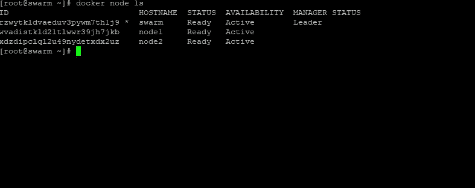

# 将堆栈部署到 Docker Swarm

> 原文：<https://medium.datadriveninvestor.com/deploy-stack-to-docker-swarm-1b23582d0279?source=collection_archive---------3----------------------->

Docker Swarm

在这篇博客中，我将通过部署一个由 Python 应用程序组成的应用程序向您展示，该应用程序在 Redis 实例中维护一个计数器，并在您访问它时递增该计数器。这不是一个介绍性的教程，但我将来会创建一个。

Docker swarm 是 Docker(从 1.12 版本开始)的新增功能。它旨在使用 Docker CLI 轻松管理多个主机上的容器调度。

# 首要的

1]应配置 docker 群组模式
2]应安装 docker-compose 1.10 或更高版本

**注意**:如果您正在本地开发环境中进行尝试，您可以将您的引擎置于 swarm 模式，而如果您已经运行了一个多节点 swarm，请记住所有命令都必须从一个管理节点运行。

首先，检查 docker swarm 模式是否配置正确:

现在，设置 docker 注册中心，因为一个群由多个 Docker 引擎组成，需要一个注册中心来向所有引擎分发图像。在你的 swarm 上启动注册表并检查它的状态。

部署一个应用程序来理解要群集的堆栈，现在创建一个工作区，所有需要的程序都将在这里编写。首先在项目工作区中创建一个名为 app.py 的文件，并在其中编写这段代码。

创建一个名为`requirements.txt`的文件，并将这两行写入:

创建一个名为`Dockerfile`的文件和一个名为`docker-compose.yml`的文件，分别写几行。

使用`docker-compose up`启动应用程序，开始撰写。这将构建 web 应用程序映像，如果您还没有 Redis 映像，则提取它，并创建两个容器。

 [## 数据驱动的投资者|微软比 Chrome 有“优势”

### 简史我从来不是浏览器的粉丝，确切地说，我只是一个浏览器的粉丝，Chrome。这是我的…

www.datadriveninvestor.com](https://www.datadriveninvestor.com/2020/03/29/microsoft-having-an-edge-over-chrome/) 

您会看到一个关于引擎处于群集模式的警告。这是因为 Compose 没有利用群体模式，而是将所有内容部署到单个节点上。您可以放心地忽略这一点。

使用`docker-compose ps command :`检查应用程序是否正在运行

现在，您可以使用 curl 命令或在 chrome 中使用端口号浏览节点 IP 来测试应用程序。

之后，在将生成的图像放入注册表之前，关闭应用程序。

为了在整个群体中分发 web 应用程序的图像，需要将它推送到您之前设置的注册中心。使用 Compose，这非常简单:

现在可以部署堆栈了，用`docker stack deploy` 创建堆栈。最后一个参数是堆栈的名称。每个网络、卷和服务名称都以堆栈名称为前缀，并检查它是否与`docker stack services demo:`一起运行。一旦运行，您应该会看到两个服务的`REPLICAS`下的`1/1`。如果您有一个多节点群，这可能需要一些时间，因为需要提取图像。

像以前一样，你可以用`curl and` 测试应用程序由于 Docker 内置的路由网格，你可以在端口 8000 上访问 swarm 中的任何节点，并路由到应用程序:

Chrome with connecting with container

这是我和 Docker Swarm 合作的经历。我考虑过其他选择，但在我看来。对于最简单的所需文件已经在这里找到:[https://github.com/VarshitAgarwal/Docker_Swarm.git](https://github.com/VarshitAgarwal/Docker_Swarm.git)。