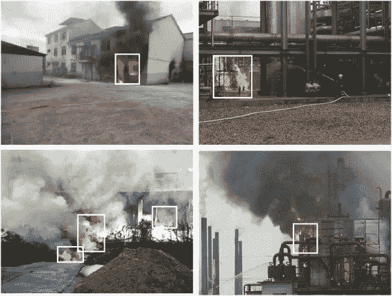
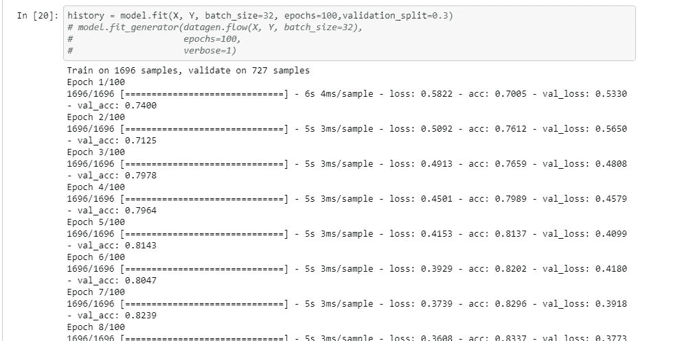
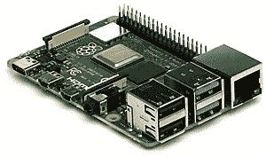
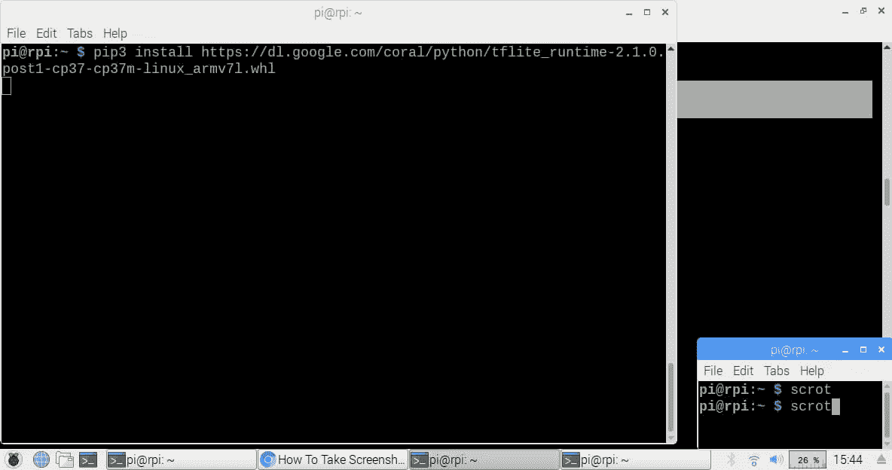
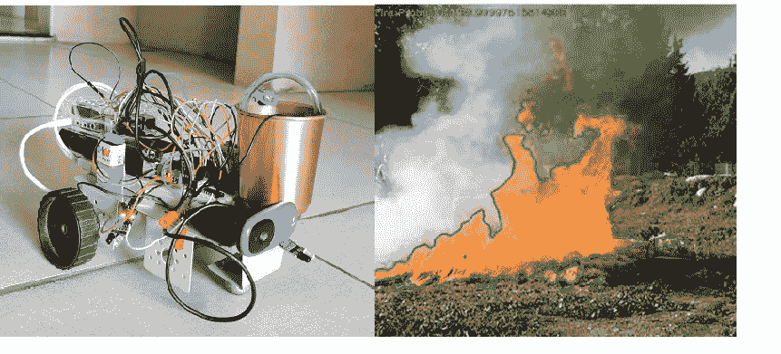

# 使用 TensorFlow lite 在物联网设备上部署深度学习模型

> 原文：<https://medium.datadriveninvestor.com/deploy-your-deep-learning-models-on-iot-devices-using-tensorflow-lite-99d3ccdfc853?source=collection_archive---------1----------------------->


最近，我参与了一个机器人项目，该项目旨在利用覆盆子馅饼让 T2 成为一个消防机器人。我在研究机器人的**视觉模块**，它应该可以实时探测火灾。

**我正在分享我的经验和一个基础教程，给所有想把他们的模型推向微处理器生产的人(例如，覆盆子馅饼)。**



**Fire Detection Model**

对于火灾探测，我制作了一个定制的卷积神经网络(CNN 的性能优于经典的成像技术)。我面临的约束是有限的计算能力和磁盘空间，这是微处理器的一个主要问题。除了火灾探测，微处理器还必须控制机器人的其他传感和驱动任务。因此,**有必要实现该模型的轻量级实现。**

**我遇到了张量流精简版，它帮助我制作了一个轻量级模型。**

[](https://www.tensorflow.org/lite) [## 面向移动和边缘设备的 TensorFlow Lite | ML

### 一个用于设备上推理的深度学习框架。在移动和物联网设备上训练和部署机器学习模型…

www.tensorflow.org](https://www.tensorflow.org/lite) 

让我们看看这个 **lite 框架**是怎么回事。根据官方文档，TensorFlow Lite 有助于在移动设备和物联网设备上部署我们的模型，即它可以将您的 TensorFlow 模型转换为高度优化的物联网和移动设备模型。

所以你可以转换一个预训练的(tflite 也提供了一些[预训练的](https://www.tensorflow.org/lite/models)模型已经以 tflite 的形式存在)模型，使用转移学习或者你自己定制的 TensorFlow 模型(在我的例子中是定制模型)成为它的轻量级变体。最棒的是，api **支持更高级别的库 Keras。**

我正在覆盖 **Python API** 部分，框架也支持 Cpp、Java 和 JavaScript。

主要组件:

1.  [**TensorFlow Lite 转换器**](https://www.tensorflow.org/api_docs/python/tf/lite/TFLiteConverter) **:** 该工具将普通 TensorFlow 或 Keras 模型转换成 tflite 版本(。tflite)。
2.  [**TensorFlow Lite 解释器**](https://www.tensorflow.org/lite/guide/python) **:** 虽然 raspberry pie 支持完整的 TensorFlow 包，但当您只需要部署和运行您的模型时，为什么要浪费大型 Tensorflow 库的磁盘空间呢？**这个仅用于解释器的包是整个 TensorFlow** 包的一小部分，包含了使用 TensorFlow Lite 运行推理所需的最少代码。

我猜这些信息足以让你开始。那么流程是什么，如何安装、转换和部署我的模型？

**参考步骤和样例片段即可。**

1.  首先，**选择您的首选模型**，在您的高端 GPU/CPU 系统上训练、测试和验证您的模型。下面是我用 **Keras** 编码的火灾探测模型的截图(供你参考)。

```
**#Keras code -- model layers(reference Code)
use tf 1.x version or tf 2.x version(here used)**import tensorflow as tf
from tf.keras.datasets import cifar10
from tf.keras.preprocessing.image import ImageDataGenerator
from tf.keras.models import Sequential
from tf.keras.layers import Dense, Dropout, Activation, Flatten
from tf.keras.layers import Conv2D, AveragePooling2Dmodel = Sequential()
model.add(Conv2D(filters=16, kernel_size=(3, 3), activation='relu', input_shape=X.shape[1:]))
model.add(AveragePooling2D())
model.add(Dropout(0.5))model.add(Conv2D(filters=32, kernel_size=(3, 3), activation='relu'))
model.add(AveragePooling2D())
model.add(Dropout(0.5))model.add(Conv2D(filters=64, kernel_size=(3, 3), activation='relu'))
model.add(AveragePooling2D())
model.add(Dropout(0.5))model.add(Flatten())model.add(Dense(units=256, activation='relu'))
model.add(Dropout(0.2))model.add(Dense(units=128, activation='relu'))model.add(Dense(units=2, activation = 'softmax'))model.compile(loss='sparse_categorical_crossentropy',
              optimizer='adam',
              metrics=['accuracy'])
```



**Model Training**

2.接下来，当模型准备好时，使用 Keras 内置的保存模型特性保存它。我已经存为. h5 格式，你也可以存进去。pb 格式。

```
model.save('TrainedModels/Fire-64x64-color-v7.1-soft.h5')
```

3.现在是 TensorFlow-lite **转换器 API** 的角色。调用 tfLiteConverter 将保存的模型转换为 flite 版本并保存。基于你的 TensorFlow 版本检查代码。

```
**#Converting tf.keras models****#tensorflow 1.X implementation**import tensorflow as tf
converter = tf.lite.TFLiteConverter.from_keras_model_file('/content/Fire-64x64-color-v7-soft.h5')tfmodel = converter.convert()#saving tflite model
open("fire_lite_model.tflite","wb").write(tfmodel)**#tensorflow 2.X implementation** import tensorflow as tfmodel = tf.keras.models.load_model('C:/Users/samar/fireDet/Fire-64x64-color-v7-soft.h5')# Convert the model.
converter = tf.lite.TFLiteConverter.from_keras_model(model)#save tflite model
tflite_model = converter.convert()
open("model.tflite","wb").write(tflite_model)
```

> 要转换保存的模型、冻结 _ 图形模型，请检查此[https://www.tensorflow.org/lite/r1/convert/python_api](https://www.tensorflow.org/lite/r1/convert/python_api)

**保存模型后，如果我们比较模型的‘大小’。tflite 的尺寸还不到原始模型的一半。你可能会意识到这种规模的差异时，更深的模型，如 YOLO，RCNN 或 Resnet50，在这种情况下，模型的大小可以超过数百兆字节，你不能给你的微处理器这样的负载。**


TFLITE SIZE Vs ORIGINAL FILE (H5) SIZE

# 在覆盆子馅饼上部署:

**下一步是做树莓派，并部署我们转换后的模型。我假设你熟悉在覆盆子馅饼上使用 python 和 OpenCV(感谢我的朋友 Nikhil，他帮我完成了这一部分)。**



Raspberry pie

4.复制。tflite 模型并保存在您的覆盆子馅饼上。

5.在 RPI 上下载并设置 **TFlite 解释器。**

(注意:如果您想在树莓派上训练模型或使用 TensorFlow 功能，您需要安装整个 TensorFlow 包)

```
**# Using python 3.7 (Rasberry pie 4b running Raspbian Buster)**
pip3 install [https://dl.google.com/coral/python/tflite_runtime-2.1.0.post1-cp37-cp37m-linux_armv7l.whl](https://dl.google.com/coral/python/tflite_runtime-2.1.0.post1-cp37-cp37m-linux_armv7l.whl)
```

> 如果您使用不同的 Python 版本或平台，请参考[https://www.tensorflow.org/lite/guide/python](https://www.tensorflow.org/lite/guide/python)(安装指南)



6.下载运行时解释器后，创建一个 python 文件，运行模型并进行预测。

```
**#test.py
# Load tflite model and allocate tensors**import tflite_runtime.interpreter as tfliteimport numpy as np
**#Used for reading image from path or using live camera** import cv2interpreter = tf.lite.Interpreter(model_path="modelpath/fire_lite_model.tflite")
interpreter.allocate_tensors()**# Get input and output tensors** input_details = interpreter.get_input_details()
output_details = interpreter.get_output_details()**#Load input image** input_image = cv2.imread("/path/")
input_shape = input_details[0]['shape']**#Reshape input_image** np.reshape((input_image,input_shape)**#Set the value of Input tensor** interpreter.set_tensor(input_details[0]['index'], input_image)
interpreter.invoke()**#prediction for input data**
output_data = interpreter.get_tensor(output_details[0]['index'])
fire_probability = output_data[0][0] * 100 #prediction probability
```

您可以使用 OpenCV 从路径或使用 USB 摄像头读取图像。我没有涉及这一部分，你可以找到很多相同的资源。

在上面的代码中，输入/输出细节就是我们在 Keras 模型中定义的模型的输入/输出层。加载输入图像后，如果需要，将输入图像整形为模型所需的形状。接下来，使用 set_tensor 将输入张量的值分配为输入图像。

[](https://www.datadriveninvestor.com/2020/03/02/internet-of-things-and-the-future-of-the-mining-industry/) [## 物联网和采矿业的未来|数据驱动的投资者

### 物联网可以做出重大贡献的领域之一是采矿！2 月 3 日，在开普…

www.datadriveninvestor.com](https://www.datadriveninvestor.com/2020/03/02/internet-of-things-and-the-future-of-the-mining-industry/) 

解释器使用 invoke 方法运行。通过使用 get_tensor()，我们得到了输入的**预测类。**

模型的结果以 output_details 的形式出现。你必须以一种有意义的方式解释张量，这种方式在你的应用中是有用的。

> **可选:**您可以使用 tensorflow optimsation toolkit 进一步优化您的模型。[https://www . tensor flow . org/lite/performance/model _ optimization](https://www.tensorflow.org/lite/performance/model_optimization)

瞧啊。我们完了。我们的模型很容易在 Raspberry pie 上部署，现在您可以为许多对象检测模型扩展相同的过程。我希望这一经历已经为您节省了一些阅读完整文档的时间。我仍在学习，我肯定会喜欢我的写作和过程的一些反馈。

PS。这是我们的消防机器人:D 的原型



**参考文献:**

 [## 模块:tf.lite | TensorFlow Core v2.1.0

### tf.lite 命名空间的公共 API。实验模块:tf.lite.experimental 命名空间的公共 API。类解释器…

www.tensorflow.org](https://www.tensorflow.org/api_docs/python/tf/lite) [](https://github.com/tensorflow/tensorflow/issues/25361) [## 特点:TensorFlow Lite 兼容 TF 2.0。第 25361 期张量流/张量流

### 解散 GitHub 是超过 4000 万开发者的家园，他们一起工作来托管和审查代码，管理项目，以及…

github.com](https://github.com/tensorflow/tensorflow/issues/25361) [](https://towardsdatascience.com/portable-computer-vision-tensorflow-2-0-on-a-raspberry-pi-part-1-of-2-84e318798ce9) [## 便携式计算机视觉:树莓 Pi 上的 Tensorflow 2.0

### 机器/深度学习刚入门吗？这个博客系列是为你准备的。

towardsdatascience.com](https://towardsdatascience.com/portable-computer-vision-tensorflow-2-0-on-a-raspberry-pi-part-1-of-2-84e318798ce9)