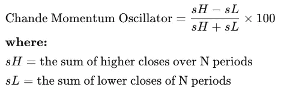
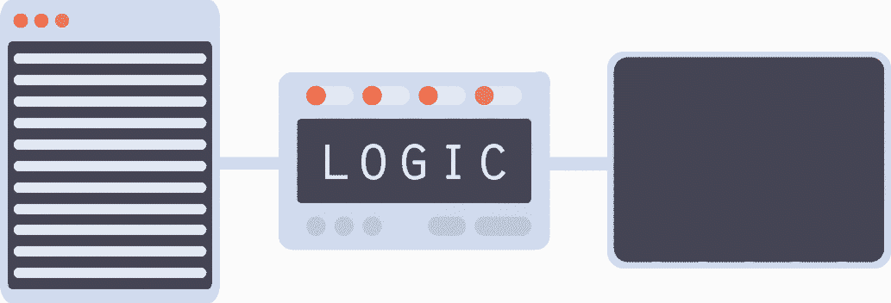
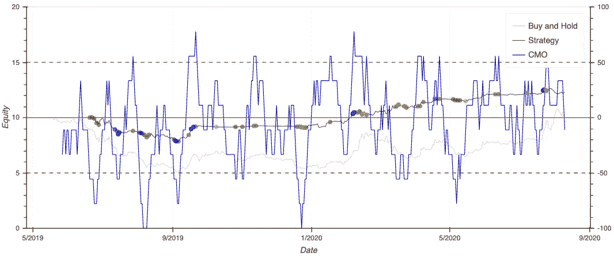

# 如何部署比特币交易机器人

> 原文：<https://medium.datadriveninvestor.com/deploying-a-bitcoin-trading-bot-eb9998dfc0f5?source=collection_archive---------4----------------------->

## 机器中的逻辑


[Source](https://www.coindesk.com/)

挑选股票很难，通常需要一些可怜的初级分析师在早上 7 点将堆积如山的报告输入 Excel。

如果你有一个机器人为我们做**有利可图的交易决策**，那不是更简单吗？

```
-------------- Results ----------------------------- Benchmark ---------------
Capital      : 10.00
Final Equity : 10.24
Net profit   : 0.24 (+2.37%)
Max Drawdown : -49.16%
--------------- Strategy ---------------
Capital      : 10.00
Final Equity : 12.29
Net profit   : 2.29 (+22.87%)
Max Drawdown : -21.71%
Sharpe Ratio : 0.86
Sortino Ratio: 1.30
Alpha        : 0.11
Beta         : 0.16
Fees paid    : 0.24
-------------- Statistics --------------
Longs        : 30
Sells        : 30
Shorts       : 21
Covers       : 20
Total Trades : 101
-----------------------------------------
```

这就是我用 [Python](https://www.python.org/downloads/) ，技术分析[，AWS](https://aws.amazon.com/) ，一个 Rasberry Pi 和[一大堆咖啡](https://www.sainsburys.co.uk/gol-ui/product/all-coffee/sainsburys-italian-roasted---ground-coffee-227g)部署的。这篇文章旨在通过我的旅程来指导你，以便你可以自己运行类似的项目，如果你有任何问题，请让我知道。

## 交易策略

技术分析是一门交易学科，使用图表和交易统计数据，而不是公司报告和宏观经济因素。有太多的技术分析交易策略，但我们将专注于用 Python 写 CMO。

使用以下公式计算 CMO:



CMO Calculation ([source](https://www.investopedia.com/terms/c/chandemomentumoscillator.asp))

这个结果数字表明资产的“超卖”或“超买”程度。高 CMO 可能表明资产超买，应建立空头头寸，而低 CMO 表明资产超卖，应建立多头头寸。

我将 CMO 翻译成 Python 的过程是这样的:

```
for day in range(first_day, final_day):
    if data['close'][day] > data['open'][day]:
        higher_close_price += 1
    elif data['close'][day] < data['open'][day]:
        lower_closing_price += 1

# Chande Momentum Oscillator (CMO)
cmo = ((higher_close_price - lower_closing_price) / \
       (higher_close_price + lower_closing_price)) * 100

return cmo
```

每次程序运行时，通过回顾过去 N 天(9)计算 CMO，并根据 CMO 做出交易决策。如果 CMO 高于 50，做空，如果低于-50，做多，当亏损或盈利超过特定阈值时，交易就会结束。

该代码检查这些损失/收益:

```
# Check to see if we've made gains / losses
for trade in gemini.account.positions:
    if gemini.account.opened_trades[trade.number].price >= data.iloc[-1].high * (1+position_gain_loss):
        close_position_function(gemini=gemini, 
                                position=trade, 
                                percent=1, 
                                price=data.iloc[-1].high)
    elif gemini.account.opened_trades[trade.number].price <= data.iloc[-1].high * (1-position_gain_loss):
        close_position_function(gemini=gemini, 
                                position=trade, 
                                percent=1, 
                                price=data.iloc[-1].high)
```

这段代码检查是否进行新的交易:

```
# CMO > 50 indicates overbought. Go short.
if cmo > cmo_params['OVERBOUGHT_VALUE(0:100)']:
    enter_position_function(gemini, data, position='Short', max_positions=max_positions, risk=risk, minimum_reserves=minimum_reserves)

# CMO < -50 indicates oversold. Go long.
if cmo < cmo_params['OVERSOLD_VALUE(-100:0)']:
    enter_position_function(gemini, data, position='Long', max_positions=max_positions, risk=risk, minimum_reserves=minimum_reserves)
```

如果你对这个回购的更广泛的版本感兴趣，给我发消息。

## 使用 Gemini 进行回溯测试

过去的表现可能不代表未来的结果，但使用回溯测试引擎肯定会增强信心。

我推荐一个名为 [Gemini](https://github.com/anfederico/Gemini) 的现有回溯测试引擎，这个项目让任何人都可以很容易地测试出自己的加密交易策略。



Source: [Gemini](https://github.com/anfederico/Gemini)

Gemini 引擎有自己的类，允许你将你的逻辑、参数和绘图工具加载到一个对象中。它还具有有用的帮助功能，允许您以熊猫数据帧的形式从 Poloniex crypto exchange 加载全面的历史定价信息。

**波洛涅克斯交易所**
在波洛涅克斯交易所——不同的“密码对”被交易，例如比特币换以太币或一些 Dogecoin 换莱特币，这类似于用一些英镑换一些欧元。


[The Poloniex Exchange](https://poloniex.com/exchange/)

该机器人目前专注于比特币以太网市场，**，但肯定会有不同密码对之间的套利阿尔法(hit me up)** 。

下面是一个使用 Poloniex 加密交换数据初始化 Gemini 类的例子。

```
pair = "ETH_BTC"    # Use ETH pricing data on the BTC market
period = 1800       # Use x second candles
days_history = 300  # Collect y days data

# Request data from Poloniex
df = px.load_dataframe(pair, period, days_history)

# Algorithm settings
sim_params = {
    'capital_base': 10,      # initial capital in BTC
    'fee': {
        'Long': 0.0025,      # fee settings for Long
        'Short': 0.0025,     # fee settings for Short
    },
    'data_frequency': '1D'    # Time frame to use (see /helpers/timeframe_resampler.py for more info
    # Allowed periods:
    # * T - minute (15T - 15 minutes),
    # * H - hour,
    # * D - day,
    # * W - week,
    # * M - month
}

# Load data and settings to backtester core
gemini = gemini_master.Gemini(logic=backtesting_cmo_strategy_logic, sim_params=sim_params, analyze=analyze_bokeh)

# Start backtesting custom logic with 10 (BTC) initial capital
gemini.run(df, show_trades=True)
```

既然数据、参数和策略已经加载到 Gemini 中，运行这个程序将生成一个图表(见本文的顶部),展示特定时期的性能。

下图显示，在过去的六个月中部署这种策略是有利可图的(约 23%的利润)。绿色和红色分别表示开仓的多头和空头交易，而蓝色(多头)和橙色(空头)表示已经平仓。



Bokeh plot of the CMO trading strategy

## 使用 Rasberry Pi 进行部署

为了经常运行这些脚本，而不是让它一直在我的笔记本电脑上作为后台进程，我把所有的代码都移到了一个记忆棒上，并下载到了一个 Rasberry Pi 上。使用下面的 CRON 命令，脚本被设置为每五分钟运行一次。

```
*/5 * * * * source /home/pi/Desktop/venvs/crypto_trading/bin/activate && /home/pi/Desktop/crypto_trading/strategies/cmo_strategy.py
```

在这个项目之前，无论我在做什么，我总是喜欢使用最新、最辣、最令人兴奋的 Python 版本。但是他的整个经历让我明白了使用稳定版的价值。我的项目在 Pi util 上非常不稳定，直到我退回到 Python 3.6。

## 优化和改进

> “如果你不能衡量它，你就不能改善它。”—彼得·德鲁克

为了确保该项目的未来稳定性，回溯测试引擎生成的大量有价值的数据被捕获，这些数据可以插入机器学习模型，以便找到最佳参数(CMO 阈值、最大仓位、交易规模、交易对等)，从而实现利润最大化。

该数据集可以通过每次运行该程序时在 S3 (AWS Datalake)中捕获的额外数据来增强，下面的 Python 摘录说明了机器人开始工作时捕获的数据。

```
session_data = {'cmo': cmo,
                'cmoOverbought': cmo_params['OVERBOUGHT_VALUE(0:100)'],
                'cmoOversold': cmo_params['OVERSOLD_VALUE(-100:0)'],
                'BTC': balance['BTC'],
                'ETH': balance['ETH'],
                'pruchasePrice': purchase_price,
                'sellPrice': sell_price,
                'purchaseAmount': purchase_amount}with open(filename, 'w') as file:
    writer = csv.DictWriter(file, session_data.keys())
    writer.writeheader()
    writer.writerow(session_data)

s3_client = boto3.client('s3')

s3_response = s3_client.upload_file(Filename=f'{os.getcwd()}/{filename}',
                                  Bucket=cmo_aws_params['BUCKET_NAME'],
                                    Key=f'{cmo_aws_params["KEY_PARTITIONS"]}/{filename}')
```

机器人还没有产生足够的数据来产生有价值的见解，**但是如果你有兴趣了解未来的优化，访问这些数据或者对解决这个问题的最佳方法有任何想法，请告诉我。**

## 后续步骤和结论

编写交易算法是整个过程中最简单也是最令人兴奋的部分。这个项目的其余时间是配置、部署、测试、完善……这些都是非常重要的事情，但比交易算法或帮助你提前退休的**机器学习机器人要逊色得多。**

现在，这个机器人藏在我的沙发后面，每五分钟生成一次交易模式数据。接下来，我将分析数据集，以优化交易模式，并给机器一些真钱。

如果你需要任何帮助来建立和运行你自己的交易机器人，请告诉我！

查看我的 YouTube 视频，深入了解回溯测试引擎:

**访问专家视图—** [**订阅 DDI 英特尔**](https://datadriveninvestor.com/ddi-intel)