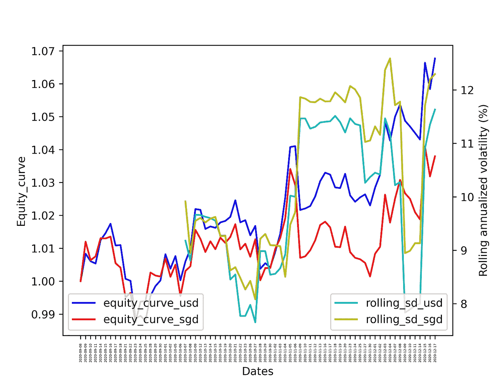

# 在全自动算法交易系统中部署外汇风险对冲机制

> 原文：<https://medium.datadriveninvestor.com/deploying-a-hedging-feature-for-foreign-exposure-in-fully-automated-algorithmic-trading-system-8db31f50d3ad?source=collection_archive---------7----------------------->



Equity curve for my 10% volatility target all weather portfolio (9-Sep-2020 to 17-Dec-2020)

【2021 年 2 月 16 日更新——我使用 SGX 的 ICE 美元/新加坡元连续期货合约对冲我的美元风险，而不是直接做空美元/新加坡元(下面突出显示的方法),因为它更有利于保证金和成本效益。然而，我关于对冲外汇风险的论点仍然成立。

*传奇对冲基金经理雷伊·达里奥在接受彭博* [*采访*](https://www.bloomberg.com/news/articles/2020-09-15/ray-dalio-warns-of-threat-to-dollar-as-reserve-currency) *时提到，“现在有太多的债务产生和债务货币化”。*

在我之前的文章中，我开发了一个全自动算法交易系统( [part1](https://medium.com/datadriveninvestor/designing-and-building-a-fully-automated-algorithmic-trading-portfolio-management-system-6945c6c87620) 和 [part2](https://medium.com/datadriveninvestor/how-to-place-option-spread-e-g-straddle-through-interactive-brokers-api-a-101-tutorial-aca2a0be3737) )，具有性能监控功能(参见 [part1](https://medium.com/datadriveninvestor/developing-a-performance-monitoring-component-in-my-fully-automated-algorithmic-trading-system-88f5afae05cd) 、 [part2](https://medium.com/datadriveninvestor/developing-a-performance-monitoring-component-in-my-fully-automated-algorithmic-trading-system-983368441bba) 和 [part3](https://medium.com/datadriveninvestor/performance-monitoring-component-in-my-fully-automated-algorithmic-trading-system-part-3-3d41f14005) )。特别是对于 [part2](https://medium.com/datadriveninvestor/developing-a-performance-monitoring-component-in-my-fully-automated-algorithmic-trading-system-983368441bba) ，我增加了追踪汇率效应影响的功能。自从我上次写文章以来，我的一个策略的美元股票曲线-新加坡元股票曲线差距扩大到 3%(自 9 月以来，美元股票曲线为 7%，新加坡元股票曲线为 4%)。就夏普比率而言——美元权益曲线为 2.16，新加坡元权益曲线为 1.08。这相当于绝对业绩下降了 43%,夏普比率下降了 50%,归因于作为新加坡居民的海外敞口。

在最近的一次采访中，Bridgewater Associates 的传奇对冲基金经理雷伊·达里奥最近对美元作为全球储备货币的未来发出了警告。我仔细思考了他的观点，也思考了对冲海外风险的必要性。

**我为什么要对冲？**

以下是我的思路。

我的义务以新加坡元计(例如，现有贷款和摊销费用以新加坡元计)。我消费的一篮子商品和服务主要以新加坡元计价。

即使我在新加坡消费的商品和服务来自美国；这些实体的价格是粘性的，即如果你看到美元/新加坡元下跌 10%；在不久的将来，你可能不会看到 Macbook pro 的价格下降 10%。作为一名前经济学家，我肯定会有一篇学术论文研究这一现象？

唉，我做了一个有意识的决定，让我的投资组合对冲美元风险。

**在全自动算法交易系统中对冲外汇风险的框架**

我将通过一个独立的例子向你展示我如何通过交互式经纪人 API 对冲我的投资组合，

*   假设设置
*   提取净清算价值(美元)
*   现在该不该对冲，对冲多少？
*   创建合同并获得历史价格
*   创建并下订单

**我的实际套期保值特征包含在我的工程保障框架中。为了方便起见，下面是一个独立的例子。*

**假设设置**

为了遵循本教程，我假设如下，

*   安装的 python
*   为 ib_insync、datetime、numpy 和 time 安装了 python 包
*   已安装 IB TWS(带图形用户界面)或 IB 网关(不带 GUI 的轻量级版本)。我的偏好是后者，我在我的生产技术栈中使用它。

**提取美元净清算价值**

首先，通过 IB 网关或 TWS 建立连接。如果通过 spyder 或 Jupyter notebook 之类的 IDE 运行 util.startLoop()是必需的。否则，如果您通过命令行运行它，您可以省略它。

接下来，提取以美元计价的净清算价值(nlv)。如果您购买美国交易所的资产或持有美元外币头寸，净头寸将反映在下面的 nlv_usd 变量中。例如，如果您持有价值 100 万美元的资产，但您做空价值 100 万美元的美元/新加坡元，则美元净敞口为 0 美元。

```
**#util.startLoop()
ib = IB()
ib.connect('127.0.0.1', 4001, clientId=9999)
nlv_usd = util.df([v for v in ib.accountValues() if v.tag == ‘NetLiquidationByCurrency’ and v.currency == ‘USD’])**
```

**现在该不该对冲，对冲多少？**

对冲不是免费的午餐。这是有成本的。在互动经纪商中，这相当于每年 1.5%。因此，你需要在对冲成本和你对外汇风险的偏好之间取得平衡。

如果您希望对美元风险完全保持 delta 中性，您将执行 100%对冲。如果你想对冲一部分风险，下面的代码需要调整。

另一个重要的考虑。你现在应该对冲吗？你不会想被货币波动的奇思妙想所左右。我建议你在增加或减少对冲前设定一个门槛。让我们在示例中分配 5 万美元。“hedge_activation”包含用于发送订单的布尔变量。

```
**threshold = 50000
hedge_activation = abs(nlv_usd) > threshold**
```

**创建合同并提取‘价格’**

接下来，创建一个外汇合约，并获得最后 1000 点的“价格”。价格是这一时期的平均值。如果对你来说更有意义，你可以把它修改为数量加权平均价格(VWAP)。

```
**contract = Forex(‘USDSGD’)
ib.qualifyContracts(*contract) 
usdsgd = contract 
start = ‘’
end = datetime.datetime.now() 
ticks = ib.reqHistoricalTicks(usdsgd, start, end, 1000, ‘BID_ASK’, useRth=False) 
df = util.df(ticks) 
df[‘midpoint’] = (df[‘priceBid’] + df[‘priceAsk’])/2 
df = df[~pd.isnull(df[‘midpoint’])] 
exch_rate = df.midpoint.mean()**
```

**创建并下订单**

获得价格后，创建一个 LimitOrder 对象。如果你已经达到 hedge_activation 阈值，净敞口为正，卖出美元/新加坡元，否则买入美元/新加坡元。在下面的例子中，我添加了 0.999 的酌情权，即低于/高于当前价格 0.1%，以确保订单得到执行。你可以根据自己的喜好随意调整。

最后但并非最不重要的杀手锏——下订单！通常，我会将它赋给一个交易变量，并通过一个文本文件流来跟踪状态。这里不包括代码。

```
**if hedge_activation:****discretion = 0.999****if ((prop_to_hedge*abs(nlv_usd)) > 0):
 order = LimitOrder(“SELL”, abs(round(nlv_usd)), round(exch_rate*(1-discretion),4), tif=”DAY”, account = <account_num>) ##algos only DAY 

 if ((prop_to_hedge*abs(nlv_usd)) < 0):
 order = LimitOrder(“BUY”, abs(round(nlv_usd)), round(exch_rate*(1+discretion),4), tif=”DAY”, account = <account_num>) ##algos only DAY 

 trade = ib.placeOrder(contract, order) 
 time.sleep(5)

#Disconnect
ib.disconnect()**
```

**警告**

*   上述代码不包括工程特性、配置参数和安全措施，如调度、错误处理和日志记录特性。如果您希望部署此代码，请包括它们。
*   上述代码的变体适合我的面向对象的框架。为更相关的特性添加函数/方法更容易。
*   从哲学上讲，你应该对冲本币吗？我觉得新加坡中央银行和新加坡总体上是负责任的当局。但是，如果你的政府负债累累(有巨大的动机让他们的货币贬值以降低债务偿还额)，你应该用本币对冲你的货币吗？一些精神食粮。
*   我是分散投资的粉丝——只有金融领域的免费午餐才能让你获得风险调整后的绝对回报。你应该完全信任一个政府吗，即使它在财政和货币上是负责任的？

**未来发展**

*   用期货来对冲可能更划算。这是我目前正在考虑的一个选择。
*   我可能会使用连续预测的趋势跟踪框架来对冲我的海外敞口。更多详情，请参见文章[此处](https://medium.com/datadriveninvestor/plans-for-developing-a-trend-following-strategy-in-futures-using-continuous-forecasts-inspired-by-e00e31255144)。
*   我正在探索实际有效汇率(REER)框架，该框架将一种货币的价值与几种外币的加权平均值进行比较。它是实际有效汇率除以价格平减指数或成本指数。更多详情见[此处](http://datahelp.imf.org/knowledgebase/articles/537472-what-is-real-effective-exchange-rate-reer#:~:text=REER%20is%20the%20real%20effective,deflator%20or%20index%20of%20costs.)。

【2021 年 2 月 16 日更新——我使用 SGX 的 ICE 美元/新加坡元连续期货合约对冲我的美元风险，而不是直接做空美元/新加坡元(下面突出显示的方法),因为它更有利于保证金和成本效益。然而，我关于对冲外汇风险的论点仍然成立。

*如果你喜欢这些内容，你可以访问我以前的文章* [这里](https://medium.com/datadriveninvestor/designing-and-building-a-fully-automated-algorithmic-trading-portfolio-management-system-6945c6c87620)和[这里](https://medium.com/datadriveninvestor/how-to-place-option-spread-e-g-straddle-through-interactive-brokers-api-a-101-tutorial-aca2a0be3737) *，在那里我讨论了我如何设计、构建和部署我的非期权和期权策略的全自动算法。*

*我也写过关于系统性能监控功能的文章，其中我讨论了如何捕捉权益曲线、时间加权回报、下滑、汇率影响、滚动波动和提款。参见* [第一部分](https://medium.com/datadriveninvestor/developing-a-performance-monitoring-component-in-my-fully-automated-algorithmic-trading-system-88f5afae05cd)、[第二部分](https://medium.com/datadriveninvestor/developing-a-performance-monitoring-component-in-my-fully-automated-algorithmic-trading-system-983368441bba)和[第三部分](https://medium.com/datadriveninvestor/performance-monitoring-component-in-my-fully-automated-algorithmic-trading-system-part-3-3d41f14005)

[](https://www.datadriveninvestor.com/2020/07/23/learn-data-science-in-a-flash/) [## 一瞬间学会数据科学！？数据驱动的投资者

### 在我之前的职业生涯中，我是一名训练有素的古典钢琴家。还记得那些声称你可以…

www.datadriveninvestor.com](https://www.datadriveninvestor.com/2020/07/23/learn-data-science-in-a-flash/) 

**独立示例**

**我的全自动算法交易系统中的对冲功能**

## 访问专家视图— [订阅 DDI 英特尔](https://datadriveninvestor.com/ddi-intel)