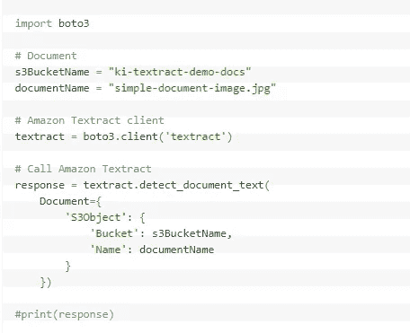
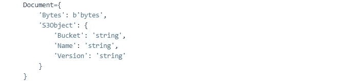
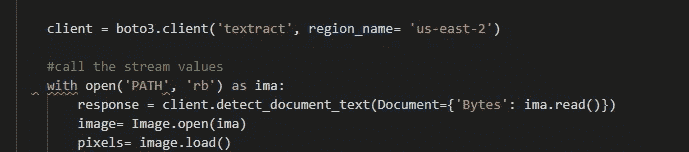
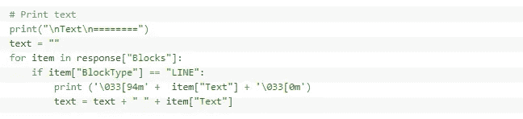
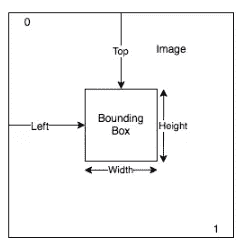
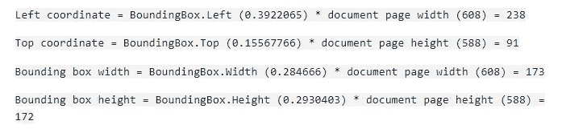

# 通过图像字节部署 Amazon Textract

> 原文：<https://medium.datadriveninvestor.com/deploying-amazon-textract-via-image-bytes-311510434d7a?source=collection_archive---------5----------------------->

我们有 Amazon Textract 为什么还要在纸上做检测！！

Manual Detection: [Unsplash](https://unsplash.com/s/photos/detective)

在通过云计算平台和 API 为网站托管或创业提供可靠服务方面，亚马逊证明了自己的前景。许多这些服务都倾向于机器学习，你不需要成为数学大师来使用这些服务并获得想要的输出。

最近，我一直在做一个项目，该项目需要使用 2019 年 11 月发布的 ***亚马逊 Textract*** API。Amazon Textract 主要用于从 ***图像、pdf***和 ***表单*** 中进行 ***文本检测*** 和 ***分析*** ，但也可以执行许多其他经常需要的任务，如文档翻译和文档搜索。我在 Textract 中发现的最与众不同的特性是，它能够在提取的文档中保持与原始文档相同的文本顺序，无论是表格、表单还是段落。

# S3 桶与图像字节

写这篇博客的想法是在我卡在 Textract 的输入参数时产生的。它提供了两种输入方式-

*   通过上传对象到*S3 桶然后在你的程序中调用它。大多数参考资料解释了这种向 API 提供输入的方式，即通过手动为 S3 桶创建对象，因为这种方式更容易。但是我发现它很麻烦，因为您需要手动将每个文档上传到您想要分析的 bucket 中。*

**

*Using S3 Bucket method*

*   *如果使用的是***AWS SDK(boto 3)***，可以传递不需要 Base64 硬编码字节数组的图像字节。它只需要存在于您的本地系统中，我们可以通过路径直接调用映像。如果您使用 AWS CLI 进行访问，那么您需要对图像进行 Base64 编码。我将在本文中进一步解释 Boto3，即 SDK 方法。*

**

*Delete the S3Object Key-Value pair and use Bytes method for input*

*Boto3 是 AWS 发布的 SDK，用于调用 API 和执行各种开发任务。 ***(你可以找到更多关于*** [***这个***](https://boto3.amazonaws.com/v1/documentation/api/latest/guide/quickstart.html) ***的链接)****

# *复杂概念的简单步骤*

*   ****pip 安装 boto3*** 会轻松安装调用 API 所需的 SDK。*
*   *从 [***此***](https://aws.amazon.com/cli/) 链接下载 AWS CLI 以设置凭证和配置。*
*   *安装后。exe CLI 程序，键入 ***aws 在你的 OS 的 cmd 中配置*** 并填写要求。*
*   *代码如下-*

****

*Code snippet of an example program*

*   ***响应**包含所有检测到的文本信息，如 JSON 格式的边界框坐标、文本类型(页面、行或字)以及高度和宽度信息。*

# *输出行话*

**

*Measurement Format of Textract*

*Textract 以父子格式*提供 JSON 格式的输出(我已经附上了进一步阅读的链接)*。要以正确的位置和大小显示边界框，您必须将 bounding box 值乘以文档页面宽度或高度(取决于您想要的值)以获得像素值。使用像素值来显示边界框。一个示例是使用 608 像素宽 x 588 像素高的文档页面，并对分析的文本使用以下边界框值:*

***边界框。左:0.3922065
包围。顶部:0.15567766
接线盒。宽度:0.284666
接线盒。高度:0.2930403***

**

*[Link](https://docs.aws.amazon.com/textract/latest/dg/text-location.html)*

*在 这里可以找到完整的 JSON 格式输出示例 [**。**](https://docs.aws.amazon.com/textract/latest/dg/text-location.html)*

***参考文献:***

*   *[AWS](https://aws.amazon.com/blogs/machine-learning/automatically-extract-text-and-structured-data-from-documents-with-amazon-textract/) ， [Textract](https://docs.aws.amazon.com/textract/latest/dg/text-location.html)*
*   *发布会[视频](https://www.youtube.com/watch?v=5g48uf5sCu8)*