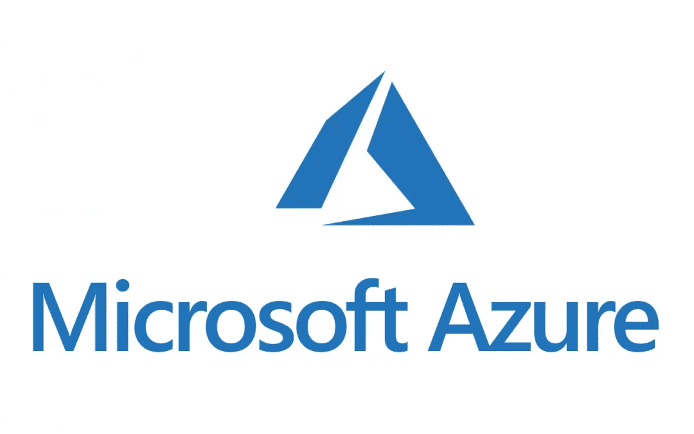
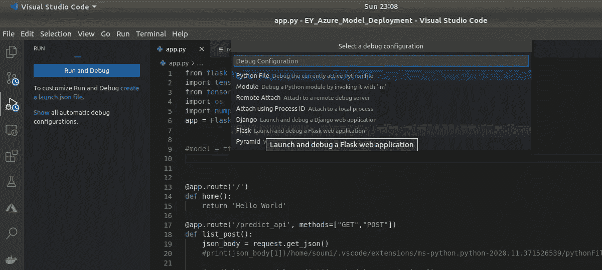
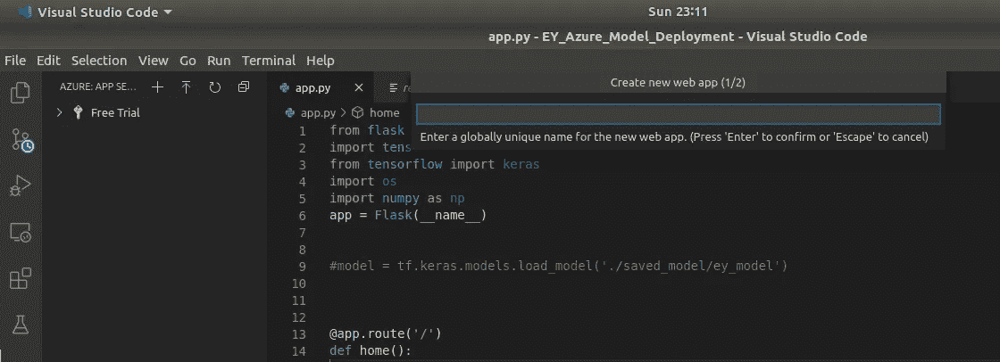
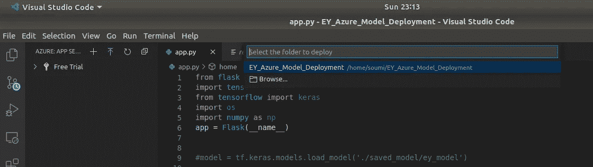
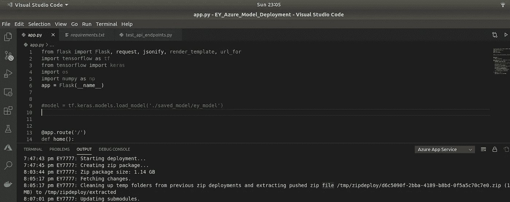
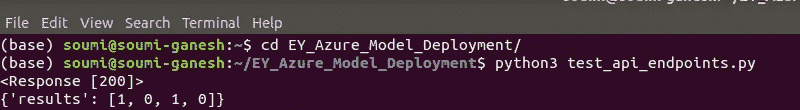

# 在 Microsoft Azure 上部署 Flask web 应用程序

> 原文：<https://medium.datadriveninvestor.com/deploying-flask-web-app-on-microsoft-azure-89cea17e9114?source=collection_archive---------1----------------------->



[https://www.abd.es/tag/microsoft-azure/](https://www.abd.es/tag/microsoft-azure/)

绝对喜欢 VS-Code 的 Azure 应用服务集成！

[](https://azure.microsoft.com/en-in/services/app-service/) [## 应用服务|微软 Azure

### 在 Azure 上实现超过 200 万个应用和站点的生产力和创新快速构建、部署和扩展 web…

azure.microsoft.com](https://azure.microsoft.com/en-in/services/app-service/) [](https://code.visualstudio.com/) [## Visual Studio 代码-代码编辑。重新定义的

### Visual Studio Code 是一个重新定义和优化的代码编辑器，用于构建和调试现代 web 和云…

code.visualstudio.com](https://code.visualstudio.com/) 

## 议程

*   我们将创建一个非常简单的 Flask REST API
*   我们将在微软 Azure 上托管 web 应用程序

## 烧瓶应用程序

*   我们将创建一个非常简单的 flask 应用程序。
*   它将 json 数据作为输入，并返回 json 数据。

这是一个简单 app.py 的代码。

我们需要一个 requirements.txt 文件:

```
Flask==1.1.1
```

## Azure 部署

> 现在在 VScode 上安装 **Azure App 服务**扩展。
> 
> 进入**运行调试**，在选项中选择**烧瓶**。



> 接下来转到左边的 Azure 图标，选择 **+** 创建一个新的 web 应用。给它一个任意的名字。



> 单击向上箭头符号进行部署。选择要部署的 web 应用程序和文件夹。重要的是，压缩文件的大小要小于 2.048 gB。



> 瞧啊。Flask app 部署好了！



该应用程序可以通过唯一的网址访问。我的网络应用 EY7777 的网址是:[https://ey7777.azurewebsites.net/](https://ey7777.azurewebsites.net/)

## 录像

如果你遇到任何问题，看看这个视频，它是所有步骤的简短演练:[使用 Azure 应用服务部署 Flask API:Microsoft Azure:Azure 应用服务 VSCode 扩展— YouTube](https://www.youtube.com/watch?v=qqinLLccL2E)

## 测试 API 端点

为了测试 API 端点，我们有另一个名为 test_api_endpoints.py 的文件。在我的 github 上，我们有一个大小为 1.3 gB 的模型，但是，这个例子是一个简单的表达式，没有使用模型。

该应用程序将一个数组作为输入，并将其副本添加到自身中。返回这个双精度数组。如果你通过[1，2]，你得到[1，2，1，2]。如果通过[1，1]，则得到[1，1，1，1]。这是预测 api 的端点:[https://ey7777.azurewebsites.net/predict_api](https://ey7777.azurewebsites.net/predict_api)

下面是 test_api_endpoints.py 文件:

执行该文件后的输出将是:



这就是我们如何使用 Azure App services 部署 flask REST API！

谢谢！

[](https://github.com/Soumi7) [## Soumi7 - Github

### GitHub，托管代码、管理项目和构建软件的最佳场所…

github.com](https://github.com/Soumi7) 

## 访问专家视图— [订阅 DDI 英特尔](https://datadriveninvestor.com/ddi-intel)