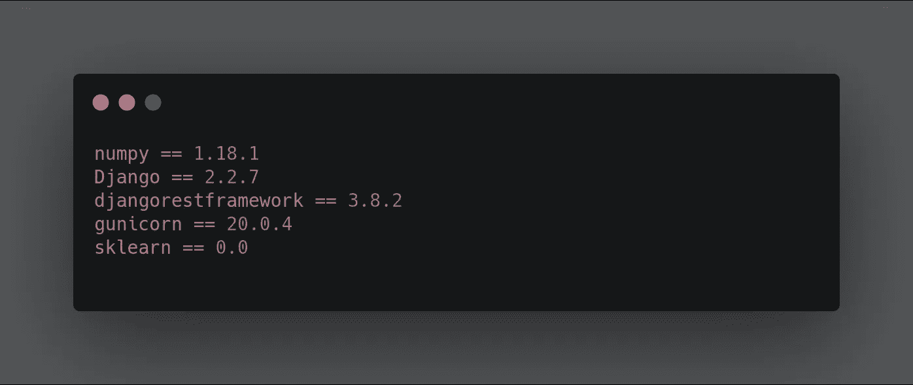
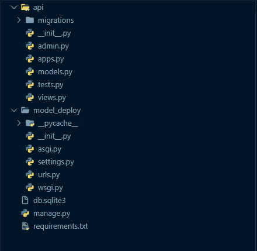
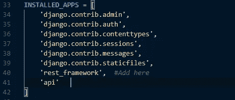
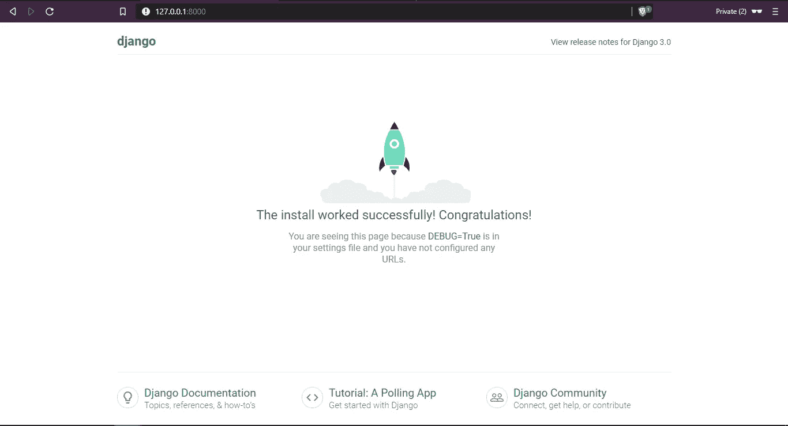
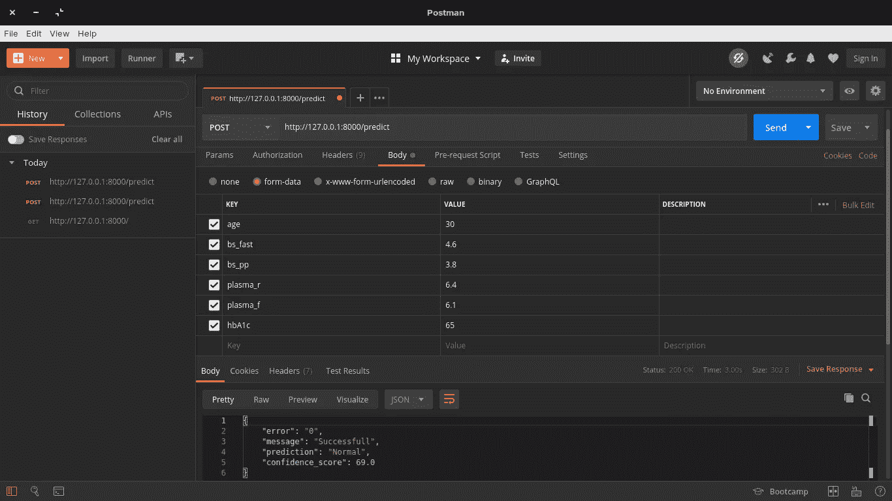

# 使用 Django REST API 部署 ML 模型第 2 部分

> 原文：<https://medium.datadriveninvestor.com/deploying-ml-models-using-django-rest-api-part-2-84cea50b3c83?source=collection_archive---------0----------------------->

在我的[上一篇文章](https://medium.com/@aminuisrael2/deploying-ml-models-using-django-rest-api-part-1-da0370a07b90)中，我解释了 API 的基本先决条件，并重点强调了 Python web 框架 Django。在本文中，我将向您展示如何使用 Django REST 框架部署任何机器学习模型。让我们开始吧…


Photo by [SpaceX](https://unsplash.com/@spacex?utm_source=medium&utm_medium=referral) on [Unsplash](https://unsplash.com?utm_source=medium&utm_medium=referral) (Yeah, am so much a fan of spaceX and space travel 😀)

在这篇文章中，我将部署一个简单的多分类模型，根据血糖、血糖等预测糖尿病的类型(1 型、2 型或正常)。ML 模型的代码可以在[这里](https://colab.research.google.com/drive/1YOyEA2M_fQtvdwtUOvCWQhk-n7-8YcId)找到。

要部署我们通过 API 训练的模型，我们必须将 API 构建为:

*   接受数据并进行预处理
*   使用 pickle 加载我们训练过的模型
*   根据我们通过的数据预测结果
*   以 JSON( JavaScript 对象表示法)的形式返回预测和置信度得分

## 第一步

***创建虚拟环境并安装所需库* :**

```
C:\Users\Documents\mldeployment>python -m venv my_api
```

我把我的虚拟环境命名为‘my _ API’，你可以使用任何你喜欢的名字。

运行该命令后，使用以下命令激活虚拟环境…

```
C:\Users\Documents\mldeployment>cd my_apiC:\Users\Documents\mldeployment\my_api>cd ScriptsC:\Users\Documents\mldeployment\my_api\Scripts>activate
```

您应该会得到这样的结果:

```
(my_api) C:\Users\Documents\mldeployment\my_api\Scripts>
```

对于 Linux 和 Mac 用户，您可以使用以下链接了解如何创建虚拟环境:

> **Linux**:[https://www . liquid web . com/kb/creating-virtual-environment-Ubuntu-16-04/](https://www.liquidweb.com/kb/creating-virtual-environment-ubuntu-16-04/)
> 
> **Mac**:[https://programwithus . com/learn-to-code/Pip-and-virtualenv-on-Mac/](https://programwithus.com/learn-to-code/Pip-and-virtualenv-on-Mac/)

对于这个项目，这些是我们将要安装的必需包:



Requirements

建议将这个包添加到一个 **requirements.txt** 文件中，并使用 **pip** 从文本文件中安装，而不是一个接一个地安装。

[](https://www.datadriveninvestor.com/2019/02/25/6-alternatives-to-the-yahoo-finance-api/) [## 雅虎财经 API |数据驱动投资者的 6 种替代方案

### 长期以来，雅虎金融 API 一直是许多数据驱动型投资者的可靠工具。许多人依赖于他们的…

www.datadriveninvestor.com](https://www.datadriveninvestor.com/2019/02/25/6-alternatives-to-the-yahoo-finance-api/) 

创建文件并添加 python 库之后，将它们安装到使用命令创建的虚拟环境中

```
pip install -r requirements.txt
```

然后将安装所需的软件包。

## 第二步

***建立 Django 和 Djangorest:***

在命令行中，创建一个 Django 项目…

```
(my_api)C:\Users\Documents\mldeployment>django-admin startproject model_deploy
```

之后，导航到文件夹的目录并创建一个 Django 应用程序

```
(my_api)C:\Users\Documents\mldeployment\model_deploy>django-admin startapp api
```

在一天结束的时候，你应该有一个这样的工作目录…



Working Directory

在 model_deploy 文件夹中，导航到 **settings.py** 文件，添加“rest_framework”和“api”，这是我们在 **INSTALLED_APPS** 下创建的应用程序。



然后进行迁移

```
(my_api)C:\Users\Documents\mldeployment\model_deploy>python manage.py makemigrations
```

然后迁移

```
(my_api)C:\Users\Documents\mldeployment\model_deploy>python manage.py migrate
```

让我们通过运行服务器来检查一切是否正常

```
(my_api)C:\Users\Documents\mldeployment\model_deploy>python manage.py runserver
```

你应该会得到这样的结果…

```
Performing system checks...System check identified no issues (0 silenced).
March 04, 2020 - 07:34:15
Django version 2.2.7, using settings 'model_deploy.settings'
Starting development server at [http://127.0.0.1:8000/](http://127.0.0.1:8000/)
Quit the server with CTRL-BREAK.
```

复制 [http://127.0.0.1:8000/](http://127.0.0.1:8000/) 并粘贴到您的网络浏览器上，您应该会得到类似下图的东西。



The installation worked successfully…

## 第三步

***构建 API:***

在 api 文件夹中，导航到 **views.py** 文件并粘贴以下代码。

*   在第 2–6 行，我导入了必要的库
*   在第 9-15 行，我创建了一个简单的索引页面，它更像是每个网站或 API 的欢迎页面，注意第 9 行中使用的装饰器，装饰器做了什么，它检查 API 请求方法以查看它是否是一个 GET 请求，如果不是 GET 请求，那么你将不能访问那个函数。
*   第 20–25 行从 API 端点收集数据，并将其存储在一个变量中
*   从第 27 行到第 33 行，我做了一个简单的数据预处理，把变量转换成浮点型，因为当你从网上收集数据时，它总是被表示成字符串数据类型。
*   从 36 到 39，我使用 pickle 加载模型，我将它存储在一个名为“ml_model”的文件夹中。然后在加载模型后，我传入收集的数据来进行预测，并获得置信度得分。
*   然后，在第 40–44 行，我构造了将响应作为 JSON 返回的方式。

**配置 URL(路径)**

首先，导航到“model_deploy”文件夹中的“urls.py”文件，然后粘贴以下代码

然后在“api”文件夹中创建一个新的 urls.py 文件，并粘贴以下内容

> 请注意，在 urls.py 中，我们将路径“predict”设置为 views.py 中的函数“predict_diabetictype”。因此，每当我们将该路径添加到端点时，Django 都会将您带到 views.py 文件中的该函数

通过运行服务器检查是否没有任何问题:

```
(my_api)C:\Users\Documents\mldeployment\model_deploy>python manage.py runserverPerforming system checks...System check identified no issues (0 silenced).
March 11, 2020 - 11:15:15
Django version 2.2.7, using settings 'model_deploy.settings'
Starting development server at [http://127.0.0.1:8000/](http://127.0.0.1:8000/)
Quit the server with CTRL-BREAK.
```

是的。！！您已经成功部署了您的 ML 模型。

**测试 API**

使用邮递员



所以基于我传递的那个数据，我得到了一个**正常**的预测，置信分值 **69** %,速度 **3.0 秒。**

***

## 查看 API 的运行情况

这个 API 被整合到 Adeniran Opeyemi Adewale 建立的网站上，帮助病人和医生了解他们的糖尿病类型。你可以点击查看[。](https://nifty-ride-7ff752.netlify.com/#)

对于这个项目，你可以在这里得到代码[。](https://github.com/AminuIsrael/Deploying-ML-Models-with-Django)

感谢阅读😀。