# 使用 AWS Lambda+AWS API gateway+AWS Elastic 文件系统在 AWS 中部署深度学习模型。(第一部分)

> 原文：<https://medium.datadriveninvestor.com/deployment-of-deep-learning-models-in-aws-using-aws-lambda-aws-api-gateway-aws-elastic-file-a48fdeb2c140?source=collection_archive---------3----------------------->

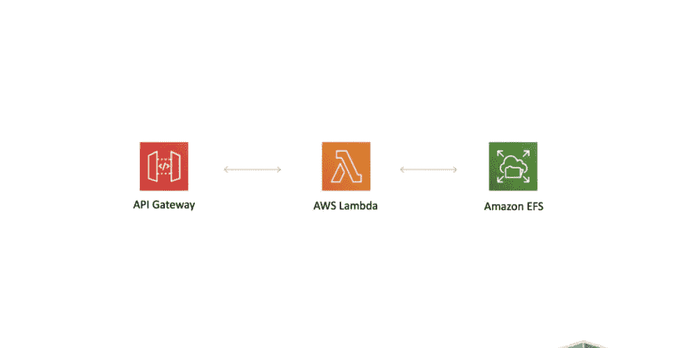

AWS Services

大家好

在这 3 篇文章系列中，我们将了解如何部署深度学习模型，该模型在 AWS 中执行图像分类，并向世界公开其 API，因此其他人可以与您的 API 进行交互。

**转到帖子 1:你就在那里，你应该在的地方。**

**转到帖子 2:** [**链接**](https://medium.com/@balakrishnakumar.v/deployment-of-deep-learning-models-in-aws-using-aws-lambda-aws-api-gateway-aws-elastic-file-2b7102b3ff39?sk=43669dd5d884823cc95d0281a3d4d2b2)

**转到帖子 3:** [**链接**](https://medium.com/@balakrishnakumar.v/deployment-of-deep-learning-models-in-aws-using-aws-lambda-aws-api-gateway-aws-elastic-file-c423139fa858?sk=c781d42e92cab18e797f2b5e58b7068c)

如前所述，我们将在 AWS 中使用 3 种服务。

1.  **AWS 弹性文件系统(第一部分)**

首先，EFS 是由亚马逊 Web 服务提供的云存储服务，旨在提供可扩展、弹性、有一些限制的并发和加密的文件存储，用于 AWS 云服务和内部资源。

我们之所以将 EFS 纳入我们的实现，是因为 AWS Lambda 施加的限制，只是为了运行深度学习模型，我们需要大量的依赖项以及您喜欢的 DL 库，如 Keras、Tensorflow 或 Pytorch。

AWS Lambda 目前支持带 AWS Lambda 的压缩部署包的硬限制为 50MB，未压缩的 AWS Lambda 硬限制为 250MB。

对于现实世界的部署，我们可能需要至少 1 GB 的依赖关系，因此为了克服这个问题，我们使用 AWS 弹性文件系统，在这里我们可以加载我们的部署包，并将这个路径添加到我们的 python 库，它可以毫无问题地导入。

但是这里我将添加两个实践的实现，我们将从 AWS Lambda 层导入一些库，从 AWS EFS 导入一些库。

**2。自动气象站 Lambda(第二部分)**

AWS Lambda 是完全无服务器的，我们只为计算时间和使用的资源付费。

我们正在使用 AWS Lambda 为我们的深度学习模型实现一种无服务器方法，其中我们的模型实际上为给定的图像执行计算。

3. **AWS API 网关(第三部分)**

为了使我们的深度学习模型对外部世界可用，我们可以使用 API 网关来创建我们的模型与他人交互的连接。

# **AWS 弹性文件系统(第一部分)**

好了，让我们开始创建 AWS EFS 和它的挂载点。

1.  在创建 EFS 之前，我们需要在 AWS 中配置一个新的安全组，以便通过 AWS Lambda & EC2 访问我们的 EFS。因此，我希望您已经登录到您的 AWS 帐户，并导航到 EC2 选项卡下的安全组。

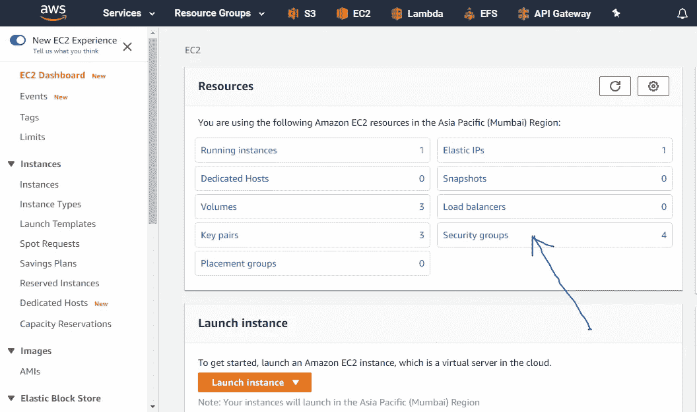

2.创建新的安全组。

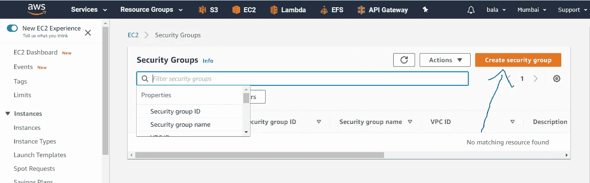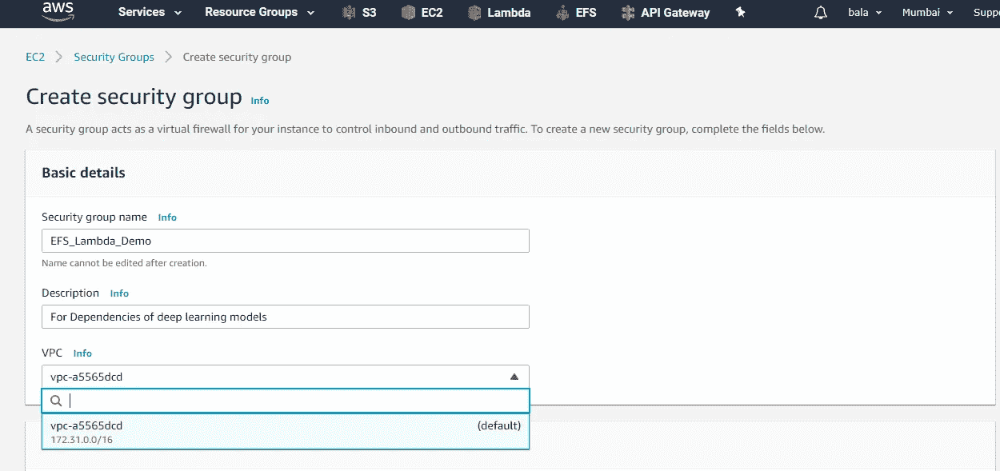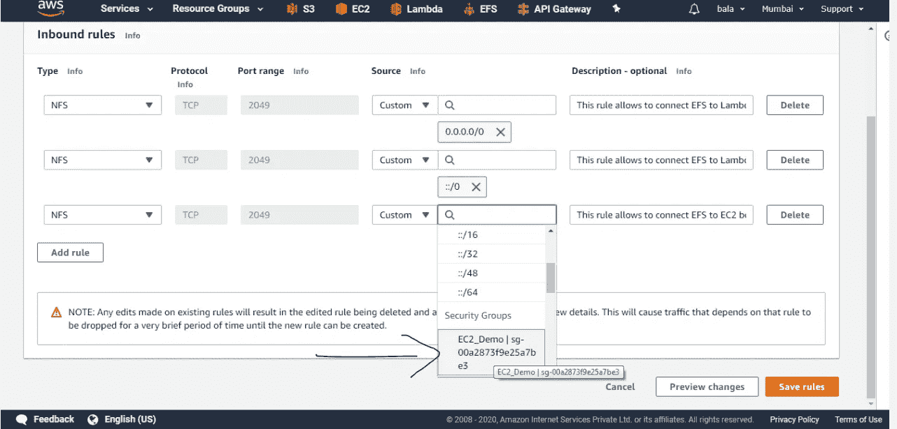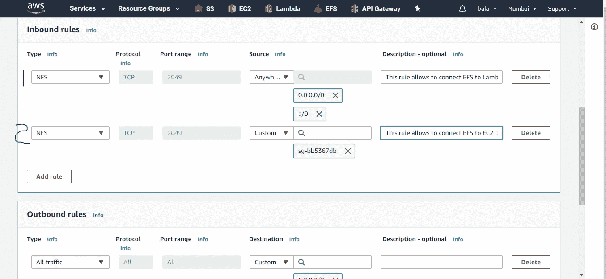

在这里，我添加了两条规则。

规则 1:使用 IPV4 和 IPV6 协议连接我们的 AWS EFS。

规则 2:挂载我们的 EC2 实例，然后我们可以将文件(Python 包)添加/替换到我们的 EFS 中。在 Source 下拉列表中，选择附加到您想要连接的 EC2 实例的安全组。

请注意，如果您正在运行连接到不同安全组的其他 EC2 实例，则无法挂载您的 EFS 驱动器，除非您像上面那样将它们的安全组添加到入站规则中。

如果这里没有 EC2 实例要添加，也没什么好担心的。查看我在 [**上的帖子，逐步在 AWS 中创建 EC2 实例，并通过 Putty & WinSCP**](https://medium.com/@balakrishnakumar777/step-by-step-creation-of-an-ec2-instance-in-aws-and-access-it-via-putty-winscp-a6c28f2022be) **，**访问它，然后创建一个 EC2 实例，或者稍后再创建，然后返回到安全组并在此处的入站规则中添加一个新条目。

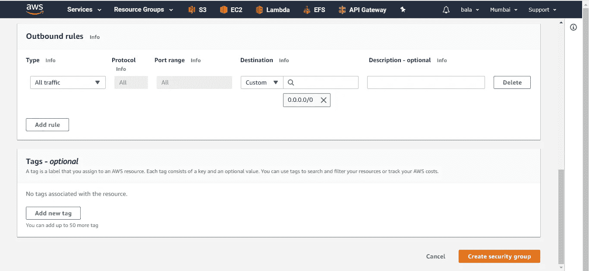

保持出站流量不变，然后单击创建安全组。

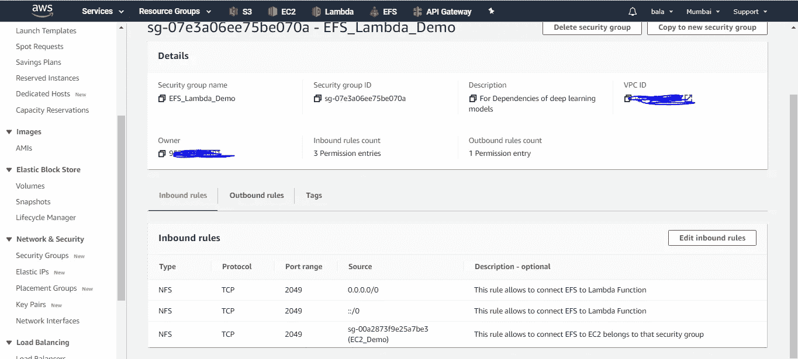

3.很好，现在让我们创建一个弹性文件系统(典型的 EFS 就像一个 Google Drive)，在这里您可以无限制地垂直扩展卷，并为您使用的内容付费。

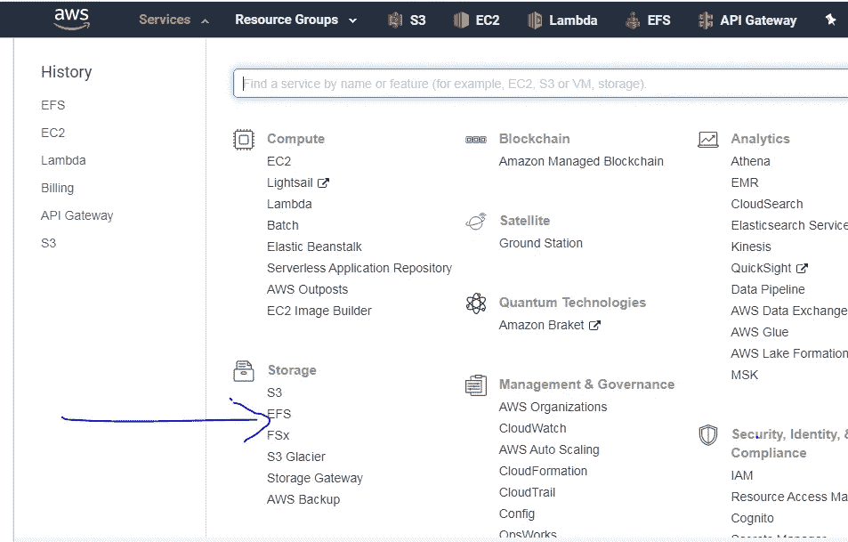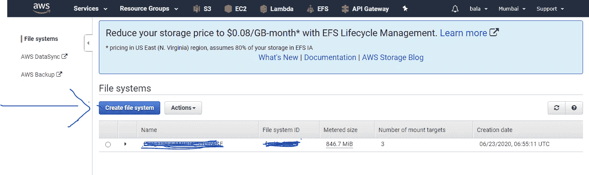

默认情况下，您将连接到一个默认的安全组，您必须删除它们并用新创建的安全组(在我们的例子中是 its→EFS _ 拉姆达 _ 演示)替换它们，然后单击下一步。

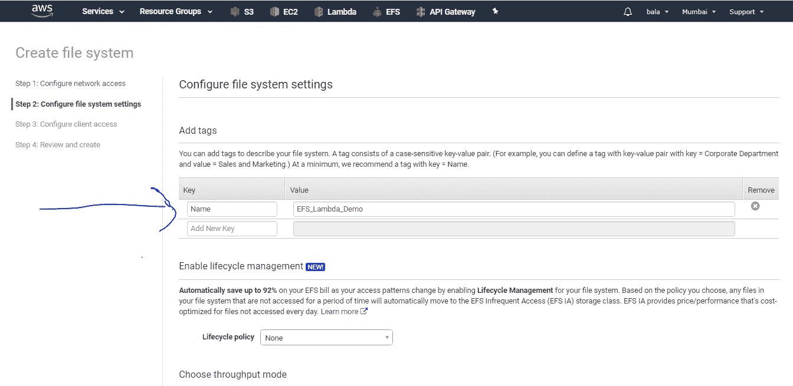

通过创建一个 key & Value 对来添加一个新的标签，因为我们稍后将使用这个标签来标识我们的 EFS，并保留默认选项，然后进入下一步。

在配置客户端访问的第 3 步中，使用上面的值来填充接入点，并随意选择名称和目录的值。这里我选择了/demo 目录，所以我将在 EFS 的这个文件夹下添加所有的依赖项。

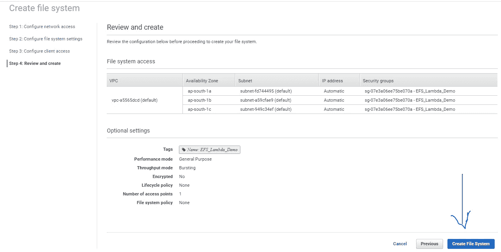

现在我们完成了，单击创建文件系统。

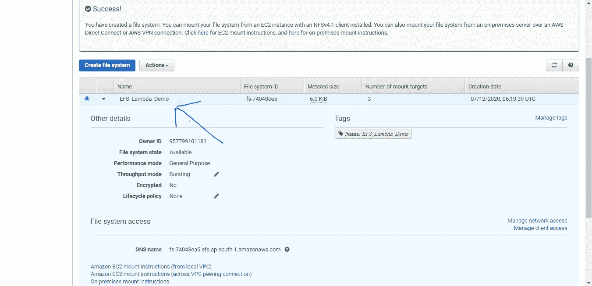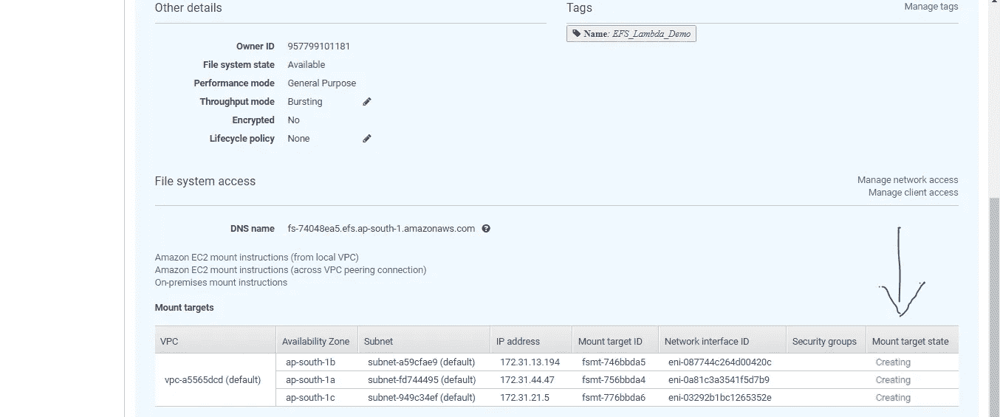

等待，直到挂载目标状态从**创建**变为**可用**状态。最后，我们完成了。

4.创建一个 EC2 实例，并使用挂载点连接我们的 EFS，让我们添加 python 包。

我在这里跳过了创建 EC2 实例的部分，如果你需要复习，请参考我的帖子 [**在 AWS 中逐步创建 EC2 实例，并通过 Putty&WinSCP**](https://medium.com/@balakrishnakumar777/step-by-step-creation-of-an-ec2-instance-in-aws-and-access-it-via-putty-winscp-a6c28f2022be)**访问它，然后回到这里。**

**现在让我们转到 EFS 页面，看看将我们的 EFS 驱动器安装到我们的 EC2 实例背后的说明。现在点击链接“亚马逊 EC2 安装说明(来自 VPC 本地)”。**

**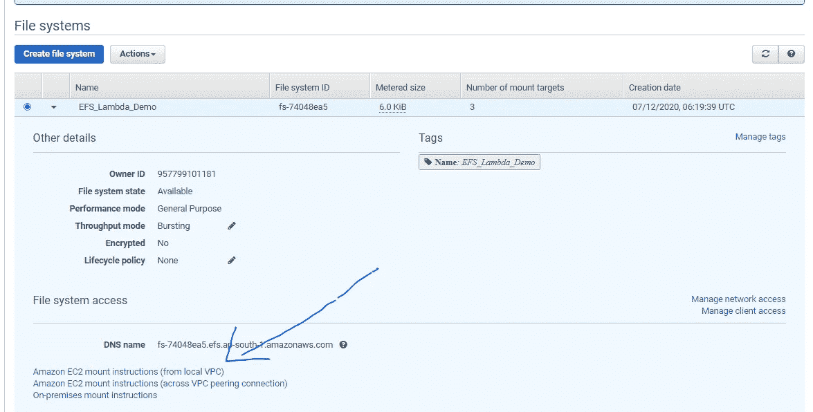**

**5.它会打开一个新的弹出窗口，因为我们使用的是基于 ubuntu 的 EC2 实例，所以我们会遵守绑定到基于 ubuntu 的操作系统的命令。**

**通过 Putty 连接您的实例并运行突出显示的命令。**

**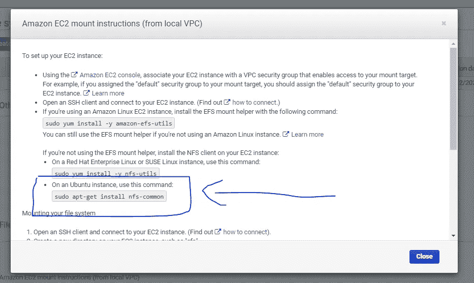****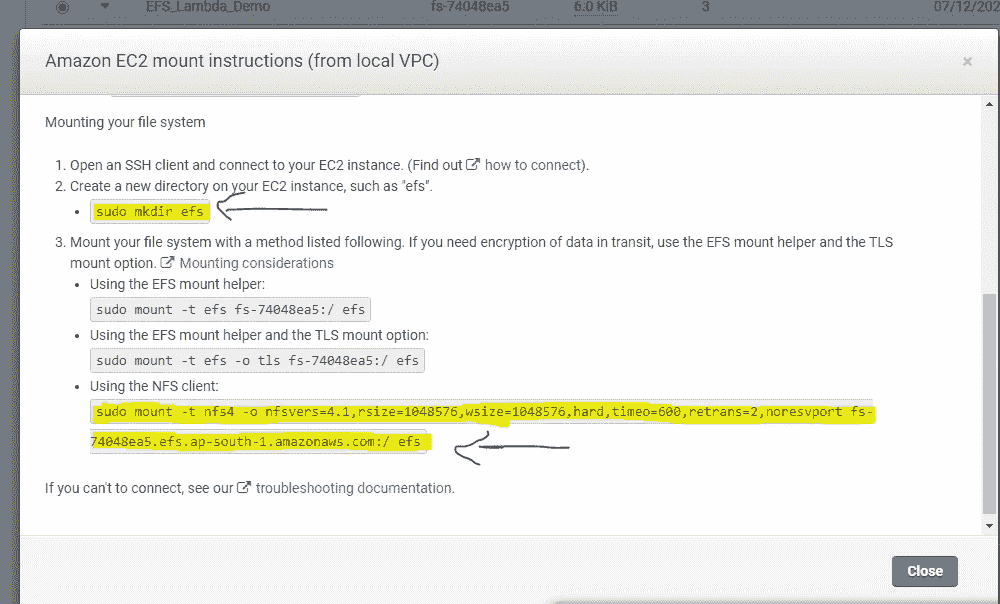**

**通常我们需要运行这 3 个命令。请注意，第三个命令是用户独有的。**

****C1。sudo apt-get 安装 nfs-common****

**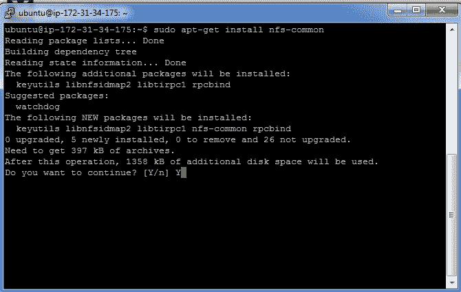**

****C2** : **sudo mkdir /efs(注意我在这里做目录，所以加/efs)****

**按照 putty 中列出的命令，在根目录中创建一个挂载点。**

**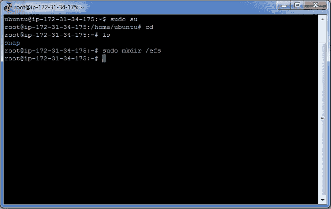**

**子命令:**

**SC1:须藤秀**

**SC2:光盘**

**SC3: ls**

**C2 : sudo mkdir /efs**

**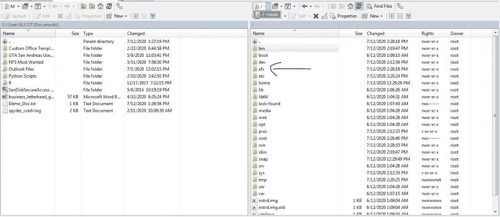**

**也检查与 WinSCP 工具，你可以看到一个新的文件夹“efs”在根目录。**

****C3:sudo mount-t NFS 4-o NFS vers = 4.1，rsize=1048576，wsize=1048576，hard，timeo=600，retrans=2，nores port fs-74048 ea 5 . EFS . AP-south-1 . amazonaws . com://EFS****

****(另请注意，我在结尾处使用了/efs，而不是 efs)****

**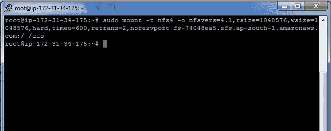**

**太好了，现在我们已经成功地在 EC2 文件系统中挂载了 EFS。现在让我们将一些文件添加到我们的 EFS 中，并在 AWS EFS 选项卡上检查更新的大小。**

**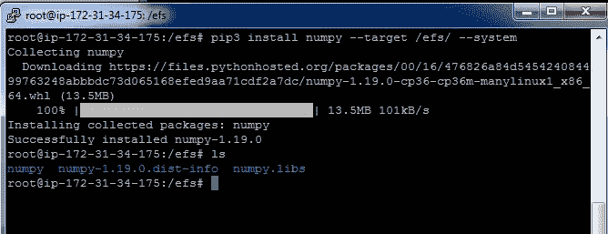**

**在这里，我在 efs 文件夹中下载了一个 NumPy python 包，我们可以在 EFS 控制台中看到计量大小的增加。**

**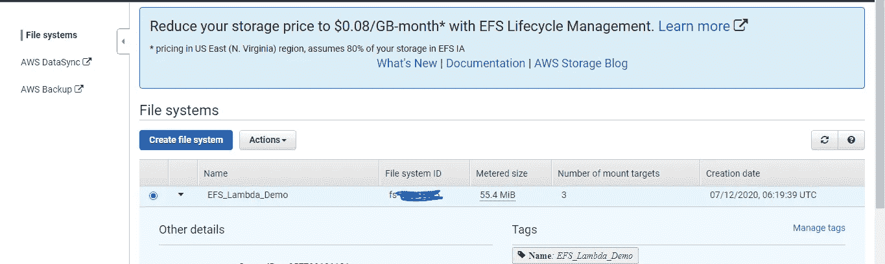**

**6.现在，在做实验时，我最近发现，当我们停止并启动一个实例时，EFS 驱动器被卸载，我每次都运行 **C3** 来连接我的 EFS。因此，解决这个问题的一个方法是在实例设置下的用户数据字段中添加 **C3** 。**

**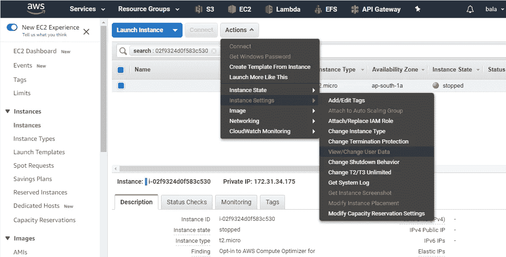****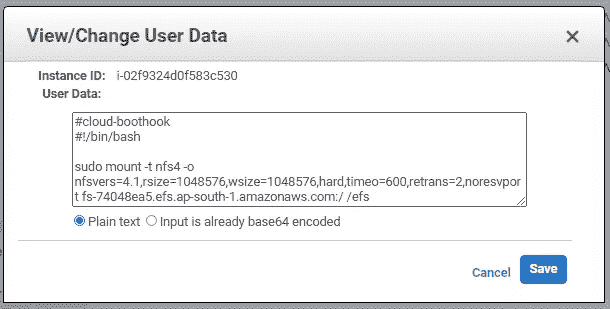**

**所以以后我们不用担心每次都要连接我们的 EFS。**

**好了，一旦你成功地实现了这一部分，现在你可以按照后 2 & 3。**

**最佳做法是检查 https://aws.amazon.com/ec2/pricing/[EFS](https://aws.amazon.com/efs/pricing/)的定价**

**我将发布与机器和深度学习相关的文章，以及它们与 AWS 服务的交集。**

**在那之前，下次见。**

****文章作者:****

**巴拉克里希纳库马诉 T21**