# 使用 AWS Lambda+AWS API gateway+AWS Elastic 文件系统在 AWS 中部署深度学习模型。(第三部分)

> 原文：<https://medium.datadriveninvestor.com/deployment-of-deep-learning-models-in-aws-using-aws-lambda-aws-api-gateway-aws-elastic-file-c423139fa858?source=collection_archive---------8----------------------->

大家好，

在这 3 篇文章系列中，我们将了解如何部署深度学习模型，该模型在 AWS 中执行图像分类，并向世界公开其 API，因此其他人可以与您的 API 进行交互。

**前往岗位 1:** [**链接**](https://medium.com/@balakrishnakumar.v/deployment-of-deep-learning-models-in-aws-using-aws-lambda-aws-api-gateway-aws-elastic-file-a48fdeb2c140)

**转到帖子 2:** [**链接**](https://medium.com/@balakrishnakumar.v/deployment-of-deep-learning-models-in-aws-using-aws-lambda-aws-api-gateway-aws-elastic-file-2b7102b3ff39?source=friends_link&sk=43669dd5d884823cc95d0281a3d4d2b2)

**转到岗位 3:你正是在那里，你应该在的地方。**

# AWS API 网关(第 3 部分)

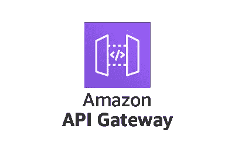

在我们的第一篇和第二篇文章中，我们解决了 AWS Lambda 的限制，即为什么它不能处理大小为 250 MB 的未压缩部署包，因此我们附加了 EFS，它就像 AWS 的 Google Drive，您可以在那里水平扩展并加载您的部署包。

在第二篇文章中，我们使用 AWS Lambda 层和 AWS EFS 向 AWS Lambda 中添加了部署包(轻型和重型)。

在这第三篇文章中，我们将最终使用 API Gateway 部署我们的图像识别模型，并向外界公开它。

让我们开始吧。

1.  导航到 AWS API 网关控制台并单击 Create API，然后构建一个 REST API 并填充必填字段。

将 API 的名称和端点类型命名为 Regional。

有三种类型的终端可用:区域终端(仅部署在当前区域)、边缘优化终端(部署在世界各地的边缘位置)、私有终端(部署在您当地的 VPC)

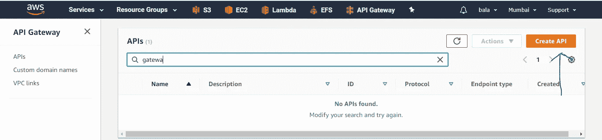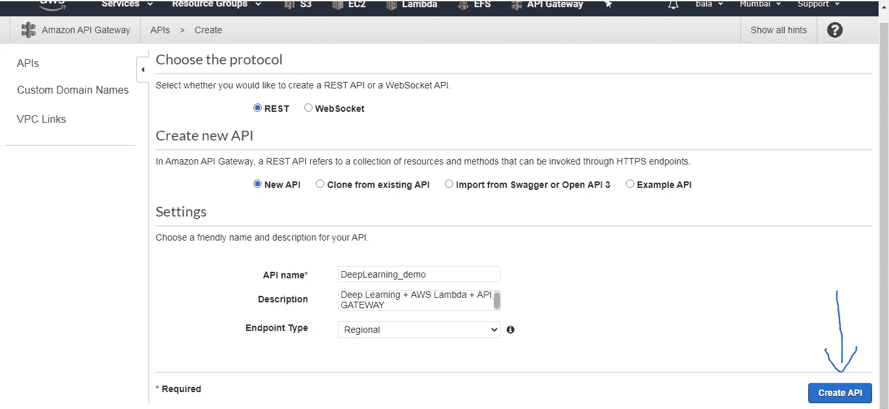

2.现在让我们根据表述性状态转移 API [REST](https://en.wikipedia.org/wiki/Representational_state_transfer) 的定义，创建一个资源和一个方法。

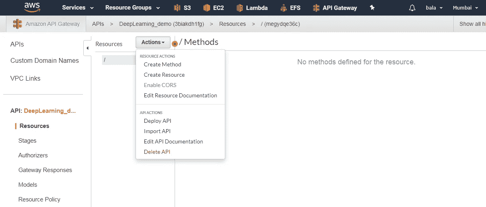

3.在操作下，单击创建资源并添加资源名称，然后单击创建资源。

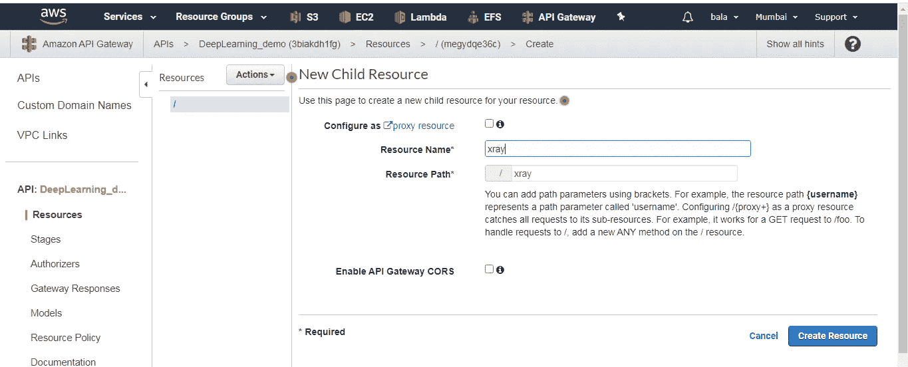

4.现在，在 Resource created 下，我们将创建一个新方法→ **POST (HTTP VERBS)** ，因为我们正在从用户那里获取一个图像**。**选择集成类型为**“Lambda 函数”，**选中**使用 Lambda 代理集成，**因为我们希望所有输入映射都在 Lambda 中完成(映射规则、输入内容类型等)，而选择我们在上一篇文章中创建的 Lambda 函数并保存它。

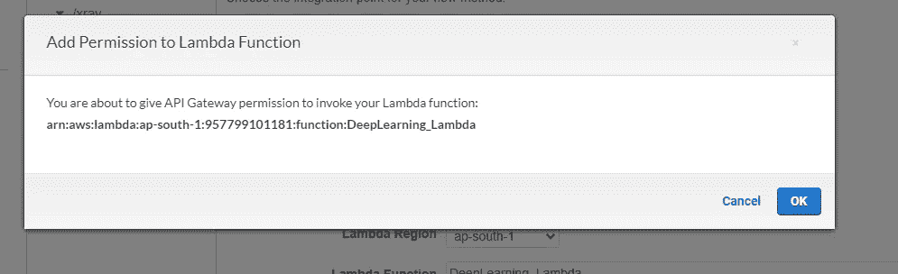

它将提示一个窗口，要求为 lambda 函数添加适当的权限。点击确定即可。

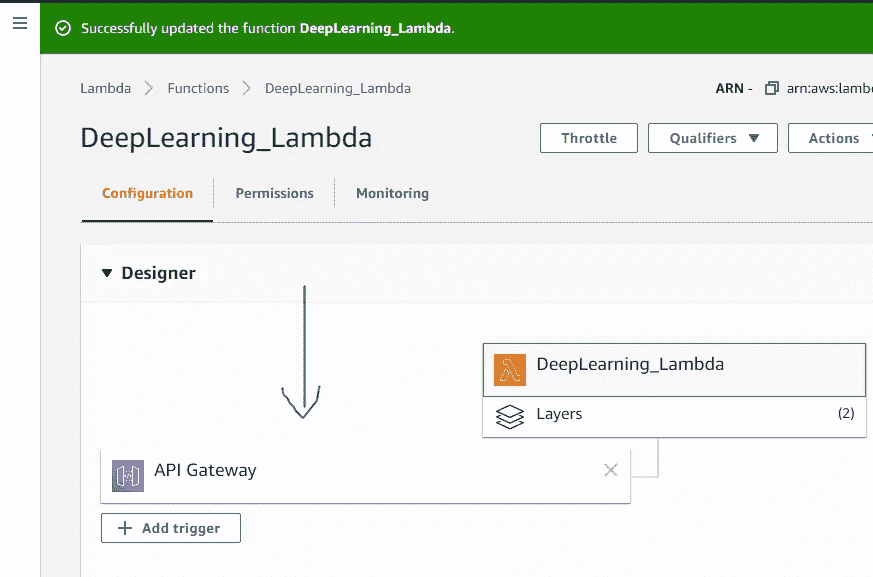

在 lambda 功能控制台，我们可以看到，它自动添加了一个触发点，因此我们的 AWS Lambda 可以由 API Gateway 触发。另请检查 permissions 选项卡，其中添加了基于资源的策略。

5.最后，在设置选项卡中，添加**二进制媒体类型:*/*，**一个通配符，以便它接受任何输入格式并保存更改。

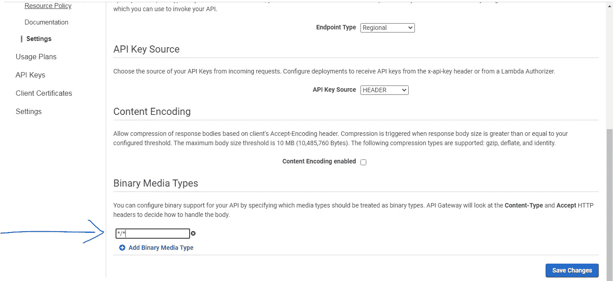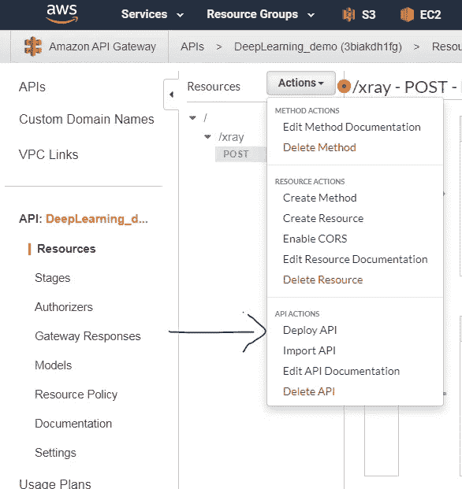

6.现在我们部署我们的 API，因此在 API 操作下，单击 Deploy API。

以便我们可以获得一个调用 URL 并传递我们的请求。

7.选择阶段名称 v1/dev/prod/test，然后单击 deploy。

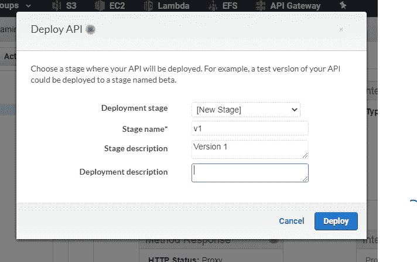

8.现在我们有了一个 invoke URL，在 BASH 中我们通过 CURL 调用这个 URL 来进行 API 调用。

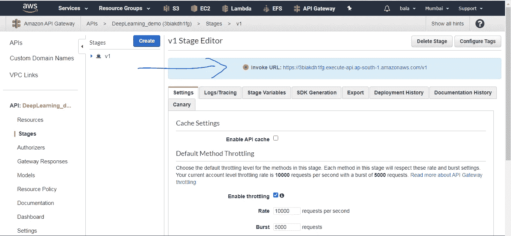

现在让我们检查我们的功能代码。这里我们打印出**事件**。

AWS Lambda 集成了其他 AWS 服务来调用函数。您可以配置触发器来调用函数以响应资源生命周期事件，响应传入的 HTTP 请求。

与 Lambda **集成的每个服务将数据**作为**事件**发送到 **JSON** 中的函数。对于每种事件类型，事件文档的结构是不同的，并且包含关于触发该功能的资源或请求的数据。Lambda 运行时将事件转换为对象，并将其传递给函数。

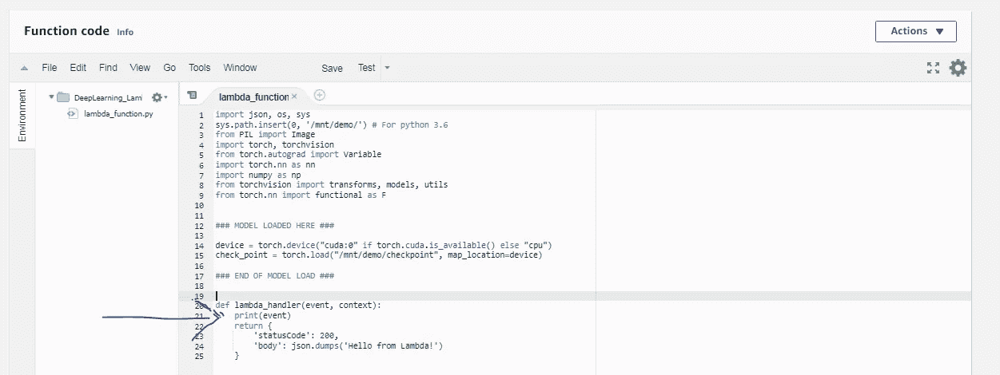

9.现在我们通过 Bash 控制台调用这个 URL，

命令:**curl-request POST-H " Content-Type:image/jpg "--upload-file " Xray . jpg "**[**https://3 biakdh1 fg . execute-API . AP-south-1 . Amazon AWS . com/v1/Xray**](https://3biakdh1fg.execute-api.ap-south-1.amazonaws.com/v1/xray)

在上面的命令中，我们传递一个 POST 请求，我们将内容类型指定为 image/jpg(也有各种其他可用的内容类型)，然后我们上传文件，我的桌面上有一个图像“xray.jpg ”,后面是**invoke _ URL/method(https://…/Xray)。**

我们得到默认输出“Hello from Lambda”，这表示我们的流程运行时没有任何错误。

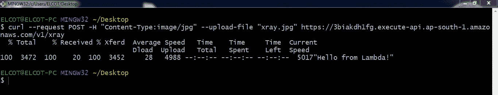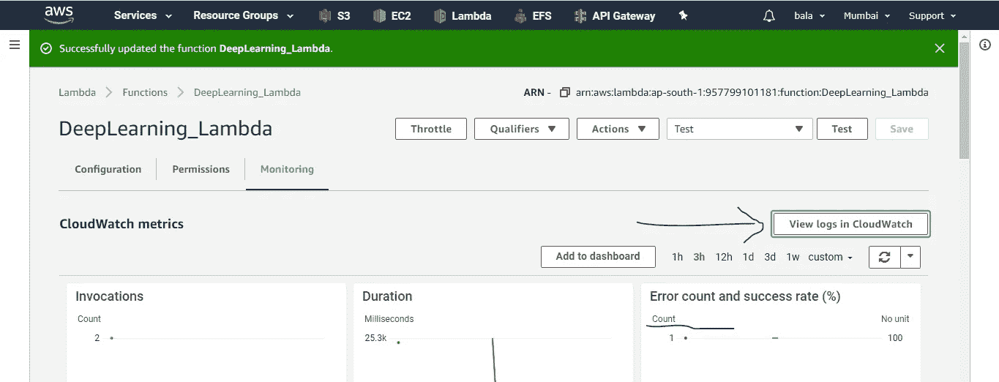

10.现在让我们通过调用 lambda 函数的 cloudwatch 日志中的 API 来监控我们得到的响应。

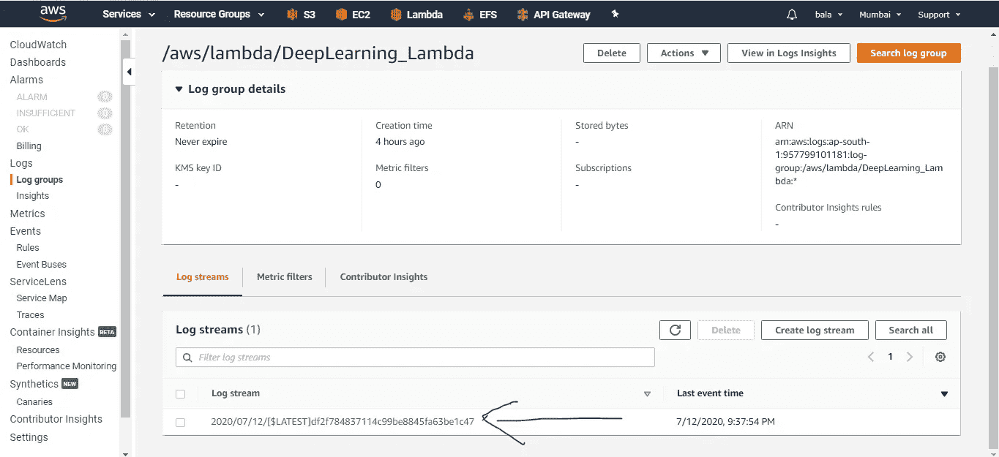

11.根据调用时间选择最近的日志。

12.这里的事件是我们输入的 JSON 格式，其中包含了我们可以使用的所有必要参数。

我们随调用 URL 一起发送的输入图像位于 JSON 的**“body**部分，但是输入图像是**base64 编码的，**因此为了重新构建，我们需要执行 base64 解码。

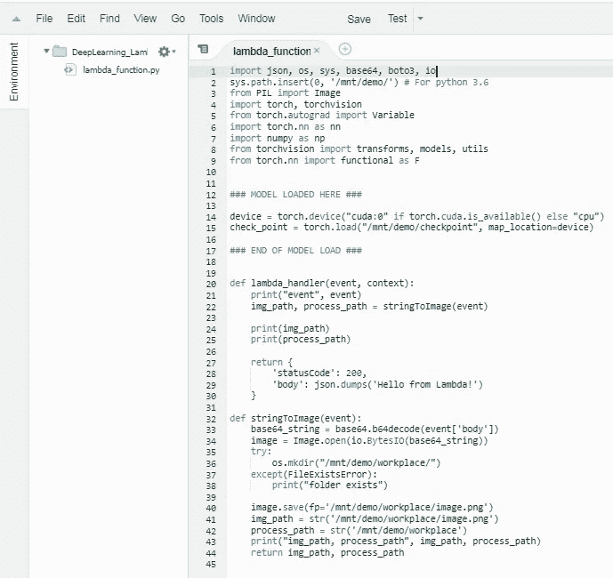

13.现在，我们在 lambda_function 中编写 python 代码来解码这个 base64 编码的图像，并将其存储在我们的 EFS 驱动器中。

15.这里我们可以看到图像被解码并存储在目录 **"/efs/demo/workplace "下。**现在使用这个 image，我们可以使用深度学习模型执行一些图像处理，并传递输出。所以让我们修改我们的代码。

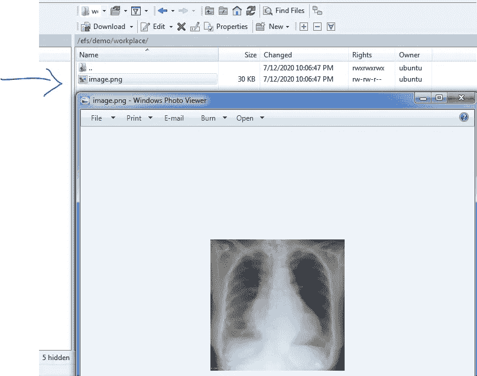

16.很好，现在我已经添加了一些基于深度学习的代码，用于处理输入图像并在给定的胸部 X 射线中找到疾病，现在我们的模型将提供发现的分类标签。

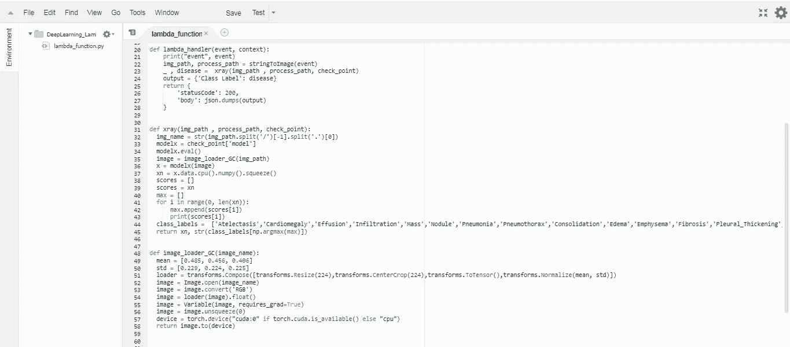

17.现在让我们用更新后的代码调用我们的 API 端点，看看我们是否能得到疾病标签的类别。

正如我们所料，我们可以看到我们的模型预测的输出标签，在我们的情况下，它是**心脏肥大。**

我们刚刚在无服务器模式下完成了深度学习模型的运行。

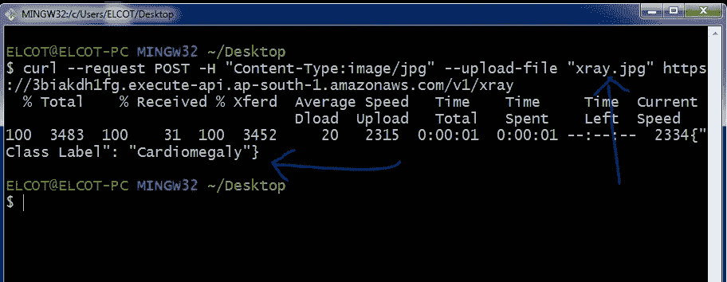

我们不仅仅局限于只发送回输出类，我们可以做很多事情。

太好了，我们终于到了三篇文章系列的结尾，我们遇到了 AWS 罩下的许多服务来实现它，这只是开始，有大量的定制可用。

# **局限性**:

现在，我们看到了如何在这个完整的系列中进行深度学习模型的端到端部署，了解每个服务内部存在的限制是很好的。

对于 AWS Lambda :最大执行时间为 15 分钟，最大可用 RAM 为 3 GB，如果您有 100 个 Lambda 函数，最大并发数为 1000。(也就是说，并发性是指在任何给定时间你的函数所服务的请求的数量。当您的函数被调用时，Lambda 会分配它的一个实例来处理事件。当功能代码完成运行时，它可以处理另一个请求。如果在处理请求时再次调用该函数，则会分配另一个实例，这将增加函数的并发性。)

在撰写本文时，它们是硬限制。

对于 **API 网关(REST API)** :最大超时只有 29s(硬限制)。因此，当用请求调用 invoke URL 时，您需要在 29 秒内发回响应，否则，连接将被终止，并发回超时错误。

因此，如果你的程序是 CPU 受限的或者 I/O 受限的，那么就利用 python 中的多线程/多处理模块，因为在 Lambda 下，最多分配 2 个 CPU 的内存。

否则，执行异步操作，在我们的例子中，您可以从用户那里获取图像，一旦成功，您可以向他们发送回响应，一旦处理完成，您可以配置通过 **AWS SES 将输出安全地发送到客户端。**

最佳实践是检查 AWS API 网关的定价:[https://aws.amazon.com/api-gateway/pricing/](https://aws.amazon.com/api-gateway/pricing/)

我将发布与机器和深度学习相关的文章，以及它们与 AWS 服务的交集。

在那之前，下次见。

**文章作者:**

**BALAKRISHNAKUMAR V**