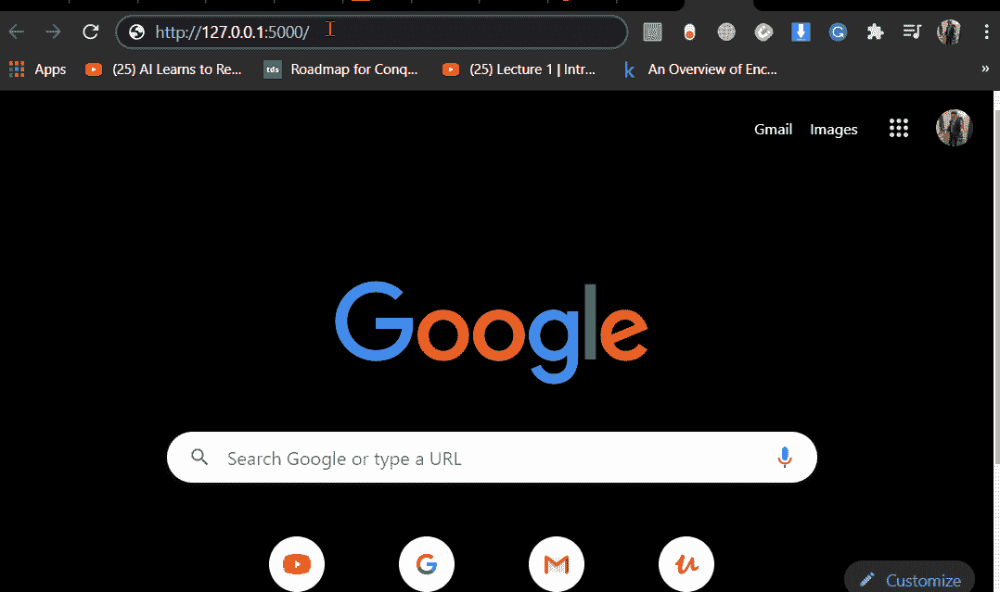
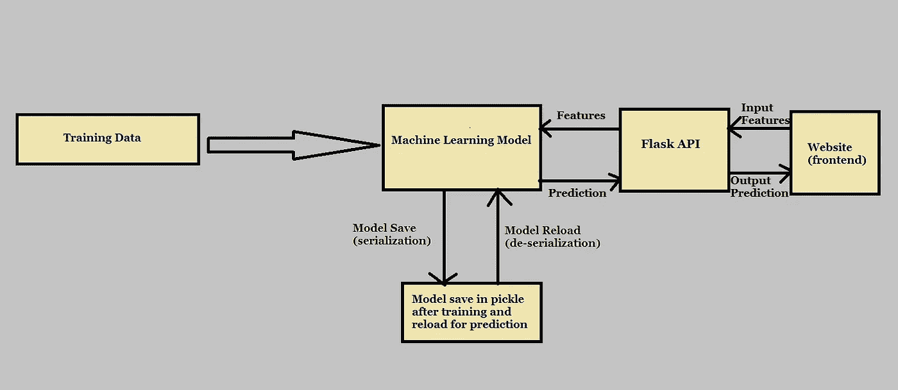

# 使用 Flask 的机器学习模型部署

> 原文：<https://medium.datadriveninvestor.com/deployment-of-machine-learning-project-using-flask-bf6e5a750319?source=collection_archive---------0----------------------->

## 生产中的机器学习项目。


Here it begins

在本文中，我们将主要讨论使用 flask API 的机器学习模型部署，但是使用 flask API 的模型构建和部署的代码将在我的 [**GitHub**](https://github.com/bharatc9530/Machine-Learning/tree/master/Model-Deployment-Using-Flask) 资源库中提供，以便您也可以在自己的项目中尝试。

我假设你在机器学习或深度学习模型构建方面有一些经验，并希望用**flask API**生产模型**。**

# **烧瓶 API 简介**

Flask 是一个轻量级的 [**Web 服务器网关接口(WSGI)**](https://en.wikipedia.org/wiki/Web_Server_Gateway_Interface) 一个用 python 编写的微框架。这意味着 flask 为我们提供了工具、库和技术，允许我们构建 web 应用程序。这个 web 应用可以是一些网页，一个博客，或者我们的机器学习模型预测 web 应用。Flask 是连接我们的模型和前端预测网页的中间媒介，如下图中的**所示。**


API Data Flow

# 先决条件

我们假设我们所有人都在 jupyter 笔记本上有关于模型训练的知识。这篇文章旨在提供关于使用 Flask API 将机器学习模型部署到生产中的见解。

模型部署中需要的库:

```
pip install pickle-mixin
pip install Flask
```

1.  [pickle](https://docs.python.org/3/library/pickle.html#:~:text=%E2%80%9CPickling%E2%80%9D%20is%20the%20process%20whereby,back%20into%20an%20object%20hierarchy.) :本地 python 库，用于将 python 对象作为文件保存(序列化)和加载(反序列化)到磁盘上。
2.  烧瓶:一个基于 python 的简单易用的微型 web 框架。

# 项目结构

这个项目有四个主要部分:

1.  iris.py —它包含我们的机器学习模型的代码，用于根据“iris.data”文件中的训练数据预测 Iris Plant(分类)。
2.  app . py——它包含 Flask APIs，通过 GUI 或 API 调用接收 Iris 数据输入，根据我们的模型计算预测值并返回它。
3.  iris.pkl —包含训练后获得的预训练模型，将在 app.py 中用于预测。
4.  模板-此文件夹包含允许用户输入输入要素并在网页中显示预测输出的 HTML 模板。

## 资料组


Pandas DataFrame

## 模特培训

首先，我们通过 CSV 文件读取数据，我们有四个输入特征和三个可能输出变量，因此我们对它们进行标记和编码以用于训练。之后，我们使用 SVC(支持向量分类)进行模型训练，并使用 pickle 保存模型(iri.pkl)。对于你的问题可能不同，我们举了一个简单的例子来理解。

## 烧瓶 API

*   这里，我们通过调用 flask(__name__)来初始化我们的 Flask 应用程序，并使用 pickle 加载模型。
*   " @app.route('/')"这里我们初始化了 flask 应用程序的根目录，并在其中定义了将在该根目录调用自身的函数。
*   " @app.route('/predict '，methods=['POST'])"这里我们定义了 home 函数，我们使用 request.form[' ']从前端 HTML 页面获取数据并预测输出，然后将其发送回 HTML 页面以进行预测可视化。

> 默认情况下，Flask 路由响应 **GET** 请求。然而，可以通过向 **route()** decorator 提供方法参数来改变这种偏好。
> 
> 为了演示在 URL 路由中使用 **POST** 方法，首先让我们创建一个 HTML 表单并使用 **POST** 方法将表单数据发送到一个 URL。

以下脚本在本地主机和默认端口(5000)上启动 flask 服务器，使[成为 URL: http://127.0.0.1](http://127.0.0.1:5000/) :5000/

> *只需在浏览器上粘贴*[*http://127 . 0 . 0 . 1:5000/*](http://127.0.0.1:5000/)*按回车键即可看到服务器工作。*

## Html 模板

```
templates folder
 |
 +-- home.html
 |    
 +-- after.html
```

1.  home.html 是我们在浏览器中打开链接时打开的默认根页面。它包含一个表单，我们通过这个表单以文本格式提供输入特性(总共四个),点击提交按钮，它调用 app.py 中的 home 函数进行预测。

2.after.html 是'/predict '目录中 home 函数的页面调用，它显示模型的预测。

## 在本地系统上托管



Flask API

**模型建立和部署流程图**



# 结论

模型部署是任何机器学习管道的关键部分。

Flask 是一个简单的 web 应用程序框架，很容易构建。使用 Flask API 托管和共享机器学习模型真的很容易。

完整代码:[***Github***](https://github.com/bharatc9530/Machine-Learning/tree/master/Model-Deployment-Using-Flask)

如果你想了解更多关于模型部署的知识，我想在 youtube 上用 flask 和 docker 调出这个 [**优秀播放列表**](https://www.youtube.com/watch?v=hTacGMfL8lc&list=PLZoTAELRMXVNKtpy0U_Mx9N26w8n0hIbs) 由 [**克里斯纳伊克**](https://www.youtube.com/channel/UCNU_lfiiWBdtULKOw6X0Dig) 制作。这是对我帮助最大的一个。一定要去看看。

# 参考

1.  [https://www.tutorialspoint.com/flask/flask_http_methods.htm](https://www.tutorialspoint.com/flask/flask_http_methods.htm)
2.  [https://flask.palletsprojects.com/en/1.1.x/](https://flask.palletsprojects.com/en/1.1.x/)

谢谢你的阅读。我也希望在未来写更多初学者友好的帖子，顺便说一下，这是我在**媒体**上的第一个帖子。

[](https://www.datadriveninvestor.com/2020/02/19/five-data-science-and-machine-learning-trends-that-will-define-job-prospects-in-2020/) [## 将定义 2020 年就业前景的五大数据科学和机器学习趋势|数据驱动…

### 数据科学和 ML 是 2019 年最受关注的趋势之一，毫无疑问，它们将继续发展…

www.datadriveninvestor.com](https://www.datadriveninvestor.com/2020/02/19/five-data-science-and-machine-learning-trends-that-will-define-job-prospects-in-2020/) 

在 [**中**](https://medium.com/@bharatchoudhary817) 跟我上来。一如既往，我欢迎反馈和建设性的批评，可以通过 [**Linkedin**](http://www.linkedin.com/in/bharat-choudhary-9530) 联系。

**访问专家视图—** [**订阅 DDI 英特尔**](https://datadriveninvestor.com/ddi-intel)