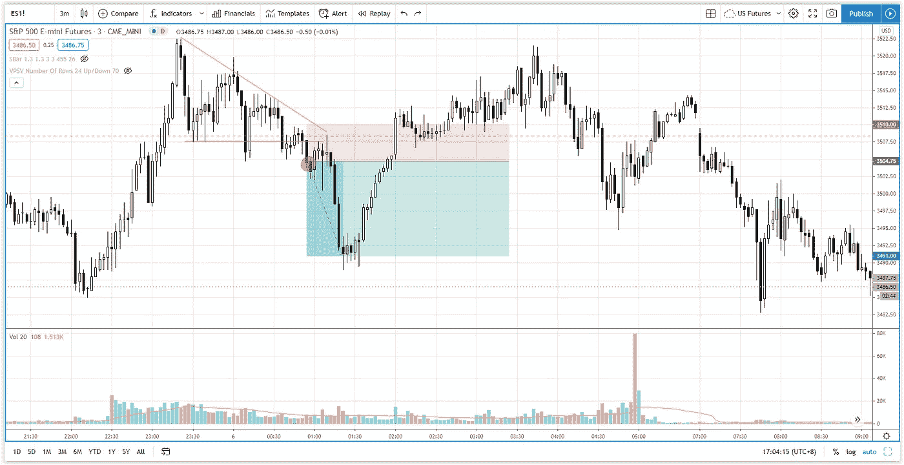

# 没人告诉你的下降三角形图表模式交易策略

> 原文：<https://medium.datadriveninvestor.com/descending-triangle-chart-pattern-trading-strategy-s-p-500-day-trading-c5d9f2520697?source=collection_archive---------13----------------------->

在交易回顾部分，找出如何通过正确的供求关系交易从下降三角形图中获利。

观看视频，了解 2020 年 11 月 6 日交易时段标准普尔 500 指数期货的**每日市场分析。在这个视频中，你将看到最后一节的市场回顾和三分钟内的交易回顾(包括进场、出场和背后的原理)。展望未来，我将涵盖偏见，要注意的关键水平，我稍后的交易计划。**

## 时间戳

*   [1:09](https://www.youtube.com/watch?v=cIMzaBw8ObE&t=69s) 市场回顾
*   [2:30](https://www.youtube.com/watch?v=cIMzaBw8ObE&t=150s) 贸易回顾
*   [4:50](https://www.youtube.com/watch?v=cIMzaBw8ObE&t=290s) 下跌三角形的突破
*   [9:05](https://www.youtube.com/watch?v=cIMzaBw8ObE&t=545s) 当前股市展望

如果你还没有看我的[每日市场分析视频](https://www.youtube.com/watch?v=fbEwcwqXR0k)，为了更好地了解市场回顾和交易回顾。

**偏向** —中性(日内交易)；看涨(长期)

**关键点位** —阻力:3540，3500–3520；支持:3480、3400–3420

**潜在设置** —在关键级别寻找潜在反转。

# 资源

**每周市场展望&最佳交易建议**直达您的收件箱:[https://www.tradeprecise.com/](https://www.tradeprecise.com/)

**职业免费**制图平台:创建账户→[www.TradingView.com](https://bit.ly/2U2Femd)

**非美国居民？** ( **马来西亚、新加坡**、澳大利亚、新西兰、欧洲等……):[点击此处，当您存入新币 2000 元](https://ji.hn/sgtiger)时，即可获得**免费股票(价值 100++ &美元)老虎经纪**的欢迎礼物

美国居民？[点击此处，当您存入 1500 美元](https://ji.hn/ustradeup)时，就有机会在 TradeUP 上获得一份**免费的 AMZN 股票(价值 3000++美元** ) & **欢迎礼物**

**无限制访问媒体文章** —加入以下:【https://priceactiontrading.medium.com/membership】T2

# 进一步阅读

 [## SLV 白银 ETF——下一个 GameStop (GME ),由 WallStreetBets (WSB)做空？

### SLV 交易所交易基金将成为下一个 GameStop (GME)开始疯狂上涨，因为华尔街 Bets 准备释放世界…

medium.com](https://medium.com/datadriveninvestor/slv-silver-etf-the-next-gamestop-gme-by-wallstreetbets-wsb-short-squeeze-d2c748045fe1)  [## 市场修正，泡沫还是崩盘？标准普尔 500 价格行为分析

### 标准普尔 500 期货(es)昨日因供应激增下跌 2.5%，跌破上行通道。这是正常的…

medium.com](https://medium.com/datadriveninvestor/market-correction-bubble-or-crash-s-p-500-price-action-analysis-6f26e6698dbc)  [## 2021 年这些绿色能源股会涨 400%-1300%吗？

### 2021 年第 3 周市场回顾

medium.com](https://medium.com/datadriveninvestor/will-these-green-energy-stocks-gained-400-1300-in-2021-3f7288227c76) 

Photo by Author — Ming Jong Tey

Photo by Author — Ming Jong Tey

披露:如果您点击本文中的链接进行购买或开立账户，并将所需金额存入推荐的经纪人账户，我们将免费为您赚取佣金。

免责声明:本演示中的信息仅用于教育目的，不应作为投资建议。