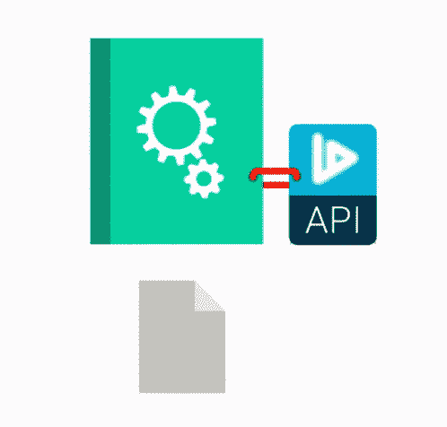

# 反序列化缺陷

> 原文：<https://medium.datadriveninvestor.com/deserialization-flaws-6f41af45953b?source=collection_archive---------3----------------------->

## 不安全的反序列化是现代 web 应用程序中最常见的漏洞之一，它允许攻击者通过序列化对象传输有效负载。

明确一点，反序列化漏洞不是代码级的 bugs 它们主要是由应用程序级序列化中的设计错误引起的。由于影响较小，这种类型的空中漏洞不太受安全研究人员的欢迎。避免反序列化漏洞的最佳方法是将您的应用程序嵌入到一个设计为不能提供与普通序列化应用程序相同性能的应用程序中，如电子邮件客户端。

不同的 API 框架有不同的序列化和反序列化过程，这些风险可以不同的方式处理。没有已知的漏洞，但是从 XML 到 JSON 的序列化格式的转换并不能解决所有的反序列化问题。

成功的反序列化攻击允许将未经授权的代码注入应用程序。如果允许攻击者的代码不安全地执行，几乎任何恶意意图都是可能的。

 [## 分散化、多样化和抗脆弱性|数据驱动的投资者

### 1997 年，当被问及现代企业面临的最大挑战时，汤姆·彼得斯和罗伯特…

www.datadriveninvestor.com](https://www.datadriveninvestor.com/2018/10/12/decentralization-diversification-and-antifragility/) 

不安全的反序列化是一个漏洞，不可信或未知的数据被用来执行拒绝服务(DDoS)攻击、执行代码或进一步滥用应用程序逻辑。相应的漏洞是一个被利用的盲目命令执行漏洞。不可信数据的反序列化可能会导致安全漏洞，并且可能被远程攻击者利用来使用 JMS ObjectMessage 在应用程序中执行任意代码。当不受信任的用户能够操纵对象并将其直接发送给 PHP 可疑的函数时，不安全的反序列化漏洞会导致应用程序中存在不安全的访问控制漏洞。不安全荒漠化的可能后果是损害访问控制、未经授权访问数据以及注入未经授权的代码。

在过去，利用反序列化错误大多是手动的，但是今天的大多数开发人员认识到他们不能信任用户输入，倾向于信任在该过程中绑定的数据，这使得攻击者能够破坏该过程并执行一系列攻击。

不可信数据的反序列化可能导致成功利用漏洞，使得攻击者能够以 causer 的权限在受影响的设备上执行任意代码。攻击者可以通过向受影响系统上的某些侦听器发送恶意的序列化 Java 对象来利用此漏洞。该漏洞使得攻击者能够在没有 case 用户权限的设备和未经验证的远程攻击者上执行任意命令。

XML 曾经是攻击 web 应用程序的基础，但 JSON (JavaScript Object Notation)是目前 web 应用程序中最流行、最安全的 XML 替代方案。随着新设计更频繁地使用 JSON，需要将注意力集中在不安全的荒漠化上，将其作为一个紧迫的安全问题。如果得不到足够的保护，将来被利用的漏洞的数量正在增加。另一方面，在我们分析了 JSON 之后，公平地说，即使是 JSON 也没有那么安全。

Java 运行时系统可以将序列化的流转换和反序列化为对象，而无需首先用预期的类型验证其内容。为了防止 Java 的反序列化漏洞，应用程序必须限制可以放弃的类的数量，并限制攻击者可以获得的数据量。

易受攻击的代码存在很长时间并不罕见，但直到现在我们才真正知道这些漏洞经常出现在大型、流行的应用程序中。随着越来越多的开发人员检测到漏洞，越来越多的安全工具支持它们，我相信会发现更多由不安全的荒漠化造成的漏洞。

## 有用的来源

YSOSERIAL 是一个概念验证(POC)工具，用于生成利用不安全 Java 对象反序列化的有效负载。您可以在 Apache 2.0 许可下从 GitHub 资源库免费下载它。[链接](https://github.com/frohoff/ysoserial)

对于 pen 测试人员和研究人员来说，Java-Deserialization-Cheat-Sheet 是关于各种 Java (JVM)序列化库中的反序列化漏洞的非常有用的资源。[链接](https://github.com/GrrrDog/Java-Deserialization-Cheat-Sheet#exploits)

## 引用的来源

*   【http://varutra.com/blog/?p=1559 
*   [https://www . Christian-schneider . net/javadeserializationsecurityfaq . html](https://www.christian-schneider.net/JavaDeserializationSecurityFAQ.html)
*   [https://the hackerish . com/secure-deserialization-explained-with-examples/](https://thehackerish.com/insecure-deserialization-explained-with-examples/)
*   [https://blog.doyensec.com/2019/07/22/jackson-gadgets.html](https://blog.doyensec.com/2019/07/22/jackson-gadgets.html)
*   [https://dzone . com/articles/why-are-deserialization-vulnerability-so-popular](https://dzone.com/articles/why-are-deserialization-vulnerabilities-so-popular)
*   [https://blog . gypsy engineer . com/en/security/safer-deserialization-in-spring-security-oauth . html](https://blog.gypsyengineer.com/en/security/safer-deserialization-in-spring-security-oauth.html)
*   [http://apfs . just likeu . be/8 snun/JSON-反序列化-漏洞-c.html](http://apfs.justlikeu.be/8snun/json-deserialization-vulnerability-c.html)
*   [https://www . tenable . com/blog/CVE-2020-2883-Oracle-WebLogic-反序列化-漏洞利用-在野外](https://www.tenable.com/blog/cve-2020-2883-oracle-weblogic-deserialization-vulnerability-exploited-in-the-wild)

**访问专家视图—** [**订阅 DDI 英特尔**](https://datadriveninvestor.com/ddi-intel)