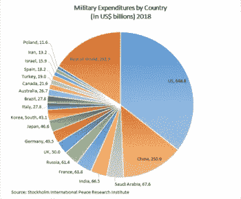
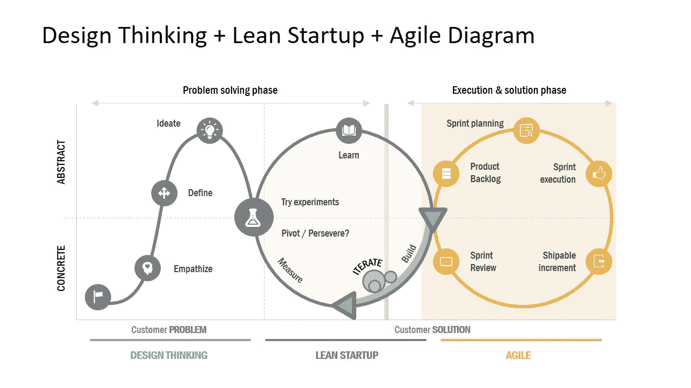
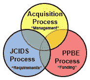
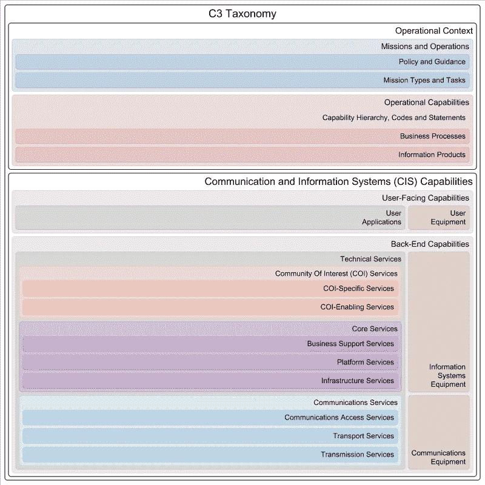

# 设计思维与军事创新

> 原文：<https://medium.datadriveninvestor.com/design-thinking-and-military-innovation-e1e87faa00e9?source=collection_archive---------10----------------------->

世界军费开支每年占国内生产总值的 2.1%。美国花费了 GDP 的 3.2%，北约花费了 GDP 的 2.5%。为了让你知道它的意思，让我们看看美国的自由支配预算。美国 2021 年的自由支配预算为 1.485 万亿美元。一半以上用于军事开支，包括国土安全部、退伍军人事务部和其他与国防相关的部门。

Military Expenditure per Country

这导致一些最具创新性的发明来自军事部门。人类历史上一些最伟大的进步都是这种军事创新的结果。数码摄影、虚拟现实、深度网络和互联网本身只是军事研究中诞生的一些技术。

创新是一个新的想法，创造性的思想，和新的想象力，作为应用更好的解决方案，以满足新的要求，明确的需求，或现有的需求。创新中最流行的方法之一是设计思维，这是一种更好地理解需求、挑战假设、重新构建问题并提出解决方案的方法。它通常与精益启动一起使用，以开发提议的服务/产品，并使用敏捷方法来交付提议的服务/产品。我想强调的是，精益创业就是在企业内部开发特定的服务/产品。业务模型画布用于总体业务，以找到适合组织的运营模型。

Design Thinking, Lean Startup and Agile

艾森豪威尔说，“计划什么都不是。规划就是一切。”军事创新来自其资金和治理。美国国防部(DOD)拥有强大的、经过战斗考验的国防采办系统，该系统是一个管理技术、计划和产品支持投资的过程，这些投资对于实现安全战略和支持当今和未来的武装部队以公平合理的价格及时满足他们的需求、提高能力和作战支持是必要的。

Defense Acquisition System

联合能力集成和发展系统(JCIDS)是一个需求过程，它提供了确定、评估、验证和优先化能力需求、理论、组织、训练、材料、领导、教育、人员、设施和互操作性、政策范围内的差距和冗余的既定方法。(DOTMLPF-IP)通过

基于能力的规划(定义能力、评估需求、提出解决方案)

联合概念(CONOPS[【1】](#_ftn1)、分析、实验、紧急需求和任务)和集成架构(企业架构，例如 DODAF)的应用

集成的协作审查流程

利用所有利益相关者的专业知识。

其结果是初始能力、能力发展、能力部署和操作支持。从而定义了诸如北约标准、NIST 等标准和规范。

DOTMLPF-IP 频谱是为了避免“锤到每个解决方案看起来都像钉子”的方法:

教条:军事事务中的既定原则。他们作战的方式，如杜鲁门主义，强调机动战和联合部队战役。

**组织**:他们如何组织战斗；师、空军联队、海空地面特遣部队等。

**训练**:他们如何准备战术上的战斗；基础训练到高级单兵训练，各种类型的单元训练，联合演习等。

物资:装备部队所必需的所有“东西”，也就是武器、备件等。所以他们可以有效地运作。

**领导力** **和教育**:他们是如何培养他们的领导人从班长到四星上将/上将的战斗；职业发展。

**人员**:和平时期、战争时期以及各种应急行动中合格人员的可用性

**设施**:不动产；支持部队的设施和工业设施(如弹药生产设施)。

互操作性:与整个联盟中的部队进行互操作的能力

**政策**:任何可能妨碍在其他 DOTMLPF-IP 领域有效实施变更的跨机构或国际政策问题

让我们来看一个模型，它代表了功能的所有生命周期活动中涉及的概念及其关系。C3 分类法使一种通用语言和工具能够同步这些活动，并通过国防规划过程(DPP)中表达的雄心水平，改善战略概念和政治指导与通信和信息系统(CIS)架构和设计结构之间的联系。C3 分类法是一个通用的框架，它为“互联力量”计划的一个关键组成部分做出了贡献:利用技术来帮助实现互操作性。下图描绘了 C3 分类法的最高层次，通过任务类型、能力代码和声明、业务流程和信息产品将政治和军事野心与独联体能力组成部分联系起来。

C3 Taxanomy

[【1】](#_ftnref1)作战概念(CONOPS)用于检查解决当前或新出现问题所需的当前、新的或提议的能力。它从各种涉众的角度描述了如何使用一个系统。这在项目开始时的模糊能力和取得成功所需的特定技术需求之间架起了一座桥梁。