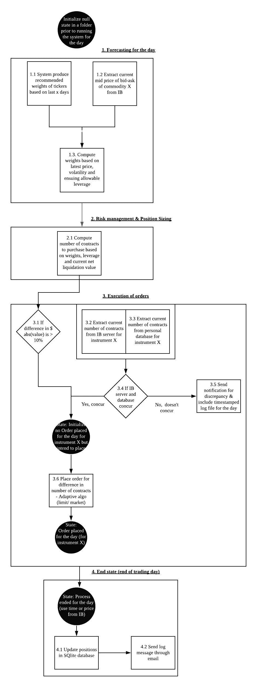

# 设计、构建和部署全自动算法交易系统

> 原文：<https://medium.datadriveninvestor.com/designing-and-building-a-fully-automated-algorithmic-trading-portfolio-management-system-6945c6c87620?source=collection_archive---------2----------------------->

My personal Jarvis

2020 年 11 月 10 日更新:如果你喜欢这些内容，你可以访问我以前的文章 [第二部分](https://medium.com/datadriveninvestor/how-to-place-option-spread-e-g-straddle-through-interactive-brokers-api-a-101-tutorial-aca2a0be3737)和[第三部分](https://medium.com/datadriveninvestor/deploying-a-hedging-feature-for-foreign-exposure-in-fully-automated-algorithmic-trading-system-8db31f50d3ad) *，在那里我讨论了我如何设计、构建和部署我的期权策略和外汇对冲的全自动算法。我也写过关于系统性能监控特性的文章，在这些文章中，我讨论了如何捕捉股票曲线、时间加权回报、滑动、汇率影响、滚动波动和提款。参见* [第一部分](https://medium.com/datadriveninvestor/developing-a-performance-monitoring-component-in-my-fully-automated-algorithmic-trading-system-88f5afae05cd)、[第二部分](https://medium.com/datadriveninvestor/developing-a-performance-monitoring-component-in-my-fully-automated-algorithmic-trading-system-983368441bba)和[第三部分](https://medium.com/datadriveninvestor/performance-monitoring-component-in-my-fully-automated-algorithmic-trading-system-part-3-3d41f14005)

在我开发几个日间交易/投资组合管理算法的同时，我也开始了一个并行的旅程，开发一个完全自动化的执行框架来满足我的需求。

**以前，信号自动生成后，手动执行订单。*

**要求**

-在交易时间由每小时任务调度程序触发的相对较慢的交易系统。为此，我使用了 Linux cron 作业。

-非事件驱动的框架。我依赖 ib_sync 框架在交互式代理中执行我的算法。根据我的经验，替代方案是一个事件驱动的框架(例如基于 asyncio 的官方 IB 框架),它很难调试，对于我的中低频交易/投资组合管理系统来说是一个大材小用。

-与风险、信号和杠杆上限相关的自动化交易执行和投资组合调整。

-从多个数据源/API 获取数据，用于信号处理、交易执行和日志。

-在启动任何交易之前，包括适当的安全措施和断路开关。

-在交易日开始、中间和结束时通过电子邮件通知错误和每日更新。

-能够通过 Python 整合以上步骤。

**采取的步骤**

无需深入代码的细节，这里是我的框架的一般流程。文章末尾附有“主”程序和执行流程图。

1.  作为新会话连接到我的经纪帐户。
2.  取消任何未结订单。我采用这个选项，而不是“修改订单”,因为它更容易。如果我要修改订单，我必须跟踪已完成订单和未完成订单的数量。由于我的算法是每小时触发一次，在该小时时段的任何未执行订单都被视为明显偏离当前价格，以限价执行的机会非常低。也就是说，在我的下一次迭代中，我更愿意花时间编写代码来“修改订单”，而不是简单的“取消订单”。
3.  生成预测，即来自不同报价机的所需杠杆和权重。我目前把它们写成本地文件，而不是提交给数据库或作为变量存储，因为它们在实时交易中更健壮。我不必担心并发问题(否则代码必须考虑互斥和锁)、数据库停机。
4.  获得账户的净清算价值。
5.  读入股票权重并利用第 3 步中写出的文件。
6.  为不同的报价机创建订单文件，包括“购买”、“出售”或“什么都不做”等行为、数量和限价。目前，我使用的是互动经纪商的自适应限价订单——根据我的理解，这是一种以限价为上限的全权委托订单。目前，我不愿意在这方面投入更多的时间来获得任何进一步的执行阿尔法，因为这可能是一个不平凡的任务，深入研究买卖双方的订单。
7.  通过错误标志检查从步骤 1 到 4 是否有任何错误。如果有任何错误，订单将不会被发送。如果一切顺利，程序会将订单发送到交易所。
8.  交易，如果有的话，被记录到一个 csv 文件中。
9.  保存当前快照，包括当前头寸、交易、净清算价值、利用的杠杆和利润。
10.  如果遇到错误，系统会向我的 gmail 发送提醒。
11.  每日更新/快照会在会话开始、中间和结束时发送到我的 gmail。
12.  如果该程序在美国标准时间早上 5 点(美国交易时间之后)被触发，快照和交易信息将被提交到我的数据库中。
13.  断开与当前会话的连接。

**技术堆栈**

如果你很想知道我的技术堆栈，我目前正在使用以下技术，

*   Linux Mint
*   薄荷盒，8GB 内存(但任何笔记本电脑或虚拟专用服务器就足够了)
*   交互式经纪人经纪账户(但是该框架可以适用于任何具有 API 的经纪人)
*   交互式经纪人网关(IB Trade Worker Station 是一个备选方案，但我不需要任何图形用户界面来实现我的目的)
*   ib_insync 框架

**告诫的话**

*   这个框架对于逐点或逐棒(秒或分)交易算法来说并不理想，因为它不是基于速度的。如果需要速度，事件驱动的框架将是更好的选择。
*   我依靠经纪服务器端来跟踪当前的头寸、保证金、杠杆和订单。在这个最小可行产品之外的下一个开发阶段，我热衷于开发我自己的会计系统。

*如果你喜欢这些内容，你可以在这里***访问续集，在这里我讨论了我如何通过交互式经纪人 API 进行期权价差，以及我如何在这里* *实现我的外汇对冲功能* [*。*](https://medium.com/datadriveninvestor/deploying-a-hedging-feature-for-foreign-exposure-in-fully-automated-algorithmic-trading-system-8db31f50d3ad)*

**我也写过关于系统性能监控功能的文章，其中我讨论了如何捕捉权益曲线、时间加权回报、滑动、汇率影响、滚动波动和提款。参见* [第一部分](https://medium.com/datadriveninvestor/developing-a-performance-monitoring-component-in-my-fully-automated-algorithmic-trading-system-88f5afae05cd)、[第二部分](https://medium.com/datadriveninvestor/developing-a-performance-monitoring-component-in-my-fully-automated-algorithmic-trading-system-983368441bba)和[第三部分](https://medium.com/datadriveninvestor/performance-monitoring-component-in-my-fully-automated-algorithmic-trading-system-part-3-3d41f14005)*

***附录***

*面向对象编程类中的 Main 方法*

*** [## 人性的算法账户|数据驱动的投资者

### 我们这个世纪的主要发展之一是发现了物理结构和交流…

www.datadriveninvestor.com](https://www.datadriveninvestor.com/2019/11/08/the-algorithmic-account-of-humanity/) 

**访问专家视图—** [**订阅 DDI 英特尔**](https://datadriveninvestor.com/ddi-intel)*