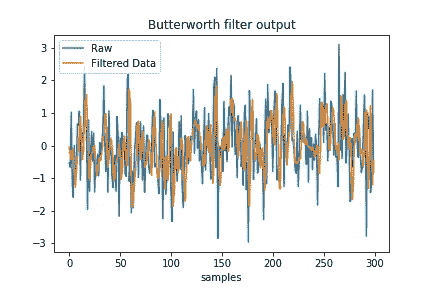
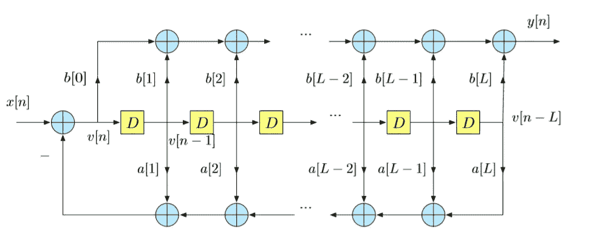
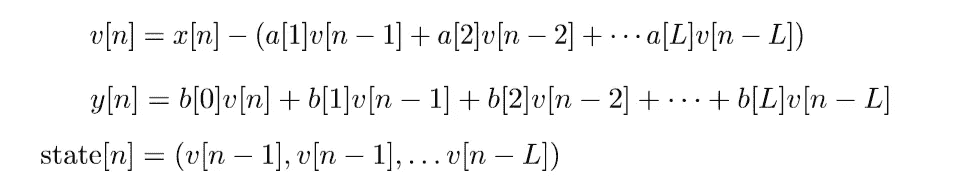
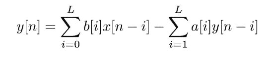
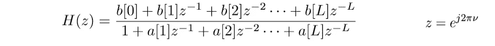
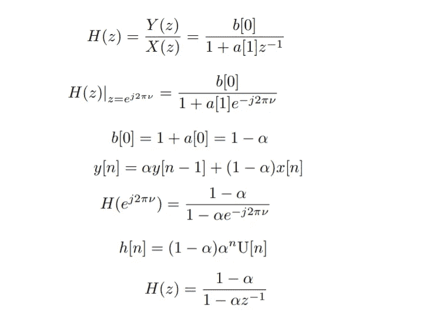
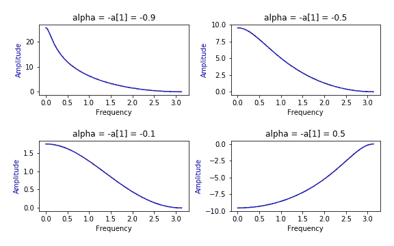
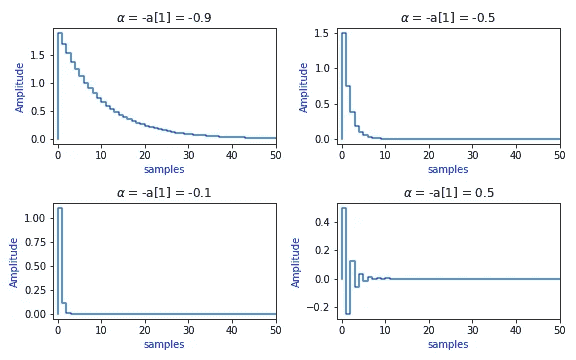
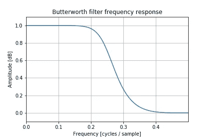

# 使用 Python 简化信号处理

> 原文：<https://medium.datadriveninvestor.com/designing-filters-made-easy-using-python-9c44d9064f94?source=collection_archive---------2----------------------->

不言而喻，Python 是工程应用的重要语言。这篇文章是学习使用滤波器设计的信号处理应用的快速教程。由于滤波器设计是所有信号处理应用的基础，因此对于学习 Python 进行信号处理应用的学生来说，这将是一个良好的开端。您无需依赖昂贵的商业软件来为您的信号处理应用设计尖端滤波器。

[](https://www.datadriveninvestor.com/2019/02/07/8-skills-you-need-to-become-a-data-scientist/) [## 成为数据科学家所需的 8 项技能|数据驱动型投资者

### 数字吓不倒你？没有什么比一张漂亮的 excel 表更令人满意的了？你会说几种语言…

www.datadriveninvestor.com](https://www.datadriveninvestor.com/2019/02/07/8-skills-you-need-to-become-a-data-scientist/) 

Python 中的滤波器实现、分析和设计工具与 Matlab 中的非常相似。在这个问题中，你将设计并绘制一个重要的滤波器的频率响应。供您参考和回顾，图 1 描述了一个 l 阶滤波器。



Fig 1\. ARMA Filter of Order L

该滤波器由下面给出的差分方程定义:



频率响应:



现在的目标是用 Python 实现过滤器。Scipy.signal 是设计和实现信号处理应用的基本工具。下面的代码实现了一阶 AR 滤波器。输出如图 2 所示。



Fig. 2: Frequency Response

可以使用以下命令计算脉冲响应:

```
% using signal.dimpulse(sys) for discrete system  and 
% signal.impulse(sys) for continuous system.
t, y = signal.dimpulse(sys)
```



Impulse Response

最后，以下简单代码用于设计 N=4 阶巴特沃兹滤波器。第 1 行设计了 N =4 阶巴特沃兹滤波器。第 4 行绘制了频率响应。



Butterworth filter Frequency Response

现在我们将检查巴特沃兹滤波器的输出。为此，创建长度为 300 的 numpy 数组，包括标准正态分布的 iid 实现。该序列通过巴特沃兹滤波器进行滤波，输入和输出信号绘制在同一图上。下面的代码计算巴特沃兹滤波器的输出。

