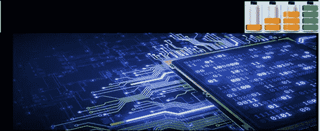

# 设计人工智能的增量层次

> 原文：<https://medium.datadriveninvestor.com/designing-incremental-levels-of-artificial-intelligence-b563be2f592e?source=collection_archive---------10----------------------->

Dev 坐在大会议室里等待会议开始，作为一名自由顾问这些天来并不容易。他了解机器学习，并在人工智能领域建立了一些系统，但这是一项为一家网络公司设计和建立一个更大的人工智能系统的任务，他需要这份合同。

当 CTO 走进演示室时，Dev 知道这不是一件容易的事，他保持冷静，完成了一份准备充分的演示，现在是时候听取一些反馈了。

首席技术官说，我喜欢你这样做。今天，人工智能或智能系统是一个非常普遍使用的术语，每个人都在建立一个人工智能系统，当然所有的系统都是不平等的，我们可以欣赏一些系统比其他系统更聪明。我希望能够看到我们将如何建立一个智能递增的系统，并能够了解该系统在任何时候都有多智能，让我们在下一次会议上看到这一思路。

戴夫走出房间，思考着智能系统中的增量级别，拉胡尔是人工智能方面的专家，他设计并建造了几个人工智能系统，他一定知道答案，他拿出手机，拨通了一个联系人，嘿！戴夫在另一端的声音说话了。

 [## 人工智能和监督资本主义|数据驱动的投资者

### 大科技，总是现在:人工智能推动的大科技，已经使购物，搜索，在你的…

www.datadriveninvestor.com](https://www.datadriveninvestor.com/2020/03/04/on-artificial-intelligence-and-surveillance-capitalism/) 

那天晚上，戴夫和拉胡尔通过 Skype 聊天。Dev 说，Rahul，我正在为一个人工智能系统学习，我需要能够清楚地说出系统中的智能水平，以及它如何从一个水平发展到另一个水平。

拉胡尔思考了一会儿这个问题，然后说:“根据环境的不同，有几种不同的想法，对于一个为实现特定目的而工作的人工智能系统来说，这就是我对智能水平的分类。

1.基于规则的决策 z

2.响应选择

3.响应组合

4.学问

5.归纳

6.论证

7.预言；预测；预告

8.规划

Dev 说，是的，这是一种非常清晰的方式来查看系统的智能级别，并计划我们如何将它从一个级别提升到另一个级别，您能为清晰起见解释一下每个级别吗？拉胡尔继续说道:

**基于规则的决策:-** 当一个系统能够基于输入变量执行一组规则，并基于规则执行提供响应，那么我们可以认为该系统处于这个级别。Dev 说哦，是的，比如说一个系统监控网络上的负载，如果负载达到 70%,就会发送一封邮件。Rahul，这些规则绝对可以更复杂，甚至有一个分支逻辑，包含多个输入变量，比如网络负载、响应时间、错误等。Dev 这正是我们计划启动系统的级别。

**响应选择:-** 下一级智能将是系统从一组可用响应中选择响应的能力，换句话说，系统可以根据其能力决定如何对情况做出响应。Dev，Ok，因此，如果监视负载的系统发现负载增加，它可以决定是否必须增加资源或向管理员发送电子邮件。是的，这是一个很好的例子，拉胡尔喊道。

**响应** **组合:——**当系统可以组合多个规则并组合响应以满足目标时，我们认为 AI 处于这个级别，进一步说明您的示例当系统基于规则识别出重负载时，它不是在一组简单的响应之间进行选择，而是运行附加诊断以进一步识别问题， 基于诊断的结果，它采取诸如增加资源之类的行动，同时还遵循诸如检查预算之类的其他规则，它最后向管理员发送一封邮件，说明它已诊断出什么问题以及采取了什么行动。 Dev 说是的，听起来不错，我们已经步入正轨。

**学习:-** 当系统根据其能力范围内的各种知识规则和行动采取行动时，一些行动可能会提供比其他行动更好的结果，在某些情况下，它可能需要人工干预来解决问题。一个学习系统会识别哪个解决方案对哪个问题有效，它还会根据人类专家解决问题的方式添加额外的操作。Dev 说，因此，如果系统发现网络过载，它会采取措施来管理这种情况，并可能会请求管理员的干预，当问题得到解决时，它会分析数据以确定问题是如何解决的，哪些可行，哪些不可行，从中学习并更好地应对未来的过载。拉胡尔说你去吧戴夫。

Rahul 继续说，在这个层次上，系统可以概括它在解决一个问题时学到的知识，并将其应用于解决其他类似性质的问题。戴夫，好吧，我有点搞不懂你了。拉胡尔说让我解释一下，人类，一直在概括。当我 2 岁的儿子找到 iPad 时，他学会了如何使用触摸屏手机和观看视频。他很容易就能运用从手机中学到的知识，轻松使用 iPad。然而归纳并不总是有效的，他也试图在电视上使用相同的知识，但这并不奏效，因为电视不是触摸屏设备。正确地说，如果系统了解到可以通过终止理想的网络会话来管理过载情况，它会创建一个通用模板，并且当它看到数据库过载时，它会尝试通过终止锁定的或理想的数据库连接来管理这种情况，以减少负载，并且这个动作不一定被明确地编程到系统中。戴夫:哦，酷，那看起来真的很有趣，那么我们从这里走向哪里呢？

**推理:-** 推理引擎更进了一步，具有推理能力的系统可以根据一组公理识别结果。Dev 提问，公理是什么。拉胡尔解释说，公理是已经被证实为真的信息。简而言之，基于系统学习到的新信息，它能够自动改变自己的规则。该系统将处理不确定性和概率，以便为最理想的结果提出最合适的规则集。为了更清楚起见，让我们进一步说明我们的示例，假设我们有规则来考虑当网络负载为 70%时它调用动作 A1。推理系统可以分析数据并创建 2 个新规则，第一个规则在 60%负载时开始动作 A1，因为它发现在该负载时采取该动作最有效，第二个规则在网络负载仍然达到 75%时停止动作 A1，因为在该负载时发现动作 A1 进一步损害稳定性。Dev 说这是一项严肃的业务，系统会有自己的逻辑！拉胡尔回答说，是的，一般来说，系统提出的这些规则都是由人类专家审查和批准的。

**预测:-** 这些系统具有分析历史和当前信息以及预测未来和未知事件的能力。让我们考虑一下，如果我们有一个 1 级系统来监控我们用于股票交易的网络，当网络负载达到 70%时，一些用户开始看到连接错误或缓慢，系统采取行动并纠正这种情况。如果我们有一个配备了预测功能的系统，它可以预测工作日结束时的负载将会激增，并在这种情况发生之前采取行动，并确保尽管负载激增，用户也不会看到网络性能的任何变化。戴夫说，太好了！这些是我们想去的地方。

**规划:-** 这是智能系统中的最高级别之一，在这里系统可以考虑当前的状态，并创建一个计划，或者一系列要采取的行动或步骤，以达到预期的目标。规划将利用以上所有层次，在不确定的环境中最大化期望结果的概率。在我们的示例中，如果网络监控系统检测到对网络的攻击，它可以快速提出并执行计划，该计划具有一系列动作，其中系统可以将保护网络资产作为第一目标，然后恢复正常操作。系统可能采取关闭端口、重启路由器、阻止 IP 激活额外的安全过滤器等措施。一旦资产得到保护，它将按照计划采取行动恢复正常运行。拉胡尔总结道。

戴夫说拉胡尔说得很好。谢谢你的帮助。