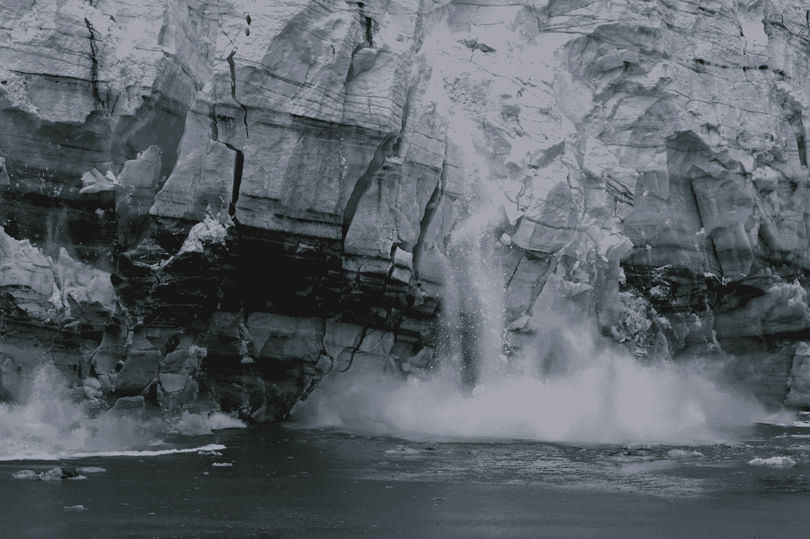
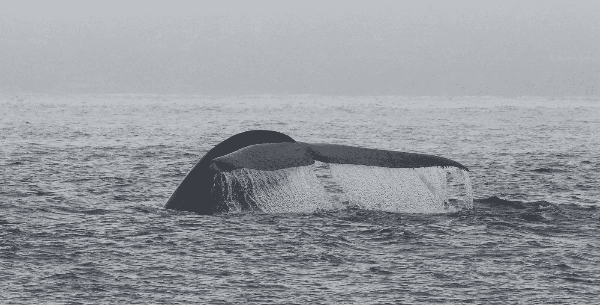
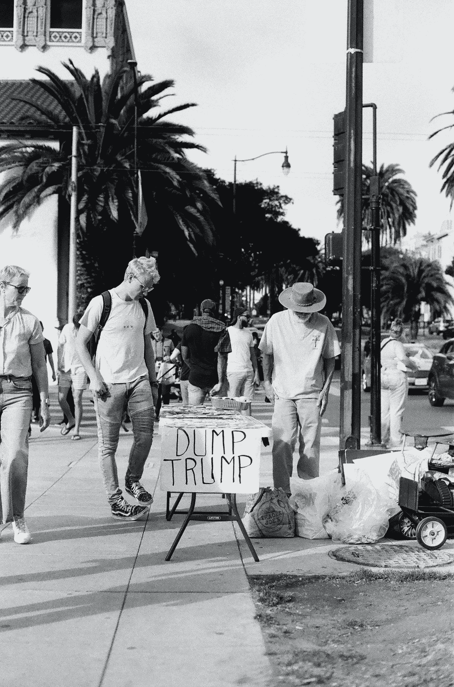

# 绝望是现实，无所作为不是选项

> 原文：<https://medium.datadriveninvestor.com/despair-is-a-reality-inaction-is-not-an-option-fe0dd1dd70ea?source=collection_archive---------8----------------------->

如果我们希望减缓生态崩溃，现在*就必须进行一场政治变革*

**

*A calving glacier. Witness to global warming - image courtesy of NOAA/Unsplash*

*三十多年来，我一直在世界各地对野生海洋哺乳动物进行科学和保护研究。这些年来，随着我在海上与海豚和鲸鱼相伴数千小时，我越来越担心这些生物和它们的生态系统。*

*作为一名科学家，我知道阻止气候变化必须是我的首要任务，因为这是我们的星球今天面临的最紧迫的威胁。*

*困难的问题是:*我能做些什么？**

*在疫情中，我发现自己对这个问题想了很多。*

*我对我们现在目睹的生态危机的广度和深度的担忧，让我的生活变得更有创造力，摆脱了海洋生物学家的“常规”家务，去拥抱我认为会对环境问题产生更大、更可衡量的影响的其他事情。*

*但我仍然有一种痛苦的感觉，我没有为海洋和我来研究和热爱的动物做足够的事情。我想我应该在那里，无论*在那里*在哪里，做更多的事情；一些更注重行动的事情，而不仅仅是做实地研究，经营一个环境非营利组织，写一些关于动物和保护自然的书籍和文章。*

**

*An [endangered](https://www.iucnredlist.org/species/2477/156923585) blue whale swimming in my study area off California - image: ©2020mbearzi/OCS (under NOAA permit)*

*我知道不止我一个人在问我能做什么？特别是现在在美国，我们发现自己被疫情和正在一点一点破坏我们环境的政治体系所窒息。我的丈夫，一个环保主义者和像我一样的作家，问了这个问题。我的大多数朋友也是这样，除了那些无法忍受去想它的人，因为它是压倒性的，只有提到这个话题会让他们不安和沮丧。*

*有一个新造的词来形容目前多少人对气候变化的感受:生态焦虑，定义为“对环境末日的慢性恐惧”这是一种现代现象，造成了巨大的担忧，抑制了我们应对气候变化的能力。*

*感到绝望当然是现实，尤其是在过去几个月里。根据最近但仍在疫情会议之前的调查，几乎 70%的美国人关心气候变化，大约 51%的人感到无助。所以，再加上大量的新冠肺炎和骗人的白宫，你早上醒来希望今天的坏消息不会超过昨天。但通常是这样的。*

*我不相信*感到*担心有什么不对。我当然知道！但老实说，我不认为把头藏在沙子下面，不解决这些问题是一个选项。*

*这是*我能做什么*的部分，我仍然在挣扎…*

*为了感觉我们正在为我们的星球做出贡献，我们中的许多人循环利用，骑自行车，清理海滩，种植花园，避免使用塑料，吃素，点击支持某项运动，签署请愿书，并在选择的社交媒体渠道上发泄。然后生活继续。*

*但是，这真的足以带来所需的*立竿见影的*变革吗？*

*就个人而言，我丈夫和我花数小时阅读和讨论环境和政治问题。我们都很沮丧，以至于我们两个人每天都试图做些什么，任何事情，哪怕是一丁点儿的改变。*

*我的丈夫信奉对自己的行为进行无情的自我批评，所以如果我对自己诚实，我仍然几乎没有做任何事情来解决房间里的大象。*

*主要的问题是，我们所看到的生态危机是一场政治危机。*

*正如 Timothy Snyder 在他的书 [*通往不自由之路*](https://www.penguinrandomhouse.com/books/570367/the-road-to-unfreedom-by-timothy-snyder/) 中很好地解释的那样，当今美国对自然最大的威胁是一个正在滑向专制的政治体系。如果我们不在即将到来的选举中阻止特朗普，那么保留我们认为理所当然的自由、扭转现任政府加剧的环境破坏并最终阻止气候变化的希望就很小。*

*我从来不太关注政治。我不是特别喜欢政治。*

*我在意大利长大，那里的政府已经腐败了很长一段时间，对大多数人来说，任何修复它的尝试都是无望的。这不是我们不参与变革的借口，我们的国家需要变革，并且仍然需要变革，以摆脱肮脏的现状。话说回来，我从来不认为意大利的行动或政策会像美国的行动那样威胁到全球范围内的任何人。*

*我已经在美国住了超过二十五年了。我成了世界上最强大国家的公民。可悲的是，像我这样关心未来的人，再也不能享受远离政治的奢侈了。
Trump *是*房间里的大象；不仅仅是因为他为了经济利益和个人名誉而完全淡化新冠肺炎的危险，更因为气候变化根本不是他或他的政府关心的问题。总统(这里不能用 capitol P，抱歉！)称气候变化是“一个昂贵的骗局”、“虚构的”、“不存在的”或“由中国人为中国制造的，目的是让美国制造业失去竞争力”。特朗普和他意志薄弱的*特朗普手下*显然更关心股票市场，而不是这个星球或其人民的福祉。*

*现在，这位总统的主要目标是保住权力。不惜任何代价。*

*这就是为什么我们迫切需要改变我们的政治路线，恢复政府的信任和平衡。这就是为什么，如果我必须把我的努力集中在今天我能做的事情上，以帮助这个星球并维护我们的自由，我必须选择努力确保特朗普不会在 11 月再次当选。此外，我必须努力确保他不会压制公开公正的选举，也不会通过质疑即将到来的选举结果而在白宫逗留。作为一名生物学家、环保主义者和这个国家负责任的公民，我相信在不久的将来，这就是我需要集中精力的地方。*

*要让特朗普和他的一伙下台，还有很多工作要做，而剩下的时间不多了。我无法独自改变现状，我也不认为向唱诗班布道有助于改变结果。为了摆脱这种政治混乱，我需要以高效、团结、务实、系统的方式与他人合作。作为一个没有特殊超能力的人，我的目标是找出我的优势所在，志愿加入一个或多个已建立的组织和/或活动，以促进联盟，并在 2020 年 11 月及以后回归理性治理。无论我做什么，无论我拥有什么，我都应该为那些能够在未来几年带来变化并推翻特朗普独裁统治的团体提供帮助。*

*今天是星期天，天气很好。我正在完成这篇文章，而我的丈夫正在隔壁房间给摇摆州的公民手写个性化的信，请他们投票。专注于民主党过去未能联系到的摇摆州选民是帮助将天平向更理智的政府移动的许多方法之一。这是由 [Vote Forward](https://votefwd.org/) 组织的努力的一部分。截至昨天，他已经写了 260 封信，还买了邮票。前几天，他写了一篇关于国土安全部代理部长查德·沃尔夫和帝国宣传部长保罗·约瑟夫·戈培尔之间令人毛骨悚然的相似之处的专栏文章。我们并不富裕，但我们给许多致力于阻止川普的组织捐了钱，比如[林肯项目](https://lincolnproject.us/)。这不是一个左派组织。相反，它主要由共和党人组成，他们的主要目标是让那些违反宪法誓言的人承担责任。*

*感到绝望是一个现实，我没有解决问题的所有方法，但我知道在这个历史的关键时刻，无所作为不是*的选择。否则，我们就成了问题的一部分，没有权利抱怨结果。**

*今天，我在写这篇文章，但我已经在想，我的时间是否可以更有效地花在做我丈夫正在做的事情上。也许，现在我做完了，我会写一些信。*

**

*Dump Trump — courtesy of K.Ryan/Unsplash*

*Maddalena Bearzi 研究海洋哺乳动物的生态和保护已超过 25 年。她是[海洋保护协会](http://www.oceanconservation.org/)的主席和联合创始人，也是[美丽心灵:类人猿和海豚的平行生活](https://www.hup.harvard.edu/catalog.php?isbn=9780674046276)(哈佛大学出版社)的合著者。她也是几家出版物的摄影记者和博客作者，包括国家地理杂志。她的新书是[海豚机密:一位野外生物学家的自白](https://press.uchicago.edu/ucp/books/book/chicago/D/bo10896892.html)(芝加哥大学出版社)。*