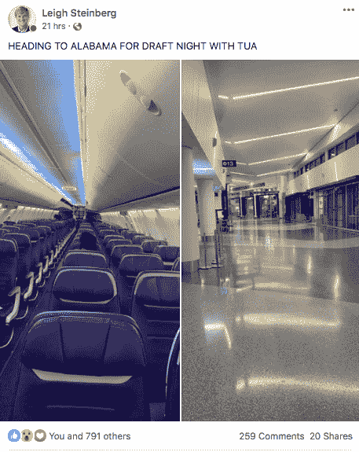
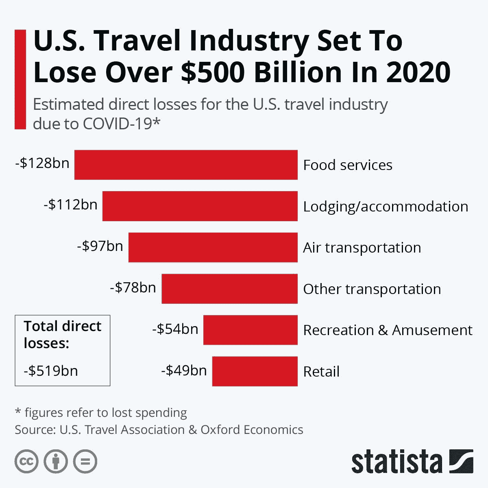
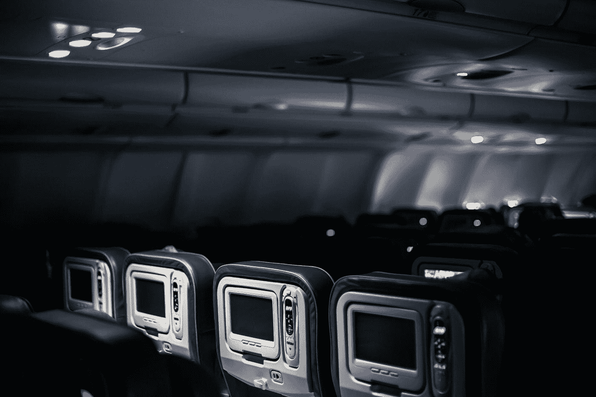
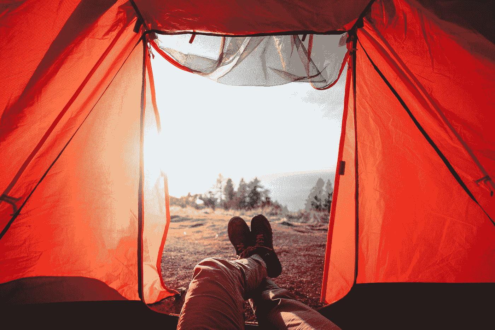
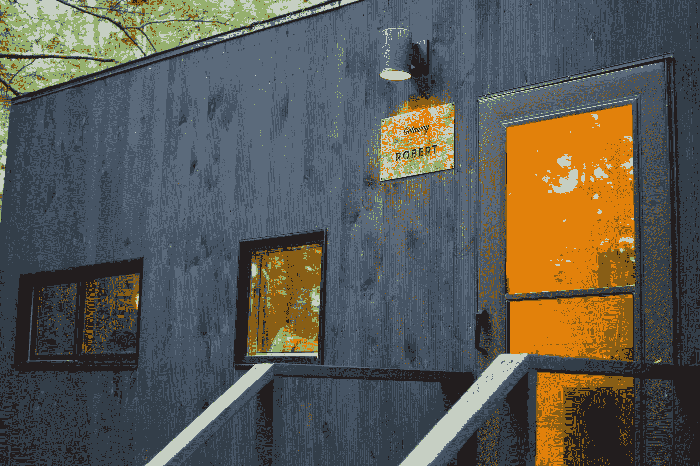

# 目的地不明:今天的旅游业似乎被冠状病毒摧毁了

> 原文：<https://medium.datadriveninvestor.com/destination-unknown-todays-travel-industry-seems-decimated-by-the-coronavirus-4e5e6579fa16?source=collection_archive---------4----------------------->

## 旅游业和冠状病毒

## 新冠肺炎疫情事件之后，无论是对游客还是对任何从事旅游相关业务的人来说，都没有好消息

Photo by [paul mocan](https://unsplash.com/@paulmocan?utm_source=medium&utm_medium=referral) on [Unsplash](https://unsplash.com?utm_source=medium&utm_medium=referral)

# 介绍

我们都看过这些故事，它们似乎很有趣。你发现自己是飞机上唯一的——或者几乎唯一的——人。当然，今天，这意味着在社交媒体上发布一张你的经历的照片或视频。这一切都很有趣——过着国王或工业巨头的生活…

Source: [https://www.facebook.com/photo.php?fbid=2984151521646654&set=pcb.2984154514979688&type=3&theater](https://www.facebook.com/photo.php?fbid=2984151521646654&set=pcb.2984154514979688&type=3&theater)

…是的，你甚至可以在空荡荡的飞机上过“狗的生活”。

这些事件成为有趣的新闻故事，在这个时候，我们都可以从各方面——医疗、经济、政治、体育……嗯，今天在任何地方——似乎无情的坏消息中得到一点安慰！因此，在冠状病毒疫情肆虐的日子里，媒体喜欢报道“孤独的旅行者”的故事——这是可以理解的！

这一切都是娱乐和游戏，至少看起来是这样，直到你考虑到所有这些的经济性！事实是，今天所有那些几乎空无一人的飞机表明，在 T2 冠状病毒/新冠肺炎疫情 T3 之后，不仅仅是航空业，而是整个旅游业已经基本崩溃了。

# 旅游业的崩溃

这些数字绝对*令人难以置信——这是这位分析师可能用来描述这种情况的最恰当的学术术语。根据美国旅游协会[和](https://www.ustravel.org/)[旅游经济](https://www.tourismeconomics.com/)的最新旅游行业[报告](https://www.ustravel.org/sites/default/files/media_root/document/Coronavirus_WeeklyImpacts_04.23.20.pdf)，美国国内旅游行业的收入同比下降了 89%。这变成了一个严峻的现实，因为从三月初开始，仅仅在六周内，旅游相关公司已经损失了 990 亿美元！当预计全年时，美国旅游业预计将损失 5000 亿美元！*

**Source:** Statista — [https://cdn.statcdn.com/Infographic/images/normal/21443.jpeg](https://cdn.statcdn.com/Infographic/images/normal/21443.jpeg) (Used with Permission)

航空公司、连锁酒店、租车公司、娱乐场所等等都在破产的边缘徘徊。在整个行业停止航行之前，游轮上发生了无数次疫情，现在游轮几乎成了死亡陷阱的代名词，游轮公司很难很快恢复元气。事实上，城市和整个地区——比如这位分析师的家乡新奥尔良，还有奥兰多、拉斯维加斯等严重依赖旅游经济的城市——无论是人民还是政府都处于紧张状态。

旅游业的战略问题是这样的:*快速反弹的前景并不乐观！*考虑到根据[最近对旅行者的调查](https://www.ustravel.org/sites/default/files/media_root/document/MMGYResearch_Week2_FINAL_WEB.pdf)，80%的旅行者取消了他们的旅行计划(被他们的航空公司、酒店、度假村等取消)。)或者在冠状病毒爆发后选择推迟他们的旅行计划。此外，旅游活动的在线搜索活动和实际的新预订量都在大幅下降。根据旅游分析公司 [ADARA](https://adara.com/) 的[最新数据](https://adara.com/traveler-trends-tracker/)，截至 4 月 21 日的一周，旅游相关搜索下降了 81%,在线预订同比下降了 88%。也许更令人担忧的是最近的研究，例如旅游研究公司 [Destination Analysts](https://www.destinationanalysts.com/) 刚刚发布的[对旅行者](https://www.destinationanalysts.com/insights-updates/)的调查，该调查显示，在疫苗到位之前，相当一部分旅行公众不打算“正常”恢复旅行。正如我们现在都知道的“冠状病毒新闻爱好者”，乐观地说，这至少需要 18 个月或更长时间！

Photo by [Alev Takil](https://unsplash.com/@alevtakil?utm_source=medium&utm_medium=referral) on [Unsplash](https://unsplash.com?utm_source=medium&utm_medium=referral)

# 旅行和旅行行业的未来是怎样的？

因此，这位管理顾问看到的是整个旅游业暗淡的前景。当我们坐在这里看着日历，传统上至少会是夏季旅游季节的临近，人们可以有把握地说，今年基本上不会有*一个*！消费者表示，鉴于目前的状况，他们在未来 2、3…6 个月内不会舒适地旅行——甚至没有考虑到可能出现的，有些人会说很可能出现的[第二波甚至第三波或更多波冠状病毒](https://www.theguardian.com/world/2020/apr/20/will-there-be-second-wave-of-coronavirus-)——航空公司、酒店、租车公司、旅游运营商、主题公园等的前景。所有的充其量看起来摇摇欲坠。

正如这位作者在展望零售业[大流行后的未来](https://bit.ly/351ZbxO)时所强调的，卫生和清洁将不得不成为*长期的*——所有形式的公共服务公司的服务等式中不可或缺的一部分。旅游业的发展也是如此，这可能会重塑 2020 年 3 月之前的旅游业。接下来，让我们来看看对各种类型的旅行和旅游业细分市场的一些具体预测:

## ***航空公司***

是的，在我们的现代生活和现代经济中，我们确实需要航空旅行。然而，在大流行后的环境中出现的航空业可能不仅看起来不同，而且很可能有不同的参与者。我们知道的一件事是，我们不会回到疫情之前挤满飞机的经历。航空公司已经开始[取消预订可怕的中间座位](https://www.traveller.com.au/middle-seat-on-planes-during-coronavirus-qantas-among-airlines-no-longer-putting-passengers-in-middle-h1nhc4)，也有人呼吁[把这些座位从飞机上拿掉](https://www.businessinsider.com/as-coronavirus-spreads-analyst-suggests-removing-middle-seat-on-airplanes-2020-3)，以增加飞机上的社交距离(比如这是可能的！).设计师们已经提出了彻底改造客机乘客座位的想法，甚至在座位之间设置有机玻璃屏障，所有这些都是为了减少面对面的接触。这样的举措将会减少运力，从而使飞行的经济性比疫情之前更差。

当然，这样的改变需要资金(*供不应求*)，需要时间来实现(并得到国内外交通监管机构的批准)，而且，是的，将会遇到乘客的不同反应(想象一下带着小孩旅行，中间用有机玻璃隔开你们……)。商务旅行会恢复到什么程度还是一个未决的问题，因为回到商务旅行的旧规范会有一些犹豫，但正如我们所看到的，在线会议的兴起可能会永久性地减少人们聚集在一起完成许多事情的必要性。最后，在接下来的几个月里，一个备受关注和讨论的话题是，国际旅行可能会永远改变。在可预见的未来，不仅消费者出国旅游的欲望可能会大大降低，而且国家之间新的旅游限制可能会进一步降低出国旅游的实用性和吸引力——无论是休闲还是商务目的。

## ***酒店***

酒店业不仅面临着重大的运营挑战，还面临着营销和品牌挑战。是的，在强调清洁和卫生方面需要全面的改变。与餐饮业和零售业一样，酒店行业组织(如美国酒店和住宿协会(T1，AHLA)和 T2 职业酒店经理协会(T3，APHM))可以在制定行业标准方面发挥主导作用。这应该对酒店经营者(尤其是特许经营者和小型独立经营者)以及旅行公众都有吸引力，他们可能会在搜索酒店时依赖这种“认证”。然而，由于酒店行业数十万清洁和维修工人的工作条件受到公众关注，如果行业自律被认为是“不够的”，我们很可能会看到 [OSHA](https://www.osha.gov/) (职业安全和健康管理局)——专门为酒店行业制定的法规。

Photo by [runnyrem](https://unsplash.com/@runnyrem?utm_source=medium&utm_medium=referral) on [Unsplash](https://unsplash.com?utm_source=medium&utm_medium=referral)

从品牌的角度来看，酒店将面临一些非常令人生畏的营销主张。据推测，旅行者可能会选择较小的酒店，以避免后疫情时代更大的人群聚集。这意味着大型酒店——尤其是收入主要由与会议相关的旅游(这一领域的复苏可能比整体旅游经济更慢)驱动的酒店——可能在未来几个月真的受到影响——甚至可能更长。最后，除了“廉价”连锁酒店之外的所有酒店——6s 汽车旅馆、T2 红顶酒店、T4 超级 8s 酒店、舒适酒店等——都可能面临真正的品牌问题。随着酒店确实恢复到更“正常”的运营，冠状病毒爆发后，不仅是高端酒店，中档酒店的运营也可能恢复缓慢。酒店餐厅和酒吧将慢慢重新开放，并恢复到某种程度上的“正常”运营，但容量较低。但是酒店的温泉？游泳池和热水浴缸？桑拿？客人可以去托儿所吗？所有这些都可能缓慢开放，或者在未来一段时间内很难恢复到疫情之前的运营水平。因此，在一段时间内，将高端酒店与更便宜、更基础的酒店区分开来的因素要么不存在，要么非常有限。这意味着，随着疫情经济的复苏，我们可能会看到竞争对手之间的激烈竞争，甚至是交叉竞争，因为酒店正在努力恢复其经济地位，以及在整个酒店市场中的地位。

## ***巡航***

至于邮轮公司，嗯，我们可能正在目睹整个行业的死亡——或者至少是一个看起来在维持生命的行业！简而言之，邮轮公司不仅很难从邮轮业持续的负面宣传中恢复过来，也很难从公众认为邮轮模式从健康角度来看可能不安全的看法中恢复过来。载有许多人的大船，许多拥挤的公共场所，许多近距离——在冠状病毒爆发后，这些似乎——在很大程度上本来就是——传染病的滋生地。邮轮运营商可能需要重新思考他们的基本运营模式，以便能够向可能永远改变的旅行公众销售。然而，随着对越来越大的游轮的巨额投资，他们几乎不能*现实地*改变他们基本的大容量、高密度模式。因此，邮轮产业——以及所有受雇于它并与之相关联的企业——将面临重大问题，不仅仅是如何度过眼前的危机，而是如何长期生存。

Photo by [Joshua Sortino](https://unsplash.com/@sortino?utm_source=medium&utm_medium=referral) on [Unsplash](https://unsplash.com?utm_source=medium&utm_medium=referral)

# 结论:现在的旅游行业有什么亮点吗？

面对如此黯淡的前景，有人可能会问，旅游业中是否有*的任何*亮点？当然，虽然调查确实显示美国消费者在制定旅行计划时非常犹豫，特别是对于国际旅行，甚至是国内商务旅行，但在我们进行的所有检疫隔离之后，将会出现“机舱热效应”。民意调查公司 [Piplsay](https://www.piplsay.com/) 刚刚发布的一项调查显示，有一种被压抑的恢复旅行的需求，几乎一半(46%)的美国人说，一旦条件允许他们安全旅行，旅行将是他们最想做的事情之一。不仅仅是一天车程，而是 2-3 小时车程的目的地似乎将是美国人在未来几个月内愿意进行的第一次“墙外”旅行。此外，一旦限制解除，将会有与家人和爱人重新联系的旅行。

 [## 如果资本主义失败了，那么还有什么选择呢？数据驱动的投资者

### 在当前政治领域的修辞之旅中，我们都可以面对面地接触到流行词汇，如…

www.datadriveninvestor.com](https://www.datadriveninvestor.com/2020/03/16/if-capitalism-is-a-failure-then-what-is-the-alternative/) 

如果我可以指出一个领域，我会说，疫情和它的后果实际上对旅游业是“好的”，这将是我可以标记为“隔离旅行”一个人越能远离其他旅行者和人群，无论是在路上还是在目的地都能自给自足，这对后疫情时代的我们就越有吸引力。因此，我要说的是，到目前为止，在整个旅游市场中还很小，甚至是利基市场的三个领域，可能已经成熟，可以引起人们的浓厚兴趣并实现增长。共同点是，它们都允许旅行者——或多或少——在“泡泡”中旅行，并为他们提供与其他旅行者保持社交距离的机会。

## ***1。房车租赁***

由于年轻消费者对房车租赁越来越感兴趣，以及像 VRBO 和 Airbnb 这样的公司对短期租赁模式的普遍接受，多年来，租赁休闲车一直是[的一个增长趋势。然而，虽然市场分析师预测这些公司的前景在疫情之后变得相当暗淡，但有充分的理由相信短期房车租赁市场可能会在疫情爆发后的几个月内出现需求大幅飙升。乘坐房车旅行使家庭能够在探索家中四面墙以外的区域时保持自我隔离，同时也避免了在旅途中住在酒店的担忧。从本质上来说，乘坐房车旅行让家庭有机会在旅途中呆在自己的“泡泡”里，最大限度地提高他们的安全性，同时允许他们继续旅行。](https://www.latimes.com/business/la-fi-rv-rentals-20181109-story.html)

Photo by [Will Truettner](https://unsplash.com/@willy_teee?utm_source=medium&utm_medium=referral) on [Unsplash](https://unsplash.com?utm_source=medium&utm_medium=referral)

## ***2。国家公园和州立公园***

虽然许多国家和州立公园在疫情冠状病毒爆发后立即关闭或运营受到严重限制，但随着各州开始慢慢重新开放，这些地区将成为受欢迎的目的地，因为人们想方设法在户外“做点什么”和/或在一个可以安全地练习社交距离的环境中短期度假。当然，随着人们开始想要旅行，这些公园的日客流量将会显著增加，这些目的地提供的空间——以及它们的可负担性——将使它们成为第一批“反弹”到相对正常的旅游目的地之一——或许远远超过正常的游客数量。正如下一个要讨论的领域，国家公园和州立公园对小屋甚至露营空间的需求可能远远超过传统的住宿选择，无论是在这些目的地内外。同样，小屋的私密性和露营提供的空间，无论是户外还是房车，都为旅行者提供了与其他公园游客相对隔离的机会，让家庭有机会在他们自己的“泡泡”中旅行。

Photo by [Andrea Davis](https://unsplash.com/@andreaedavis?utm_source=medium&utm_medium=referral) on [Unsplash](https://unsplash.com?utm_source=medium&utm_medium=referral)

## ***3。隔离舱***

我认为未来几个月特别感兴趣的最后一个领域——由于对病毒的担忧可能会持续一段时间，甚至可能更久——是“非传统”度假租赁领域，这与我们在浏览 Airbnb 或 VRBO 时通常会发现的领域截然不同。我相信，那些能为旅行者提供逃离大都市去僻静地旅行的机会的公司会有很高的吸引力，尤其是对个人和夫妇。光是一家公司， [Glamping Hub](https://glampinghub.com/) ，现在就为美国和海外的 30，000 多家这样的“非传统”度假租赁公司提供中心位置！

今天有一家公司在这方面做得很好，那就是[度假屋](https://getaway.house/)，它将小房子运动与人们逃离现代生活“噪音”的愿望结合在一起。如今，该公司经营得很好，在越来越多的大城市之外“度假”。当然，这并不是每个人的理想假期，但对城市居民，尤其是创意人士来说，T2 有着巨大的吸引力。然而，在这一次，他们的隔离模式为寻求靠近大城市的目的地(在今天的疫情行话中翻译为“热点”)的旅行者再次提供了一个“泡沫”，他们可以在其中旅行，但仍被安全隔离。随着旅行者在大流行后的环境中寻求安全，是的，独特的旅行概念，在这一领域将会有更多的竞争。

# **和我一起在媒体上写作**

想开始自己的写作之旅吗？想通过发布自己创作的文章来更好地建立个人品牌？考虑今天和我一起在媒体上写作，并使用这个链接:[https://davidwyld.medium.com/membership](https://davidwyld.medium.com/membership)。这样做，你将帮助支持我的写作，因为我收到你的媒介会员费的一部分。

 [## 通过我的推荐链接加入媒体-大卫·怀尔德

### 作为一个媒体会员，你的会员费的一部分会给你阅读的作家，你可以完全接触到每一个故事…

davidwyld.medium.com](https://davidwyld.medium.com/membership) 

[***大卫·c·怀尔德***](https://medium.com/@davidwyld)([dwyld@selu.edu](mailto:dwyld@selu.edu))是新奥尔良郊外[东南路易斯安那大学](https://www.southeastern.edu/)的管理学教授。他是一位著名的商业顾问和当代管理问题的演讲者/作家。

# David Wyld 关于冠状病毒/新冠肺炎和商业的其他文章:

 [## 向前缩放:疫情期间缩放的爆炸式增长

### 冠状病毒爆发的赢家很少，但 Zoom 和在线会议/视频会议总的来说…

medium.com](https://medium.com/swlh/zooming-ahead-the-explosive-growth-of-zoom-during-the-pandemic-34f55b1f13e8)  [## 一种新型病毒需要新的商业理念

### 领先的管理咨询公司提供的太多专家“建议”都是老生常谈，公式化的

medium.com](https://medium.com/swlh/a-novel-virus-needs-novel-ideas-for-business-43da4aebb09d)  [## 后新冠肺炎时代的商业世界——第一部分:概述

### 调查流行病学黑天鹅事件后环境的变化

medium.com](https://medium.com/datadriveninvestor/the-post-covid-19-business-world-part-1-overview-84e2a85d448e)  [## 后新冠肺炎时代的商业世界——第二部分:餐馆

### 注意:在本系列的第一篇文章(后新冠肺炎商业世界——第一部分:概述)中，我们勾画了…

medium.com](https://medium.com/datadriveninvestor/the-post-covid-19-business-world-part-2-restaurants-ede436e370f7)  [## 新冠肺炎之后零售业的“科斯莫·克莱默法则”:为什么零售商需要快速标准化他们的…

### 随着冠状病毒的出现，每个零售商，无论规模大小，都在努力解决如何正确保护这两者…

medium.com](https://medium.com/swlh/the-cosmo-kramer-rule-for-retail-after-covid-19-why-retailers-need-to-quickly-standardize-their-53c14c2a9237)  [## 没有粉丝的运动:空旷体育场比赛的商业现实

### 在冠状病毒疫情之后，体育联盟、电视网、广告商，是的，政治家们都在呼吁…

medium.com](https://medium.com/sportsraid/sports-without-fans-the-business-realities-of-empty-stadium-games-bf6c75d21cc8)  [## 被冠状病毒切碎

### 随着冠状病毒的出现，全国各地的餐馆都感觉自己受到了不公平的待遇…

medium.com](https://medium.com/swlh/chopped-by-the-coronavirus-ec6315d9b766)  [## 在疫情期间，我们想在网上看到什么，这说明了我们什么

### 对美国人网上活动的分析揭示了很多关于美国人如何生活、工作、观看…

medium.com](https://medium.com/datadriveninvestor/what-we-want-online-during-the-pandemic-and-what-that-says-about-us-31d2cd23f1e2)