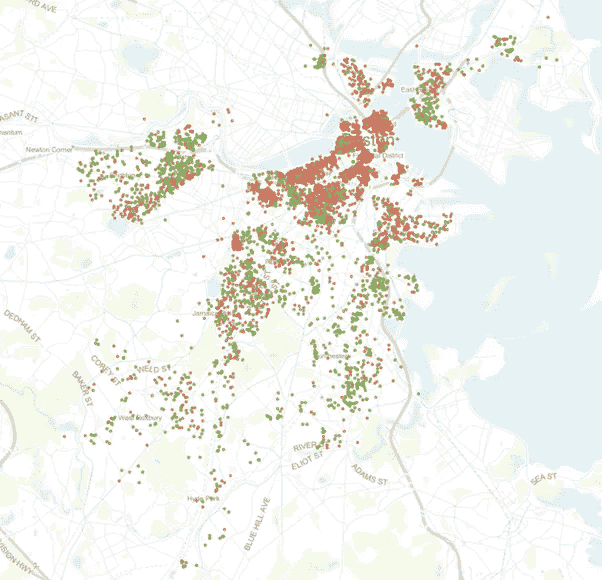
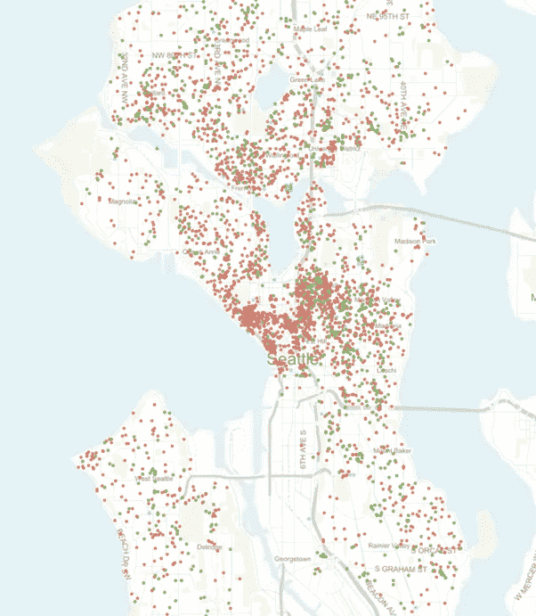
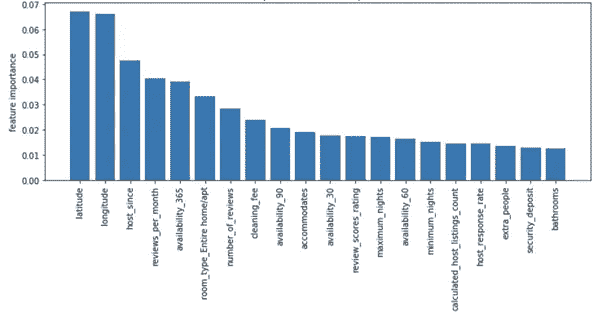
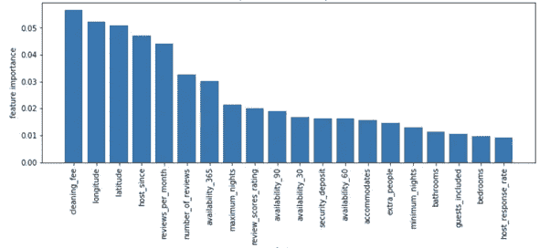
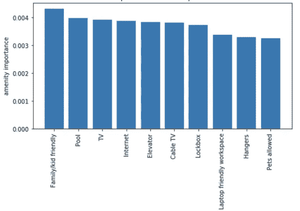
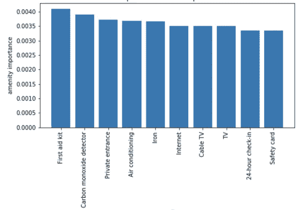

# 波士顿和西雅图 Airbnb 数据的详细分析

> 原文：<https://medium.datadriveninvestor.com/detailed-analysis-of-boston-and-seattle-airbnb-data-48260c8f8772?source=collection_archive---------2----------------------->

# 使用波士顿和西雅图的 Airbnb 房源数据进行数据分析。

# 介绍

你想知道 Airbnb 房东如何确定他们公寓/房子的租金价格吗？我们能从波士顿和西雅图的 Airbnb 数据集中解读出什么？

西雅图和波士顿 Airbnb 的数据集有什么明显的不同吗？

*估算 Airbnb 租赁价格的最重要特征是什么？*

*人们最需要的便利设施是什么？*

让我们试着找出这些问题的答案！

# 快速浏览西雅图和波士顿

Boston Airbnb Listings

Seattle Airbnb Listings

从 2018 年 8 月中旬提供的数据来看，波士顿有 6036 个房源，平均 184 美元/晚，而西雅图有 8494 个房源，平均 152 美元/晚。为了给出更详细的定价，75%的波士顿房源低于 219 美元/晚，而 75%的西雅图房源低于 189 美元/晚，这表明西雅图 Airbnb 的租金价格比波士顿略低。

波士顿最贵的单子是 3999 美元/晚，而西雅图最贵的单子是 5400 美元/晚。

Airbnb 主机可以标记整个家庭/公寓(红色)、私人(绿色)或共享房间(蓝色)。在波士顿，对于以上 3 种房型，主持人列出的房型分别为 62.2%、36.6%和 1.2%。而西雅图的房型比例分别为 66.6%、30.4%和 3.1%。

让我们更深入地看看数据，并用它们来估算 Airbnb 在波士顿和西雅图的租赁价格。

# 预测波士顿和西雅图的租金价格

由于 99%的列表价格低于 500，所以我选择删除高于 500 的行，以获得更稳定的预测。缺失值由基于其他相关特征的中值或最频繁值填充。

使用 GradientBoostingRegressor 对两个数据集进行分类，并应用五重 GridSearchCV 为分类器找到最佳超参数。

另一方面，预处理数据集的 1/5 用作测试数据，剩余的 4/5 用于训练 ML 模型。

# 预测租赁价格最重要的特征是什么？

我列出了这两个城市的 20 大特色，它们在预测租金价格方面起着最重要的作用。让我们来看看他们是什么样子的。

Top 20 Features to predict Boston Rental Price

毫不奇怪，*纬度*和*经度*是最重要的特征之一，因为租赁价格在很大程度上取决于房产的位置。 *Host_since* 功能代表当主人开始他们的 airbnb 之旅时，如果主人更早开始 Airbnb，他们可能有更多吸引人的经验，知道如何让他们的客人更舒适。*每月评论数*和*评论数*告诉我们，人们不仅愿意住在那里，还会留下评论，这意味着他们喜欢住在这里。其他一些功能，如*容纳*、*安全押金*和*浴室*也名列前茅。

Top 20 Features to predict Seattle Rental Price

在西雅图，特色同样重要。新增了 *host_response_rate、extra_people、guest_included 等一些功能。*但是大部分顶级功能都是和波士顿机器学习模型共享的。我们可以看到清洁费是这里最重要的特点，因为更大的房间，可能更多的浴室和更多的服务会产生更多的清洁需求。

# 有哪些值得注意的顶级设施？

在训练机器学习模型后，我们现在可以检查便利设施如何影响价格预测/它们有多重要。

Boston Top 10 Important Amenities

在波士顿，像电视、互联网锁箱和衣架这样的便利设施如预期的那样重要。家庭/儿童友好也是大多数旅行者会考虑的一个特点。我们可以看到，如果你有一个游泳池在你的财产，你可能会更有信心在提高您的租金价格。一个有趣的现象是 Airbnb 在西雅图列出的便利设施(168 个)比波士顿(120 个)多。

Seattle Top 10 Important Amenities

西雅图东道主比波士顿有一些额外的便利设施，如亚马逊回声、加热地板、正式用餐区和记忆泡沫床垫。 我们可以看到在最后一节中市容设施的重要性没有其他功能高。

在西雅图，最重要的便利设施似乎是急救箱，而电视和互联网也位列前十。

# 结论

在这篇博客中，我们深入研究了最新的 Airbnb 波士顿和西雅图数据集，发现了许多有趣的现象，比如:

> 我们收集了波士顿和西雅图的 Airbnb 数据集，并对两者进行了比较。
> 
> 我们建立了一个机器学习模型来预测这两个城市的租金价格。
> 
> 我们查看了训练模型的特征重要性，并检查它们是否有意义。
> 
> 我们列出了所有重要的便利设施，以便更好地了解东道主如何通过提供更好的服务来满足顾客的需求，从而赚更多的钱。

我写这篇博客是作为 udacity 的数据科学纳米学位课程的一部分。当然，将来还可以做很多事情，比如研究客户提供的评论。

**Instagram**:[https://www.instagram.com/jyotsna_tiwary//hl=en (T3)](https://www.instagram.com/jyotsna_tiwary/?hl=en)

**Github** : [https://github.com/jyotsnatiwary](https://github.com/jyotsnatiwary)

**Facebook** [https://www.facebook.com/jyotsna.tiwary.790](https://www.facebook.com/jyotsna.tiwary.790)

**Linkedin** [https://www.linkedin.com/in/jyotsna-4140ab171/](https://www.linkedin.com/in/jyotsna-4140ab171/)