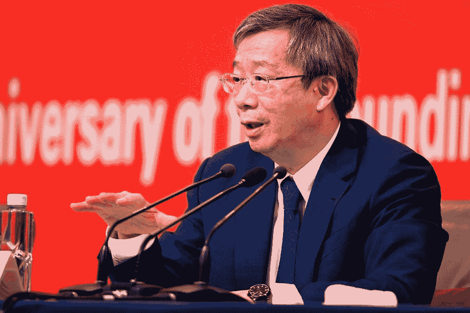

# 中国数字货币细节匮乏？有什么含义？

> 原文：<https://medium.datadriveninvestor.com/details-of-chinas-digital-currency-are-scarce-what-are-the-implications-7011b81747d5?source=collection_archive---------19----------------------->

Yi Gang, President of the People’s Bank of China, answers a question during a press conference on promoting stable, healthy and sustainable development of the Chinese economy for celebrating the 70th anniversary of the founding of the PRC in Beijing on September 24, 2019\. AFP via Getty Images

中国数字货币的细节很少。中国人民银行(PBoC)还没有正式宣布，但专家们认为 2020 年是可能的。如果中国发行数字人民币会有什么影响？

一个可靠的来源，德意志银行(DB)研究，在一月份出版了[第三部分:数字货币:终极硬实力工具](https://www.dbresearch.com/PROD/RPS_EN-PROD/PROD0000000000504589/The_Future_of_Payments_-_Part_III__Digital_Currenc.pdf)，详细回顾了中国在支付系统、移动支付服务和数字货币方面的工作。本文的信息部分基于 DB 报告。路透社(Reuters)在 2 月份也报道称，中国是创造数字货币的领跑者。

 [## 5 行业转型区块链应用|数据驱动投资者

### 除非你一直生活在岩石下，否则我相信你现在已经听说过区块链了。而区块链…

www.datadriveninvestor.com](https://www.datadriveninvestor.com/2019/02/13/5-real-world-blockchain-applications/) 

根据 DB 的报告，“目前，主流数字货币的主要竞争者是脸书的 Libra 和中国政府的数字货币。拥有近 25 亿用户(占世界人口的三分之一)的脸书和拥有超过 14 亿居民的中国有潜力将数字货币推向主流。”

2018 年，中国处理了 37 万亿美元的移动支付，由支付宝和微信支付等服务处理。

DB 的分析表明，随着中国发展电子、加密和点对点战略，全球经济实力的中心可能会转移。

私营企业将需要做出反应，以保持其在全球经济中的地位。“如果在中国做生意的公司被迫采用数字人民币，这肯定会削弱美元在全球金融市场的主导地位。”

美国可以制定法规，阻止企业与数字货币提供商做生意。因此，亚洲国家可能同时需要美元和新的数字人民币。

DB research 认为，由于外汇交易已经从金本位制转向法定货币，数字货币可能是下一步。该报告的作者表示，“2019 年底，中国政府在没有正式宣布的情况下，表示将推出中国人民银行(PBoC)数字货币。这些计划于 2019 年 10 月最终确定并获得批准，因此在 2020 年底进行试点发射似乎是可行的。如果这如预期实现，中国将成为第一个使用数字货币的主要经济体。这将迫使其他国家建立自己的数字货币。政府发行的数字货币可能是中国强有力的政治和经济工具。”

Libra 促使各国央行将加密货币视为现实问题。不管是好是坏，妖怪已经从瓶子里出来了。

Similarly, Facebook’s announcement of Libra helped push the Chinese government to speed up its efforts, believes DB Research. “In late October 2019, Chinese President Xi Jinping endorsed blockchain as “an important breakthrough for independent innovation of core technologies” in a meeting of the Political Bureau of the Chinese Communist Party’s Central Committee. He has since repeated the PBoC’s intention to replace cash with a central bank digital currency.”

The People’s Bank has not communicated what the technology behind its digital currency will be. The energy need for such a system would be significant and regulatory hurdles are still a challenge. But if “the growth in blockchain wallet users continues to mirror that of internet users, then by the end of the decade, they will number 200 million, quadruple the current level.”

*Originally published at* [*https://www.forbes.com*](https://www.forbes.com/sites/robertanzalone/2020/02/07/details-of-chinas-digital-currency-are-scarce-what-are-the-implications/)*.*