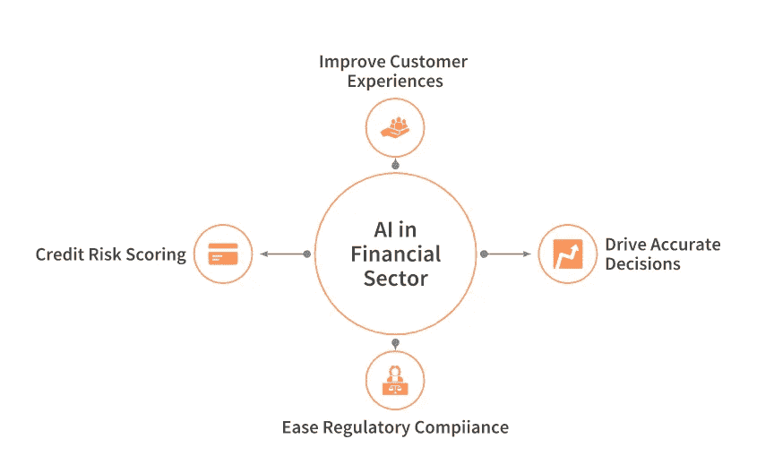
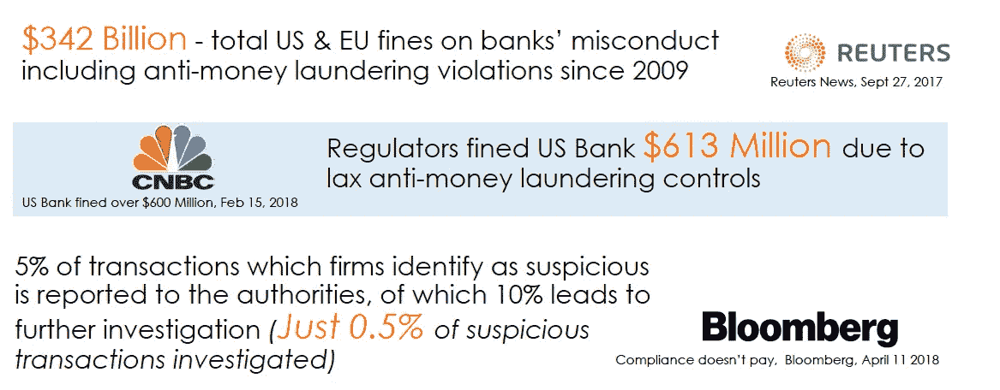
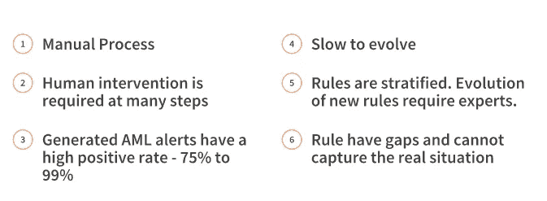
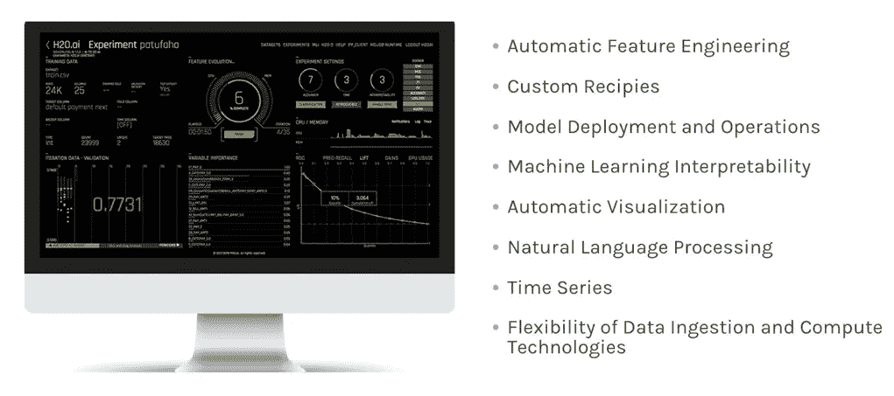
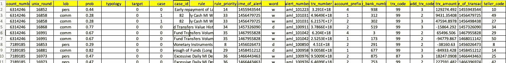
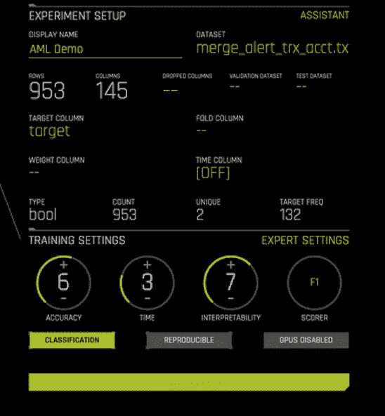
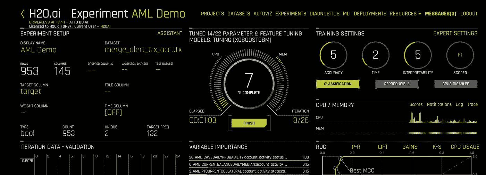
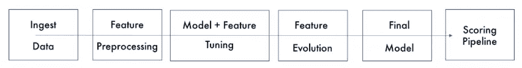

# 使用无人驾驶人工智能检测洗钱网络

> 原文：<https://medium.datadriveninvestor.com/detecting-money-laundering-networks-using-driverless-ai-ce911155caaa?source=collection_archive---------8----------------------->

人工智能已经从一个时髦的词发展成为今天的现实。它对几个行业产生了积极的影响，金融行业也未能幸免。金融服务行业不断创新和推进新技术，以扩大客户群并寻找新的机会。从资本市场到商业银行，从消费金融到保险，所有领域都在发生这种情况。

 [## 为什么加密对日常生活至关重要？数据驱动的投资者

### 你几乎每天都要输入密码，这是你生活中最基本的加密方式。然而问题是…

www.datadriveninvestor.com](https://www.datadriveninvestor.com/2020/02/10/why-encryption-is-critical-to-everyday-life/) 

人工智能在金融行业的应用正在迅速改变商业格局，即使是在传统的保守领域。如今，金融机构在遵守监管合规性的同时，将人工智能(AI)用于客户服务、风险管理、欺诈检测和反洗钱等场景。

Some areas where AI is helping the business

当涉及到检测**洗钱**和 H2O 时，人工智能解决方案已被证明是一个福音。人工智能的开源领导者 AI 正在授权领先的金融服务公司提供人工智能解决方案，帮助有效应对这种威胁。

# 反洗钱

*洗钱是隐瞒非法所得的来源，通常是通过涉及外国银行或合法企业的转账方式*

Impact of Money Laundering on Global Banking

洗钱是金融服务业的一个大问题。根据联合国毒品和犯罪办公室的数据，估计每年有 2 万亿美元通过银行系统被“清洗”。对未能阻止洗钱的银行的罚款在过去十年中增加了 500 倍，达到每年 100 多亿美元。因此，银行组建了庞大的团队，并赋予他们查找和调查可疑交易的耗时任务，这些交易往往以复杂的参与者网络中大量小额转账的形式出现。

# 解决洗钱问题的传统方法。

调查小组使用了基于规则的系统，如 **FICO** 、 **Fiserv** 、 **SAS** **AML** 、 **Actimize** 等。发现可疑交易。当前基于规则的工作流中涉及的步骤如下:

*   警报系统产生警报。
*   研究者使用不同来源的信息对其进行审查。
*   警报被批准为真阳性或分类为假阳性。

然而，基于规则的系统有大量的假阳性，通常在 75–99%的范围内。这些规则可能会很快过时，从而产生大量仍需审查的误报。使用基于规则的系统的一些缺点是:

Issues with Rule-based AML approaches

# 人工智能如何解决这个问题

**资本市场和零售银行业务中的反洗钱(AML)** 计划广泛部署了**基于规则的交易监控系统**，涵盖货币门槛和洗钱模式等领域。坏演员可以随着时间的推移了解这些规则，并改变他们的方法以避免被发现。**基于人工智能的行为建模**和客户细分可以更有效地发现交易行为，识别行为模式和异常值，从而表明潜在的洗钱行为。

AI，尤其是时间序列建模，特别擅长看一系列复杂的交易，发现异常。使用机器学习技术的反洗钱可以发现可疑交易和交易网络。这些交易被标记为待调查，并可以被分为高、中或低优先级，以便调查者可以确定其工作的优先级。AI 还可以为标记交易的决定提供原因代码。这些原因代码告诉调查者他们可以在哪里发现问题，并有助于简化调查过程。人工智能还可以在调查人员审查和清除可疑交易时向他们学习，并自动加强人工智能模型的理解，以避免不会导致洗钱的模式。

# 利用无人驾驶人工智能解决反洗钱问题

H2O Driverless AI

[**H2O 无人驾驶 AI**](https://www.h2o.ai/products/h2o-driverless-ai/) 是一个屡获殊荣的自动机器学习平台，通过使用自动化在短短几分钟或几小时内，而不是几个月内完成关键的机器学习任务，使数据科学家能够更快、更有效地开展项目。 **H2O.ai 的 AML 解决方案使用无人驾驶 ai 作为建模引擎，利用无人驾驶 AI 的高级特征工程和模型创建能力。**

与基于规则的系统相比，H2O.ai 的反洗钱(AML)系统具有以下优势:

*   从根本上减少了误报
*   它有能力摄取为洗钱定制的食谱。
*   该解决方案战略性地位于反洗钱系统和调查人员之间
*   它使用环路外 ML 方法将警报分类为假阳性或真阳性。
*   向调查者提供一组精选的警报

通常的调查时间从 45–90 天大幅减少到几秒钟。它还减少了人为误差和所需的工时。它以创新的特性填补了规则的空白。

# 无人驾驶人工智能演示

## 资料组

H2O.ai 的反洗钱系统可以处理预先标记的反洗钱警报数据、交易银行数据和 KYC 银行数据。但是，对于本演示，我们将使用一个合成数据集，其分布与金融数据集非常相似。数据集的定型数据由数值列和分类列组成。一些字段是-个人账号、日期、业务种类、类型等。

**目标**列标识警报是否足够可疑，可以发送进行进一步调查。这是我们需要预测的事情，即生成的警报是否有用。我们的想法是减少这种情况下的假阳性。在这里，重要的是要知道模型学习基于交易的行为，而不是特定于任何一个人。

A Glimpse of the dataset

# 启动实验

*如果你想重温一下关于无人驾驶人工智能的入门知识，请随时试驾***。试驾是 H2O 在 AWS 云上的无人驾驶人工智能，你可以探索它的所有功能，而不必下载它。**

*这些数据被摄取到一个无人驾驶的人工智能实例中，并被视为一个有监督的 ML 问题。获取数据集后，我们进入专家设置，并引入专门用于识别洗钱警报中误报的方法。*

*最后，我们选择 F1 作为记分员(因为我们希望尽可能减少假阴性)。进一步，我们可以调整精度；时间和可解释性设置来满足我们的需求。*

**

*The AML experiment in progress*

*保持所有其他参数为默认值，我们开始实验。屏幕应该如下所示:*

**

*Anti Money Laundering experiment in Driverless AI*

*除了每次迭代的 F1 分数之外，无人驾驶人工智能还让我们看到了用于建模目的的特征的可变重要性。对于这个实验，无人驾驶 AI 执行了以下步骤来找到最佳的最终模型:*

**

# *结论*

*人工智能对于金融服务业的成功至关重要。无人驾驶人工智能使金融服务公司能够快速建立个性化的银行体验、欺诈和洗钱模型、提高员工生产率等。*