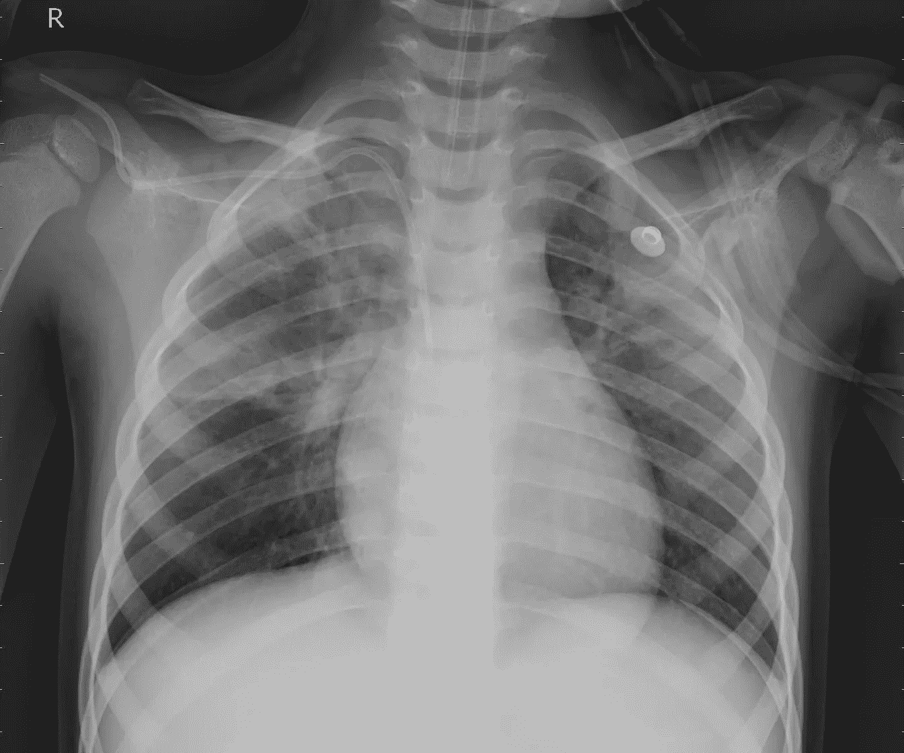
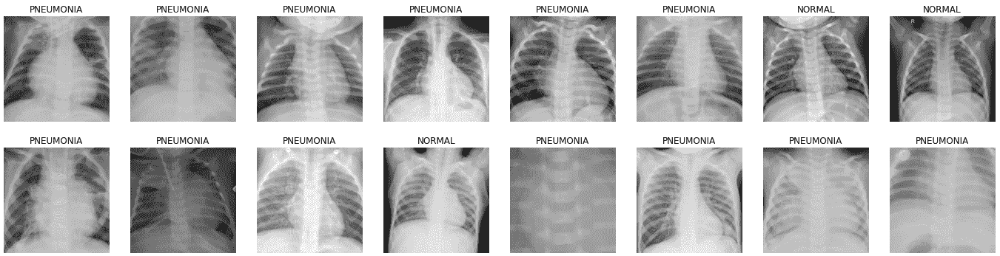
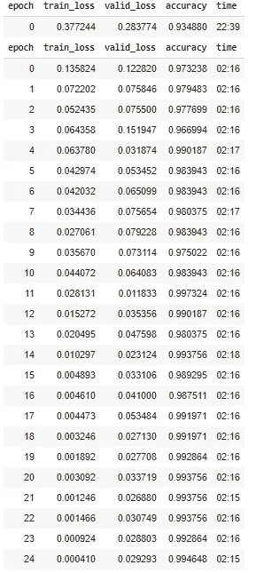
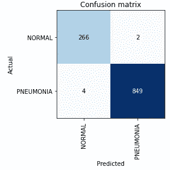
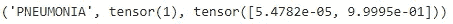
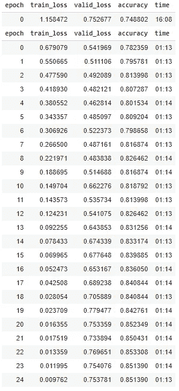
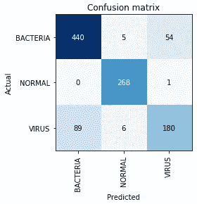

# 使用 FastAI 以 99.5%的准确率检测肺炎

> 原文：<https://medium.datadriveninvestor.com/detecting-pneumonia-with-99-5-accuracy-using-fastai-2de2157a9d2b?source=collection_archive---------9----------------------->


Photo by [CDC](https://unsplash.com/@cdc?utm_source=medium&utm_medium=referral) on [Unsplash](https://unsplash.com?utm_source=medium&utm_medium=referral)

你醒来发现胸口有些痛。你开始咳嗽。你觉得呼吸困难，发烧。你现在非常担心自己的身体出了什么问题，并匆忙赶往医院。那里的医生怀疑是肺炎，但想进行胸部 x 光检查以证实。

> 肺炎是由一些病毒和细菌引起的感染，这些病毒和细菌使一个或两个肺部的气囊发炎。

测试结果呈阴性，但你和医生都不知道，这是假阴性。根据[国家生物技术信息中心](https://www.ncbi.nlm.nih.gov/pmc/articles/PMC4608340/#:~:text=The%20sensitivity%20of%20CUS%20in,0.0%2D94.5)%2C%20respectively.)的数据，使用胸部 x 光检查肺炎只有 93.3%的准确率。仅在美国，每年就有 130 万人感染肺炎，5 万人死于肺炎。

但是如果我们可以利用卷积神经网络来检测肺炎呢？事实证明，我们可以！

> 阅读这篇文章了解[卷积神经网络是如何工作的](https://medium.com/swlh/ai-can-see-you-heres-how-425dd3ca7322)！
> 
> 观看[我在这个项目上制作的](https://youtu.be/MVx3JqXB_yk)视频以及[我的 GitHub 库](https://github.com/eason-w/PneumoniaClassifier)！

# 获取数据

对于人工智能来说，数据是创建一个好的模型最重要的部分之一。如果你的模型在坏数据上训练，预测也将是坏的。垃圾进，垃圾出。

寻找数据集的一个好地方是 Kaggle。我使用的数据集[有近 6000 张胸部 x 光照片，这些照片已经过质量控制筛选，删除了所有低质量或不可读的扫描。](https://www.kaggle.com/paultimothymooney/chest-xray-pneumonia)



A sample from the dataset of viral pneumonia

# 破解密码

为了创建分类模型，我使用了 FastAI，这是 PyTorch 的一个非常强大的 API。

## 训练人工智能

```
!pip install -Uqq fastbookimport fastbookfastbook.setup_book()from fastbook import *
```

代码的第一部分是将 FastAI 导入 Jupyter 笔记本，这允许我开始用 FastAI 而不仅仅是普通 Python 编码。它还允许我在上面安装 Google Drive 来导入文件。

```
lung_types = 'NORMAL','PNEUMONIA'path = Path('/content/gdrive/My Drive/ReplicateFiles/train')
```

这段代码定义了两种肺类型，并定义了获取文件的路径。

```
lungs = DataBlock(blocks=(ImageBlock, CategoryBlock),get_items=get_image_files,splitter=RandomSplitter(valid_pct=0.2, seed=42),get_y=parent_label,item_tfms = Resize(256)) dls = lungs.dataloaders(path)
```

这段代码通过将数据分割成一个验证集并将其调整为相同的大小来准备图像文件。它还定义了“*DLS”*，我们将在培训中使用它来定义从哪里获取文件。

```
dls.valid.show_batch(max_n=16, nrows=2)
```

这显示了文件中的 16 个图像，我用它来验证所有文件都被正确导入，并且可以通过“ *dls* 访问。



```
learn = cnn_learner(dls, resnet152, metrics=accuracy)
learn.fine_tune(25)
```

这将“*学习*功能定义为 CNN 学习者，它从“ *dls* 获取文件，使用 Resnet 152，并使用准确性度量。然后，它使用“*微调*进行 25 个时期的训练。



After 25 epochs the model reaches 99.46% accuracy

```
interp = ClassificationInterpretation.from_learner(learn)interp.plot_confusion_matrix()
```

这将绘制一个混淆矩阵，以查看模型哪里出错了，然而，这在检测两个以上事物的模型中会更有用。



就是这样！在大约 80 分钟的训练中，我们可以达到比医生更高的检测肺炎的准确率！

## 导出和测试人工智能

```
learn.export()path = Path()path.ls(file_exts='.pkl')
```

这段代码简单地导出了模型，这样我们就可以重用它，而不需要重新训练整个模型。如果我们希望保留模型以备将来使用，这是很有用的(这样我们就不必再花 80 分钟来训练它)。通过导出模型，可以更容易地使用它制作 web 应用程序，并保持一致的准确性。

```
learn_inf = load_learner(path/'export.pkl')learn_inf.predict('/content/gdrive/MyDrive/ReplicateFiles/test/PNEUMONIA/person100_bacteria_481.jpeg')
```

这段代码定义了一个名为“ *learn_inf* 的函数，它将使用我们刚刚导出的模型来做一些事情。第二行使用" *predict* "函数对" *learn_inf* "预测一个图像，根据文件名，可以判断是细菌性肺炎。但是模型能预测什么呢？结果如下:



我训练的模型以 99.995%的置信度预测为肺炎。

# 病毒性和细菌性肺炎的鉴别

既然我们知道该模型可以区分健康的和患有肺炎的肺部——那么，我们如何区分细菌性和病毒性肺炎呢？

事实证明，我们不需要做太多的修改，只需要一行代码(将两种类型的肺炎分别添加到两个文件夹中)。

```
lung_types = 'NORMAL','VIRUS','BACTERIA'
```

更改后，代码的其余部分完全相同，结果如下:



This model only has a 85% accuracy after 25 epochs.



正如你所看到的，这个模型经常混淆细菌性和病毒性肺炎，导致第一个模型(99.5%)和这个模型(85%)之间的准确性下降了 14.5%。

# 最终要点和关键要点

由于[贝叶斯法则](https://www.youtube.com/watch?v=lG4VkPoG3ko)，使用人工智能诊断肺炎的准确性并不等同于你患肺炎的概率为阳性结果。正因为如此，医生很可能仍然需要，像这样的模型只会被用作建议。

最近，医生们一直在利用人工智能来提高他们诊断的准确性，并且已经被证明是有效的。2019 年，人工智能算法实现了 93.73%的肺炎检测准确率，仅在医生准确率方面略有提高。当人工智能与医生一起作为推荐工具时，整体准确性应该会提高。

像这样的模型对于医生和医院来说是非常有益的，可以用作提高诊断准确性的工具。

*   数据对于拥有一个好的人工智能模型至关重要
*   FastAI 是人工智能的一个非常有用的工具，可以用来实现非常高的准确率
*   创建一个人工智能模型有许多不同的步骤，通常遵循以下结构:导入必要的东西、处理数据、训练、导出和测试
*   CNN 非常强大，已经在帮助医生进行诊断，尽管他们应该只是提供一个建议

> 嘿！非常感谢你阅读这篇文章！如果你想在我下次写文章时得到通知，请在 [Medium](https://bit.ly/EWUMedium) 上关注我！真的很感谢！
> 
> 你也可以查看我的[网站](https://bit.ly/EWUSite)，订阅我的[时事通讯](https://bit.ly/EWUNewsletter)，关注我的 [Twitter](http://bit.ly/EWUTwitter) 和 [LinkedIn](https://bit.ly/EWULink) ！