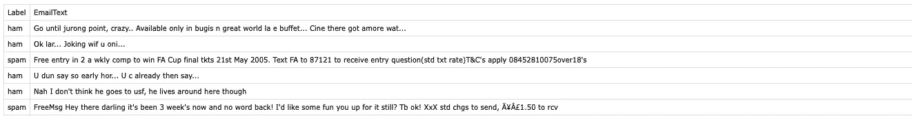
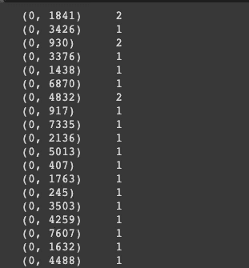

# 15 行代码中的垃圾邮件检测

> 原文：<https://medium.datadriveninvestor.com/detecting-spam-in-15-lines-f238c20b6ab4?source=collection_archive---------19----------------------->

3 分钟 DIY 机器学习模型


机器学习一直被视为一个黑盒，其根源在于微积分、线性代数和统计学。实际上，它比大多数算法都要简洁和容易得多。以下是如何用 15 行代码构建垃圾邮件检测算法。跟我一起或者只是浏览一下！

# 导入必要的包

```
import pandas as pd
from sklearn.model_selection import train_test_split
from sklearn.feature_extraction.text import CountVectorizer
from sklearn import svm
```

**导入 pandas 作为 pd** 导入 pandas 一个数据清理和分析包。“as pd”允许我们将 pandas 方法称为“pd”而不是“pandas”。

**从 sklearn.model_selection 导入 train_test_split** 这是一个包，它允许我们将数据集分成训练集和测试数据集，在训练集中我们教授模型，在测试集中我们测试模型的表现。

**来自 sk learn . feature _ extraction . text import count vectorizer**一个对电子邮件中出现的单词进行标记和计数的包。Tokenizes 只是意味着给每个单词一个随机数，以便于操作。

**从 sklearn 导入 svm** 导入 svm 一个支持向量机，它使用数据训练模型。如果机器学习背后有秘方的话，这就是了。

# 数据分析

```
spam = pd.read_csv('spam.csv')
```

**spam = PD . read _ csv(' spam.csv ')**将 CSV 文件' spam . CSV '转化为数据帧，保存到 spam。数据框只是 python 可以解释的表格数据，不会对数据集进行任何更改。在这里找到数据[。](https://drive.google.com/file/d/1vBFxXjwFmojH80e0hVnsB7Hjy7hbgCMT/view?usp=sharing)

[](https://www.datadriveninvestor.com/2020/11/19/how-machine-learning-and-artificial-intelligence-changing-the-face-of-ecommerce/) [## 机器学习和人工智能如何改变电子商务的面貌？|数据驱动…

### 电子商务开发公司，现在，整合先进的客户体验到一个新的水平…

www.datadriveninvestor.com](https://www.datadriveninvestor.com/2020/11/19/how-machine-learning-and-artificial-intelligence-changing-the-face-of-ecommerce/) 

# 分割训练和测试数据集

```
x = spam['EmailText']
y = spam["Label"]
x_train, x_test,y_train, y_test = train_test_split(x,y,test_size = 0.2)
```

**x = spam['EmailText']:** 将 spam 中的“EmailText”列分配给 x。这是我们放入模型的数据。你可以在下面看到原始数据集的截图。

**y = spam["Label"]:** 将 spam 中的" Label "列分配给 y。这将告诉模型如何更正答案。你可以在下面看到原始数据集的截图。

**x_train，x_test，y_train，y_test = train_test_split(x，y，test_size = 0.2):** 将 x 和 y 列分为用于训练输入的 x_train、用于训练标签的 y_train、用于测试输入的 x_test 和用于测试标签的 y_test。test_size=0.2 将测试集设置为 x 和 y 的 20%。



# 提取特征

```
cv = CountVectorizer()
features = cv.fit_transform(x_train)
```

**cv= CountVectorizer():** 保存 CountVectorizer()为每个单词随机分配一个数字(标记化)，统计单词的出现次数，并保存到 cv。还没有做什么，我们只是暂时把这个方法分配给 cv。

**features = cv . fit _ transform(x _ train):**随机给每个单词分配一个数字(标记化)，统计单词的出现次数，保存到 cv。在下图中，0 代表电子邮件的索引，随机数代表单词，最右边是出现的次数。



The word corresponding to 1841 is used twice in email number 0

# 建立模型

```
model = svm.SVC()
model.fit(features,y_train)
```

**模型=支持向量机。SVC():** 分配 svm。SVC()到模型。

**model.fit(features，y_train):** model.fit 用特征训练模型，y_train。它通过对照标签(y_train)检查它的预测并调整参数直到它达到最优。

# 测量精度

```
features_test = cv.transform(x_test)
print(model.score(features_test,y_test))
```

**features _ test = cv . transform(x_test):**根据经过计数矢量化的 x _ test 进行预测。将结果保存到 features_test。

**print(model . score(features_test，y_test)):** mode.score()针对 y_test 实际标签对 features _ test 的预测进行评分。

就是这样！通过这个模型，我们能够以 97%的准确率对垃圾邮件进行分类。希望这篇文章揭开了机器学习的神秘面纱，帮助你获得更好的理解，甚至可能帮助你建立你的第一个模型。如果你喜欢这篇文章，请鼓掌，并关注我！

## 访问专家视图— [订阅 DDI 英特尔](https://datadriveninvestor.com/ddi-intel)