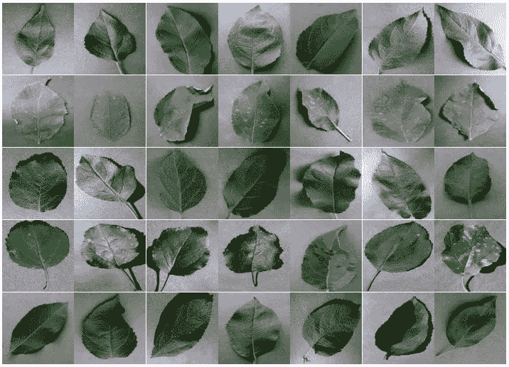
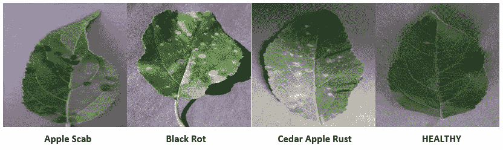
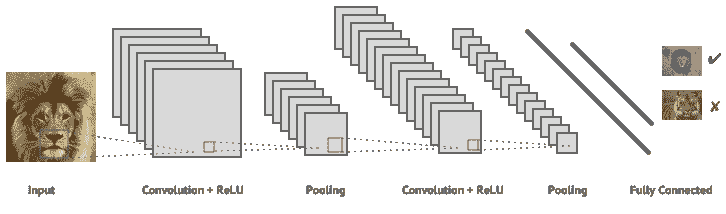
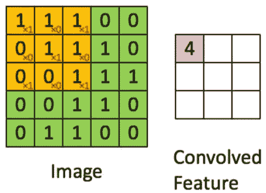
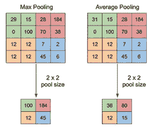
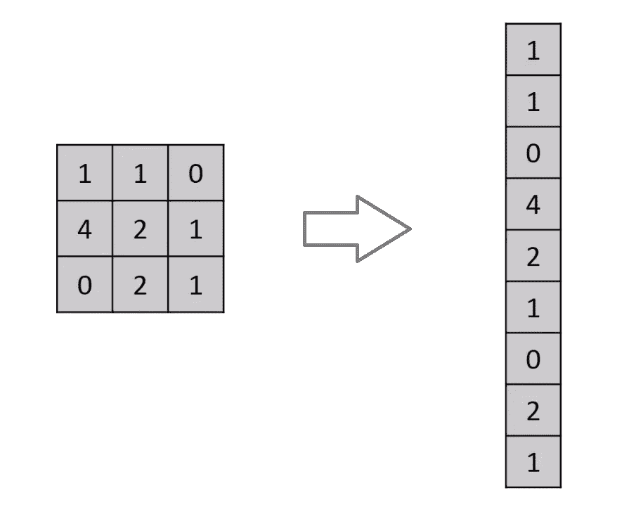
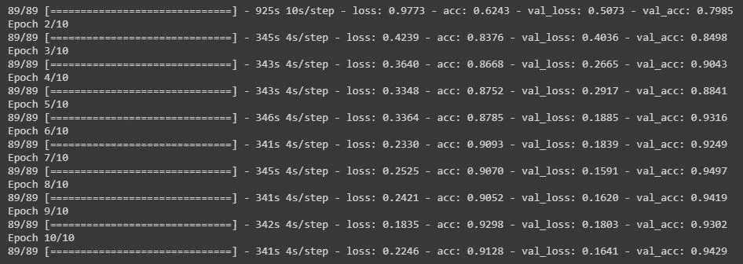
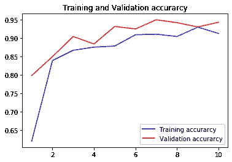
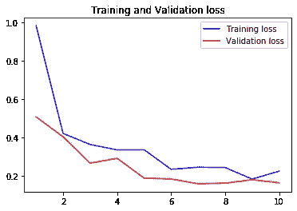

# 基于深度学习算法的苹果树病害检测与分类

> 原文：<https://medium.datadriveninvestor.com/detection-and-classification-of-apple-tree-disease-based-on-deep-learning-algorithm-d8c29940ed02?source=collection_archive---------1----------------------->


我们必须非常感激，世界上数字技术的发展最近被证明在生活的几乎所有方面都非常有用。人工智能技术的发展也相当迅速。可以利用的事情之一是通过使用机器学习或深度学习来制作植物疾病诊断系统。在生物学中，通过植物的形态特征可以知道它的状况是否健康。其中一个可以作为参考的是叶子表面的形态。受某些植物病害影响的植物会在叶子表面表现出异常。因此这些植物的叶子通常与健康植物的叶子不同。这为我们利用机器学习算法，基于叶片图像建立植物病害自动诊断系统提供了参考。

[](https://www.datadriveninvestor.com/2019/03/22/the-seductive-business-logic-of-algorithms/) [## 算法诱人的商业逻辑

### 某些机器行为总是让我感到惊讶。我对他们从自己的成就中学习的能力感到惊讶…

www.datadriveninvestor.com](https://www.datadriveninvestor.com/2019/03/22/the-seductive-business-logic-of-algorithms/) 

为了创建植物疾病检测系统，我们可以使用深度学习模型之一，卷积神经网络(CNN)。CNN 是深度学习模型之一，经常用于对图像进行分类。jpeg 格式。CNN 有不同的架构设计，根据需要搭建 CNN 模型。有几个 CNN 建筑设计的例子已经建成并被批准用于表演。例如 VGGNet-16、AlexNet、LeNet、残差网络(ResNet)等等。我们可以基于现有架构构建 CNN 模型，甚至可以构建我们自己的 CNN 架构！但是如果你自己做架构，当然需要时间和更深入的研究。



The dataset contains photos of apple leaves

为了建立这个诊断系统，我们需要一个植物叶片图像数据集。为了得到这个数据集，我们可以在 Kaggle 下载。之后，我们可以开始在 Jupyter 笔记本或 Google Collaboratory 上构建 CNN 模型。我会用 Google Collaboratory 让它变得更简单，不用在我的 PC 上安装 Jupyter Notebook 和 Python。实际上有 2 种方法可以制作 CNN 模型，那就是使用一个库或者从头开始创建一个 CNN。实际上是一样的，只是如果你使用这个库，我们只需要调用要构建的函数，并改变每个函数中的参数。所以在建立这个 CNN 模型的时候会更快。如果从零开始(scratch)，它会使每个功能一个接一个。每种都有优点和缺点，但是在本文中，我们将考虑到它的有效性，单独使用硬库来构建 CNN。

苹果植物中至少有 3 种疾病，包括:苹果黑星病、黑腐病和雪松苹果锈病。因此，我们使用的数据集必须涵盖这 3 种疾病，并添加健康苹果叶片照片的数据。稍后，该数据集将根据每种疾病的图像进行分类。



Photograph of apple tree leaves with several types of diseases

如果我们能够利用机器学习创建一个苹果植物病害类型自动分类系统，这将对苹果水果生产链中的许多人产生积极的影响。至少这将有助于苹果种植者采取更早的行动来治疗受疾病侵袭的苹果植株。

## 错误预测的后果

每一台自动化机器都不是完美的，一定会有机器出错的时候。如果苹果植株的病害类型分类出现错误，将对苹果生产链产生负面影响。至少当他们种植的苹果树没有最佳结果甚至死亡时，果农会遭受损失。因此，重要的是建立一个高性能的 CNN 模型来避免这些错误。在图像分类模型中，有几种方法可用于识别模型性能。


Confusion Matrix

根据混淆矩阵，可以计算机器学习模型的性能，从准确度、精确度、灵敏度到特异性开始。现在从这个性能将确定一个卷积神经网络模型的特征，这已经作出。

# 构建卷积神经网络架构

将为苹果叶中的疾病分类而构建的卷积神经网络架构基本上由 3 种类型的层组成。即卷积层、汇集层和全连接层。



Illustration of Convolutional Neural Network Architecture

## 卷积层

卷积层用于过滤 CNN 模型中的图像。在这一层，将为每个输入的爱提取独特的特征。例如垂直线、水平线、gambaar 角等等。卷积层可用于处理前一层，即初始输入图像或前一特征图。卷积层的大小可以变化，但通常只使用 3x3、5x5 或 7x7 滤镜。还有一个 1x1 大小的过滤器，但该过滤器更专用于减少层中的通道数量。



Image Convolution Process

## 汇集层

池层的工作原理是将突出的参数作为原始图像的解释。常用的有两种类型，即最大池层和平均池层。顾名思义，Max-Pool Layer 通过在一个矩阵区域中取最大参数来工作。虽然平均池层以同样的方式工作，但是取的是参数的平均值。



Maximum Pooling dan Average pooing

## **展平**

在进入全连通层之前，先进行展平层处理。非常简单，即将每一列排成一行。接着是第二个，第三个，等等。所以最终它只会变成一个一维矩阵。



Flattening Process

## 全连接层

全连接层用于 CNN 架构的最后一层。全连接层 1 维矩阵，就像一系列长长的数字排列在一起。全连接层像任何其他神经元一样工作，并且具有隐藏层、激活函数、输出层和损失函数。作为 CNN 架构的输出门。


Fully Connected Layer hingga Output

我利用 Keras 库构建了这个卷积神经网络架构。如下所示:

```
# Build CNN Architecturemodel = Sequential()model.add(Conv2D(32, (5, 5), input_shape=input_shape,activation='relu'))model.add(MaxPooling2D(pool_size=(3, 3)))
model.add(Conv2D(32, (3, 3),activation='relu'))
model.add(MaxPooling2D(pool_size=(2, 2)))
model.add(Conv2D(64, (3, 3),activation='relu'))
model.add(MaxPooling2D(pool_size=(2, 2)))model.add(Flatten())model.add(Dense(512,activation='relu'))
model.add(Dropout(0.25))
model.add(Dense(128,activation='relu'))
model.add(Dense(num_classes,activation='softmax'))model.summary()
```

构建的卷积神经网络架构由 3 个卷积层组成，详细信息如下:

卷积层 1 = 5x5 带 32 个滤镜
卷积层 2 = 3x3 带 32 个滤镜
卷积层 3 = 3x3 带 64 个滤镜

使用的激活函数是输出层上的 ReLu 和 Softmax。执行培训流程后，已创建的培训模型的结果将显示:



具有上述结构的卷积神经网络模型如果用于基于苹果树叶片的照片检测苹果树中的疾病类型，将产生高达 91.16%的准确度测试。


下图显示了训练模型过程中的准确性和损失值。从该图中，我们可以分析早先构建的卷积神经网络架构的特征。



关于卷积神经网络架构的完整程序，可以从 GitHub 下载:

[](https://github.com/mmasdar/Apple-Disease-Classification/blob/master/Apple_Disease_Classification.ipynb) [## 苹果疾病分类

### permalink dissolve GitHub 使上下文切换变得容易。阅读渲染文档，查看历史记录…

github.com](https://github.com/mmasdar/Apple-Disease-Classification/blob/master/Apple_Disease_Classification.ipynb) 

> *欢迎提问、评论和投稿。随时和我讨论任何事情。*

在 [LinkedIn](https://www.linkedin.com/in/muhammad-masdar-mahasin-66914378/) 上与我联系

在推特[上与我联系](https://twitter.com/mmasadar)

