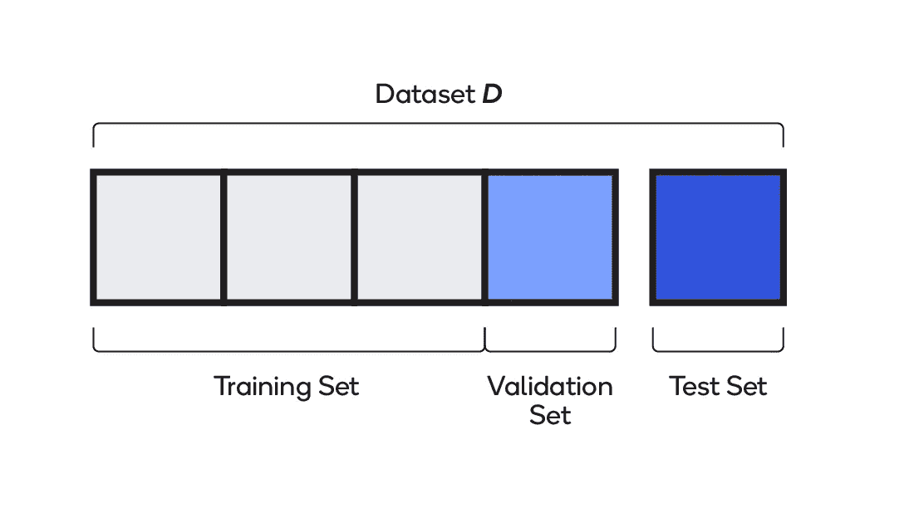
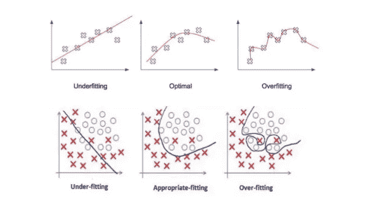
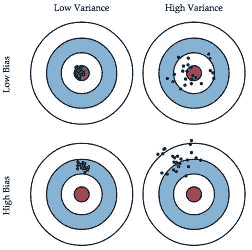
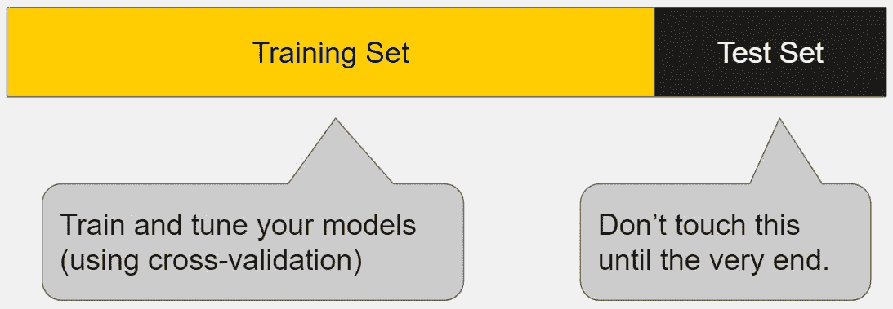
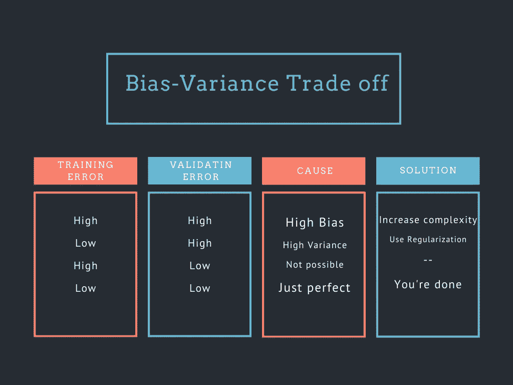
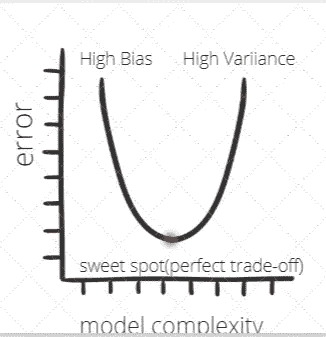

# 确定最适合您的 ML 模型。

> 原文：<https://medium.datadriveninvestor.com/determining-perfect-fit-for-your-ml-model-339459eef670?source=collection_archive---------0----------------------->

以最简单的方式教授过度拟合与欠拟合以及完美拟合。

Overfitting vs Underfitting vs Perfect Fit

在对每一个算法进行详细的解释之前，通过称为“<algorithm_name>解释”的系列为媒介。*如果我们能够理解我们想要调整模型的方式，那就更好了。*</algorithm_name>

但在此之前，让我们回忆一下机器学习的定义。

机器学习是我们提供给计算机的一种无需明确编程就能学习的能力；太正式了？所以用外行人的话说，把自己当成监护人，把你的机器当成你的孩子；现在，像往常一样，你必须教他如何做不同的家务？现在，要么你通过自己的经历来教育你的孩子，要么让他根据自己的起起落落生存下来。

> 如需更详细的解释，请跟随“[到底什么是机器学习？](https://medium.com/machine-deep-learning/what-exactly-machine-learning-is-1746c9d151ed)、了解更多数据科学跟随[服务数据科学菜鸟。](https://medium.com/towards-artificial-intelligence/serving-data-science-to-a-rookie-b03af9ea99a2)"为了了解我们如何将机器学习与我们的日常生活联系起来，请遵循"[将机器学习技术与现实生活联系起来。](https://levelup.gitconnected.com/relating-machine-learning-techniques-to-real-life-4dafd626fdff)”

准确性是我们正确解决问题的百分比，而损失是我们错误解决问题的百分比。

因此，当我们挖掘数据时，我们将其分为三部分，即训练集、测试集和验证集。

**训练集**用于教授我们的模型，用它来尝试评估输入和输出之间的复杂函数。根据不同的算法，它以不同的方式工作。

例如，当使用*线性回归*时，训练集中的点用于绘制最佳拟合线。在*K-最近邻居*中，训练集中的点是可能是邻居的点。

再次把它和现实生活中的例子联系起来；假设我们希望我们的孩子学习任何数学概念；我们通常在教科书的帮助下教他，但教科书中的问题范围是有限的，这正是训练数据，我们可以在有限的数据上训练我们的模型。

 [## 将定义 2020 年就业前景的五大数据科学和机器学习趋势|数据驱动…

### 数据科学和 ML 是 2019 年最受关注的趋势之一，毫无疑问，它们将继续发展…

www.datadriveninvestor.com](https://www.datadriveninvestor.com/2020/02/19/five-data-science-and-machine-learning-trends-that-will-define-job-prospects-in-2020/) 

**验证集:**训练完成后，验证数据用于计算分类器的精度或误差。这里要关注的一点是，我们知道验证集中每个点的真实标签，但是我们要假装不知道。然后我们会收到该点的分类。我们现在可以将它与验证点的真实标签进行比较，看看我们是否得到了正确的结果。

或者是实际考试前的测试，我们会遇到一些看不见的问题，唯一的不同是，我们试着用已经教过的问题来测试我们的孩子。

**测试集**是看不见的数据，我们用它来测试我们的模型准确性。模型完全看不到这些数据，但这些数据遵循与定型数据集相同的概率分布。因此，我们期望它尽可能正确地预测/分类。

或者是考试中可能出现的问题，我们期望孩子能正确解决。同样，测试数据中的数据是不可见的，我们希望我们的模型尽可能产生更高的准确性。

当我们开发一个机器学习模型时，我们希望它在测试数据上产生更高的准确性，因为这定义了我们的模型对训练数据的理解程度。理解得越好，就越准确，也就越合适。但是什么更合适呢？

在训练我们的模型之后，我们期望有三种类型的拟合:

1.  **过度拟合** —这是一种建模错误，当针对特定数据进行训练或函数过于接近有限的数据点集合时会出现这种错误，即它可以根据验证数据轻松预测、分类或聚类，但对于看不见的数据，它很难产生正确的输出。只是当我们被教授的问题束缚住，然后我们在考试中失败时，我们会得到一些扭曲或不同的问题。
2.  **欠拟合** —当模型既不能对训练数据建模，也不能推广到新数据时，会出现这种情况。欠拟合机器学习模型不是合适的模型，并且将是明显的，因为它将在训练数据上具有较差的性能。
3.  **刚好适合** —这是最佳点，这是非常可取的，当我们的模型能够在测试和验证数据上产生良好的准确性时就会出现。这可以通过正确设置所有超参数来实现。与上面的例子联系起来，当我们的孩子能够学习并在考试中取得更好的成绩时，就会发生这种情况。

# 现在问题来了，如何区分过拟合和欠拟合？

解决偏差和方差的问题实际上就是处理过拟合和欠拟合。相对于模型复杂性，偏差减少，方差增加。随着模型中参数数量的增加，模型的复杂性也随之增加。

让我们首先了解什么是偏差、方差及其在预测模型中的重要性。

**偏差**:这恰好是一个 ML 模型的趋势，它通过不考虑为训练给出的所有特征而持续地学习错误的关系。

具有高偏差的 ML 模型不能有效地学习要素之间的关系，因此会对数据集进行欠拟合，从而导致预测时精度较低。

它给出了我们的预测模型在平均预测值后与训练数据的接近程度。通常算法具有高偏差，这有助于它们快速学习和容易理解，但是灵活性较差。这导致我们的模型拟合不足。

**方差**:解释为目标函数在数据训练时变化的量。或者，这是模型根据给定训练数据集中的数据点进行自我调整的灵活性

具有高方差的 ML 模型使得它对于数据集的数据点变得高度灵活。这种情况会导致模型过度拟合训练数据，从而导致预测的准确性降低。

它被定义为预测的偏差，简单地说，它是告诉我们当它的点数据值改变或一个不同的数据被使用时，对于相同的模型或不同的模型，预测值将分别受到多大的影响。理想情况下，即使从一个训练数据集到另一个训练数据集发生变化，我们从模型预测的预测值也应该保持不变，但如果模型具有较高的方差，则模型预测值会受到数据集值的影响。

平衡偏差和方差(也称为偏差方差权衡)被证明是确保模型充分适合数据并在新数据上表现良好的最佳方式。

机器学习中的偏差-方差权衡；

1.  将数据分为训练、测试和验证部分。
2.  先从一些配置开始。
3.  确保使用正确的超参数。
4.  模型训练和验证错误(不要接触测试数据)

> 高偏差导致欠拟合，高方差导致过拟合。
> 
> 简单模型—高偏差、低方差
> 
> 复杂模型—低偏差、高方差
> 
> 理想模型——低偏差、低方差

如果训练误差和验证误差很高，这意味着我们受到高偏差的影响，这可以通过增加复杂性或训练更多的时期来纠正。

如果训练误差较低，但验证误差较高，这意味着我们受到高方差的影响，这可以通过使用正则化技术或早期停止来纠正。

如果训练误差和验证误差都很低，那么我们得到了我们想要的，这是一个完美的模型。

不可能有高训练误差但低验证误差。

# 结论

希望这篇文章能帮助你以最好的方式调整你的模型，并帮助你以更好的方式了解更多的机器学习概念，甚至让你意识到机器学习并不困难，而且已经在你的日常生活中发生了。

一如既往，非常感谢你的阅读，如果你觉得这篇文章有用，请分享！

请随意连接:

> *领英~*[https://www.linkedin.com/in/dakshtrehan/](https://www.linkedin.com/in/dakshtrehan/)
> 
> *insta gram ~*[*https://www.instagram.com/_daksh_trehan_/*](https://www.instagram.com/_daksh_trehan_/)
> 
> *Github ~*[https://github.com/dakshtrehan](https://github.com/dakshtrehan)

关注更多机器学习/深度学习博客。

> *中等~ https://medium.com/@dakshtrehan*
> 
> *干杯。*