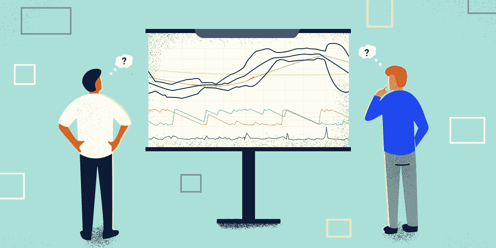
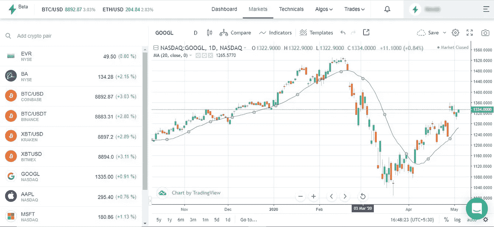
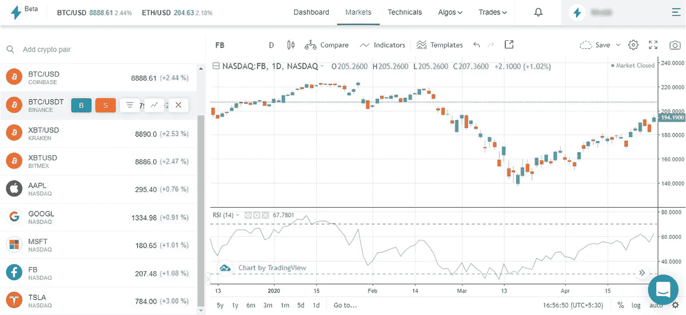
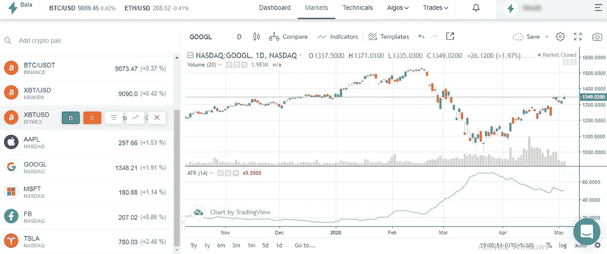

# 确定适合你交易风格的技术指标。

> 原文：<https://medium.datadriveninvestor.com/determining-the-right-technical-indicator-that-fits-your-trading-style-98f6a9230d80?source=collection_archive---------14----------------------->

# 选择正确的指标

技术指标是启发式或数学计算。使用这些指标的目的是识别交易机会，并使用图表或模式评估进场/出场位置。它们被称为技术指标，因为它们基于金融工具的价格、交易量或未平仓权益，而不是收入、利润率和收益等基本参数。

这些指标帮助我们探索技术分析的领域。交易者选择的指标类型对从过程中获得的分析洞察力起着关键作用。

 [## 使用谷歌搜索趋势预测首次申请失业救济人数|数据驱动的投资者

### 几年来，我的重点一直是使用多种替代数据来预测宏观经济统计数据…

www.datadriveninvestor.com](https://www.datadriveninvestor.com/2020/03/25/using-google-search-trends-to-predict-initial-jobless-claims/) 

大多数交易者的学习努力至少包括几个阶段，他们痴迷于技术指标。虽然交易裸图(没有指标)对新手来说并不总是明智的，他们可以通过遵循一些简单的技术指标来获益，但过度使用这些指标可能会因为图表中充斥着重叠数据的信息而导致错误信号。在本文中，我们将探讨不同类别的指标，最后，我们将讨论如何最佳地利用它。

# 技术指标的类型

如果你要使用指标，选择一个有助于更容易、更客观地分析机会的指标从长远来看是有益的。虽然使用复杂的指标来帮助我们确定价格点听起来很令人兴奋，但重要的是要强调保持图表指标的干净和简单，因为这是使用起来舒适和直观的最佳方式。

让我们来看看当你为每日图表分析选择技术指标时应该考虑的一些指标类别

# 1.趋势分析

移动平均线被大多数交易者广泛用于趋势分析。它有助于我们评估不同价位在视觉层面的重要性。顾名思义，它是预定时期内平均价格点(大多数情况下是收盘价)的结果。

让我们用一个例子来理解这一点:
一个 20 的 SMA(简单移动平均线)将是一只股票前 20 个收盘价的平均均值。这将有助于我们了解当前的市场价格是高于 20 天平均价格还是低于 20 天平均价格，从而表明趋势的方向。当快速移动平均线和慢速移动平均线一起绘制时，它们可以作为给定股票的支撑和阻力或支点，并给出动量耗尽和潜在反转的警告。

Illustration 1: 20 day SMA

如上图所示，20 SMA 上方的价格交易处于上升趋势。均线在趋势市场中非常有效，因为它们有助于评估趋势的整体强度，并提醒我们趋势反转。

# 2.振荡指示器

振荡指标利用过去和现在的价格水平作为输入，画出移动线，(通常有上限和下限)，通常有中心线。一些最受欢迎的振荡指标有 RSI，随机指标，MACD 等等。这些指标可以独立用于短期分析。这是一种确定股票超买和超卖区域的方法。

Illustration 2: RSI indicator

如上图所示，RSI 指标的范围是 0-100，50 是中心线。70 以上的区域被认为是超买区，30 以下被认为是超卖区。当指标超过 30 时，它表明价格正在从超卖区恢复，当指标低于 70 时，超卖区也是如此。它们是理想的看涨和看跌背离的具体工具

# 3.波动指标

波动性是评估金融工具交易的价格范围。作为交易者，你要避免在波动性太低的市场交易(小蜡烛线，蜡烛线的开点和收盘点在同一个奖励区)，或者在波动性太大的市场交易(大蜡烛线和长蜡烛线)。一个有见识的交易者应该在一个价格稳定的可持续市场中交易。该指标的较高读数表明波动水平较高，而较低读数表明市场状况稳定或处于低波动时期。

Illustration 3: ATR indicator

平均真实范围也称为 ATR，是一种通过分解一段时间内的价格范围来衡量特定工具范围的指标。上图是低波动的经典例子，蜡烛线很小，没有获利的机会。

# 选择合适的服装

选择和评估交易者在日常交易中使用的正确指标。图表分析可能是合理交易方法的核心，它不仅使交易过程简单明了，而且有助于避免信息重叠造成的任何瓶颈。

虽然用正确的指标交易很重要，但用相同的指标进行算法交易是大多数专业交易者使用的先进方法。在文章中，我们讨论了一些新交易者可以在日常交易中反复灌输的指标选项。借助 [**Streak.world**](https://streak.world/) **可以提高这些指标的性能。**使用各种进入/退出条件对其进行回溯测试，以了解这些指标在过去的表现，以及如何定制它们以在未来受益。