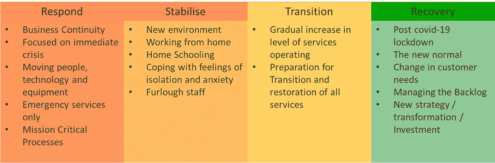
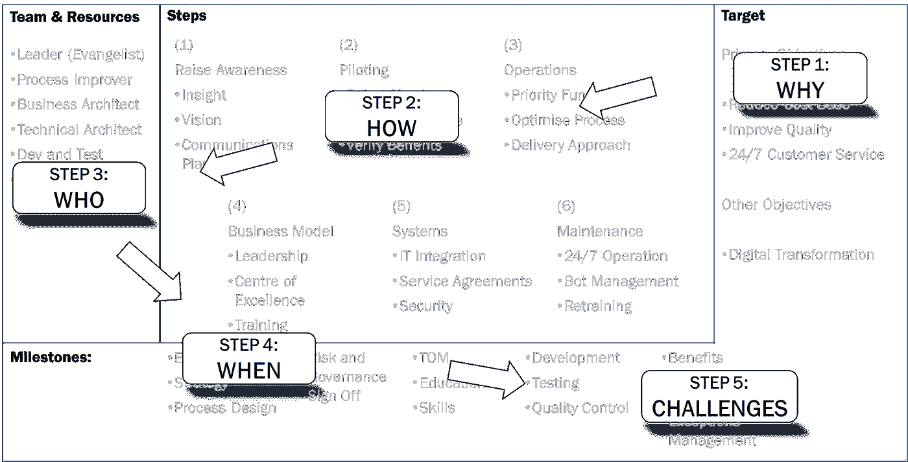

# 制定游戏计划以稳定运行

> 原文：<https://medium.datadriveninvestor.com/develop-a-gameplan-to-stabilise-operations-9010d1ad0613?source=collection_archive---------25----------------------->

一个 5 步“游戏计划”，帮助您的团队在疫情封锁期间集中精力、确定活动优先级并稳定运营。

Photo by [Austin Distel](https://unsplash.com/@austindistel?utm_source=medium&utm_medium=referral) on [Unsplash](https://unsplash.com?utm_source=medium&utm_medium=referral)

# 过渡阶段

我在之前的两篇文章中讨论了疫情响应阶段

1.  [业务连续性:走向虚拟化](https://medium.com/datadriveninvestor/business-continuity-going-virtual-ba4fa23ec0fe) —着眼于您可以立即采取的行动，以利用数字化运营和虚拟工作。
2.  [商业模式:走向虚拟](https://medium.com/datadriveninvestor/business-models-going-virtual-5ae3eac1fe30)——查看你的商业模式的即时变化，使用精益画布来可视化影响评估选项。

随着我们从维持甚至基本运营的肾上腺素激增中走出来，下一阶段变得更具挑战性，以确保您在仍然脆弱的运营中吸引人们并发展确定性。

在这篇文章中，我将解释游戏计划，这是一种有用的技术，当你从 BCP 的即时反应转移到稳定的行动时，可以集中活动。

Transition Phases by Rob King

# 完成游戏计划的 5 个步骤

视觉游戏计划是一种很棒的技术，它可以帮助你在最初制定计划时进行思考。大卫·西伯特在《T4 视觉团队》一书中详细解释了这种技术。

我特别喜欢在研讨会上使用这个工具，正如我在以前的文章中讨论的，有许多方法可以将相同的方法应用于在线“虚拟”会议。

游戏计划是一个 5 步流程，可以将您改变运营模式的需求转化为明确的攻击计划…

## 第一步:为什么。

你的主要目标是什么？

这是您需要的新目标，它将为团队提供一个焦点，例如:

*   稳定长期在家工作的环境
*   过渡到虚拟交付模式(培训、会议、研讨会)

你将如何衡量这些目标？您的回答将有助于确定里程碑，并了解衡量您进步的关键成功因素(步骤 4)。

## 第二步:如何。

*有哪些大胆的步骤？*

在你的旅程中建立大胆的步骤将会把你从今天的位置带到你期望的未来。未来会是什么样子？你将如何衡量它的成功，你需要谁？

回想一下简介中的四个产品化阶段，您可以为每个阶段创建检查点，每个检查点包含几个大胆的步骤。以这种方式想象路线图有助于利益相关者和员工理解他们的角色和更大的图景。

制定一个游戏计划不是一个线性的过程，它是一块画布，你可以在上面构建你的想法，所以在不同的组成步骤之间跳跃是完全可以接受的。

## 第三步:世卫组织。

你需要什么资源？

每一个大胆的步骤通常都需要有人来帮助你完成任务，在这个早期阶段，你可能不知道会是哪个人，所以你要记录下未来完成任务所需的团队或角色。

完成这一步将有助于您确定资源缺口，并突出将面临挑战的任何特定领域。如果这是你的情况，你可能想要添加*确认资源*，作为成功完成你的计划的重要一步。

## 第四步:何时。

*你将如何衡量成功？*

确定您需要实现的主要里程碑，并清楚地了解它们需要在何时完成以及如何衡量进展。

在我们目前的情况下有很多不确定性，所以记录下你所做的任何假设，这样如果任何假设发生变化，你就可以重新审视游戏计划。一些例子可能是:

*   目前的封锁将持续至少 12 周，甚至可能更长时间
*   在可能的情况下，角色将在锁定后继续在家工作。

尽可能具体地衡量，并考虑如何收集衡量你成功的数据。衡量成功或失败的标准是什么？

## 第五步:挑战。

什么可能会出错？

这是你检验你之前所有步骤的机会，并记录可能出错的地方！这一步并不仅仅停留在识别挑战上，你还必须找出需要避免或减轻挑战的方法。所有这些都很费时间，但是如果你早些采取行动，你会避免将来的问题，从长远来看节省时间和压力。

*   在响应阶段，流程正在运行，但很脆弱
*   稳定增强了对关键任务和流程的恢复能力，使其保持可操作性

我们面临着许多挑战，所以你需要优先考虑最重大的挑战，并制定出你将如何应对它们。

我的书《数字劳动力中也提到了完成游戏计划的 5 个步骤，利用同样的方法制定游戏计划，将机器人自动化引入你的商业模式。

抢劫

