# 开发跨平台的桌面 GUI 应用程序。网络核心

> 原文：<https://medium.datadriveninvestor.com/develop-cross-platform-net-core-desktop-apps-on-linux-with-xaml-bf3dbba9afa0?source=collection_archive---------0----------------------->

## 用 XAML 在 Ubuntu 上构建反应式图形用户界面

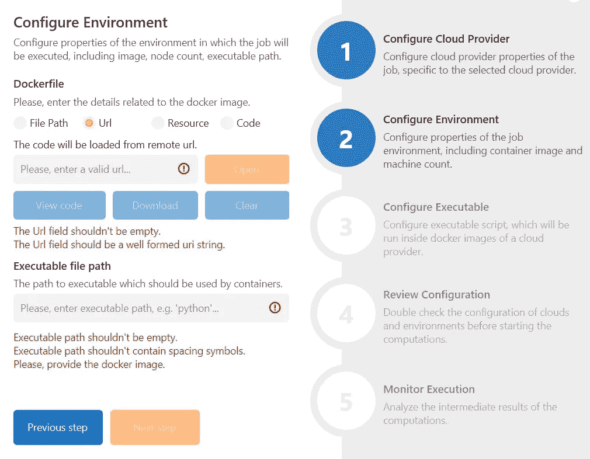

Utility app built on Ubuntu 18 KDE with [AvaloniaUI](https://github.com/avaloniaui/avalonia), [ReactiveUI](https://www.reactiveui.net/), and [ReactiveUI.Validation](https://github.com/reactiveui/reactiveui.validation) libraries.

随着[的初次发布。NET Core](http://dot.net/) ，我们现在可以构建跨平台。NET 应用程序不仅使用 Windows，还使用 macOS、Ubuntu 和其他 Linux 发行版。作为一名对。NET 生态系统，我用的是双引导的 Ubuntu 和 Windows 的笔记本电脑，用的是。NET Core SDK 安装在两个操作系统上。然而，大多数开发时间我更喜欢使用 Ubuntu [KDE](https://kde.org/) 。一方面，Linux 中的命令行界面使得各种各样的问题更容易解决，包括包管理、网络配置和 [Docker](https://www.docker.com/) 容器的编排。另一方面，在生产和开发服务器上使用相同的环境也有一些好处。

但是，中不存在跨平台的桌面 GUI。开箱即用的 NET Core。像 WPF 和 UWP 这样令人敬畏的桌面框架目前只支持 Windows，甚至在 WPF 移植到 Windows 之后也是如此。网芯。为了克服这个问题，微软最近宣布了新的[多平台应用程序 UI](https://devblogs.microsoft.com/dotnet/introducing-net-multi-platform-app-ui/) ，计划于 2021 年 11 月全面上市。然而，根据 GitHub 上的 [MAUI 页面，Linux 设备不会得到微软的官方支持。当然，人们可以使用基于 web 技术的框架来开发桌面应用，但是这会导致用户抱怨高 RAM 和 CPU 使用率。在这种情况下，](https://github.com/dotnet/maui#xamarinforms-vs-net-maui) [AvaloniaUI](http://avaloniaui.net/) 前来救援！

# 什么是 AvaloniaUI？🔥

AvaloniaUI 是一个开源、免费、功能丰富的软件。NET Core framework，允许我们在任何操作系统(包括 Ubuntu、macOS 和 Windows)上构建任何复杂性的跨平台应用程序。

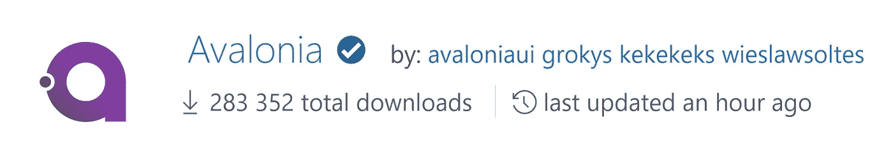

AvaloniaUI is an open-source project supported by the .NET Foundation.

该框架使用了 XAML 方言，这对于来自 WPF、UWP 或 Xamarin Forms worlds 的人来说应该很熟悉。XAML 是一种标记语言，允许使用简洁的类似 XML 的语法，以声明方式描述应用程序 UI。与 WPF 和 UWP 类似，阿瓦洛尼亚 XAML 支持 MVVM 模式和数据绑定。

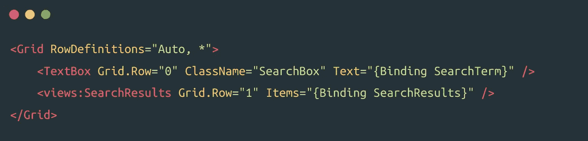

An example of a valid AvaloniaUI XAML markup with MVVM-style bindings.

然而，主要的区别在于 XAML 编译引擎。AvaloniaUI 中的 XAML 标记在编译时进行类型检查，这使得打字错误和其他标记错误更容易发现和修复。值得注意的是，AvaloniaUI 支持在您最喜欢的 IDE 的调试器中调试 XAML。AvaloniaUI 在内部使用了 [XamlX](https://github.com/kekekeks/XamlX) 编译器来启用这些令人敬畏的特性。

此外，AvaloniaUI 允许使用常规的 C#代码来构建用户界面，这似乎类似于《T4》中使用的技术。也支持来自代码的绑定，并且存在一个特定的语法，它允许将绑定附加到 C#对象的初始化器中的指定属性。值得注意的是，来自[反应式扩展](http://reactivex.io/)的`IObservable`是 AvaloniaUI 的一等公民。

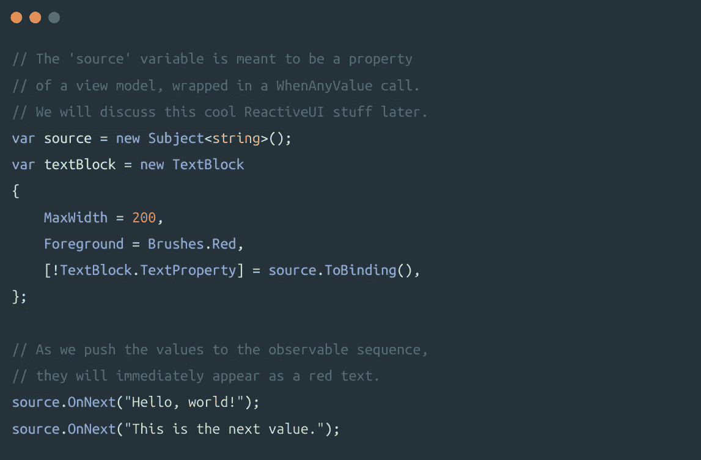

Binding to observables and properties in AvaloniaUI.

AvaloniaUI 中的[样式系统](https://avaloniaui.net/docs/styles/styles)深受 CSS 的启发，可以认为是 XAML 模板和 CSS 选择器的混合。从我个人的经验来看，结合这两种强大的技术来构建用户界面是一个非常酷的想法，它极大地简化了复杂应用程序的设计过程。有了一个类似 CSS 的选择器，你可以很容易地选择所需的控件，XAML 声明的 setters 允许使用资源字典中的画笔。这种资源字典可以在运行时动态改变，使得给 AvaloniaUI 应用程序创建主题变得非常容易。

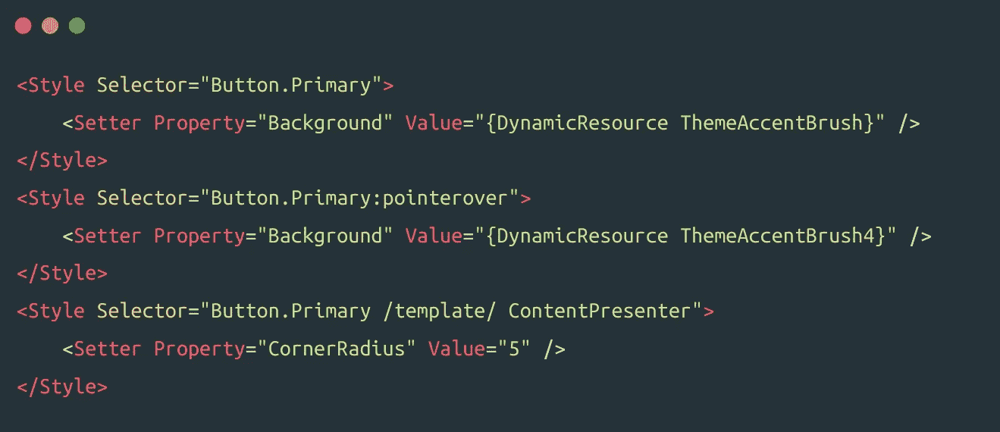

Styling complex controls and visual states in AvaloniaUI.

AvaloniaUI 区别于 WPF 等优秀老技术的另一个很酷的特征是智能数据模板。AvaloniaUI 中的数据模板有一个`DataType`属性，可以在运行时根据绑定对象的类型选择数据模板。反过来，绑定对象通常是用 [ReactiveUI](https://reactiveui.net) 构建的视图模型。在 Avalonia 应用程序中，ReactiveUI 默认用作 MVVM 框架。

 [## 干净的代码在软件开发中至关重要——这就是为什么|数据驱动投资者

### 干净的代码是“容易理解和容易改变的”，它是关于对细节的关注。但是开发人员为什么要担心…

www.datadriveninvestor.com](https://www.datadriveninvestor.com/2020/05/27/clean-code-is-crucial-in-software-development-heres-why/) 

# 什么是反应式 UI？💫

来自 WPF、UWP 和夏威夷的人们应该对感到熟悉。这是一个面向所有人的高级、可组合、反应式 MVVM 框架。NET 平台，在 NuGet 上有将近 150 万次下载。ReactiveUI 可以随着您的应用程序扩展而优雅地应对，允许您通过使用 [reactive extensions](http://reactivex.io/intro.html) 的全部功能来避免过于复杂的事情。

ReactiveUI profile on NuGet. ReactiveUI is a mature .NET Foundation project.

使用 ReactiveUI 制作的典型视图模型可能如下所示。这样的代码可以放入. NET 标准库中，变得容易[移植](https://www.reactiveui.net/docs/handbook/view-models/)和[可测试](https://www.reactiveui.net/docs/handbook/testing/)。

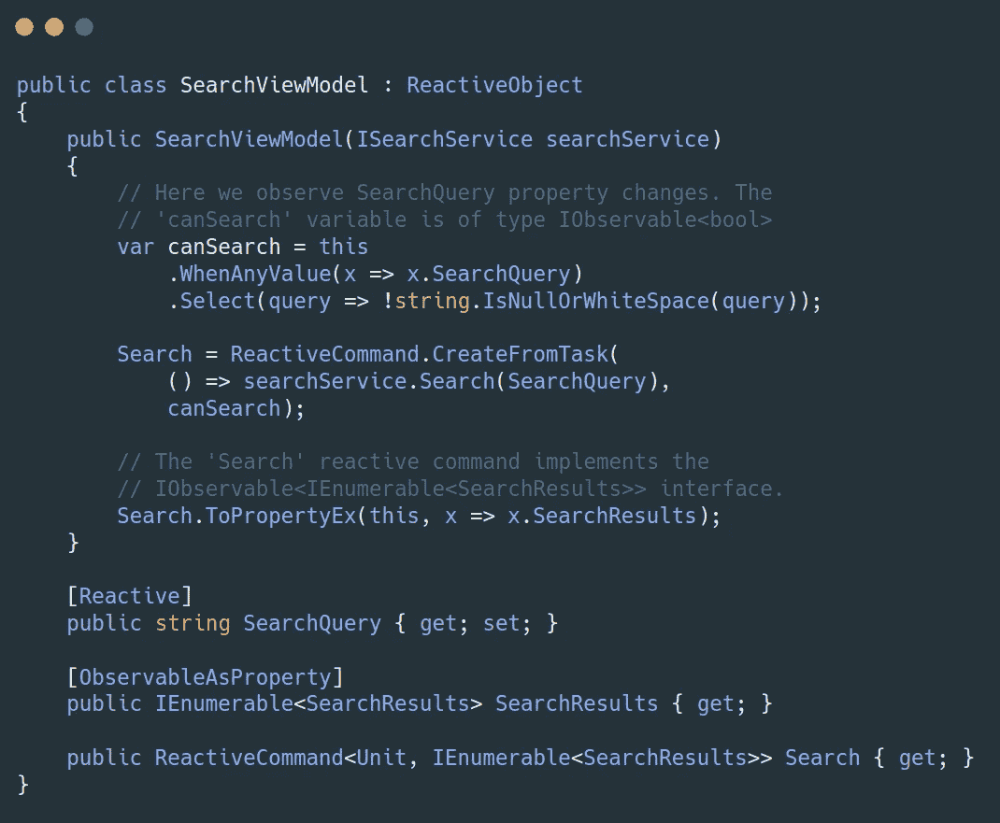

A typical view model implemented with the [ReactiveUI](https://www.reactiveui.net/) framework. Cross-platform and easily testable.

ReactiveUI 允许通过 [WhenAnyValue](https://www.reactiveui.net/docs/handbook/when-any/) 扩展方法来观察属性变化。计算属性通过[observableaspertyhelper](https://www.reactiveui.net/docs/handbook/observable-as-property-helper/)类实现，或者使用`[ObservableAsProperty]`属性，[react command](https://www.reactiveui.net/docs/handbook/commands/)类是 ICommand 接口的默认实现。这样的命令通常绑定到按钮，所以按钮保持禁用，直到满足`WhenAnyValue`条件。`SearchViewModel`的 XAML 标记示例如下所示。

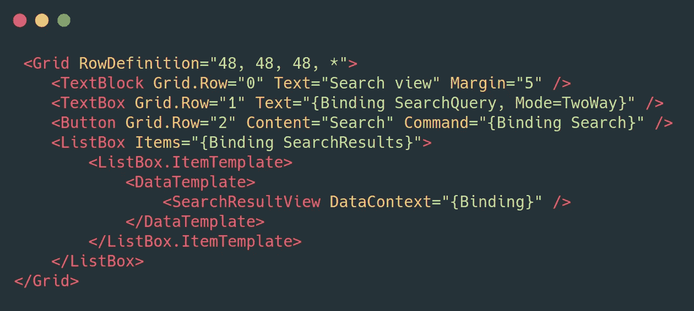

A possible markup of a view made with AvaloniaUI XAML for the ReactiveUI view model shown above.

此外，ReactiveUI 支持视图模型[激活](https://www.reactiveui.net/docs/handbook/when-activated/)和[路由](https://www.reactiveui.net/docs/handbook/routing/)。ReactiveUI [路由](https://www.reactiveui.net/docs/handbook/routing/)由一个`IScreen`、一组`IRoutableViewModel`和一个特定于平台的`RoutedViewHost`控件组成。AvaloniaUI 在 [Avalonia 中提供了自己的`RoutedViewHost`控件的](https://avaloniaui.net/docs/reactiveui/)[实现](https://avaloniaui.net/docs/reactiveui/routing)。ReactiveUI 支持包。

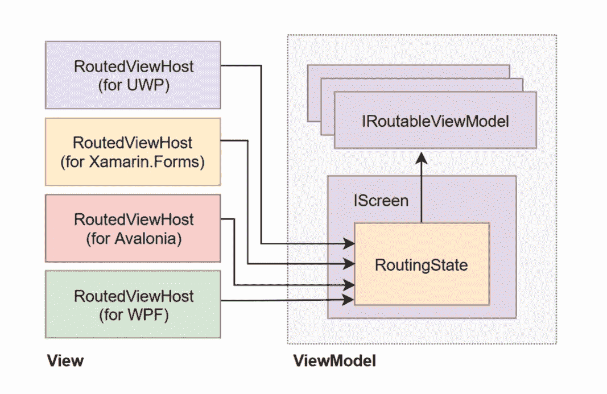

[ReactiveUI routing](https://www.reactiveui.net/docs/handbook/routing/) in one image.

ReactiveUI 生态系统包括[药剂师](https://github.com/reactiveui/pharmacist)、[动态数据](https://github.com/reactiveui/dynamicdata)、[六分仪](https://github.com/reactiveui/sextant)等辅助项目。这些工具可以让你在构建丰富的、反应式的用户界面方面拥有超强的能力。[号反应堆。验证](https://github.com/reactiveui/reactiveui.validation)包包含验证助手和`INotifyDataErrorInfo`接口的实现。

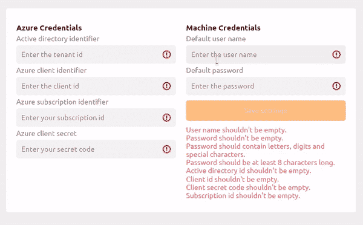

INotifyDataErrorInfo validation in action with [ReactiveUI.Validation](https://github.com/reactiveui/reactiveui.validation).

# 在 Linux 上开发 AvaloniaUI 应用程序

使用上面描述的技术栈，我们可以使用 [JetBrains Rider](https://www.jetbrains.com/rider/) 作为我们的 IDE，轻松地在 Linux 上构建一个. NET 核心 GUI 应用程序。还有 [Live 等帮手包。Avalonia](https://github.com/worldbeater/Live.Avalonia) 通过向我们的 Avalonia 图形界面添加热重新加载功能，可以简化和加快 GUI 开发过程。

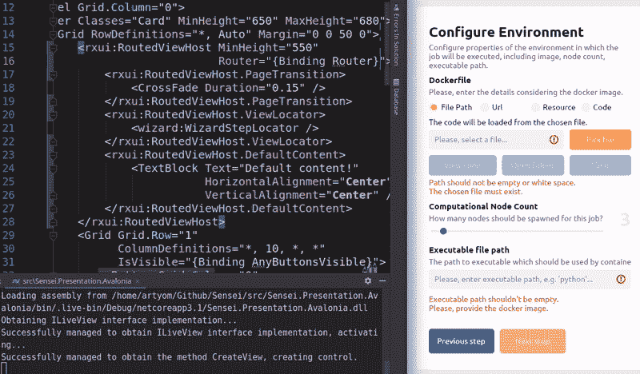

[Live.Avalonia](https://github.com/worldbeater/live.avalonia) demo running in [JetBrains Rider](https://www.jetbrains.com/rider/) on Ubuntu 18.

微软的 Visual Studio Code IDE 也可以用于开发。

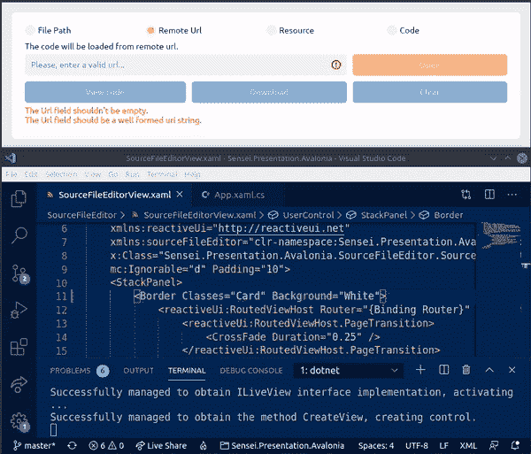

[Live.Avalonia](https://github.com/worldbeater/live.avalonia) demo running in [Visual Studio Code](https://code.visualstudio.com/) on Ubuntu 18.

为了开始构建跨平台。NET Core GUI 应用在 Linux 上使用 Avalon ui 和 ReactiveUI，从 GitHub 安装[模板](https://github.com/AvaloniaUI/avalonia-dotnet-templates)，按照 Avalon ui 网站上的[教程操作。另一个选择是遵循另一个教程，该教程提供了关于如何在 Avalonia 应用程序](http://avaloniaui.net/docs/tutorial/)中设置 [ReactiveUI 路由的详细说明。](https://avaloniaui.net/docs/reactiveui/routing)

如果您遇到任何问题，请前往[Avalon ui Gitter](https://gitter.im/AvaloniaUI/Avalonia)，在那里您可以提出任何问题并从 Avalon ui 维护人员那里获得帮助。如果您愿意深入研究所描述的技术堆栈，请查看以下文章:

*   [Ubuntu 上的 Avalonia UI:入门](https://dev.to/carlos487/avalonia-ui-in-ubuntu-getting-started-2fak)
*   一个跨平台的桌面 GUI 主题。网络核心应用
*   [活性 MVVM 图案。NET 平台](https://medium.com/@worldbeater/reactive-mvvm-for-net-platform-175dc69cfc82)
*   [关于无功编程](https://www.reactiveui.net/blog/2020/07/article-on-reactive-programing)
*   [赞美提升的价值](https://www.reactiveui.net/blog/2020/07/article-on-elevated-values)
*   [Avalonia 是与 XAML 合作开发跨平台应用的大热门](https://www.idiwork.com/avalonia-a-big-candidate-to-create-crossplatform-apps-with-xaml/)
*   [什么是跨平台。NET UI 框架长什么样？探索阿瓦隆尼亚](https://www.hanselman.com/blog/WhatWouldACrossplatformNETUIFrameworkLookLikeExploringAvalonia.aspx)
*   [跨平台保存路由状态到磁盘。带有 ReactiveUI 和 Avalonia 的 NET Core GUI 应用程序](https://habr.com/ru/post/462307/)
*   [令人敬畏的 Avalonia 图书馆和资源的精选列表](https://github.com/AvaloniaCommunity/awesome-avalonia)
*   [ReactiveUI 手册](https://www.reactiveui.net/docs/handbook/)
*   [反应式扩展简介:入门](http://introtorx.com/Content/v1.0.10621.0/01_WhyRx.html)

感谢阅读！

**访问专家视图—** [**订阅 DDI 英特尔**](https://datadriveninvestor.com/ddi-intel)