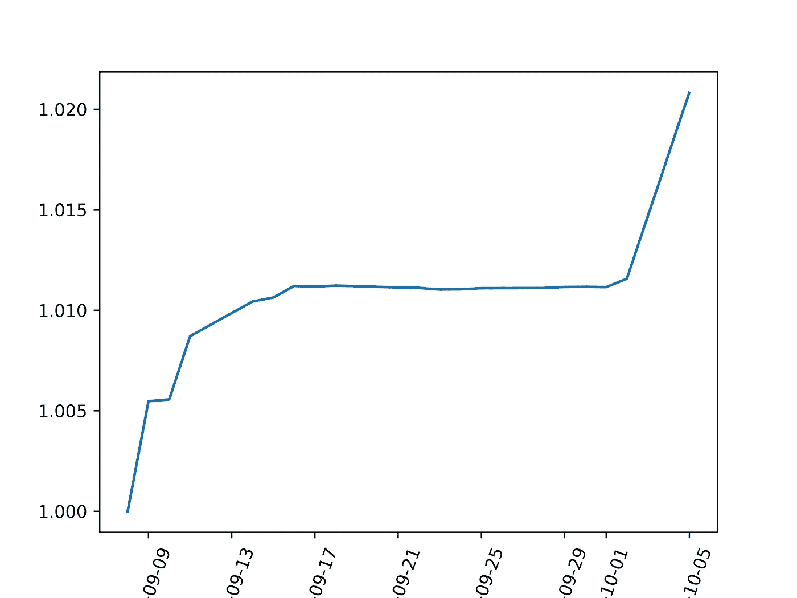
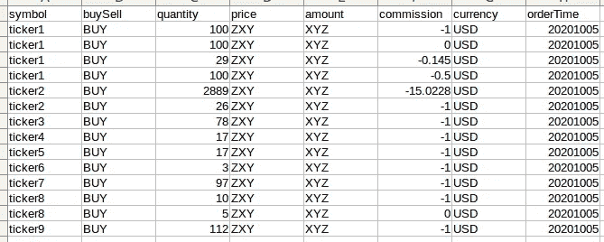
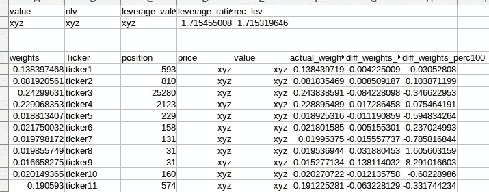
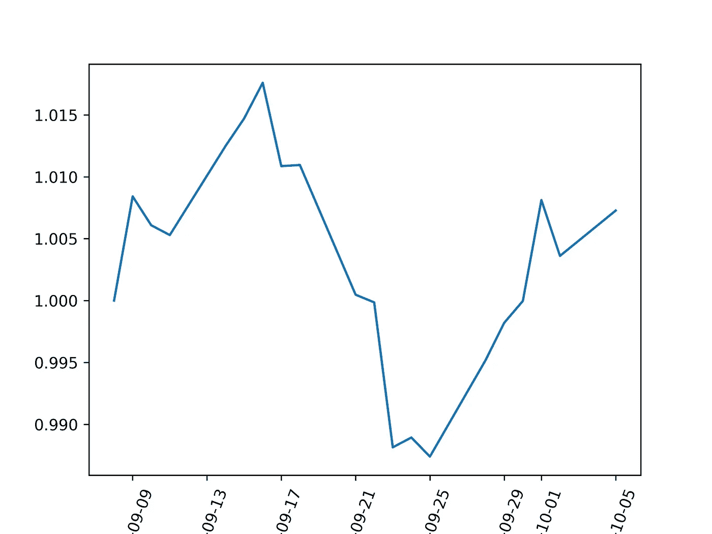
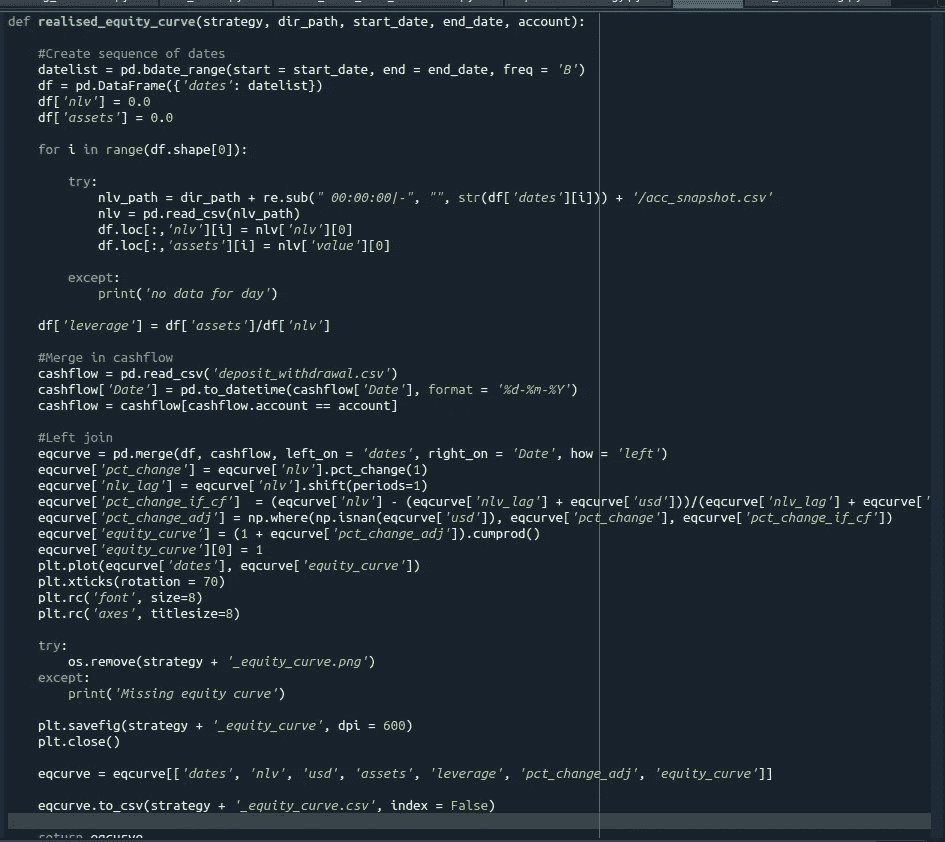

# 在我的全自动算法交易系统中开发性能监控组件(第 1 部分)

> 原文：<https://medium.datadriveninvestor.com/developing-a-performance-monitoring-component-in-my-fully-automated-algorithmic-trading-system-88f5afae05cd?source=collection_archive---------6----------------------->

Equity curve for 1 of my strategies based on returns captured by my algorithmic trading system

根据历史数据对你的信号和预测进行回溯测试是一回事，但就执行而言，这是完全不同的另一回事。我已经在这里写了这个。

建立算法交易系统的另一个重要部分是性能监控。在开发这个组件时，我想到了一些重要的问题，

1.  我如何衡量我的滑点？支付佣金？
2.  我的每日回报率是多少？在考虑账户现金流入和流出的同时，我如何衡量我的策略的绩效？

**我如何衡量我的滑点？**

在这方面，我使用 ib_insync 的 [FlexReport](https://ib-insync.readthedocs.io/_modules/ib_insync/flexreport.html) 函数(使用 REST API)来查询当天的交易。该函数将查询来自交互式代理的 XML 报告，我随后将该报告格式化以用于日常报告。queryId 规范必须通过 IB 网络帐户管理系统进行设置。不幸的是，它每年都会过期，这意味着您必须想办法提醒自己每年手动刷新这个 queryId。

``
##从 IB 查询的代码
report = FlexReport(token，queryId)
` '

然后编写一些简单的代码将我的电子邮件通知的 XML 格式化成下面的格式，

Trades and slippage

我的每日回报率是多少？在考虑账户现金流入和流出的同时，我如何衡量我的策略的绩效？

过去，我会降低绩效监控的优先级，将其放在待办事项的底部，因为我可以很容易地从 IB 查询复杂的绩效数据。你可能会在我的[博客](https://jironghuang.github.io/portfolio/portfolio)中找到一些数据。

然而，我越来越发现，通过工具和策略来理解投资组合表现的表现驱动因素是很重要的。为了在这个粒度级别进行分析，我必须捕捉工具和策略的日/小时级别和回报。

为此，系统会触发一个请求，要求每小时拍摄一次投资组合的会计快照，

Snapshot tables

但是如果有现金的流入和流出呢——你可能会问？我简单地依靠时间加权回报(TWR)公式。

 [## 为什么大多数人在日内交易中亏损(以及如何不成为他们中的一员)|数据驱动的投资者

### 日内交易很难，大多数人都赔钱。我确实有。事实上，我曾经在一个单一的损失更多的钱…

www.datadriveninvestor.com](https://www.datadriveninvestor.com/2020/09/23/why-most-people-lose-money-day-trading-and-how-to-not-be-one-of-them/) 

TWR = [(1+HP1) X…(1+HPN)]-1

*   其中 TWR =时间加权回报率
*   n =子周期的数量
*   HP =(日终值-日初值+现金流)/(初值+现金流)
*   HPN =子期间 n 的回报

*来源:*【https://www.investopedia.com/terms/t/time-weightedror.asp】T2

在投资组合层面，流入和流出是账户的净现金流入。在工具层面，流入和流出将是当天的净买入/卖出交易。您还必须通过整体投资组合杠杆系数缩减规模，将工具资产价值调整为“权益价值”。

您可以在附录中找到在整个投资组合层面衡量时间加权回报的实施方法。

说了这么多，做了这么多，我还能做什么呢？我可以画一些奇特的股票曲线，如下所示，

Fancy equity curve for strategy 1

Fancy equity curve for strategy 2

有了详细的回报流，我还可以测量已实现的滚动波动性，并做一些疯狂的事情(但在我看来不重要)，如 fama-french 3、5 或 gazillion factors 分析。

**我的待办事项中有哪些需要进一步增强的性能监控组件？**

*   执行价格和自适应限价订单的偏差。
*   利用获取的数据系统地理解绩效驱动因素，即按照战略、工具和时间框架将总体投资组合回报分解为加权绩效驱动因素。
*   将数据文件推入关系或非关系数据库。但我会尽可能地限制交易时间内交易系统和数据库之间的交互。过去，我在使用 SQLite 和数据库服务器‘挂起’时观察到了并发性问题，而使用关系数据库如 Mysql。另一种选择是将服务器托管在云中。但这意味着我必须支付额外的费用，并担心连接问题。有时候普通的旧文件就可以了？
*   每天在具有冗余功能的网络连接存储(NAS)中备份参数和数据文件。
*   汇率效应对投资组合绩效的影响。我以前写过并创建了一个知识库。您可以访问[链接](https://github.com/jironghuang/RemoveExchangeRateEffects)了解更多信息。

【2020 年 11 月 10 日更新:如果你喜欢这篇文章，你可能会发现这里的**和这里的***也很有趣！在续集中，我加入了额外的特征，如汇率效应、滚动波动性、提款、各自策略对整体权益曲线的回报贡献。***

****附录****

****

**Time weighted return embedded in function to derive equity curve**

## **访问专家视图— [订阅 DDI 英特尔](https://datadriveninvestor.com/ddi-intel)**