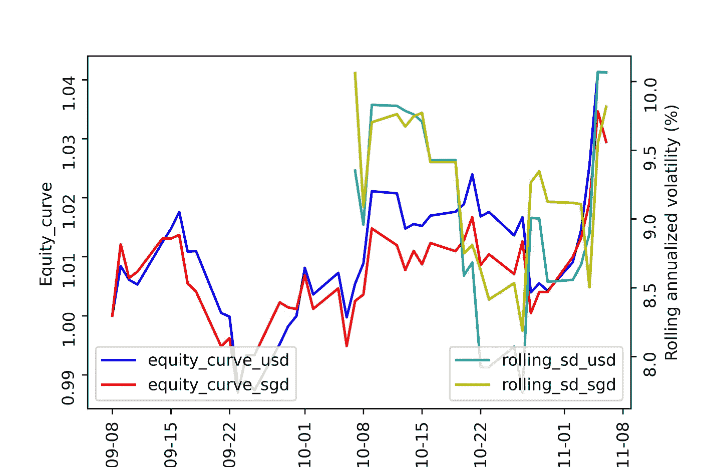
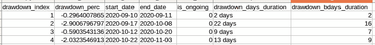

# 在我的全自动算法交易系统中开发性能监控组件(第 2 部分)

> 原文：<https://medium.datadriveninvestor.com/developing-a-performance-monitoring-component-in-my-fully-automated-algorithmic-trading-system-983368441bba?source=collection_archive---------10----------------------->

Equity curve and rolling volatility for 1 of my strategies based on returns captured by my algorithmic trading system

正如管理思想家彼得·德鲁克曾经说过的，“你无法管理你无法衡量的东西”。我试图在生活的不同方面坚持这一哲学——特别是投资组合管理和算法交易领域。

在我之前的[文章](https://medium.com/datadriveninvestor/developing-a-performance-monitoring-component-in-my-fully-automated-algorithmic-trading-system-88f5afae05cd)中，我在我的算法交易/投资组合管理系统中开发了一个最小可行产品(MVP)功能来跟踪以下内容:

*   滑点/佣金
*   每日回报
*   计入账户现金流入和流出后的绩效(时间加权回报)

从那以后，我添加了更多的功能来跟踪这些，

*   汇率的影响
*   滚动波动性——当前战略风险的代表
*   下降表

*全自动算法交易系统的设计与部署在这里***有所说明。**

***汇率的影响***

*我交易/投资的大多数工具都是以美元计价的(尽管基础资产可能是其他货币)。由于美联储在疫情期间大量印钞，从长远来看，美元可能面临下行压力。简单的经济学:在其他条件不变的情况下，增加一个实体的供给会降低其价值。因为我消费的商品和服务大多在新加坡(*真的是这样吗？这可能是另一天的话题*)，了解我的策略相对于我的本币新加坡元的表现至关重要。在图 1 中，您会注意到，当我转换货币时，性能略有下降(红线—新加坡元的权益曲线与蓝线—美元的权益曲线)。*

**

*Fig 1: Equity curve and rolling volatility for 1 of my strategies based on returns captured by my algorithmic trading system*

*潜在的货币对冲(期货、远期、期权等。)可能会被采用，但目前并不重要，因为基础资产在各国都是多样化的。*

*写一些琐碎的代码将我的股票转换回本国货币。*

***滚动波动***

*风险管理有许多学派。我在核心投资组合中坚持的一点是波动率目标的概念。在我写的另一篇[文章](https://medium.com/the-innovation/could-volatility-targeting-increase-risk-adjusted-returns-for-quantitative-strategies-ed9563d5fe5c)中，我发现通过瞄准波动率(一个简单的风险指标)，我能够增加风险调整后的回报、绝对回报，减少负偏差和峰度——从而带来更可预测和一致的回报。*

*在图 1(上一节)所示的策略中，它基于 10%的波动性目标，这意味着随着时间的推移，滚动标准偏差(青色和黄色线)应在 10%的阈值附近徘徊。我们如何解读这一指标？假设一个策略的预期年化回报率为 X%，年标准差为 10%。基于朴素的正态假设，该基金的年化回报率有 68%的可能性在(X-10)%到(X+10)%之间；并且有 95%的几率基金的回报会在(X-20)%到(X+20)%之间。你可以阅读我以前的[文章](https://medium.com/the-innovation/could-volatility-targeting-increase-risk-adjusted-returns-for-quantitative-strategies-ed9563d5fe5c)，在那里我从第一原理的角度进行了阐述。*

***我有不以波动性为目标的尾部风险策略，因为我更喜欢设计一个爆炸性对冲，以抵消我只做多的投资组合中固有的回报负偏度。**

***提款***

*根据行为经济学家丹尼尔·卡内曼和阿莫斯特·特沃斯利发展的前景理论，个人以不对称的方式评估他们的损失和收益，即从效用的角度来看，损失大于收益。*

*因此，重要的是( *&在一定程度上对灵魂和精神有好处*)了解你的策略的消耗，也就是你会损失多少，以及你会陷在困境中多久。*

*提取公式如下:*

*压降=(谷值-峰值)/峰值*

**

*不幸的是，我不得不写一些复杂的代码来创建上面的下降表。我可能会找些时间来重构它，弄清楚这是否可以用矢量化的方式编写(而不是使用 for 循环——恐怖！)*

***我的待办事项中有哪些需要进一步增强的性能监控组件？***

*   *执行价格和自适应限价订单的偏差。*
*   *利用获取的数据系统地理解绩效驱动因素，即按照战略、工具和时间框架将总体投资组合回报分解为加权绩效驱动因素。*
*   *获取均值-方差、风险-平价、布莱克-里特曼解决方案的策略之间的相关性/协方差矩阵*

**2020 年 11 月 16 日更新:如果你喜欢这篇文章，你可能会发现这里***的“续集”也很有趣！在后续文章中，我加入了额外的特性来衡量各个策略对整体投资组合表现的回报贡献。***