# 开发声波滚球虚拟现实游戏

> 原文：<https://medium.datadriveninvestor.com/developing-the-sonic-roll-a-ball-vr-game-e5de84364239?source=collection_archive---------31----------------------->

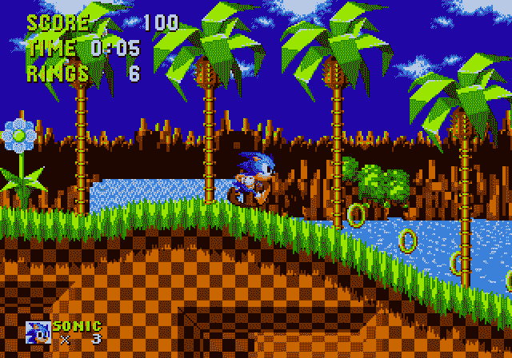

The original Sonic the Hedgehog video game.

我们都可能听说过深蓝色的刺猬，它有以音速奔跑的能力(我知道，相当疯狂)。这家伙叫索尼克，是世嘉创作的日本电子游戏系列《刺猬索尼克》中的一个角色。游戏很简单，你控制索尼克的部分动作，并在最短的时间内收集尽可能多的戒指。这个角色和概念是成功的，通过电视连续剧改编、短片动画、粉丝艺术和电影，它的知名度增加了。上面也有 fangames，所以为了更多地了解虚拟现实(VR)，一种由计算机生成的 3D 环境，允许用户与模拟现实进行交互，我复制了一个。

A video demo of Sonic Roll-A-Ball

体验很简单，玩家必须通过虚拟环境的障碍课程，如溜冰鞋，岩石，灌木丛和平台来收集所有的戒指。一旦收集到所有 20 枚戒指，他们就赢得了游戏。

# 游戏的组成部分

创建这个游戏的两个主要部分是使用 Unity VR 游戏引擎和编写 C#代码脚本，以使游戏机制正常运行。

## 虚拟景观和障碍

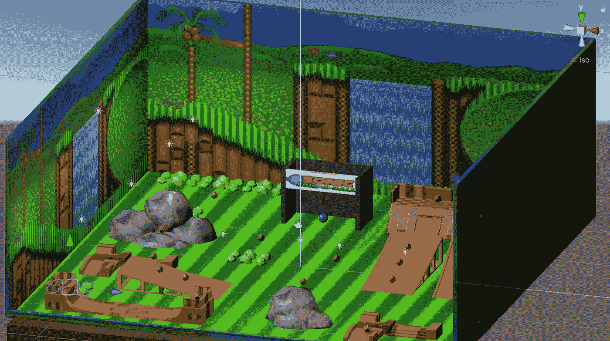

The virtual landscape

游戏环境是低聚的，有分散的灯光、石头、溜冰鞋和灌木丛。我从一个平面开始，创建了三个三维立方体对象，并缩放到墙壁中。为了应用数字背景和地板颜色图案，我将颜色图案的图像拖到材质的基本贴图上，并将材质放在 3D 对象上。

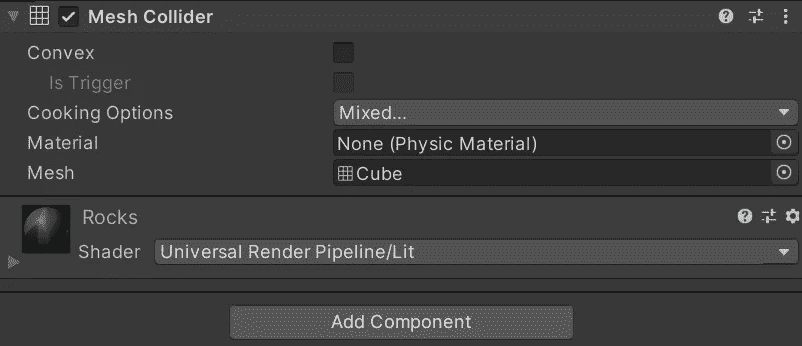

An inspector view of the mesh collider component applied to a rock mesh

对于障碍物，我从免费的在线 3D 模型数据库中导入了网格下载，这是一组相连的形状。然后，我给它们都添加了一个网格碰撞组件，以确保玩家稍后可以与障碍物碰撞，否则，它会直接穿过物体。一旦障碍物被缩放并放置在平面上，我就给它们涂上颜色。

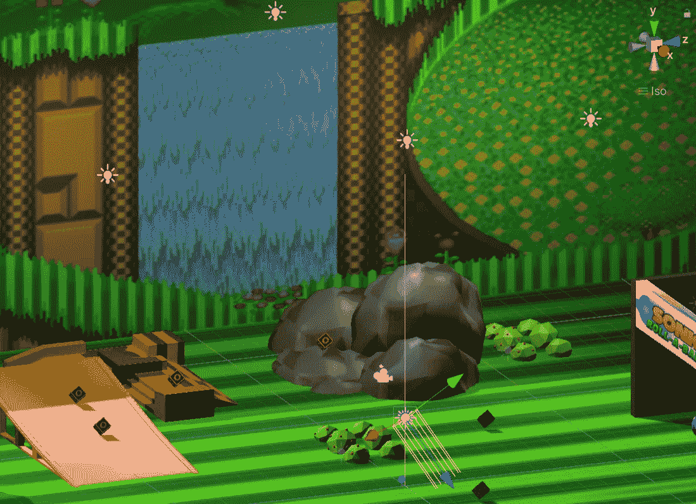

Floating light bulbs indicate the directional lights placed.

最后，为了完成这个环境，我必须确保用户在运行游戏时能真正看到他们周围的东西，所以我在游戏地图周围放置了浮动的方向灯。

## 扮演声音角色

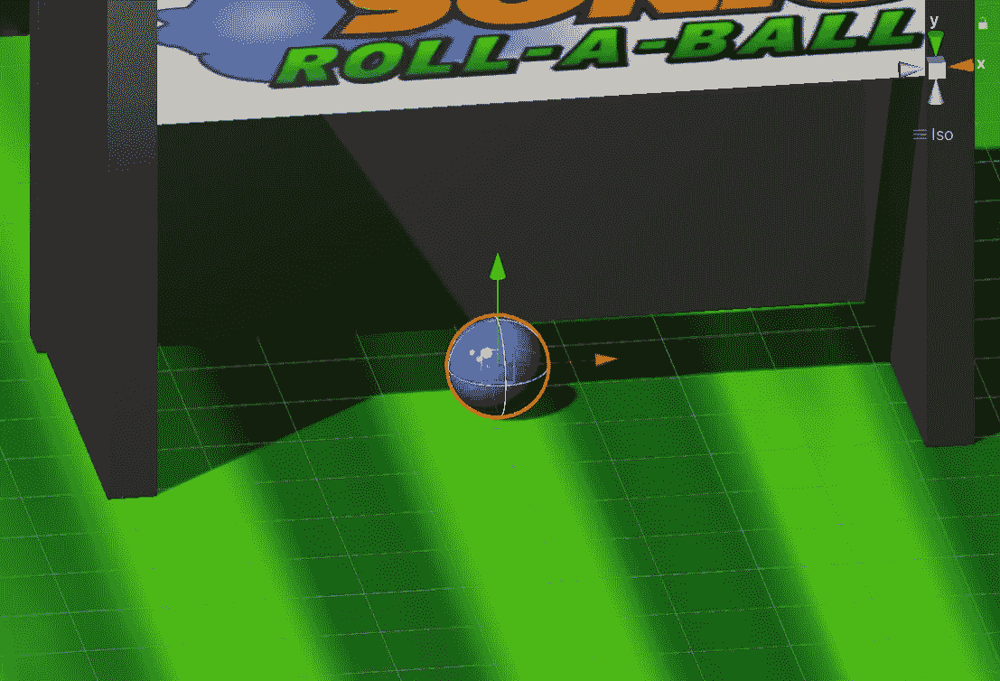

Sonic ball player

我创建了一个刚体球体作为滚动球的声音角色，并在其上附着了一种深蓝色的材料(刚体是指物体的运动遵循 Unity 的物理系统)。角色必须能够根据输入移动(现在是键盘箭头)并与周围环境碰撞。在游戏中构建玩家是最困难的部分之一，因为要做到这一点，我必须为 Unity 编写一个 C#脚本来理解我到底想要玩家做什么。

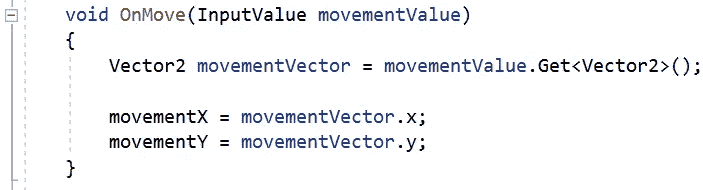

An OnMove function declaration

我向 Unity 导入了一个输入包，然后在球体上附加了一个播放器输入组件。这里，void 意味着代码不需要返回任何值，InputValue 和 movementValue 让 Unity 知道被引用的值的类型，在本例中:用户输入键盘箭头在地图上移动玩家。变量 movementX 和 movementY 是当按下箭头键时施加给玩家的力。

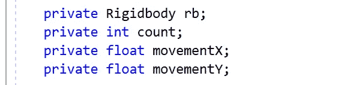

Listed variables used

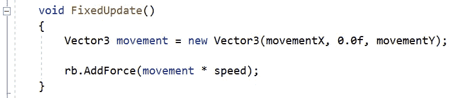

Applying force to the player object (Sonic)

然后使用 rb.AddForce 将力施加到刚体玩家对象，以允许它在物理系统下移动。我还制作了一个速度变量，并将其乘以运动，以便我在 Unity inspector 中编辑音速有多快。

## 创建主摄像机

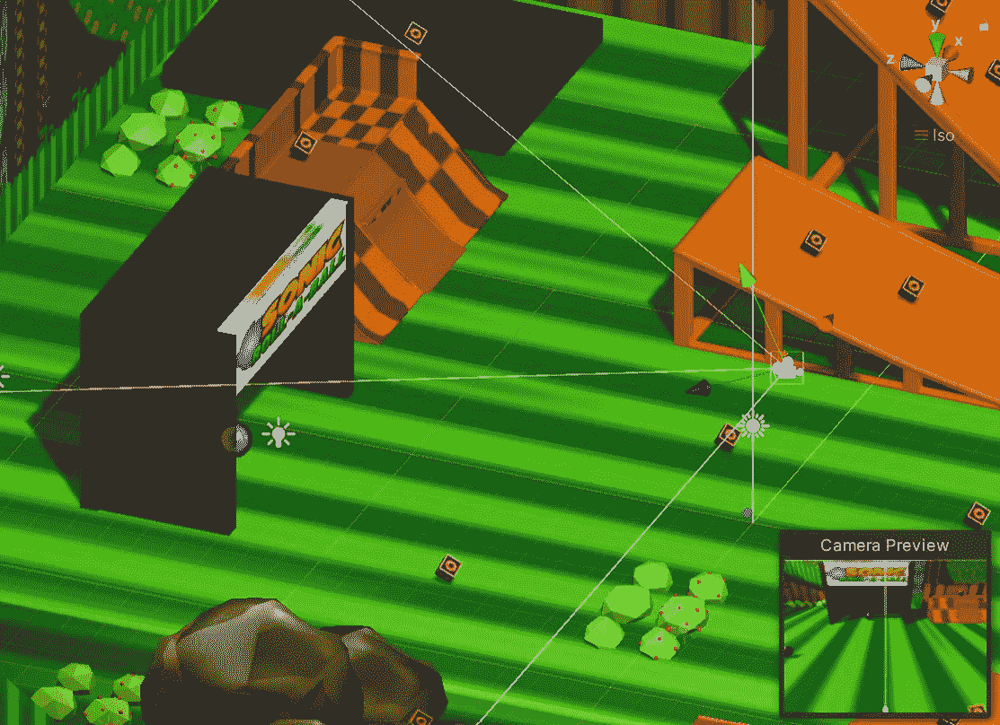

The main camera facing the player

放置摄像头是一项简单的任务，它默认带有新创建的 Unity 项目，所以我所要做的就是通过检查器定位它，以确保用户可以很好地查看播放器环境。然而，我需要使摄像机保持在一个高度，并与玩家保持一定的距离。

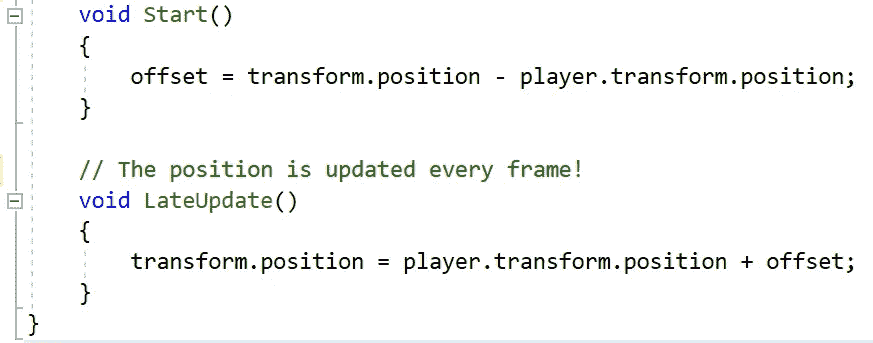

A part of the CameraController script

为此，我必须创建一个 CameraController 脚本，并通过查找两者之间的差异，从 start 函数中计算出相机位置和玩家游戏对象位置的偏移量。通过在 LateUpdate 下向玩家变换位置添加偏移量，我可以确保相机对象根据玩家游戏对象的移动向前或向后移动。然后将玩家刚体对象附加到 Unity inspector 中的 CameraController 脚本，以便它可以引用玩家游戏对象。

## **创建有组织的环**

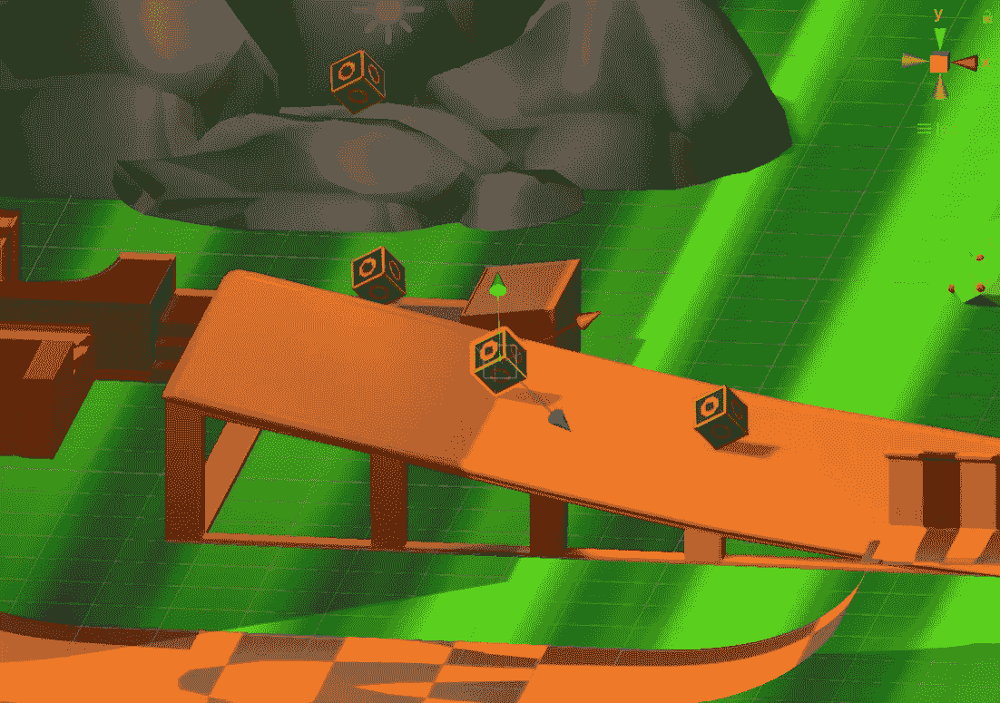

The rings

环是简单旋转的小立方体游戏对象，其上应用了环图像基础贴图材质。棘手的部分是让它们旋转并突出来。我还把所有的环都做成一个预制体，以保持它们的组织性和连贯性。

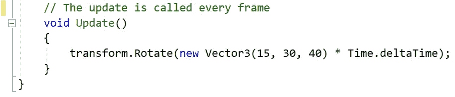

A part of the Rotator script

为了旋转圆环，我创建了一个旋转脚本并使用了一个变换。旋转函数引用变换旋转组件。将 deltaTime 附加到 Time 还可以确保运动顺利进行，因为它是一个浮点数，表示自前一帧更新以来的秒数差异。

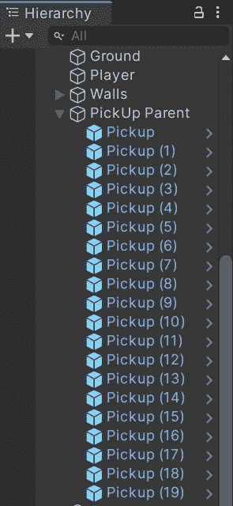

All hierarchy objects in blue are prefabs

接下来，为了在地图周围放置多个环，我将它制作成一个预设，并将原始环复制到 19 个其他环中(预设是一个游戏对象家庭的蓝图)。这意味着如果我对一个预设的戒指做了改动，它会更新该预设下所有其他戒指的改动。

 [## 技术成瘾-是真的吗？数据驱动的投资者

### 通知铃声响起。你很想检查一下。你拿起手机检查了一下。“哇...再来一个喜欢的…

www.datadriveninvestor.com](https://www.datadriveninvestor.com/2020/12/16/technology-addiction-is-it-real/) 

## 碰撞和使戒指具有收藏价值

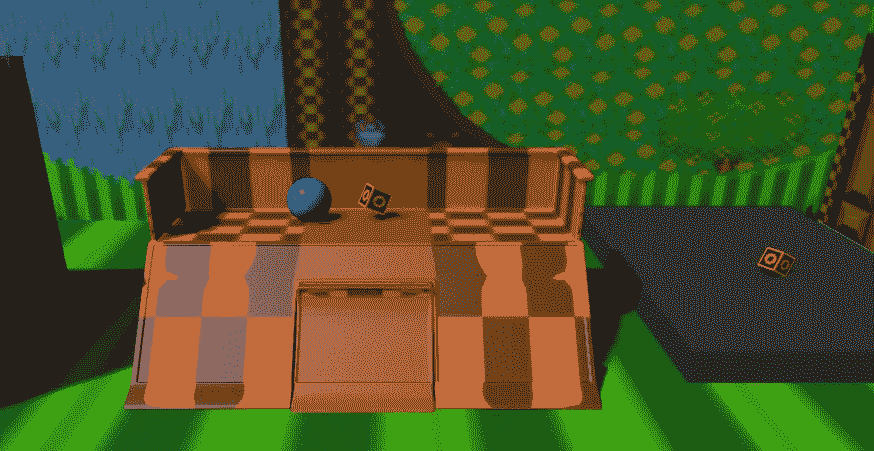

Sonic and a collectible ring

作为游戏的一部分，索尼克必须收集戒指，我需要确保他不会去收集墙壁或地平面。我使用了 Unity 的内置标记系统，并标记了原始戒指的预设(拾取)，这也将这一更改应用到预设中的所有其他戒指。

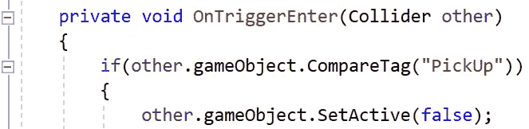

Code for deactivating an object if Sonic collides with a ring (PickUp)

在脚本中，我使用了一个条件语句，所以一个游戏对象只有在被标记为“拾取”并与玩家游戏对象冲突时才会被停用。

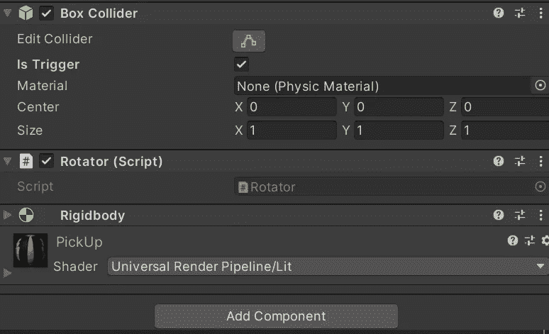

Notice that under the box collider component, “Is Trigger” is checked. The script rotator script is also attached to the collectible ring.

我还必须调整环形预设组件，使它成为一个触发器，这样对象就可以重叠它，当玩家游戏对象与它碰撞时，它就会消失。此外，我添加了一个刚体组件到拾取环预设，并使其运动(一个对象，不会对 Unity 物理力作出反应，但可以通过变换进行动画和移动)。这些戒指现在可以收藏了！但是如果用户没有获得一些分数，收集它们就没有意义。

## 显示乐谱和文本

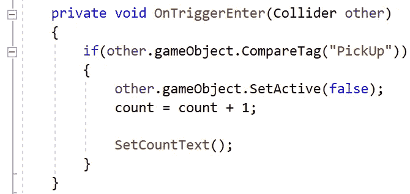

Storing the count of collected rings in the PlayerController script

在创建了一个私有 count 变量并在 PlayerController 脚本中将计数设置为 0 之后，我添加了上面显示的几行代码，以便随着玩家碰撞更多的环而增加计数。然后，我在层次结构中添加了一个 Canvas 用户界面和 TextMeshPro(Canvas 所必需的),它允许我向用户显示收集到的环数。

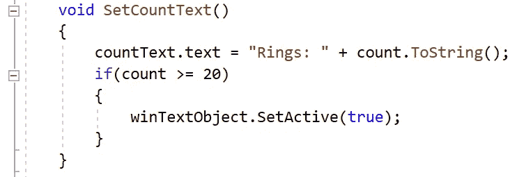

Displaying the count of collected rings in the PlayerController script

上面的代码指示 Unity 显示文本“戒指:”以及玩家收集的戒指数量。然后我在 Canvas 下添加了另一个 TextMeshPro，显示“恭喜！你赢了！”当玩家收集到所有 20 枚戒指时！

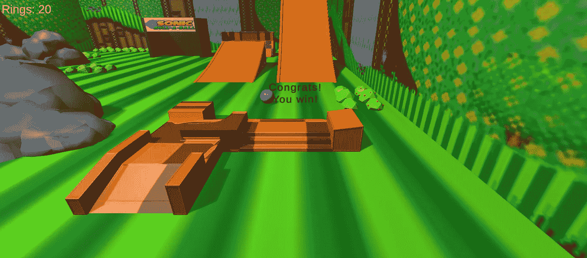

End-of-game display

# 改变现状

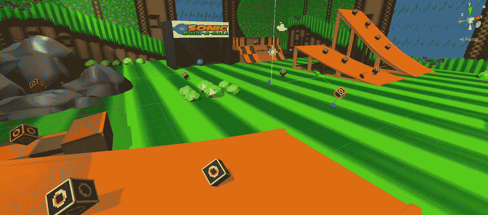

这是我的第一个虚拟现实游戏，我不得不说，Unity 在开始的时候看起来非常复杂，但我不能断定开发一个虚拟现实游戏是困难的，因为我甚至没有尝试过。下次我可能会尝试第一人称虚拟现实，我可能会切换它，让玩家保持静止，但他们可以通过主摄像头移动他们的视角。增强现实游戏也在雷达上！很多关于虚拟和增强现实的东西对我来说仍然很陌生，所以我会改变现在的情况，继续动手项目，学习这个行业的技能。

感谢阅读！欢迎任何反馈、掌声或评论。如果你觉得内容很有趣，请在 Medium 上关注我！请随时通过电子邮件([Jolie837837@gmail.com](mailto:Jolie837837@gmail.com))和 [LinkedIn](http://linkedin.com/in/jolie-li-7bb5b21b6) 与我联系！

**访问专家视图—** [**订阅 DDI 英特尔**](https://datadriveninvestor.com/ddi-intel)