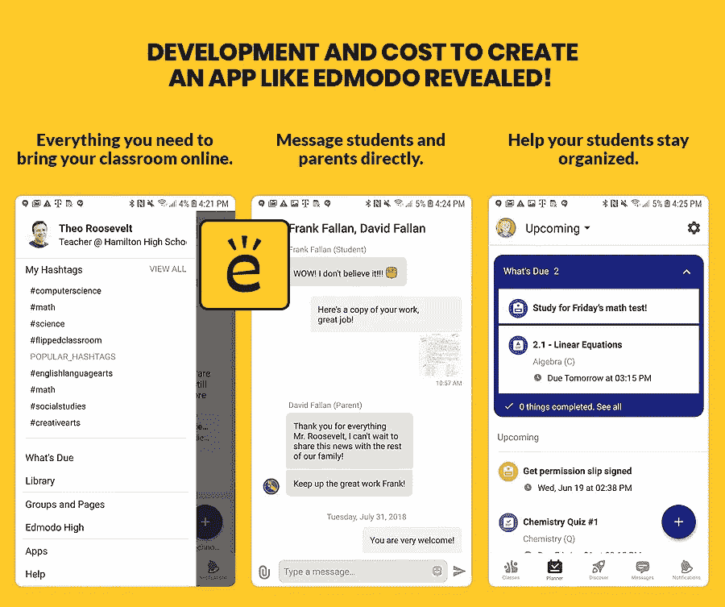

# 开发和成本，以创建一个像埃德蒙多透露的应用程序！

> 原文：<https://medium.datadriveninvestor.com/development-and-cost-to-create-an-app-like-edmodo-revealed-d03f55d24ffa?source=collection_archive---------37----------------------->

技术在学习和技术领域不断发展。在数字时代之前，局限于实物、讲座和谈话的会议和课程也不再遵循传统的轨迹。

为什么不呢？

因为迪拜 和世界各地的先行者 [**应用程序开发公司已经为教师和学生提供了一个新的数字工具箱——从移动应用程序到虚拟学习系统，再到在线课程也包括在内。**](https://www.xicom.ae/services/mobile-app-development/)

在这篇博客中，我们将阐述如何开发像 Edmodo 这样的应用程序，为什么它们对于今天的学习环境和开发应用程序的成本分析是必不可少的。

# 2020 年的学习环境为数字化学习系统做好准备了吗？

是这样的-

预测显示，到 2022 年，全球电子学习市场预计将超过 2430 亿美元。

令人惊讶的是，在线学习能够收集数据，以确定每个学生的优势和劣势。考虑到这一点，平台可以定制它的方法，使学习过程变得愉快和轻松。这最终使得全球相当一部分教师表示愿意支持不那么传统的、更加数字化的教育模式。

感兴趣吗？我打赌你是。

让我们再深入一点。

早期的教育系统非常简单；孩子们坐在教室里，老师在主导这个过程。但是，这个新的十年从第一天开始就动荡不安。随着半个世界被隔离，边境关闭，我们都在练习社交距离，将我们的联系减少到最低限度。

显然，这对教育和学校产生了持久的影响。

现在，就连互联网上也充斥着关于当你在保持社交距离时该怎么做的建议。大多数时候，它包括一个阅读、玩耍或观看的清单。这很好，但时间在流逝，世界也是如此。

我们需要食物来吃，需要钱来生活，我们的年轻人需要学习。

这就是数字学习系统发挥作用的地方。

这不是什么新鲜事！

电子学习方法的激增，归功于互联网，让迪拜的 [**、阿联酋的**](https://www.xicom.ae/services/mobile-app-development/) 和世界各地的应用程序开发者将教育和学习的范围扩展到了四面墙之外。

虽然“电子学习”一词最早出现于 1999 年，但其背后的目标有着良好的历史。

这是描述数字化学习开始的简要时间表。

1840 年的今天，伊萨克·皮特曼通过函授教他的学生速记。

1924 年的今天，第一台允许学生自我测试的测试机器被发现。

1954 年的今天，哈佛大学教授 BF·斯金纳发明了“教学机器”,这使得学校可以对学生进行程序化的指导。

1960 年的今天，俗称“冥王星”的第一个基于计算机的程序逻辑被介绍给全世界用于自动化教学操作。

1970 年-电子学习开始了变得更加互动的旅程。

20 世纪末——20 世纪 80 年代的第一台 MAC 电脑使个人能够在家中拥有台式机，使电子学习变得更加容易。而在 20 世纪 90 年代，人们能够不受人口和时间的限制而参加。

21 世纪早期——企业也开始使用电子学习来培训员工。说得对——“手机极大地包含了学习能力”。

因此，这是一个数百万人选择在线学习的数字时代。有些人把工作和学习结合在一起，而有些父母认为他们的孩子在学校会过得更好。

此外，一些公司有自己的员工学习系统，让经验丰富的专家教授新员工并提升他们自己的技能。在线培训已经存在了一段时间，但随着技术的进步，每个人都选择使用它。

简单来说，现在是投资一个移动学习应用程序或像 Edmodo 这样的在线学习管理系统的正确时机。

先说艾德莫多。

# 什么是 Edmodo？

Edmodo 最初是一家位于加利福尼亚州的技术教育公司，通过其平台为 K-12 学生和教师提供辅导、交流和协作。

此外，他们的网络允许教师在线发布课程、作业、谜题和测验等，同时还允许教师、家长和学生之间的无缝交流。

Edmodo 于 2008 年由 Jeff O'Hara、Nick Borg 和 Crystal Hutter 成立。自那以后，该公司获得了来自 Learn Capital、New Enterprises Associates、Index Ventures、Union square ventures、Greylock Partners、Benchmarks 和其他许多公司的资金。自成立以来，该公司在短时间内获得了巨大的人气，截至 2019 年 7 月，该公司声称已经突破了 1 亿用户的里程碑。

尽管这款应用主要在美国地区流行，拥有超过 5000 万用户，但也有 180 个国家的教师和学生在使用。其他大国如新加坡、意大利、印度尼西亚、乌拉圭也在名单中。

Edmodo 令人兴奋的是，只有 10%的用户是教师，这清楚地表明了该应用程序在儿童中的受欢迎程度。

令人惊讶的是，Edmodo 在 2013 年被《PC Magazine》评为“教师最佳应用”之一。在这一年中，他们占领了 Root-1，打算用于教育的应用程序商店。第二年

第二年，他们发布了 Snapshot，这是一套用来衡量学生相对于教育标准的进步的工具。Edmodo 于 2018 年 4 月被网龙以 1.375 亿美元收购。

现在，让我们展示一下 Edmodo 的商业模式。

# Edmodo 的商业模式

不同的学习方法

作为一家为教师、学生和家长运营在线社交学习平台的教育公司，该公司专注于使学习成为一个更高效、有趣和透明的过程。这个平台使导师能够轻松协作，共享资源，寻找经验和想法，并与家长互动。

它还允许教师和家长更准确地监控学生的进步，并找到适合的教学方法。除了提供一个在线平台，该公司还为教育工作者提供一系列精致的培训和专业发展课程，以便他们能够更有效地利用 Edmodo 技术。

为了让你的学习应用成为 Edmodo 主导领域的瓶颈竞争，请务必要求你在迪拜的合作伙伴应用开发者嵌入一种独特的学习方法。

就像 Edmodo 与合作伙伴网络合作，通过原生应用程序构建额外的功能一样，这也是您的应用程序获得额外荣誉的一种方式。

## 价值主张

Edmodo 最独特的价值主张是，它使创建课程内容、测试作业和监控学生进度的过程对教师和学校来说都是一种更直接、更省时和更容易使用的方式。该平台使学习过程变得透明，教师能够推断出什么样的教学方法对学生的学习最有效，同时，家长也能监督孩子的进步和表现。

该服务免费使用，通常可通过互联网浏览器、手机和平板电脑应用程序获得，允许教师、家长和学生随时随地在直观的学习环境中与各自的导师互动。该公司还为教师提供持续的支持、培训项目和资源。

因此，如果你有心情向你的目标受众提供一个无与伦比的价值主张，那么一定要与最好的 [**移动应用程序开发公司**](https://www.xicom.ae/services/mobile-app-development/) 合作。

## 重要的合作伙伴

在阿联酋迪拜，为了让你的应用取得巨大成功，你必须与领先的应用开发服务提供商合作。同样，Edmodo 也与科技公司、教育机构、内容出版商和认证营销商合作。该公司与微软建立了战略合作伙伴关系，向用户介绍 office 365 云软件，并与剑桥大学出版社合作，整合了重新布线的线性 GCSE 资格考试的最新内容。

此外，Edmodo 还与牛津大学出版社、可汗学院、LearnZillion 和宋全球教育(Song Global Education)建立了内容合作关系，后者是首家提供日语内容的合作伙伴。在墨西哥，Edmodo 与墨西哥最著名的教师工会 SINADEP-SNTE 合作，集中成员之间的沟通和协作。

早在 2012 年，Edmodo 就推出了其 API，并与一系列开发人员合作开发第三方应用程序，以增强 Edmodo 平台的功能。此外，该公司与品牌和渠道合作伙伴合作，以扩大其营销范围，并产生新的客户群。

## 客户细分

Edmodo 专注于帮助教师，帮助他们协作、共享资源、关注学生的进步，同时从一个地方使用交互式教学工具。由于其独特的性质，Edmodo 平台是全球 30 多万所学校的首选。

早些时候，该公司的主要目标市场是美国，它在那里提供 K-12 学校中领先的社会教育平台。除了美国以外，埃德蒙多最大的市场是澳大利亚、墨西哥、哥伦比亚和加拿大。除了满足教师的需求，Edmodo 还致力于向学生和家长伸出援手。学生可以参加许多在线活动，并参加许多互动会议和测试。与此同时，家长可以记录孩子的学校活动、成绩和参与学校活动的情况。

## 特色频道

为了更容易接触到有经验的移动应用程序开发公司，该平台兼容网站和移动设备。此外，该公司还拥有适用于 iOS 和 Android 的移动和平板应用。

## 关键资源

Edmodo 的关键资源是它自己的平台，它的战略和内容合作伙伴关系，以及它与人员和用户社区的基础设施。美国专利商标局的记录搜索没有发现 Edmodo 名下的专利申请。

## 客户关系

对于一个应用的成功来说，客户关系是不可否认的。然而，Edmodo 平台是自助式的，学生、教师和家长可以通过 Edmodo 主页免费注册。学生需要一个由老师提供的分组代码来注册，而家长需要为他们的孩子准备一个唯一的家长代码。

注册后，用户可以自动使用该平台，无需与 Edmodo 代表互动。

由于该平台的内容是社区驱动的，导师、学生和家长都有动力进行互动和合作。令人惊讶的是，Edmodo 不仅通过社区支持网络和直接互动，还通过自己的帮助中心为用户提供支持，其中包括用户教程、常见问题解答和故障排除手册。该公司还通过博客、时事通讯和活动以及社交媒体账户与用户群体互动。

## 收入年表

构建好应用后，下一个困扰你的问题是“收入流”。

要决定你的应用收入流，请确保了解 Edmodo 收入年表。它以免费增值模式运营，提供免费的社交学习平台，用户可以选择支付额外的功能和服务。该公司有三个核心收入来源:

*   应用市场
*   培训和专业发展服务
*   高级快照服务。

为了更好的理解，我们再深入一点。

Edmodo 提供一系列在线和现场培训解决方案，包括为期一天的现场 Edmodo 部署计划，每组 25 名教师的费用为 2，500 美元，以及为期六周的在线 Edmodo 行动课程，费用为 7，500 美元。该公司还提供四小时的认证课程，可以与当地销售代表进一步协商。

Edmodo 的高级快照服务使教师能够更准确地跟踪学生的进步，每所学校每年的进步从 1275 美元到 2000 美元不等。此外，Edmodo marketplace 提供大约 600 个第三方教育应用程序，有些是免费的，有些是付费的。各种价位的高级应用程序可以由教师根据每个教室的年度订阅进行许可。

或许，现在你已经对你的应用的收入流有了清晰的了解。

# 最后，“成本结构”

要承诺像 Edmodo 这样的教育学习 app 的确切开发成本，乍一看就像是大海捞针。

对吗？

然而，为了让您全面了解开发成本，迪拜**移动应用开发的专家建议承担与其在线平台、IT 基础设施、员工保留和合作伙伴管理相关的开发和维护费用。**

总而言之，要创建一个像 Edmodo 这样致力于社交网络概念的应用程序，并以一种适合学习的方式将其应用于课堂，相关成本从**25-49 美元/小时**不等。

在记下你的应用程序开发要点的同时，不要忘记让它不受欺负。像在 Edmodo，发生的一切老师和家长都一清二楚。因此，没有任何学生张贴任何不适当的内容或学生欺负其他学生的方式。事实上，这是一个分享想法、获得帮助以及师生交流的平台。

因此，请你的 [**应用程序开发公司**](https://www.xicom.ae/services/mobile-app-development/) 在你的应用程序中集成这样一个功能，这使它成为每个人的首选，并为所有人提供免费的安全学习网络。

最后… 最重要的是创建一个平台，为教师提供独特的工具来创建课程。

此外，为了让这一点在教育领域尽快成为现实，Xicom 拥有业经验证的专业知识，能够在课堂中实现数字化转型。许多初创公司和企业家认为，由于开销的原因，从纸质文件转向数字文件需要付出大量努力。尽管如此，在迪拜有合适的应用程序开发人员，这可以在最短的时间内完成。

你在想如何？

很简单，从你的 [**免费项目评估**](https://www.xicom.ae/services/mobile-app-development/) 开始，看看 Xicom 如何作为一个真正的催化剂来创建你的内容更好的应用。他们确保减少文书工作和评估，增加应用程序中的实际学习对象，使学习互动，让你的应用程序获得巨大成功。

请拨打 **+971.529144795** ，为创建在线头脑风暴工具和向专家学习寻找答案。

*原载于 2020 年 8 月 17 日*[*https://www . xicom . AE*](https://www.xicom.ae/blog/development-and-cost-to-create-an-app-like-edmodo-revealed/)*。*