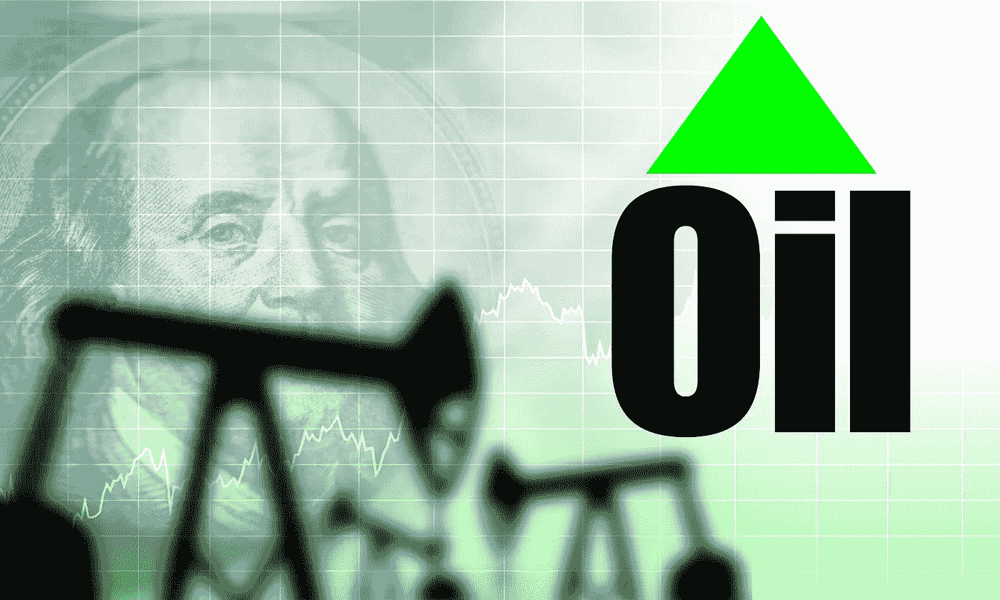
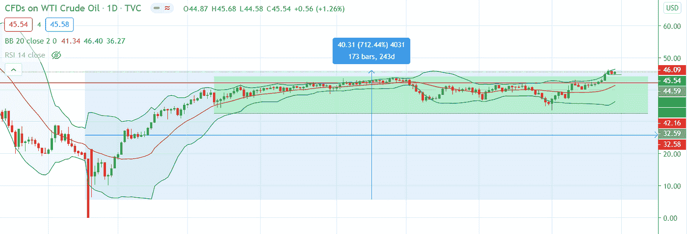
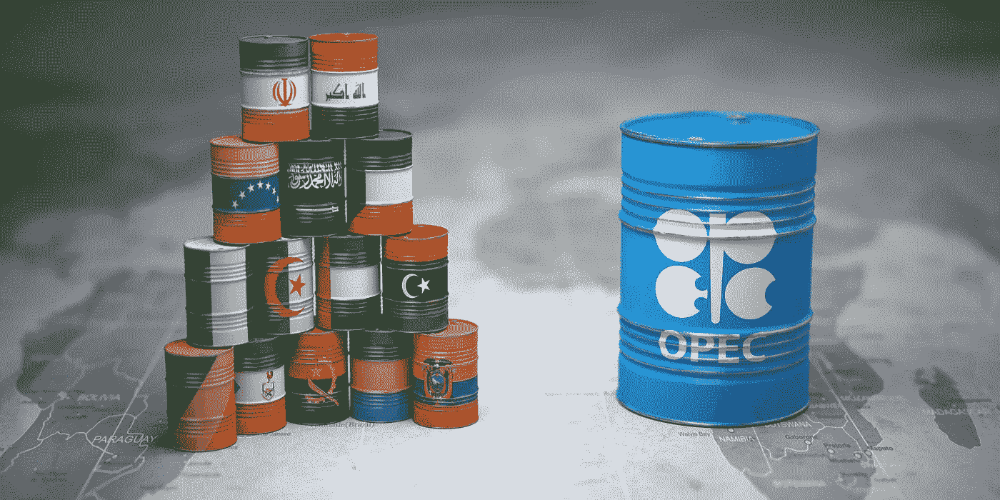

# 2020 年石油市场的发展

> 原文：<https://medium.datadriveninvestor.com/development-of-the-oil-market-in-2020-6629abf2103d?source=collection_archive---------37----------------------->

最近，在乐观的疫苗消息后，原油价格连续 4 周上涨。拜登的胜利也支撑了股市的上涨，人们希望他将很快宣布一项大规模的财政刺激计划，以支撑对石油的需求。

# 石油市场的发展

在 2020 年第一季度，原油价格暴跌，原因是新冠肺炎削弱了世界范围内的能源需求，在产量达到新高的时候，需求受到了多年来最大的打击。2020 年 3 月，油价达到 2002 年以来的最低水平，因为主要经济体的旅行限制和封锁消除了每天数百万桶的全球石油需求。

**(4 月 20 日—6 月 20 日)**第二季度初，在欧佩克+集团于 4 月初同意历史性减产后，油价开始回升。减产从 2020 年 5 月 1 日开始，最初为期两个月，到 2020 年 6 月 30 日结束。石油输出国组织得到了伊拉克和哈萨克斯坦的额外支持，两国同意进一步遵守欧佩克+国家达成的进一步削减供应的协议。

**(7 月 20 日—9 月 20 日)**在第三季度，随着一些欧洲和亚洲国家以及美国几个州开始放松冠状病毒封锁措施，石油价格稳定交易，因为人们希望汽车交通和燃料需求能够恢复。

**(10 月 20 日至今)**进入年底，油价从前一个月的低点反弹，飙升至 8 个月，人们希望，一旦新疫苗开始在世界各地分发，全球石油需求将在未来几个月逐步增加。与此同时，在 10 月份，在某些国家被迫恢复封锁措施和负面的《2020 年世界能源展望》报告后，原油价格面临一些下行压力。

以下是今年迄今为止石油市场面临的主要障碍

*   冠状病毒病例及其对全球经济复苏的影响。
*   沙特阿拉伯和俄罗斯之间的石油价格战。
*   由于美国原油库存不稳定，供应过剩的担忧。
*   美国和欧洲重新实施封锁限制。

乔·拜登的总统任期会是石油市场的另一个挑战吗？

一些市场参与者仍然认为，当选总统拜登将加强对石油行业的监管，他可能会停止发放联邦土地和水域的钻井许可证，这将使美国石油产量到 2025 年减少多达 200 万桶/日。从积极的方面来看，对大规模冠状病毒救援计划的希望以及与中国的贸易关系可能是拜登当选总统可能对短期需求产生积极影响的其他原因。

**WTI 原油技术展望**

从技术上看，本月美国原油价格的整体势头仍然看涨。短期来看，如果看涨势头持续下去，下一个上行水平看 46 美元和 48 美元。另一方面，第一个直接支撑可以在 43.80 美元找到，然后是 43 美元。从长期来看，观察周收盘高于 50 美元或低于 40 美元的区域，这将给出长期方向的更大确认。

**结论**

> *考虑到最近的看涨举措，石油投资者将密切关注乔·拜登即将采取的行动，因为他的目标是应对气候变化和支持可再生能源的发展。未来几周，我们预计美元走软、积极的疫苗乐观情绪以及需求和供应基本面的改善将继续支撑石油市场。本周，投资者还期待着石油输出国组织会议的最新进展。据路透社报道，为期两天的石油输出国组织会议推迟到了 12 月 3 日。会议原定于 12 月 1 日举行。*