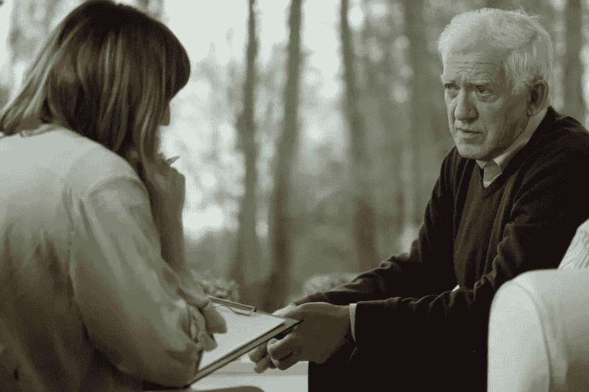
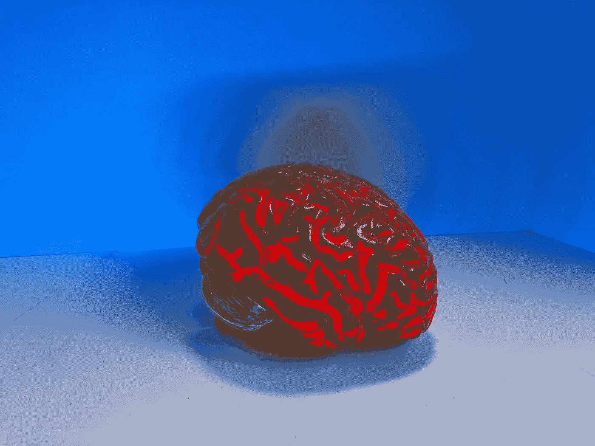

# 计算机时代痴呆症的诊断和治疗

> 原文：<https://medium.datadriveninvestor.com/diagnosing-and-treating-dementia-in-the-age-of-computers-3767623674d7?source=collection_archive---------17----------------------->

## 一个夹在现实和幻觉之间的病人如何通过计算机接受适当的治疗或评估？

Photo by [Rad Cyrus](https://unsplash.com/@radcyrus?utm_source=unsplash&utm_medium=referral&utm_content=creditCopyText)

> 我讨厌这样说，但是，“为什么是我？”“为什么是我得了痴呆症，”—帕特·苏米特

ementia 是一个狡猾的小偷，它偷走了我们的记忆、我们的个性和我们所爱的人的认可，直到最后，它夺走了我们的生命。尤其是 T2 的老年痴呆症(T3)(SDAT)，这种老化的疾病无法治愈，无法预防，也没有疫苗来治疗它。

阿尔茨海默氏症是一种机会均等的疾病，有权有势的富人和那些不太幸运的人都会患上。引用传奇女子篮球教练[帕特·苏米特](https://en.wikipedia.org/wiki/Pat_Summitt)的话很恰当，因为任何患有这种疾病的人都会问自己为什么会得这种病。

他们做了什么还是没做什么？这个问题让他们以及那些爱他们和关心他们的人感到烦恼。目前，没有人能确定为什么有些人会得老年痴呆症，而有些人不会。

我想起了我母校的一位敬爱的教授，他是数学天才，编写了全世界通用的统计学教科书。

他退休了，搬走了，渐渐地痴呆开始带走他美好的，有逻辑的，开朗的个性。我收到的一封电子邮件告诉我有些不对劲，因为措辞不典型，我以前见过。

一位女士，前学校管理人员，和她的助手一起来的，不停地问，“我们现在可以吃午饭了吗？”在我们一起度过的 45 分钟里，她一定问过超过 20 次了。她的助手是一个非常温柔和善解人意的女人，她很幸运有她帮忙去医院和做家务。

> 作为一个国家研究小组的成员，我看到了这种疾病在工业、军事和社会巨头身上的肆虐。看到他们疯狂地寻找简单的单词或说出他们出生的时间和地点，真是令人难过至极。谁会忘记自己的生日？

Copyright: [Katarzyna Białasiewicz](https://www.123rf.com/profile_bialasiewicz)

## 痴呆症评估符合技术

对痴呆症的心理评估是直截了当的，简单的问题，一些纸笔工作或我们所有人在日常生活中做的简单任务。没有错综复杂，每个人都得一分。

每一个寻找阿尔茨海默氏症的关键和如何减少它的临床研究协议都使用一套既定的测试。但是并不是每个人都足够擅长管理测试；那是另一篇文章。医疗保健提供者使用的其他证据来源是什么？

> [目前，诊断](https://undark.org/2019/03/04/artificial-intelligence-ai-alzheimers/)需要广泛的评估，包括患者和家族史、体格检查、一系列实验室和神经心理学测试，以及通过 MRI、CT 或 PET 扫描进行的神经成像。这可能需要几个月的时间，即使这样，也不可能给出明确的诊断。这只能在死后发生，当病理学家通过显微镜观察疾病如何破坏大脑的结构，导致组织退化和萎缩。

测试是艰巨的，对于不理解正在做什么的人来说可能是令人疲惫的，有些人可能会变得偏执，认为他们会被杀死。对于患者、家庭和医疗保健提供者来说，这是一项艰巨的任务。需要更快速的诊断和可能的治疗方案。希望[人工智能能成为每个人都需要的](https://journals.plos.org/ploscompbiol/article?id=10.1371/journal.pcbi.1006376)。

> …机器学习技术的最新进展为提取组合纵向和多模态特征集提供了计算框架。为此，我们使用了多个 AD 数据集，包括 1000 名受试者，纵向随访时间长达 6 年，用于 1)模拟稳定与下降的临床症状轨迹，2)使用基线和一年内随访的数据预测这些轨迹。*到目前为止，在阿尔茨海默病早期诊断的准确性和测试的时间框架方面，结果都很有希望。*

Photo by [Natasha Connell](https://unsplash.com/@natcon773?utm_source=unsplash&utm_medium=referral&utm_content=creditCopyText)

## 老年痴呆症什么时候开始？

目前的观点是，这种疾病在明显症状出现之前很久就开始了。事实上，一些伤害可能在婴儿时期就开始了。进行性脑损伤的来源之一可能是空气污染，尽管其他多种来源，无论是单独还是组合，仍然是潜在的罪魁祸首。

长期以来，铝可能与阿尔茨海默氏症造成的破坏有关的假设现在受到了更多的关注。

发表在《阿尔茨海默氏病杂志》上的一项新研究支持了越来越多的将人类接触铝与阿尔茨海默氏病联系起来的研究。

[研究人员在患有家族性 AD 的捐赠者的脑组织中发现了大量的铝。*该研究还发现了与淀粉样β蛋白的高度共定位，这导致了疾病的早期发作。*](https://www.technologynetworks.com/neuroscience/news/aluminum-exposure-again-linked-to-alzheimers-disease-329670)

在荷兰，一个机器应用程序被成功训练，以区分阿尔茨海默氏症、简单认知衰退和轻度认知障碍。一项[的进一步研究](https://pubmed.ncbi.nlm.nih.gov/28756942/)使用人工智能来分析 [PET 扫描](https://en.wikipedia.org/wiki/Positron_emission_tomography)在阿尔茨海默氏症的任何破坏开始之前很久就检测到了微妙的大脑变化。它的成功率是 84%，这将在控制脑细胞之前提供更多的时间来阻止大脑破坏。

Photo by [National Cancer Institute](https://unsplash.com/@nci?utm_source=unsplash&utm_medium=referral&utm_content=creditCopyText)

## 探索的下一阶段

阿尔茨海默病不是一种同质疾病，而是一种可以有很大差异的疾病。当需要确定适当的治疗方法时，这种差异增加了疾病的不确定性。但是另一种使用人工智能的方法将研究基因的相互作用、神经成像和症状表现。虽然一度被认为是关键，但这种参与更加复杂，可能涉及不同患者的多个基因。

PET 扫描使研究人员能够清楚地描绘出受阿尔茨海默氏症影响最严重的大脑区域，但其成本是限制其使用的一个因素。利用患者体内葡萄糖的标记形式，当患者试图进行认知测试时，很明显大脑的病理部分被照亮了。

几种药物试图减缓这种疾病的发展，如果不能完全阻止或治愈它的话。都取得了很小的成功。我参与的国家临床试验使用了一种最初在 20 世纪初开发的药物。它旨在控制一种分解乙酰胆碱的特殊酶。我们在一些病人身上看到的最多的，是轻微参与适当的社交问候。

随着病人数量的增加，这项工作仍在继续。希望人工智能可以发现早期预防和研究探索的新的有希望的途径。

[**@ drpatfarrell . medium . com/follow**](http://drpatfarrell.medium.com/follow)