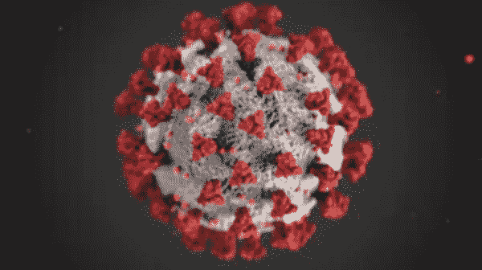
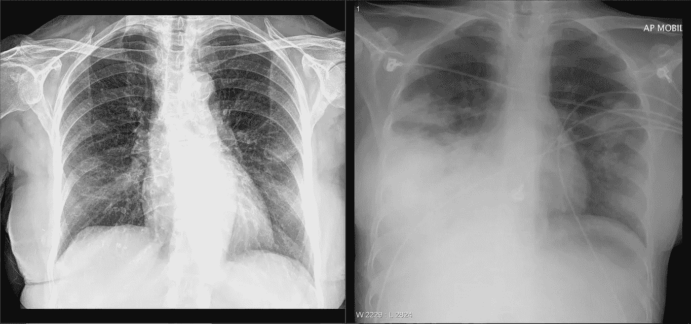
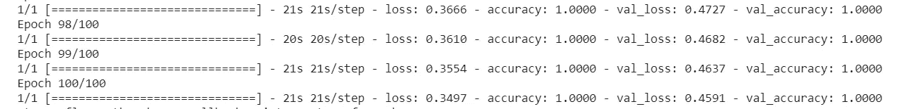

# 用人工智能诊断新冠肺炎。

> 原文：<https://medium.datadriveninvestor.com/diagnosing-covid-19-using-artificial-intelligence-2d01a6e5cdf4?source=collection_archive---------5----------------------->

新冠肺炎是一种由新发现的冠状病毒引起的传染病。世界卫生组织(世卫组织)最近评估认为，新冠肺炎可被定性为在中国湖北省首次发现的疫情。目前，它已经蔓延到世界上 100 多个国家，夺去了 22000 多人的生命。

目前的测试方法花费政府 10 到 50 美元。为了抑制成本，可以使用人工智能作为替代方案。*这是* ***不是*** *一项科学严谨的研究，也不会发表在期刊上。*

# 现有方法。

## RT-PCR 检测。

新冠肺炎 RT-聚合酶链式反应测试是一种实时逆转录聚合酶链式反应(rRT-PCR)测试，用于对医疗保健提供者从疑似新冠肺炎患者收集的上呼吸道和下呼吸道标本(如鼻咽或口咽拭子、痰液、下呼吸道吸出物、支气管肺泡灌洗液和鼻咽洗液/吸出物或鼻吸出物)中的新型冠状病毒核酸进行定性检测。

# 新冠肺炎对人类的影响。

在人类中，呼吸树的内层受到损伤，导致炎症。这反过来刺激气道内层的神经。仅仅一点灰尘就能引起咳嗽。

但是如果这种情况变得更糟，它只会经过气道的内层，进入位于气道末端的气体交换单元。

 [## 在医疗保健中使用人工智能的伦理|数据驱动的投资者

### 人工智能(AI)正被应用于任何管理大量数据的行业，并且在一个…

www.datadriveninvestor.com](https://www.datadriveninvestor.com/2020/03/21/the-ethics-of-using-ai-in-healthcare/) 

基本上，它会影响人类肺部的功能。

## x 光。

由于病毒影响肺部，胸片可以揭示很多关于病毒在肺部造成的影响。

对于 3 月 5 日发表在*新英格兰医学杂志*上的美国首例病例，该男子的第一张胸片显示没有异常；实验室检查、鼻拭子和其他临床发现也正常。由于他的旅行史，华盛顿紧急护理诊所和该州卫生部的临床医生立即打电话给疾病控制和预防中心，收集患者的样本。

他的实时逆转录-聚合酶链反应(rRT-PCR)检测结果显示 2019-nCoV 呈阳性，他被带到普罗维登斯地区医疗中心的空中隔离病房进行观察。作者指出，这一区域的位置起初限制了该男子进行护理点实验室测试。

在医院的第三天，另一个胸部 x 光片显示正常，显示“没有浸润或异常的证据，”第一作者米歇尔·l·霍尔舒(Michelle L. Holshue)和他的同事写道。但在住院的第五天，第二次 x 光检查显示左肺下叶有肺炎迹象。这是因为该男子的呼吸状况发生了变化。

该小组写道，在患者住院的第 6 天进行的下一次 x 射线检查产生了异常结果，包括每个肺部的“基底条纹阴影”，符合非典型肺炎。

就胸片而言，至少在 4 天之前是检测不出病毒的。但是 4 天后，X 射线开始显示出可以用来检测冠状病毒的迹象，这是由[研究](https://www.nejm.org/doi/full/10.1056/NEJMoa2001191)得出的结论。

## 数据集。

[Left: COVID-19 positive x-ray.](https://radiopaedia.org/cases/covid-19-pneumonia-14) [Right: Streptococcal Infection.](https://radiopaedia.org/cases/streptococcus-pneumoniae-pneumonia-temporal-evolution-1) ( Both are licensed as CC-NC-SA). Both images exhibit pneumonia. What can tell them apart?

数据集包含 50 幅图像，其中 40 幅图像用于训练模型，其余 10 幅图像用于评估模型。

感谢 Adrian Rosebrock 博士对[数据集](https://www.pyimagesearch.com/2020/03/16/detecting-covid-19-in-x-ray-images-with-keras-tensorflow-and-deep-learning/)的研究。

# 迁移学习。

**迁移学习** (TL)是机器学习**(ML)中的一个研究问题，它专注于存储在解决一个问题时获得的知识，并将其应用于另一个不同但相关的问题。例如，在**学习**识别汽车时获得的知识可以应用于识别卡车。**

**这可以作为涉及卷积神经网络的计算机视觉问题。**

## **卷积神经网络。**

**卷积神经网络可以让计算机看到，换句话说，卷积神经网络用于识别图像，通过将原始图像经过层转换为 a 类分数。CNN 的灵感来自视觉皮层。每当我们看到一些东西，一系列层的神经元就会被激活，每一层都会检测到一系列特征，如线条、边缘。高层将检测更复杂的特征，以便识别我们所看到的。**

## **VGG 网络。**

****

**VGG Network.**

**VGG16 是由牛津大学的 K. Simonyan 和 A. Zisserman 在论文《用于大规模图像识别的非常深的卷积网络》中提出的卷积神经网络模型。该模型在 ImageNet 中达到了 92.7%的 top-5 测试准确率，ImageNet 是一个包含属于 1000 个类的超过 1400 万个图像的数据集。它是提交给 [ILSVRC-2014](http://www.image-net.org/challenges/LSVRC/2014/results) 的著名模型之一。它通过用多个 3×3 内核大小的滤波器一个接一个地替换大内核大小的滤波器(在第一和第二卷积层中分别是 11 和 5)来对 AlexNet 进行改进。VGG16 接受了数周的训练，使用的是 NVIDIA Titan Black GPU。**

**该模型用于训练该模型以检测一个人是否患有新冠肺炎。**

## **结果。**

**在用具有 X 射线图像的 VGG 网络进行训练时，模型的准确度被提高到 100%。**

****

**为了代码。请在评论区留下您的电子邮件 id。**

# **CT 扫描。**

**最近[的一项研究](https://pubs.rsna.org/doi/10.1148/radiol.2020200642)得出结论，胸部 CT 对新冠肺炎的诊断具有很高的敏感性。胸部 CT 可被认为是当前流行地区新冠肺炎检测的主要工具。据说它比现有的 RT-聚合酶链式反应测试更准确。因为 CT 扫描数据不公开。这项研究是在 x 光下进行的。**

****这个博客只是一个概念验证，但如果进一步发展，它将有巨大的潜力来解决现有的有限诊断范围和未来可能的人力短缺。****

*****免责声明:*** *以下章节不主张，也不打算“解决”，新冠肺炎检测。这里发布的结果完全取决于所使用的数据集类型。***

# **参考文献。**

1.  **[https://pubs.rsna.org/doi/10.1148/radiol.2020200642](https://pubs.rsna.org/doi/10.1148/radiol.2020200642)**
2.  **[https://www . medical device-network . com/news/coronavirus-CT-scans/](https://www.medicaldevice-network.com/news/coronavirus-ct-scans/)**
3.  **[https://www . managedhealthcareexecutive . com/article/CT-scans-lung-may-help-coronavirus-diagnosis](https://www.managedhealthcareexecutive.com/article/ct-scans-lung-may-help-coronavirus-diagnosis)**
4.  **[https://www . itnon line . com/content/CT-provides-best-diagnosis-novel-coronavirus-新冠肺炎](https://www.itnonline.com/content/ct-provides-best-diagnosis-novel-coronavirus-covid-19)**
5.  **[https://www.fda.gov/media/136151/download](https://www.fda.gov/media/136151/download)**
6.  **https://pubs.rsna.org/2019-ncov**
7.  **[https://www . research gate . net/post/Free _ lung _ CT _ scan _ dataset _ for _ cancer _ non-cancer _ class ification](https://www.researchgate.net/post/Free_lung_CT_scan_dataset_for_cancer_non-cancer_classification)**
8.  **[https://www . pyimagesearch . com/2020/03/16/detecting-x-ray-images-with-keras-tensor flow-and-deep-learning/](https://www.pyimagesearch.com/2020/03/16/detecting-covid-19-in-x-ray-images-with-keras-tensorflow-and-deep-learning/)**
9.  **[https://github.com/ieee8023/covid-chestxray-dataset](https://github.com/ieee8023/covid-chestxray-dataset)**
10.  **[https://towards data science . com/using-deep-learning-to-detect-ncov-19-from-x-ray-images-1a 89701 D1 ACD](https://towardsdatascience.com/using-deep-learning-to-detect-ncov-19-from-x-ray-images-1a89701d1acd)**