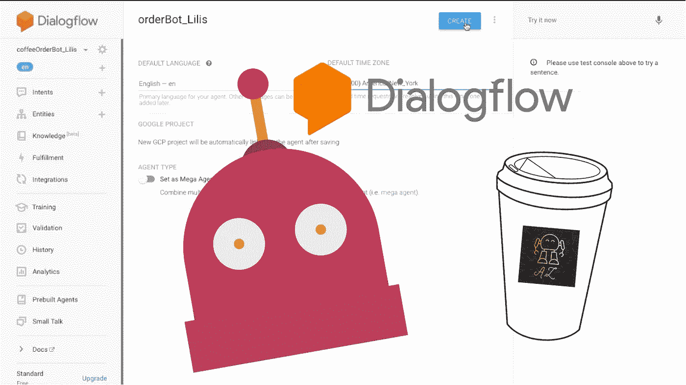
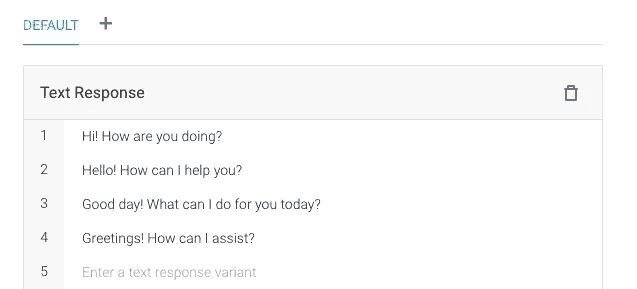
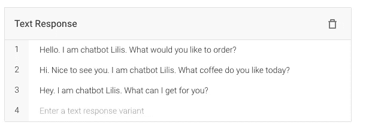
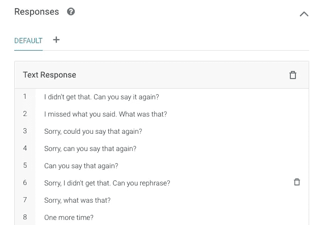
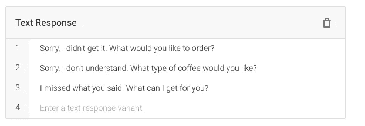

# Dialogflow 教程:根据聊天机器人的目的修改默认的欢迎和回退意图

> 原文：<https://medium.datadriveninvestor.com/dialogflow-tutorial-modify-default-welcome-and-fallback-intents-for-chatbots-purpose-6768bd663138?source=collection_archive---------4----------------------->

## 每个聊天机器人的诞生都是有目的的，就像人类一样

当您在 Dialogflow 控制台中创建新代理时，已经为您设置了两个默认意图:默认欢迎意图和默认回退意图。不幸的是，如果您想构建和部署聊天机器人来解决现实世界中的问题，这些默认的意图和默认的响应不能满足用户。

如何修改这些意图和回应？答案取决于你的聊天机器人想要解决的具体问题。每个聊天机器人的诞生都是有目的的，就像人类一样。业内常见的聊天机器人有:

*   **FAQ 聊天机器人**回答客户经常问的问题。例如，*的营业时间是什么时候？你的商店在哪里？你们提供什么样的产品？退货政策是什么？*
*   **预约日程聊天机器人**预约和发送确认。例如，*我能预约纽曼医生吗？我能把约会安排在下午 3 点吗？我可以取消这个星期五的约会吗？*
*   食品订单聊天机器人接受顾客的订单。比如*我可以要一个大披萨吗？我能要两个油炸圈饼吗？你们提供啤酒吗？*
*   **餐厅里的预约聊天机器人**。我可以预订一张明晚五点的五人桌吗？
*   **酒店订房聊天机器人**。我可以在 9 月 12 日为两位成人预订一个房间吗？

在本文中，我们将以咖啡订单聊天机器人 Lilis 为例，演示如何修改特定任务的默认意图:**接受客户的咖啡订单。**

## 可在视频中找到分步指南:

## 欢迎意向

当用户激活您的聊天机器人时，会触发欢迎意图。它应该返回一个响应，让用户知道你的聊天机器人可以做什么。默认的文本响应如下所示:

default response in welcome intent

对于咖啡订单 chatbot Lilis，我们定制如下响应:

“你想点什么？”会将对话直接引向订购流程。

## 后备意图

当聊天机器人无法理解或识别用户的表情时，就会触发回退意图。可以在下面找到预先配置的文本响应:

default response in fallback intent

当 Lilis 不能理解顾客时，她会问:

订单机器人的核心任务是确定客户想要什么，并放入订单列表中。当 it 在识别客户需求方面有问题时，上述后备响应将与客户核实。

今天，我们介绍了针对聊天机器人想要解决的特定问题的默认意图的修改。关注我的媒体以获取未来的更新，如果您有任何问题，请在下面发表评论，并将链接分享给对构建语音助手感兴趣的朋友。

在下一篇文章中，我们将使用 JavaScript 在 Fulfillment Webhook 中编写代码来处理意图“order.generic”。

# 继续🤖：

[https://www.youtube.com/playlist?list = PLbd _ cznewl9bnqeq 29 dhzaj-84 mocgaw](https://www.youtube.com/playlist?list=PLbd_cZnEWl9BNQEq29DHZAJ-84oMOCGaW)

# 构建对话流聊天机器人 Lilis 3:如何使用 Javascript 在 Fulfillment Webhook 中编码以处理订单意图