# Python 中的字典

> 原文：<https://medium.datadriveninvestor.com/dictionaries-in-python-8b4069765b6b?source=collection_archive---------40----------------------->

## 如何在 Python 中使用字典

Photo by [Aaron Burden](https://unsplash.com/@aaronburden?utm_source=medium&utm_medium=referral) on [Unsplash](https://unsplash.com?utm_source=medium&utm_medium=referral)

在本教程中，我们将介绍 Python 字典的基本特征，并学习如何访问和管理字典数据。

## 什么是字典？

Dictionary 是无序且可变对象的集合，但是它使用键和值而不是索引。字典类似于列表。它们之间的主要区别是列表元素是通过它们的位置来访问的，通过索引来访问*，而字典元素是通过键*来访问*。在字典中，每个键值对都将键映射到其关联的值。*

 [## 用 Python |数据驱动投资者进行股票价格时间序列预测简介

### 在这个简单的教程中，我们将看看如何将时间序列模型应用于股票价格。更具体地说，一个…

www.datadriveninvestor.com](https://www.datadriveninvestor.com/2020/07/07/introduction-to-time-series-forecasting-of-stock-prices-with-python/) 

## 定义字典

在 Python 中，定义字典的方法是用大括号({})括起逗号分隔的键值对列表，并用冒号( : )将每个键与其关联的值分隔开。示例:

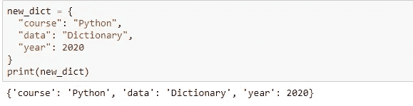

我们还可以用内置的 *dict()* 函数构造一个字典。dict()的参数应该是一个键值对序列。

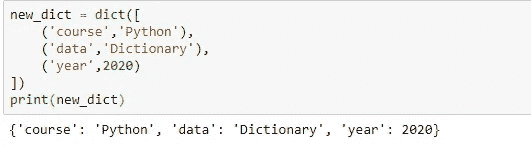

## 访问字典中的项目:

我们可以通过引用在方括号*[]中的关键字名称来访问字典的条目。通过指定相应的键从字典中检索值:*

*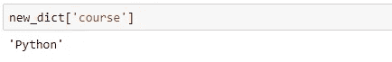*

*使用 *get()* 方法也会得到相同的结果:*

**

## *更改/更新词典中的条目:*

*向现有字典添加条目—意味着分配新的键和值:*

*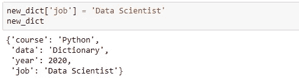*

*更新条目—为现有键分配新值:*

*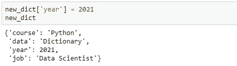*

*删除条目—使用 *del* 语句，指定要删除的键:*

*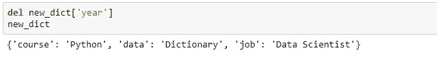*

*另一种方法是使用 *pop()* 方法:*

*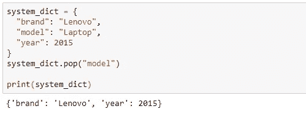*

**popitem()* 方法删除最后插入的项目:*

*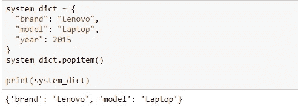*

*方法清空字典:*

*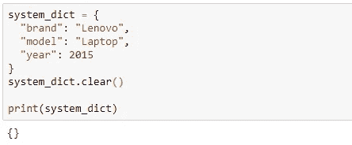*

*复制字典— *copy()* 方法用于复制字典。*

*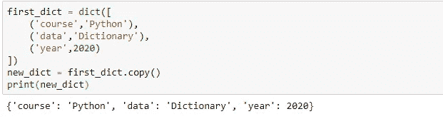*

## *在字典中循环:*

*我们可以使用*作为*循环来遍历字典。当遍历字典时，返回的值是字典的*键*，但是也有返回*值*的方法。*

*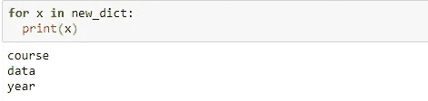*

*我们想要返回字典中的值是什么？*

*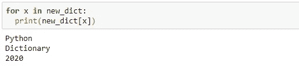*

*另一种方法是使用`values()`方法:*

*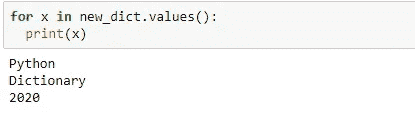*

*返回字典中的键和值:*

*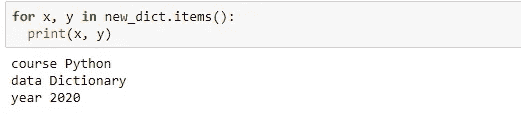*

## *嵌套词典:*

*包含许多字典的字典称为嵌套字典。*

*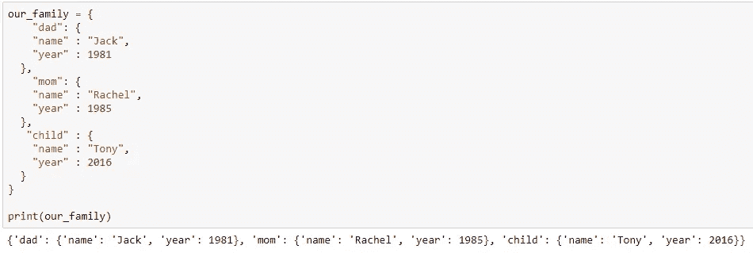*

*如果我们想从不同的字典中创建一个字典，该怎么办:*

*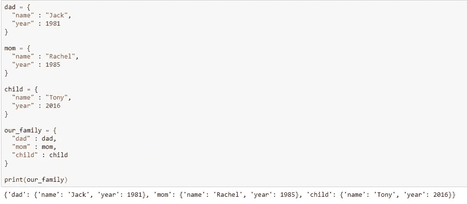*

## *结论*

*在本教程中，我们讲述了 Python 中字典的一些基本属性，并学习了如何访问和操作它的数据。*

*正如所看到的，列表和字典有几个相似之处，但是不同之处在于它们的元素是如何被访问的。列表中的元素通过基于顺序的数字索引来访问，字典元素通过键来访问。*

## *访问专家视图— [订阅 DDI 英特尔](https://datadriveninvestor.com/ddi-intel)*