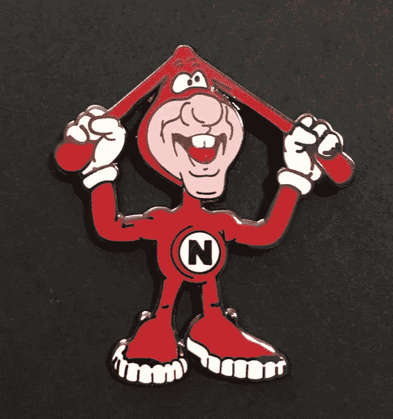
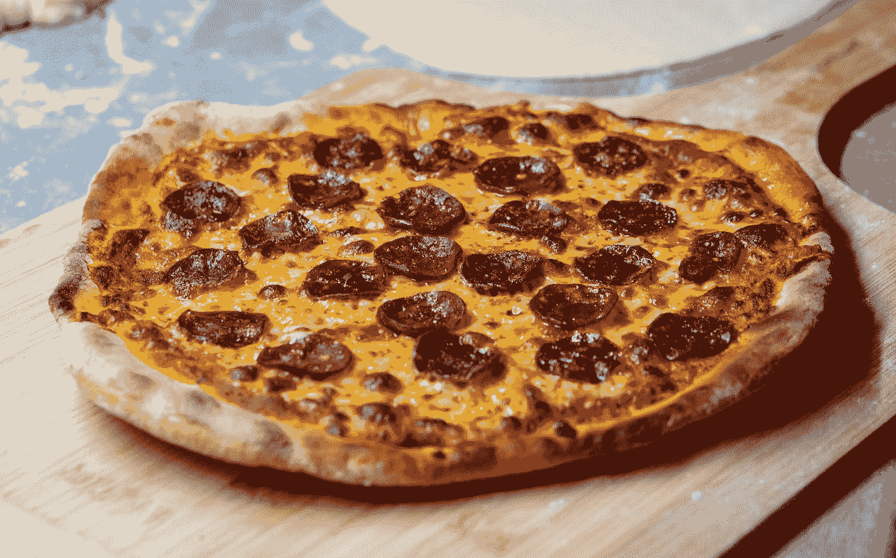

# 一场人质危机终结了达美乐最伟大的广告活动吗？

> 原文：<https://medium.datadriveninvestor.com/did-a-hostage-crisis-end-dominos-greatest-ad-campaign-34bbc797dc29?source=collection_archive---------17----------------------->

## 课堂上学不到的营销课

Domino’s “Noid” Lapel Pin — Via [Pinterest](https://www.pinterest.com/pin/655625658229978795/) By [Brian@brianchistopherbuck](https://www.pinterest.com/brianchistopherbuck/_saved/)

> “1989 年 1 月 30 日(T1)，一名男子手持一把. 357 大左轮手枪冲进佐治亚州亚特兰大的一家多米诺骨牌餐厅，劫持了两名员工……袭击者……名叫肯尼斯·拉马尔·诺伊德，显然对连锁店的新吉祥物感到不满。现场的一名警察后来[透露](http://news.google.com/newspapers?nid=1291&dat=19890131&id=ZkBUAAAAIBAJ&sjid=n40DAAAAIBAJ&pg=6893,9690639)Noid“在他的脑海中与达美乐比萨店的老板就 Noid 的广告一直不和”，并认为这些广告专门取笑他。”
> 
> ——扎克里·克罗克特在[价格经济学](https://priceonomics.com/how-dominos-pizza-lost-its-mascot/)

我们的世界充满了专家，尤其是在营销领域。他们会解释如何让平凡变得不平凡。根据他们中的许多人所说，如果你计划得足够好，一切都是可以解释的。然而，即使是最好的计划和成功也会被简单的命运击倒。

说到简单，没有什么比披萨更简单了。这是奶酪、酱和面团，有什么复杂的？现在，加上数百万美元，以及营销部门，事情突然变得复杂起来。

20 世纪 80 年代末，两家公司主导了美国的比萨饼市场:达美乐和必胜客。后者拥有坐下来用餐的市场，而达美乐则统治了外卖行业。他们甚至根据扎卡里·克罗克特设定了一个标准，你的比萨饼在 30 分钟内送到，否则免费。

如今，我们的现代社会越来越接受外卖食品，然而，在 20 世纪 80 年代，有一个观念问题。在 Studio 360 的采访中，营销人员厄尼·佩里希解释了多米诺的困境。人们认为送来的比萨饼质量较低。送来的比萨饼的奶酪会粘在盒子的顶部，很可能有一种纸板的味道，而且到达时是冷的。

 [## 商务沟通不畅是网络安全问题的 5 个原因|数据驱动型投资者

### 沟通是商业的命脉。没有协作就不会有想法，没有合作就不会有交易

www.datadriveninvestor.com](https://www.datadriveninvestor.com/2020/09/01/5-reasons-why-poor-business-communication-is-a-cybersecurity-issue/) 

Perich 和他的团队想出了制造一个坏人的主意——一个外卖披萨所有错误的活生生的化身。这个坏家伙的任务是摧毁比萨饼，然而，多米诺骨牌总是在最后获胜。

当他们和达美乐的员工交谈时，他们了解到他们称自己为多米诺骨牌。突然间，营销团队知道了如何称呼这个角色:这个“偏执狂”。佩里希带着团队的草图和角色创意去了威尔·文顿工作室的粘土动画专家那里。

他们把这种生物变成了某种小精灵，穿着紧身红色套装，耷拉着耳朵。Perich 知道他们正在做一些事情，这个 Noid 从一个想法变成了一个现实世界的角色。

# 一个营销成功的故事和一场灾难

1987 “Dome Of Quality” Commercial

> “这不仅仅是一个受欢迎的电视广告。这比我们想象的还要成功。”
> 
> —蒂姆·麦金太尔(Tim McIntyre)达美乐/ [执行副总裁金健智在 360](https://www.pri.org/stories/2018-04-13/rise-and-fall-noid) 演播室接受采访

第一个 Noid 广告发布于 1986 年，宣布了达美乐如何通过质量流程“避免 Noid”。据麦金太尔说，他们收到了大量关于新吉祥物的邮件和电话。人们还询问他们是否有任何 Noid 商品。

达美乐的市场部开始制作 t 恤衫、小雕像，甚至一款视频游戏。在迈克尔·杰克逊的音乐录影带中，这位 Noid 还出演了一个[的小角色](https://www.imdb.com/title/tt0095655/trivia)。这个角色正在发展自己的名声和生活。甚至有可能在周六早上讨论一部卡通片。

尽管这场运动取得了空前的成功，但还是有一个问题。这是达美乐或各种营销公司的高管们所能预见到的。有一个精神不正常的人，姓 Noid。

人们只能想象 Noid 先生听到多少次口头禅“避免 Noid”。你的普通人可能会因为一些友好的笑话而变得有点愤怒，但是，Noid 先生却认为这是针对他个人的。根据克罗克特的说法，活着的 Noid 认为卡通 Noid 是多米诺骨牌店老板秘密设计的，目的是让这个人的生活成为一个活生生的地狱。

# 像吉祥物一样大的事件

诺伊德先生决定为所有的精神痛苦进行报复。他用枪指着达美乐的两名员工，告诉他们他想要 10 万美元和一架去墨西哥的飞机。与警方的对峙持续了数小时，人质最终逃脱，诺伊德先生被抓获。

然而，不幸并没有就此结束。媒体大做文章，用头条新闻和笑话来淡化活着的努德先生对粘土动画努德的敌意。当负责此次行动的警察局长发表声明称 Noid 先生是“妄想狂”时，甚至当局也无意中参与了行动。

蒂姆·麦金太尔在接受 360 演播室采访时讲述了记者们连珠炮似的提问，问达美乐是否会放弃 Noid 活动。会议结束后，他们的管理团队不认为他们做错了什么。怎么会有人想到会发生这样的事？他们也看不出这场运动中有任何疏忽，所以他们继续进行。

1995 年，不幸的是，Noid 先生结束了他的生命，无法处理他正在经历的精神痛苦。许多媒体继续报道达美乐在自杀后由于负面宣传而终止了 Noid 活动。甚至扎卡里·克罗克特的文章也指出了这一点。

然而，Tim McIntyre 和 Ernie Perich 在他们的采访中指出，Noid 运动实际上在 1991 年或 1992 年就结束了。后来的自杀与此无关。不幸的是，媒体的叙述被歪曲了，Noid 运动与人质事件和自杀联系在一起。

多年来，达美乐有限地复活了这个角色。根据麦金太尔的说法，这场运动已经走到了尽头。尽管媒体经常报道 Noid 由于与 Noid 先生的冲突而死亡。

# 这种情况的最终教训是

Photo by [amirali mirhashemian](https://unsplash.com/@amir_v_ali?utm_source=medium&utm_medium=referral) on [Unsplash](https://unsplash.com?utm_source=medium&utm_medium=referral)

那么，我们从这个故事中学到了什么？最终的教训是，有时根本没有教训。我们这个时代的专家，尤其是营销和媒体专家，声称对所有事情都有答案和策略。那么，这一次的策略是什么？

对于你成功的营销活动的完全非理性的反应，你如何计划应对？你如何预见未来会发生这样的事情？不管专家告诉你什么，命运和机会经常会决定你对产品营销方式的反应。

尽管扎卡里·克罗克特在他的文章中提出了营销活动，但它非常成功——超出了达美乐的想象。它也被一个需要帮助的不幸的人的行为所玷污。这两点都不正确，但这有关系吗？

营销背后有科学、心理学和商业规划，但这些都不是傻瓜证明。一个随机的人的行动有能力让最坚如磐石的营销陷入混乱。这是你计划未来活动时需要考虑的事情。总有无法解释的未知，再多的计划也无法涵盖这些。

不幸的是，对于达美乐来说，Noid 运动总是会提起这个故事。这两者永远交织在一起，即使多米诺没有参与行动。媒体巩固了这样一个观点，即 Noid 战役被人质事件和死亡所摧毁。即使这不是真的，这个角色总会回忆起一段记忆——不管是否有保证。

## 访问专家视图— [订阅 DDI 英特尔](https://datadriveninvestor.com/ddi-intel)