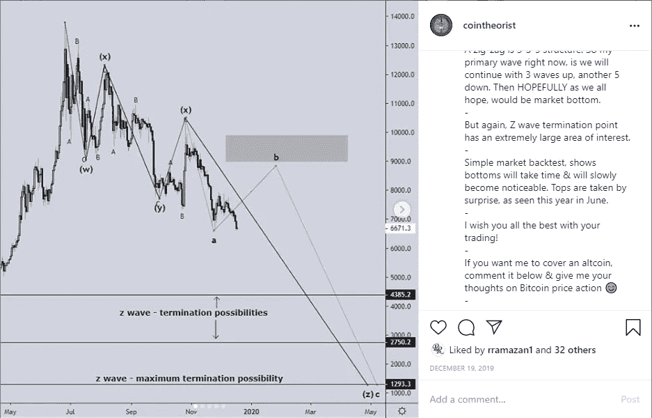
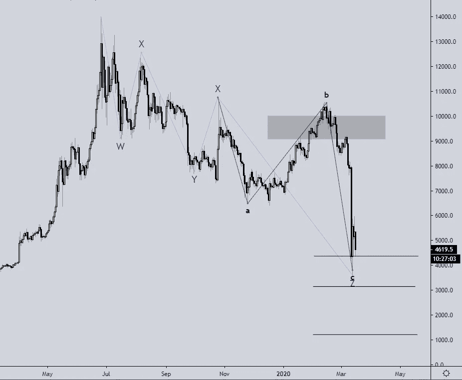
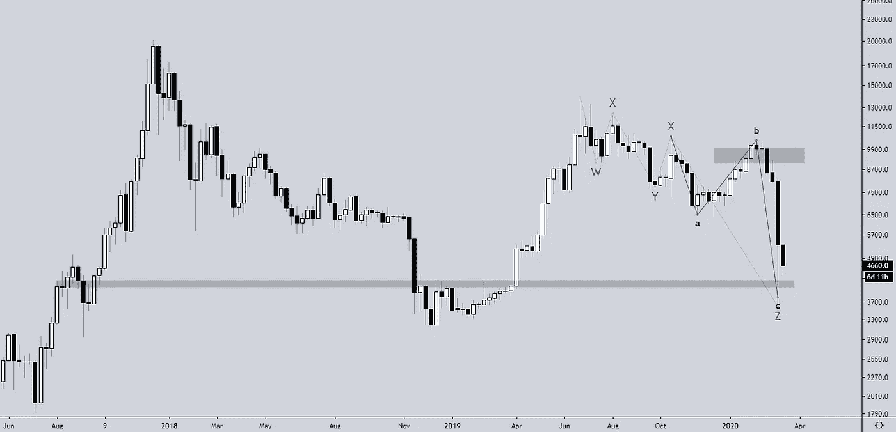
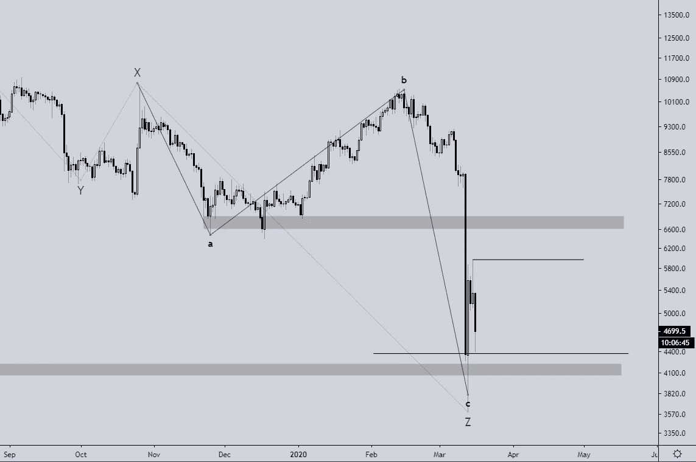

# 比特币在 3800 点见底了吗？从 10500 美元开始的暴跌是可以预测的。

> 原文：<https://medium.datadriveninvestor.com/did-bitcoin-bottom-at-3800-how-i-predicted-the-e33dca7f4c90?source=collection_archive---------8----------------------->

**极度兴奋和贪婪。**
能摧毁一个没有准备好的交易者的两种主要情绪。
2020 年 1 月和 2 月是加密货币交易商的两个大月份。

每个人都在赚钱，每个人都认为 6400 美元是底部，新的牛市已经开始。

在这篇文章中，我将回顾。
-很明显我们没有处于牛市
-一个普通的交易者如何从恐慌中拯救自己
-如何准备下一步
-学会分析路径，预测趋势的未来

首先，我想给你们看一个我 2020 年 12 月 19 日在 Instagram 上发的帖子。
IG: [@cointheorist](http://www.instagram.com/cointheorist)

 [## Azbit 旨在连接传统金融和加密货币|数据驱动的投资者

### Azbit 是下一个提供交易平台的加密项目，该平台提供保证金和算法交易。一样多…

www.datadriveninvestor.com](https://www.datadriveninvestor.com/2019/03/20/azbit-aims-to-connect-traditional-finance-and-cryptocurrency/) 

**难道我只是在崩盘发生前预测到了它？**

Bitcoin Analysis December 19th 2020 by Coin Theorist

知道趋势的未来是有力量的。

但是你怎么知道趋势的未来呢？

这很简单，就像在任何市场中观察历史时刻，注意到重复出现的简单模式。

为了更好地理解这一点，我会在这里再放一张今天的价格图。

看起来很熟悉，不是吗？

问题是，我们刚刚触底了吗？

许多人会说是，许多人会说不是。

这对 DYOR 很重要&你自己打电话吧。

但是我们可以回顾一下为什么比特币**已经**而比特币**还没有**见底的几个原因。

在这样的危机时刻，不要让你的情绪左右你的交易决定是很重要的。不幸的是，情绪引导了从 12 月到 2 月的反弹。比特币花了 60 天时间从 6500 美元的低点反弹到 10500 美元的高点，涨幅 62%。在 29 天内完全消失，下降了 67%。

用自己的情感玩交易游戏的市场参与者(其中许多人)现在已经血本无归，并放弃了他们的持股。

出于几个原因，比特币已经触底。
——世界经济正在崩溃。这就是比特币的设计初衷。
-艾略特波浪理论的常识表明，这里有逆转的可能。
——以往的市场事件总是表明，深怕之后便是盛世。
**比特币还没有见底，有几个原因** ——波浪理论是指引&一定不能作为指标。而是趋势的大致方向，这表明我们仍有可能触及以下水平。
这些价位在 2800-3200 美元和 1000-1400 美元左右(取决于你的交易所)
-图表上没有明显的看涨价格动作表明正在买入。

***我们先来看看支持暂时持有比特币的。***

Bitcoin Weekly Chart 17/03/20 12:55AM AEDT

在 2019 年上半年牛市之前，这些水平之间的 4300 美元至 3900 美元可能是 2019 年突破区的一些支撑。如果这些水平被打破，合乎逻辑的预期是下一个水平是 3000 美元，如果 3000 美元被打破，在 1200 美元附近没有太多的支撑。

有史以来最伟大的投资者说“买入恐惧，卖出贪婪”是几乎每个交易者都知道的常识，但是为什么这么多人没有利用这个基本概念来获利呢？

很难违背你正常的人类情感

**让我们看看如果比特币持有 3800-4200 美元会发生什么**

Bitcoin Daily Chart 17/03/20 12:55AM AEDT

简单地观察一下，仔细观察一下市场结构，它看起来并不像是要逆转。尽管比特币是蛮荒的西部，所以我们必须时刻准备应对可能发生的事情。
我相信当你交易加密货币或任何资产时。你应该总是这样。

过马路前，先看看两边。

我的意思是，做好看涨和看跌的打算。
为什么？
因为在蛮荒的西部，你永远不会真正了解比特币。

比特币有可能在这里“反弹”，有望反弹至 5900 美元至 4200 美元之间的区间。如果比特币突破 5900 美元，我们可以预期它会涨到 6600 美元。从那里价格行为将决定我们这是否只是一个看跌的测试(对空头来说是最佳的)或一个看涨的突破(对多头来说是最佳的)。

整体分析:
如果 3800 美元持有为底部。我们可以预期波动或反弹至 6600 美元。
如果丢了 3800 美元。我们预计价格会下降到 3000 美元到 2500 美元。

交易很难，未来永远不确定。永远都要计划好你的交易。有史以来最伟大的交易者不是根据他们的情绪交易的。

想了解更多关于加密货币市场的信息吗？

关注我的社交媒体:
[推特](http://www.twitter.com/cointheorist)
[insta gram](http://www.cointheorist.com/cointheorist)
[加入我的免费电报群](https://t.me/joinchat/AAAAAFFq87w4oW4fXtyNOA)