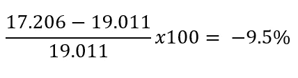

# 上个季度 GDP 真的下降了 33%吗？

> 原文：<https://medium.datadriveninvestor.com/did-gdp-really-fall-by-33-last-quarter-2316b8f4fec4?source=collection_archive---------2----------------------->

## 经济学

## 没有。但是…

Photo by [Michelle Tresemer](https://unsplash.com/@mtresemer?utm_source=medium&utm_medium=referral) on [Unsplash](https://unsplash.com?utm_source=medium&utm_medium=referral)

昨天，商务部经济分析局(T2)发布了第二季度国内生产总值(T3)的初步估计，也被称为 GDP。

该报告显示，经季节和通货膨胀调整后，国内生产总值按年率计算下降了 32.9%，与上一季度相比下降了 9.5%。

那么这一切意味着什么呢？

首先说一下 GDP 衡量的是什么。GDP 代表一个国家生产的最终产品和服务的市场价值。简而言之，它是所有新经济活动的货币价值。许多人用 GDP 来衡量一个经济体的表现，因为更多的生产会带来更多的经济价值。

 [## 对有商业头脑的投资者有用的行为经济学概念|数据驱动的投资者

### 在美国企业界，高斯统计，对我们周围世界的确定性解释，以及理性…

www.datadriveninvestor.com](https://www.datadriveninvestor.com/2020/07/09/helpful-behavioral-economics-concepts-for-the-business-minded/) 

然而，GDP 并不衡量许多事情，如幸福或平等。更多关于[的信息，请点击这里](https://medium.com/@james_tierney/gdp-doesnt-tell-the-whole-story-c010dc0ed150)。衡量地下经济生产的东西也很困难。然而，那是另一篇文章。

第二，先说 GDP 是怎么报的。有三件事需要知道:这些数字是经过季节调整、通货膨胀调整和年度化的。以这些方式报告数字的原因是为了帮助比较不同时间的数据。

## 季节性调整

当数据被季节性调整时，它们被调整以去除数据中的季节性变化。例如，由于假日季节，今年第四季度的总体消费者支出较高。报告的数字考虑到了这一点。

## 通货膨胀调整后

当一个经济体的价格整体上升时，通货膨胀就会发生(通货紧缩就是价格下降)。通货膨胀可能发生的原因有很多。一些例子包括更多的货币流通(不一定是“印刷”)，总需求的增加，或总供给的减少。由于价格随着时间的推移而变化，而国内生产总值是用来衡量经济中的生产，因此国内生产总值数据是根据这些变化进行调整的。这些数字被称为*实际 GDP (RGDP)。他们如何调整这些数据是另外一个故事，我今天就不介绍了。*

## 按年计算的

当 BEA 报告一个季度的 GDP 数据时，他们没有报告这三个月的生产量。他们正在报告如果这个季度生产发生的话，一整年将会是什么样子(再次，调整通货膨胀和季节性影响)。标题百分比变化数也报告为年度变化。这意味着，如果这一趋势持续一年，经济将会如何？

为了让这一点更清楚，让我们来看一些当前的数字:

美国 RGDP 2019 年第四季度:19.254 万亿(年化)
美国 RGDP Q1 2020 年:19.011 万亿
美国 RGDP Q2 2020 年:17.206 万亿

如果你从 Q1 2020 年到 Q2 2020 年的百分比变化，你会看到这个数字是 9.5%。

Taking the percentage change of the RGDP from Q1 2020 to Q2 2020

昨天的数据显示，第二季度经济收缩了 9.5%。它没有收缩 33%。数据显示，如果这种情况持续一整年，并根据季节差异和价格变化进行调整，我们将看到经济活动下降 33%。

让我们希望情况不是这样。

**詹姆斯·蒂尔尼是一名即兴表演和经济学教师。** [**跟着他上推特寻开心**](http://twitter.com/james_tierney) **。看看他在媒体上发表的其他经济学文章:**

 [## GDP 并不能说明全部

### 不丹是如何尝试衡量幸福的？

medium.com](https://medium.com/@james_tierney/gdp-doesnt-tell-the-whole-story-c010dc0ed150)  [## 棒球的时代统计和失业率也有同样的问题

### 两者都不完美，没关系。

medium.com](https://medium.com/@james_tierney/era-and-unemployment-rate-ee6c6f85cd48) 

**访问专家视图—** [**订阅 DDI 英特尔**](https://datadriveninvestor.com/ddi-intel)