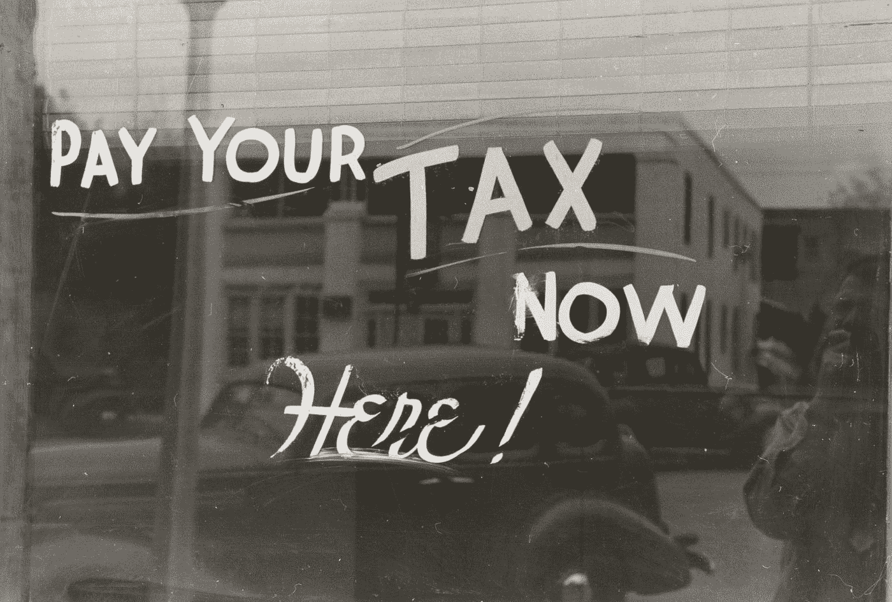
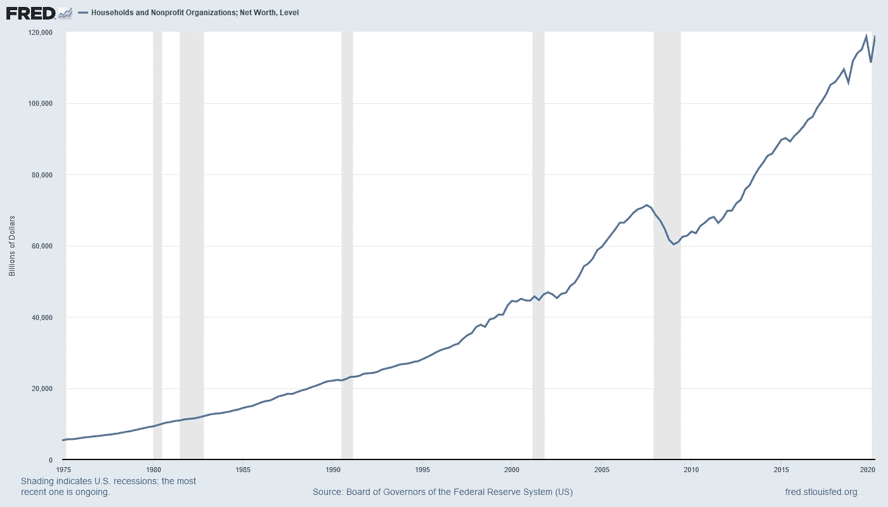
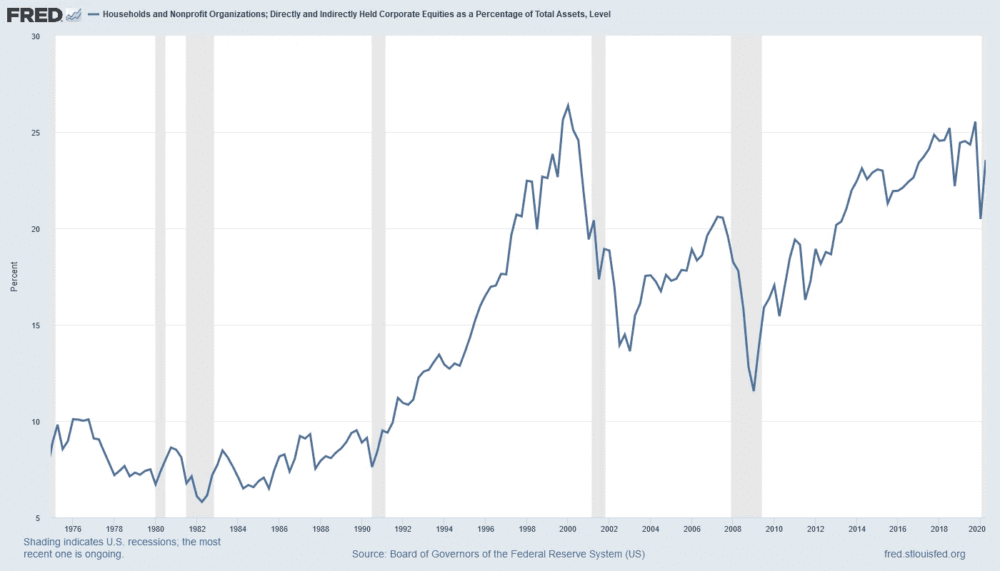

# Covid 衰退真的让家庭变得更富有了吗？

> 原文：<https://medium.datadriveninvestor.com/did-the-covid-recession-really-make-households-wealthier-15a651ecb360?source=collection_archive---------9----------------------->

## 根据美联储的数据，家庭净资产正处于历史最高水平

Photo by [The New York Public Library](https://unsplash.com/@nypl?utm_source=medium&utm_medium=referral) on [Unsplash](https://unsplash.com?utm_source=medium&utm_medium=referral)

上个月，美国美联储发布了一条非常有趣的小道消息。值得注意的是，这表明家庭、企业和政府在名义上和实际上都是有史以来最富有的。发布的数据涵盖了 6 月份的季度，其中包括了全国范围的封锁带来的大部分经济影响。事实上，在这次衰退中，家庭不仅增加了他们的净资产，而且达到了历史最高水平，这是值得深入研究的。

如果你觉得你错过了什么，我支持你。衰退应该是摧毁财富，而不是创造财富。当然，疫情造成了大量的*经济*破坏，迫使企业关闭，消费者削减支出，最终结果是更少的商品和服务转手。但从纯粹的资产负债表来看，由于政府支付的大量涌入、储蓄的增加以及资产价值(主要是金融资产)的上升，净值已经上升。

根据这份报告(被称为 Z.1，你可以把它看作是整个国家的财务报表)，家庭和非营利财富总额上升到近 119 万亿美元(见下图)。

Source: Federal Reserve Bank of St. Louis

家庭债务为 16.1 万亿美元，年增长率几乎持平，为 0.5%，而消费信贷收缩了 6.6%，抵押贷款债务(不包括冲销)的年增长率为 3.0%。

 [## 为什么我们投资 Totient，也就是人工智能如何帮助我们生产抗癌药物和 Covid | Data…

### 9 月 10 日，一家人工智能驱动的药物研发公司宣布与……建立关键合作伙伴关系，从此悄然出现

www.datadriveninvestor.com](https://www.datadriveninvestor.com/2020/09/13/why-we-invested-in-totient-aka-how-ai-can-help-us-produce-drugs-against-cancer-and-covid/) 

对于人们记忆中最严重的衰退来说，这一切似乎相当平淡。除非你考虑到联邦政府债务大幅上升 58.9%。这些数字是按年计算的，所以更像是运行利率。如果政府以 6 月份的季度利率借款一整年，将增加 11.5 万亿美元的债务。债务环比增长 2.9 万亿美元，使政府未偿债务总额达到 22.5 万亿美元。

这种巨大的借款率是为短期支出项目提供资金所必需的，这些项目使经济保持活力，直到一切恢复正常。数万亿美元的转移支付，包括刺激支票、失业福利和企业 PPP 贷款(事实上，其中许多只是转化为赠款)被用于保持企业和家庭的偿付能力，所有资金都来自国家借款。由于美联储的货币政策，政府可以以创纪录的低利率发行债券，所以如果说有过让经济尸体复活的好时机，那就是现在。

然而，支付的流动导致了个人收入的显著增加。这证明了财政对策的规模。在衰退期间，即使所谓的预算稳定器开始发挥作用(更高的失业支付和更低的税收导致自然预算赤字)，家庭收到的现金也比危机前更多，而不是你预期的收入下降。

早在 3 月份，政策制定者就非常清楚地意识到，这是一场非常不同的衰退，是由纯粹的外部因素引发的。因为存在如此多的不确定性，而且疫情还看不到尽头，尽管疫苗候选人接近终点线，但政府已经把财政厨房水槽扔向这个问题。再加上美联储融资、信贷和流动性工具(CCF、MSLP、TALF、MLF 和 CPFF)的名副其实的字母汤，一波资金涌入了整个系统。

但是这里还有一个因素在起作用。利率下降正在推高股票和房地产的估值，推高资产负债表。根据 Z.1，直接和间接持有的公司股票价值增加了 5.7 万亿美元，房地产价值增加了 0.5 万亿美元(记住这些是年化数字)。股票价值的上升部分反映了流入家庭的额外收入，其中一部分进入了股市。但这也反映出财政措施带来的前景显著改善。8 月份部分财政支持的取消是近期股市波动的原因之一。

对投资者来说，当前的市场环境如此具有挑战性，是因为无论以何种标准衡量，股票估值都处于历史高位。然而，如果你看看股票风险溢价，或者股票和政府债券等无风险证券的预期实际回报率之间的差异，估值可能是一半合理的。整个发达世界的收益率接近于零，这一事实促使投资者在股市中寻找收益。这些渴望收益的投资者准备支付股票，即使根据市盈率等传统估值标准，股票看起来很贵。

Z.1 揭示的另一条有趣信息是，家庭资产相对较高的股票配置。截至 6 月季度，23.5%的家庭资产投资于股票，当你回顾过去几十年时，这似乎接近周期的顶端。这里的风险是，鉴于对收益率的偏好，股票可能确实过于拥挤，而这一系列数据表明，股票下跌可能会给家庭带来一些真正的痛苦。尽管抛售股票可能很诱人，但在投资组合中持有债券仍是在市场低迷时提供稳定性的明智之举。

Source: Federal Reserve Bank of St. Louis

还有更多的风险事件即将发生，包括总统选举、地缘政治动荡，当然还有尚未战胜的病毒，它仍然威胁着公众健康和经济。不符合逻辑的是，经济衰退让家庭变得更加富裕。但是我们应该把多少财富投入股票呢？历史高位的配置本身是否是未来可能出现熊市的迹象？对于寻求平衡投资组合的谨慎投资者来说，这些都是值得思考的问题。对于那些寻找一些额外的宏观线索来帮助指导我们前进的人来说，它们也是重要的问题。

就我个人而言，我认为我们有进一步的证据表明股市拥挤，多年来货币当局有效实施零利率政策对此没有帮助。过多的财政和货币支付和贷款计划虽然对真正需要它们的人有巨大的帮助，但总体上看似乎针对性很差，只会加剧失衡。让我们希望我们可以很快达到 Covid-normal，这样我们就可以回到一个股票正常的市场。

## 访问专家视图— [订阅 DDI 英特尔](https://datadriveninvestor.com/ddi-intel)