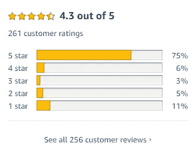
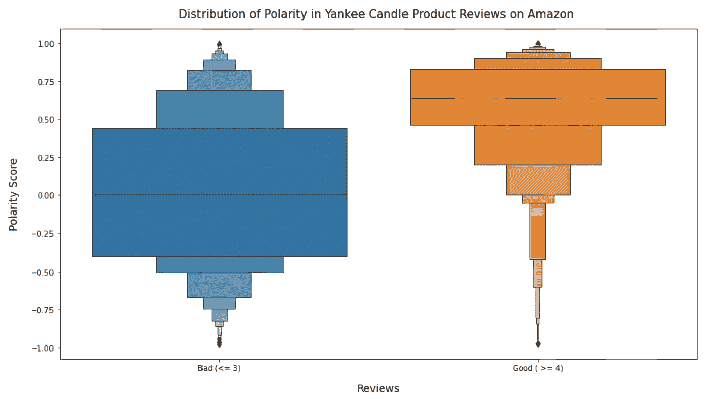
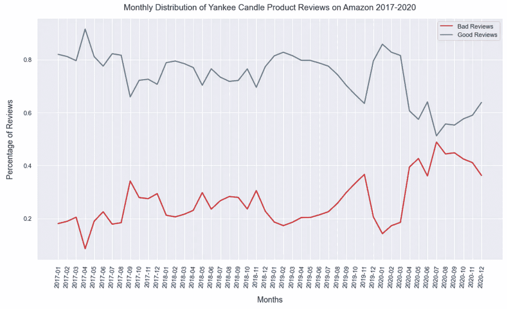
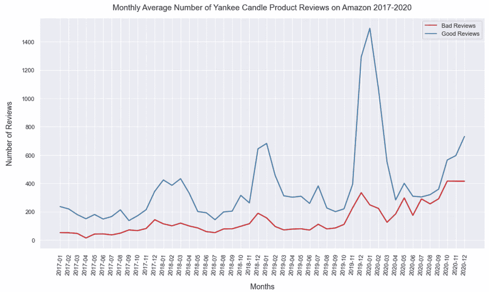
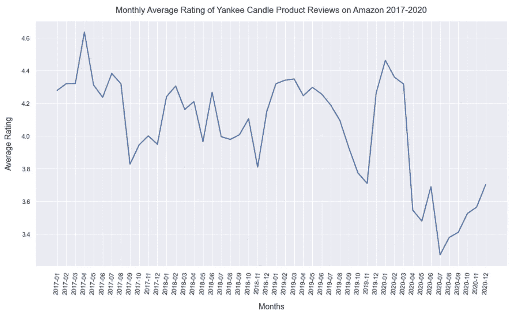
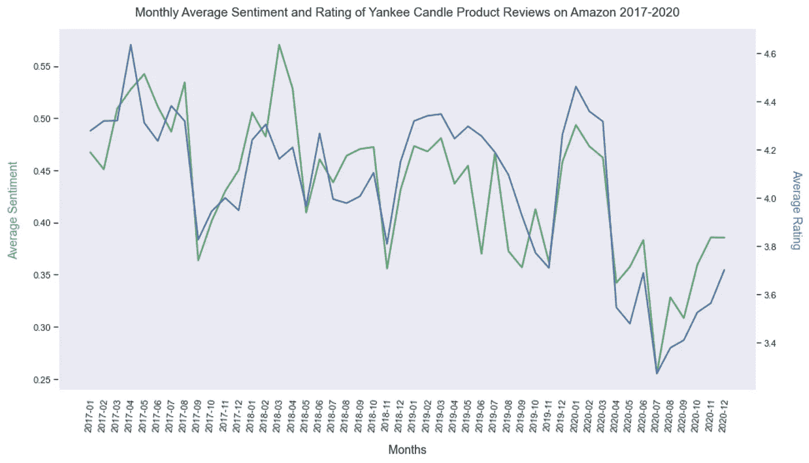
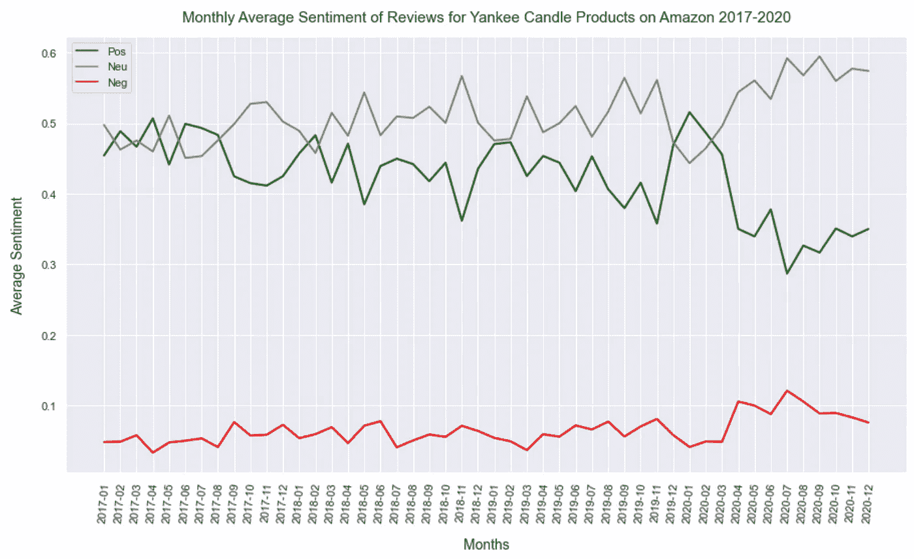
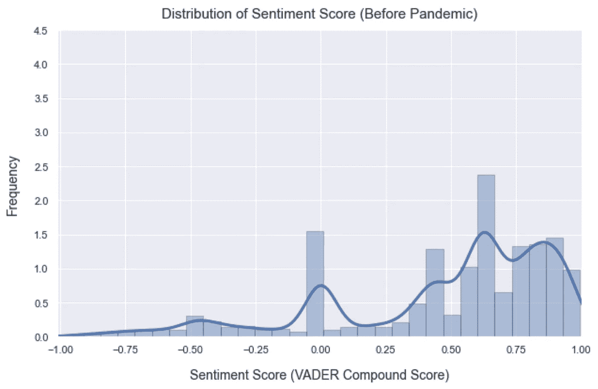
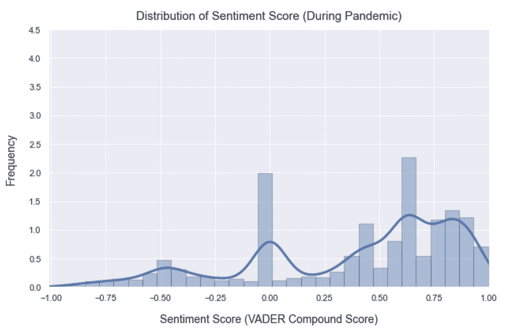

# 你是不是得了冠状病毒却不自知？我知道是谁干的！

> 原文：<https://medium.datadriveninvestor.com/did-you-have-coronavirus-and-not-even-know-it-i-know-who-did-77200e76149e?source=collection_archive---------15----------------------->

## 使用 Python 和自然语言处理，对亚马逊香味蜡烛产品的评论进行详细分析。

Photo by [Tobias Rehbein](https://unsplash.com/@tobiasrehbein?utm_source=medium&utm_medium=referral) on [Unsplash](https://unsplash.com?utm_source=medium&utm_medium=referral)

# 介绍

2020 年 11 月，我看到了一条有趣的[推文](https://twitter.com/kate_ptrv/status/1332398737604431874?lang=en)，关于香烛是冠状病毒的意外受害者。这引起了我的兴趣，我开始着手一个项目，以确定这一说法是否属实。

在本文中，我将对我所做的分析进行简要总结，但主要是向您展示我的项目的结果。我对结论如此明显感到惊讶。

这个项目的所有代码都可以在这个 [GitHub repo](https://github.com/nickdcox/nlp-sentiment-coronavirus) 中找到。

**项目目标:**利用自然语言处理和情感分析研究疫情冠状病毒对亚马逊上 Yankee Candle 产品评论的影响。

**假设:**由于嗅觉丧失这一常见冠状病毒症状，与前几年相比，2020 年亚马逊上 Yankee Candle 产品的平均评论评级和情绪有所下降。我的观点是，美国蜡烛的购买者将产品缺乏香味归咎于制造商，而没有意识到是他们自己的健康状况出了问题。

**使用的工具:** Python，Pandas，Scrapy，NLTK，Gensim，TextBlob，VADER 情绪分析，scikit-learn，Matplotlib，Seaborn

# 网页抓取和数据清理

对于这个项目，我需要通过抓取亚马逊上的 Yankee Candle 产品页面来创建一个产品评论和评级的数据集。为了达到 30，000 条评论的目标，我需要搜集 10 种不同的 Yankee Candle 产品的评论页面。为此我使用了 [Scrapy](https://scrapy.org/) ，你可以找到我在 [GitHub repo](https://github.com/nickdcox/nlp-sentiment-coronavirus) 中使用的代码。

我在蜘蛛本身中构建了一些逻辑，所以数据从一开始就相对干净。否则，我只需要删除没有评论的评论，并使用 pandas to_datetime()将日期字段更改为日期格式。

虽然我早在 2008 年就收集了评论，但对于这个项目，我专注于 2017 年 1 月 1 日至 2020 年 12 月 31 日之间发布的评论。

# 特征提取和文本预处理

亚马逊评论有一个从 1 到 5 的相关评级，5 是最高和最好的评级。对于这个项目，我将好的评论定义为评分为 4 或 5 的评论，将差的评论定义为评分为 3 或更低的评论。

Source: Amazon.com

此时，我已经准备好预处理我的数据集，为情感分析做好准备。文本预处理将文本转换为更易消化的形式，以便机器学习算法可以更好地执行。这包括将所有评论更改为小写字符，删除标点符号、HTML 和表情符号，纠正拼写并删除停用词(一种语言中最常见的词，如 a、and、but、how 或 what)。在这一点上，进行了词汇化，将单词简化为它们的词根形式。

# 探索性数据分析

在这一步中，我使用汇总统计和可视化来更好地理解数据集，发现模式和识别异常。

我在这里工作的一个关键部分是使用 [VADER](https://github.com/cjhutto/vaderSentiment) 情感强度分析器来确定评论的极性。极性是一种用正值或负值量化情绪的方法，有助于我们理解文本中表达的观点。它在-1 到 1 的范围内测量，其中 1 表示积极的陈述，而-1 表示消极的陈述。

*   亚马逊上 Yankee Candle 产品评论的极性通常是积极的，大多数评论得分在 0.5 到 1.0 之间(VADER 复合得分)。大多数负面分数的评论都低于 0，所以可以说是中性的而不是负面的。
*   不出所料，差评(评级<= 3) on average have a lower polarity score than good reviews (rating > = 4)确实如此。

# 假设检验

现在是我项目的主要部分。提醒一下，这是我的假设:

**假设:**由于嗅觉丧失这一常见冠状病毒症状，与前几年相比，2020 年亚马逊上对 Yankee Candle 产品的平均评论评级和情感已经下降。我的观点是，美国蜡烛的购买者将产品缺乏香味归咎于制造商，而没有意识到是他们自己的健康状况出了问题。

以下是我用 [matplotlib](https://matplotlib.org/) 和 [Seaborn](https://seaborn.pydata.org/) 制作的可视化效果，以及我从中获得的见解。

## 好评与差评的趋势

*   在上图中，从 2020 年 4 月开始，Yankee Candle 产品的好评明显减少，而差评相应增加。
*   2020 年 7 月，美国佬蜡烛产品的好评和差评数量几乎相等，这是第一次也是唯一一次。

*   在上面的线图中，可以看出，与前几个月相比，从 2020 年 4 月到 9 月，Yankee Candle 产品的好评数和差评数之间的差距缩小了。

## 月度平均点评评分趋势

*   在上图中，由于冠状病毒疫情的出现，2020 年 Yankee Candle 产品的平均评论评级明显下降。评论评级从 2020 年 1 月的平均近 4.5 下降到随后几个月的 3.3 至 3.6 之间。

# 月平均情绪和月平均评论评分的趋势

*   在上图中，Yankee Candle 产品的月平均评论评级密切跟踪评论的平均情绪，这是由 VADER 情绪强度分析器测量的。这包括每年秋季的周期性下降和 2020 年冠状病毒疫情期间。

# 月平均情绪成分趋势

*   在上面的线图中，VADER 正面、中性和负面得分的平均值保持相对稳定，直到 2020 年，此时正面得分开始下降，中性和负面得分都呈上升趋势。这反映了 2020 年亚马逊上 Yankee Candle 产品评论中表达的情绪总体下降。
*   在这个线图中也可以观察到周期性下降。下降似乎反映了该月平均积极得分的下降和平均中性得分的相应增加。在下跌期间，平均负分没有实质性变化。因此，可以说评论中表达的情绪变得更加中立和不那么积极，但不是更加消极。

# 疫情之前和期间的评论情绪

*   在上面的图中，很明显，与疫情之前相比，在疫情期间，评论的情绪分布出现了实质性的左移。这与平均评论评分的下降是一致的，尽管这种变化没有我预期的那么明显。

# 疫情会议之前和期间审查的性质

我使用 scikit-learn [计数矢量器](https://scikit-learn.org/stable/modules/generated/sklearn.feature_extraction.text.CountVectorizer.html)来识别 2 到 3 个单词的组，称为二元模型和三元模型，它们经常一起出现在评论中。然后，我将疫情之前的评论中的二元模型和三元模型与疫情期间的评论中的二元模型和三元模型进行了比较。

*   在冠状病毒疫情之前，亚马逊上 Yankee Candle 产品评论的前 50 个二元/三元模型中有 4 个与缺乏气味有关(没有气味，没有气味，不强烈，没有气味)，而疫情期间产品评论的前 50 个中有 7 个与缺乏气味有关(没有气味，没有气味，不强烈，没有气味，没有气味，几乎没有气味，没有气味)。
*   在疫情之前，在产品评论中出现的缺少气味的 n gram 的比率是 1，255 个 n gram 与 20，806 个产品评论的比率(0.06:1)，而在疫情期间，该比率是 1，097 个 n gram 与 10，315 个产品评论的比率(0.11:1)，几乎翻了一番。

# 冠状病毒还是没有气味的蜡烛？

根据我的分析，我们可以接受这样的假设，即与前几年相比，亚马逊上 Yankee Candle 产品的评论评级和情绪在 2020 年有所下降，这可能是由于嗅觉丧失的常见冠状病毒症状。

我希望你和我一样对这个项目感兴趣。请在评论区分享您的反馈。