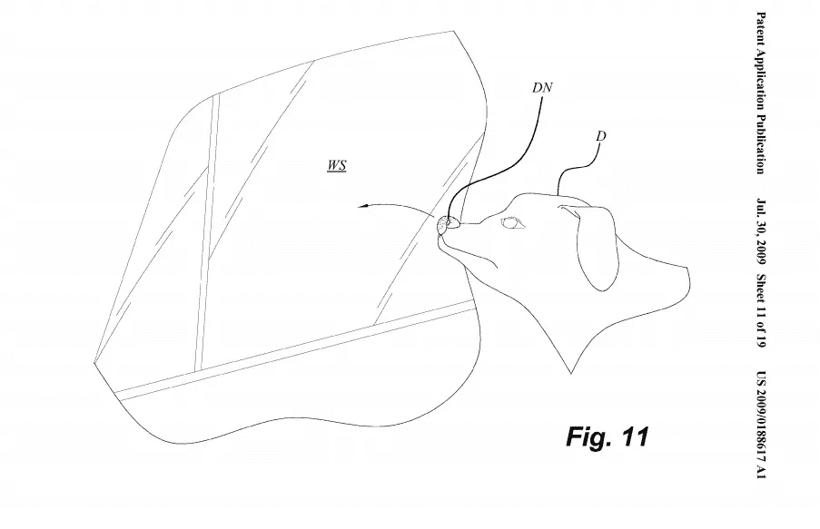
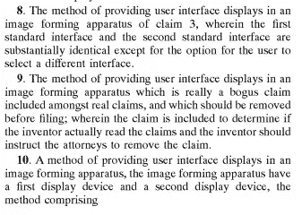
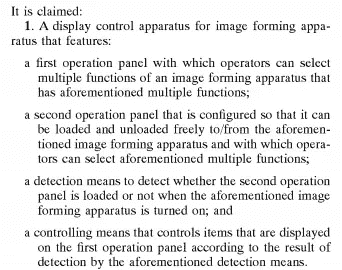
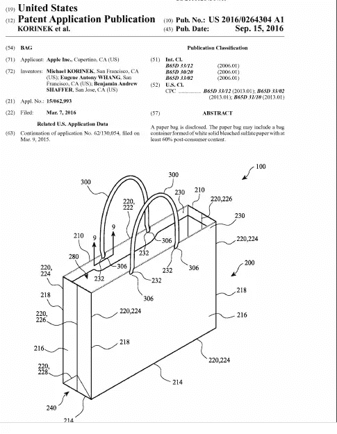

# 你知道苹果申请了纸袋专利吗？

> 原文：<https://medium.datadriveninvestor.com/did-you-know-apple-patented-the-paper-bag-de7eb3cd362c?source=collection_archive---------5----------------------->

## 一项你从未听说过的专利如何终结你的公司

所以，你绞尽脑汁，想出了一个改变世界的主意。这个想法不仅会让世界变得更好，还可能让你变得富有。在你开香槟开派对之前，你突然意识到:我或许应该以某种方式提出这个想法。

欢迎来到专利的奇妙世界。让我给你简单介绍一下。这是一个奇怪的领域，其运作的法则在某些时候更适合卡通。但是，这是一个你很快就会融入的世界。

除了你的好主意，这里还有一些已经获得专利的获奖者。

[US Patent# 5,443,036](https://patents.google.com/patent/US5443036A/en), Exercising Cat With Laser Pointer

你可能不知道，但是每次你用你的激光笔戏弄毛毛，你就侵犯了一项专利。从技术上讲，申请这项专利的人可以对你提起诉讼。尽管，这可能很难提起诉讼。

US Patent#[20090188617](http://www.freepatentsonline.com/y2009/0188617.html) — Dog Nose Art

显然，在你的狗的鼻子上画东西，让它用鼻子涂抹各种表面，也已经获得了专利。还不清楚你的狗鼻子上没有油漆就弄脏表面是否被索赔。这里有一个给你的主意。

US Patent Application [20040161257](http://www.freepatentsonline.com/20040161257.pdf)

权利要求 9 实际上在上述专利申请中列出。根据这份申请，申请人试图为复印机、传真机或打印机的用户界面申请专利…我想。他们声称，当你点击各种按钮和打印输出发生时，这是他们的想法。据我所知，这是他们所声称的，这是非常令人困惑的。

 [## 2020 年最佳短期投资选择精选资源|数据驱动型投资者

### 投资是增加你净财富的一个好方法。如果你通过遵循一个严格的…

www.datadriveninvestor.com](https://www.datadriveninvestor.com/2020/03/28/handpicked-resources-for-the-best-short-term-investment-options-of-2020/) 

这里是上述专利申请的第一项权利要求。我不知道这是否被批准，或者这是否意味着严重，但这是一个合法的申请。

Sounds Like Any And Every Computer Application Ever — [Free Patents Online](http://www.freepatentsonline.com/20040161257.pdf)

从技术上来说，如果这一主张被批准，它将涵盖所有具有打印功能的计算机程序。请记住这一点，这将是以后的重点。但是，我们现在继续找乐子。

除了上面的乐趣和游戏，你会很高兴地知道苹果公司为[纸袋](https://www.theguardian.com/technology/2016/sep/20/apple-patent-recycled-paper-bag)申请了专利(稍后展示)。不是任何纸袋，而是他们设计的纸袋。虽然它看起来有点像你家里的纸袋。所以，我不太明白这是怎么回事。但不用说，他们可以起诉任何制造类似纸袋的人。

一名来自澳大利亚的男子实际上也为[轮](https://www.drive.com.au/motor-news/melbourne-man-tries-to-patent-the-wheel-20100823-13hp4)申请了专利。或者他称之为“循环运输促进装置”。尽管根据 T2 史密森尼博物馆的记载，轮子的起源可以追溯到公元前 3500 年的美索不达米亚，他还是这样做了。但是之前没有人试图申请专利，所以这是一个待价而沽的机会。

在阅读了上面的混乱之后，你可以想象，各种各样的专利系统可能会被误用和滥用。

# 专利巨魔的攻击

> “他们提出，如果我给他们 5 万美元，他们就放弃对我的起诉。除了给他们现金，有时给他们海外银行账户，以避免缴纳所得税，专利流氓通常会要求你签署一份保密协议，所以你永远不能告诉任何人他们在做什么。”
> 
> ——奥斯丁·迈耶，在[福布斯](https://www.forbes.com/sites/johngreathouse/2019/11/08/this-entrepreneur-turned-a-nasty-patent-fight-into-a-compelling-film/#3aad8293bdf7)采访

奥斯汀·迈耶斯是个有趣的家伙。这位计算机程序员把飞行作为一种爱好。他最终拥有了自己的飞机，并将环绕加利福尼亚飞行。作为一名程序员，他也开始玩飞行模拟器。然而，所有现有的模拟器都让他感到沮丧——程序中没有他的特定飞机。

他最终制作了自己的模拟器，名为 [X-Plane](https://www.x-plane.com/) ，并开始在谷歌 Play 商店上销售。正如他在 Jordan Harbinger Show 的采访中解释的那样，有一天一名律师联系了他。这个打电话的人告诉奥斯汀，他将在对他提起的诉讼中代表他。显然，这个程序员因为专利侵权被起诉了。

这位律师解释说，如果案件继续进行，辩护费用至少要 300 万澳元。正如奥斯汀在播客中讲述的那样，那个美元数字突然让他的世界停了下来。这也将使他踏上一段奇怪的旅程，进入专利法的黑暗面。

奥斯汀解释说，在正常的法律中，被告被证明有罪之前是无辜的。然而在专利法中，被告必须证明他们没有侵犯专利。当他研究这份简报时，他也发现了一些惊人的东西。

原告的专利极其模糊(还记得打印功能专利申请)。专利[声明](https://www.x-plane.com/x-world/lawsuit/details/)当一台计算机与另一台计算机对话时，第二台计算机允许某事发生，这是他们的想法。原告起诉 Austin 是因为他在谷歌 Play 商店上卖了他的模拟器。

奥斯汀解释说，起诉他的实体什么也没做，什么也没创造。它只是拥有专利，其中许多是模糊的，并起诉人们捍卫他们。在普华永道[的一份报告](https://www.pwc.com/us/en/forensic-services/publications/assets/2014-patent-litigation-study.pdf)中，他们称这些公司为非执业实体(NPEs)。

他们在报告中指出，2013 年，67%的新专利侵权案件是由 NPEs 提起的。然而，只有 20%的最终裁决涉及这些相同的实体，这表明这些问题中的大多数是在庭外解决的-奥斯汀提到的 50，000 美元走开。

显然，当大多数人被巨魔起诉时，200-300 万美元的辩护费用通常会迫使他们放弃。《福布斯》文章将 2017 年的和解率列为 87%。

# 一个快乐的结局，算是吧

Apple’s [Patent](https://pdfaiw.uspto.gov/.aiw?Docid=20160264304&homeurl=http%3A%2F%2Fappft.uspto.gov%2Fnetacgi%2Fnph-Parser%3FSect1%3DPTO1%2526Sect2%3DHITOFF%2526d%3DPG01%2526p%3D1%2526u%3D%25252Fnetahtml%25252FPTO%25252Fsrchnum.html%2526r%3D1%2526f%3DG%2526l%3D50%2526s1%3D%25252220160264304%252522.PGNR.%2526OS%3DDN%2F20160264304%2526RS%3DDN%2F20160264304&PageN) Of A Paper Bag

> “我不会假装专利有效，付给他们钱，而是做完全相反的事情——推翻专利，不给他们任何报酬，然后拍一部纪录片。”
> 
> ——奥斯汀·迈耶，福布斯采访

根据《福布斯》和《乔丹先驱秀》的采访，奥斯汀并没有就此放弃。他解释说，如果他屈服，他不仅要付钱给巨魔，还要签署一份保密协议(NDA)。所以他也不能警告任何人。

他做了一些研究，发现起诉他的同一家公司也在同一时间就同一项专利起诉多家不同的公司。他联系了所有这些公司，他们提出了共同辩护，分担法律费用。

奥斯汀还会制作一部关于他实时经历的纪录片，名为[专利骗局](https://www.amazon.com/Patent-Scam-Austin-Meyer/dp/B0736G66P8)。奥斯汀最终赢得了这场官司，尽管这要花掉他将近 50 万美元，比巨魔的要价高出 10 倍。

尽管代价高昂，奥斯汀还是建议为自己辩护。他解释说，根据他的研究，当你向一个巨魔屈服时，更多的巨魔会过来攻击你。他还推荐共享防御方法。通常巨魔不只是起诉你一个人。

在《福布斯》的文章中，奥斯汀指出，最高法院也让专利原告在你现在居住的地方起诉你。大多数专利诉讼一度发生在东德克萨斯州的一个小地区，那里的法官不合理地偏袒原告。他还说，自从他的电影和辩护以来，庭外和解的价格平均大幅下降。

然而，尽管众所周知，巨魔并没有消失。丹尼尔·纳泽尔在 Eff.org 的一篇文章中描述了苹果最近卷入的一场专利诉讼。文件管理公司就是攻击奥斯汀的那家公司。苹果公司正试图驳回此案，因为这一指控是荒谬的。

然而，纳泽尔指出了这样一个事实，即公众无法审查这个案件。所有的文件都经过了大量的编辑(用黑色荧光笔覆盖)，公众中没有人能理解这个案件的内容。还记得奥斯丁描述的保护巨魔的 NDA 吗？

奥斯汀还报道了最近的一个案例，一个巨魔[起诉](https://arstechnica.com/tech-policy/2020/03/firm-uses-theranos-patents-to-sue-company-making-coronavirus-test/)一家冠状病毒测试制造商，该制造商使用了在 Theranos 破产期间从该公司购买的专利。

# 在你未来的努力中要小心

你可能一辈子都不会申请专利，但是，你很容易成为其中一个的受害者。当前的专利制度在很多方面都被打破了。奥斯汀解释说，专利局审查一项专利通常需要 4 个小时，但推翻一项不公平的专利可能需要 4 年时间和数百万美元。

在奥斯汀的案例中，他只成功推翻了一项针对他的专利。该专利列出了近 100 项与第一项几乎相同的其他权利要求。从技术上讲，申请人可以继续起诉其他人，永远起诉他。然而，一旦他反抗，他们就放弃了。

**奥斯汀有一些最后的个人和社会建议:**

*   如果你收到一封关于侵犯你从未听说过的专利或看起来很模糊的要求信，忽略它并存档。
*   传票不能被忽视，如果你得到这个你必须保护自己。在这种情况下，看看律师还在起诉谁，看看你是否能与其他被起诉的人分担辩护费用。专利流氓通常一次起诉一批人。
*   法律现在规定你必须在你的家乡被起诉——确保事实如此。如果巨魔不在一个友好的环境中，他们就不太可能坚持到底。
*   作为一个社会，我们必须请求国会议员终止方法专利。这是一项关于如何做某事的专利，而不是关于如何制造某物的专利——比如 iPhone 或汽车。还记得用激光笔锻炼猫的专利吗，那是方法专利。
*   作为一个社会，我们必须向国会议员请愿，禁止专利持有者起诉人们“使用技术”的行为。例如，起诉使用应用商店或无线网络的终端用户。
*   不应该允许 npe 存在。

*我也强烈推荐你看奥斯丁的电影，***【专利骗局】。一部分他变成了喜剧，因为法律是如此的荒谬。当你看到专利巨魔造成的人类大屠杀时，你也会感到愤怒。在何采访的企业主中，至少有 8 位完全成为律师的受害者，而这些律师对社会没有任何回报。许多这些业主甚至不能告诉你到底发生了什么，因为他们不得不放弃，并根据 NDA。**