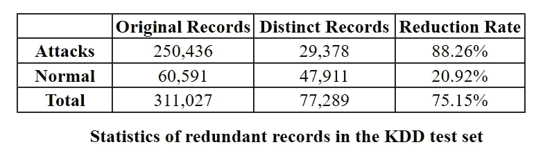
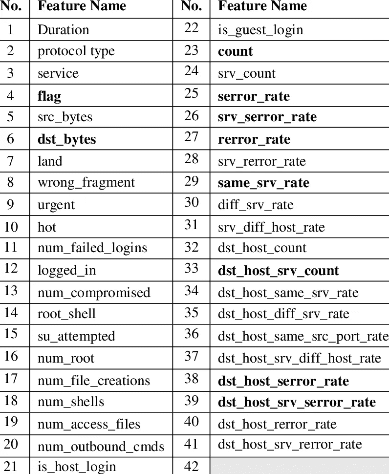
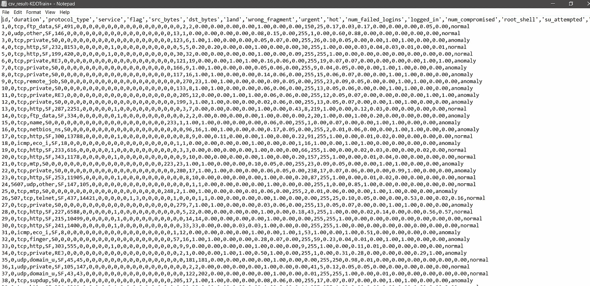
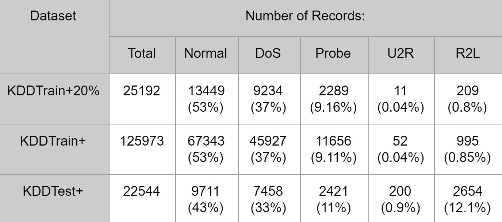

# “NSL-KDD”数据集最重要的东西

> 原文：<https://medium.datadriveninvestor.com/did-you-know-the-famous-data-set-called-nsl-kdd-293b39420c74?source=collection_archive---------1----------------------->

**NSL-KDD** 是 **KDD cup99** 数据集的更新版本，建议解决以前版本的一些问题。该数据集是研究人员比较不同类型的入侵检测系统(IDS)方法的有效基准，构建入侵检测系统(基于主机或基于网络)，在网络安全领域进行一些实验，如 wise 有很多优点。也有很多数据集(ADFA-ID，ISCX-UNB 等)在这个领域使用。所以让我们来讨论一下 NSL-KDD 数据集有哪些改进。

1.  测试集中没有重复记录。

2.在训练和测试数据集中有足够数量的记录可用。

3.从每个困难水平集合中选择的记录数量与原始 KDD 数据集中的记录水平相反。

NSL-KDD 中有 8 种不同的数据集。

1.  [**KDDTrain+。ARF**](http://nsl.cs.unb.ca/NSL-KDD/KDDTrain+.arff)
2.  [**KDDTrain+。TXT**](http://nsl.cs.unb.ca/NSL-KDD/KDDTrain+.txt) 完整的 NSL-KDD 列车集合，包括 CSV 格式的攻击类型标签和难度等级
3.  [**KDDTrain+_ 20%。ARFF**](http://nsl.cs.unb.ca/NSL-KDD/KDDTrain+_20Percent.arff)**KDDTrain+的 20%子集。飞机救援消防文件**
4.  **KDDTrain+_ 20%。TXT**KDDTrain+的 20%子集。txt 文件****
5.  ****[KDD test+。ARFF](http://nsl.cs.unb.ca/NSL-KDD/KDDTest+.arff) 带有 ARFF 格式二进制标签的 NSL-KDD 测试全集****
6.  ****[**KDDTest+。TXT**](http://nsl.cs.unb.ca/NSL-KDD/KDDTest+.txt) 完整的 NSL-KDD 测试集，包括 CSV 格式的攻击类型标签和难度级别****
7.  ****[**KDDTest-21。ARFF**](http://nsl.cs.unb.ca/NSL-KDD/KDDTest-21.arff)**KDD test+的子集。不包括难度等级为 21/21 的记录的飞机救援消防文件******
8.  ******[**KDDTest-21。TXT**](http://nsl.cs.unb.ca/NSL-KDD/KDDTest-21.txt)**KDD test+的子集。txt 文件，其中不包括难度级别为 21/21 的记录********

******在每个记录中有 41 种类型的特征，这些特征被分配给攻击或正常类型。每个特征被分为 3 种属性值类型。(标称、二进制和数字)******

******这是我之前说过的 **41 特征**的图片。******

********

****这所有类型的攻击类别基本上都被归类到 **4 部分**。****

1.  ****拒绝服务。****
2.  ****探测-监视和其他探测攻击。****
3.  ****U2R-对本地超级用户的未授权访问。****
4.  ****R2L-来自远程机器的未授权访问。****

****这是 NSL-KDD 训练数据集的图片。****

********

****Part of the training data set with CSV format****

****以下是不同类型的 NSL-KDD 数据集中正常数据和攻击数据的详细信息。****

********

****这是用于入侵检测研究的 NSL-KDD 数据集的基本分析。此外，有许多不同类型的技术和分类算法用于开发具有该数据集的 IDS。在未来，我会告诉他们使用 NSL-KDD 数据集作为实验的技术，以及我们如何使用这种数据集来开发入侵检测系统。再见！****