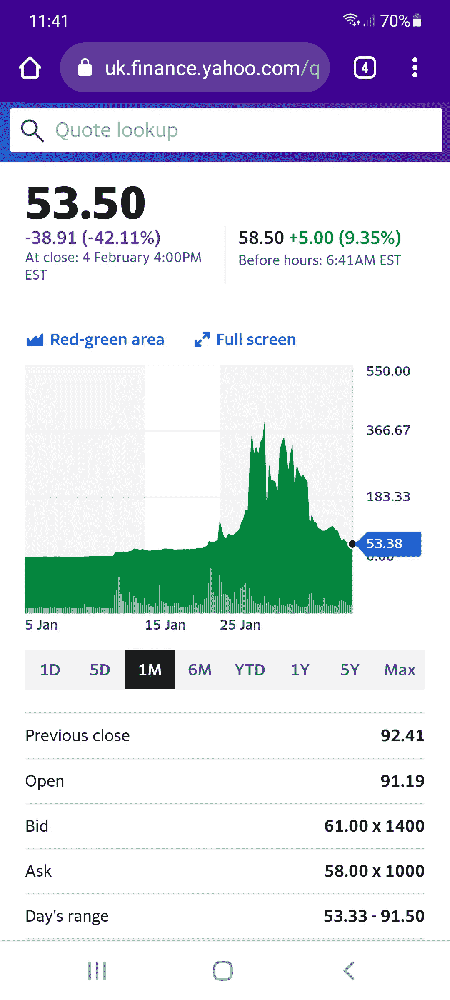
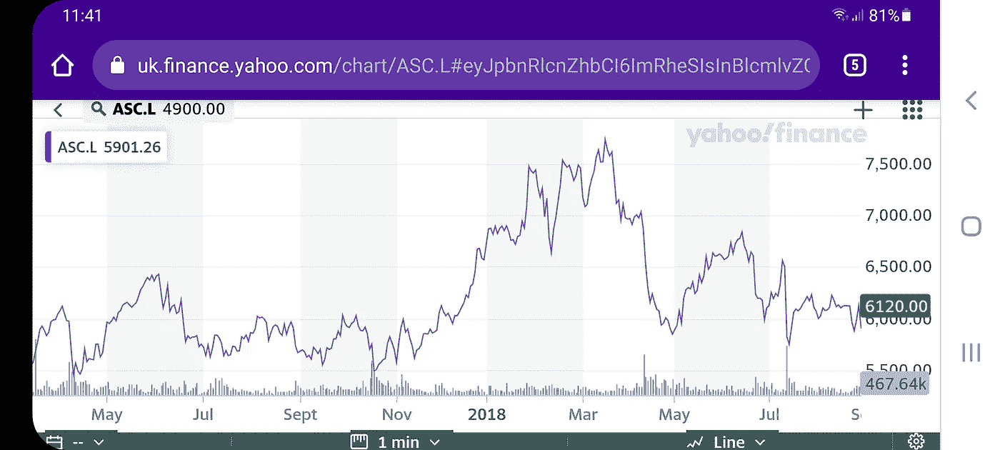

# 你错过了 GameStop 吗？

> 原文：<https://medium.datadriveninvestor.com/did-you-miss-out-on-gamestop-b57f8f749389?source=collection_archive---------25----------------------->

## 会有另一次淘金热

Photograph by Nasar Karim

你错过了 GameStop 吗？你会因为没有在一月份赚到 20 美元而自责吗？你会怎么做？也许你会在 483 美元的峰值时全部卖掉。这本来是明智之举，但该股已暴跌 90%以上，目前不到 55 美元。想象一下，如果你在股票 20 美元的时候买了 1000 美元！你会得到超过 23，000 美元的利润。你有更雄厚的财力吗？你能拿出 10，000 美元吗？如果时机合适，你可能会坐拥近 25 万英镑。

当然，事后看来，我们都有完美的时机。但这永远不会真正发生，因为我们无法预知未来。没有人预见到 GameStop 现象的到来。这就是为什么它让华尔街的许多人鼻子出血。少数交易员(至少一家对冲基金)赚了大钱，但大多数人都受到了伤害，因为围绕 GME 的买卖狂潮抹去了大约 300 亿美元的价值。

没有人能预知未来。即使是所谓的市场预测者。媒体喜欢渲染那些最终做出正确预测的人，而预测者将会得到他们所能得到的所有关注。这是一个很好的谋生方式。但是每个人都忽略了他们犯错误的所有时间，这是大多数时间。媒体不能卖新闻告诉你什么时候有人错了，这太正常了，也没什么意思。

谈论市场和身处市场完全是两码事。把你的钱用在你所说的地方会改变一切。恐惧、贪婪和希望会出现，它们会让你做出你永远不会相信的事情。即使是伟大的交易者，以巨大成功而闻名的宇宙主宰，也不能预知未来。约翰·保尔森在 2007-2008 年金融危机前做空房地产市场，赚了数十亿美元并一举成名。但他的不是点石成金。在那场改变人生的赌博前后，保尔森错的次数比对的次数多得多。即使是乔治·索罗斯，这位传奇的交易员和慈善家，在保尔森大获成功的几十年前通过做空英镑发了财，他的错误也远远多于他的正确。

大家口中的例外大概就是沃伦·巴菲特了。除了是一个全面的好人，巴菲特还是一个投资者和活动家，他有长远的眼光，并且非常擅长他所做的事情。几十年来，他积累了世界上最大的财富之一。这篇文章不是关于那种投资，在那里你有足够的时间坐下来等待你的基本面分析发挥出来。这篇文章是关于单个市场的波动，它可以让人们在短时间内赚到改变生活的钱。

GameStop 只是这些举措中最新的一个。从统计数据来看，我说对的几率比说错的几率高，如果我说你，读者，要么没有任何 GameStop 股票，要么如果你有，你几乎损失了所有的利润。交易是零和游戏。赢家的钱来自输家。因此，当少数人获得巨额利润时，很多人都在赔钱。大赢家总是少数人。

## 还能赚钱吗？

如果你确实在 GME 价格暴涨时袖手旁观，如果你在想象现在拿着所有这些快钱会做什么，我能感受到你的痛苦。你的一生可能会不同。GameStop 是你的大好机会。现在你永远也不会富有，你永远也不会还清债务，你永远也不会得到那栋房子，或者那辆车，你的余生都将为钱而担忧。该死的。

只不过不一定非要那样。你可以从市场中赚钱，但你唯一能做到的方式就是参与。当我听到人们说“但愿如此”时，我总是变得无动于衷。如果我在他们根本不在的时候以 X 价格进入就好了。你必须在市场上；何时进场是另一篇文章的主题(记住，你无法预测这样的走势)。一旦你进入，如果你能持有足够的股份，直到大的波动出现，你仍然有机会获得大的回报。

不久前，每个人都在谈论比特币。然后是以太坊。那是另一个赚大钱的机会。加密货币创造了许多百万富翁。事实上，它是过去十年中表现最好的资产类别。新兴市场(如加密货币)提供了巨大的回报，但也容易出现许多骗局。但是，有很多成熟的股票和商品可供你开始积累财富。70 年代末的黄金牛市让很多人变得富有。最近，在线服装零售商 ASOS 的股票出现了一些大趋势，在上涨和下跌的过程中都有赚钱的机会。看看 2018 年 11 月到 2019 年 4 月之间的价格动作，再看看 4 月到 5 月的跌幅。两个赚钱的机会，先稳步上升，然后通过卖空快速下降。就在十多年前，ASOS 也有过梦幻般的发展。我参与了这一趋势，这让我赚了一年多的钱。

Photograph by Nasar Karim

ASOS 只是富时 100 指数中的一只股票。富时 100 指数只是众多指数中的一个。尽管它是较为成熟的指数之一，但仍有足够多的大幅价格波动。它们都是赚大钱的机会。因此，如果您错过了 GameStop，请不要担心。涨跌如此之快，以至于在正确的时间进出的机会微乎其微。缓慢持续的移动给你一个更好的机会。

还会有更多大的价格变动。在少数情况下，它们与基本面有关，但大多数波动都是由于“群众的疯狂”基于情绪的疯狂买卖。推动市场的是人类心理，通常基本面只是事后解释，并随着市场的发展而改变。也就是说，如果你开着法拉利在公路上兜风，你会玩得很开心，你不会在乎引擎的内部工作原理或空气动力学。那么，在这个节骨眼上，谁会在乎这是不是基本面呢？站在大趋势的正确一边是一种享受。至于 GameStop，如果你赚了钱，干得好。如果你错过或损失了钱，把它记在经验上。你会再有机会的。将会有另一次淘金热。