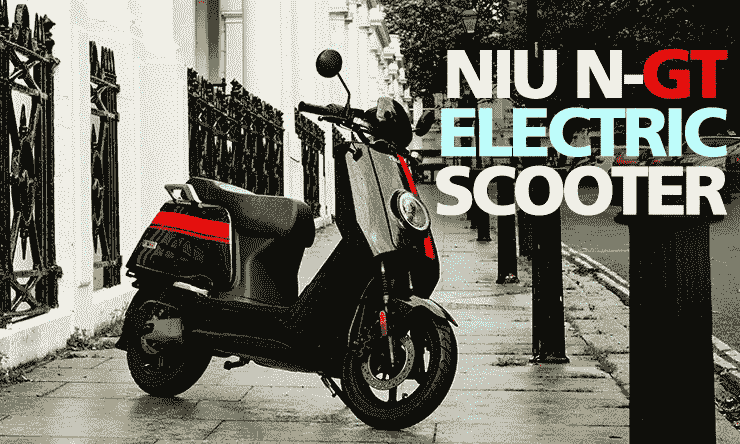
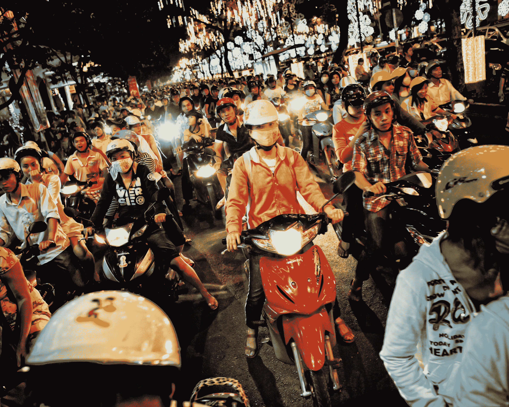
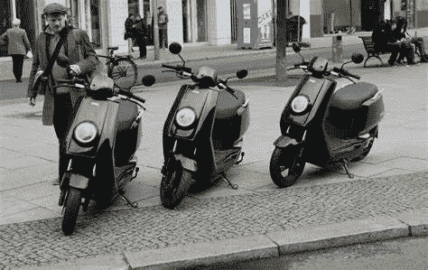

# 你错过特斯拉了吗？

> 原文：<https://medium.datadriveninvestor.com/did-you-miss-out-on-tesla-71dec6826938?source=collection_archive---------30----------------------->

## 你应该去看看牛

NIU N-GT Scooter photo by Motorcylesdata.com

试图弄清楚你是否应该尝试加入这场电动汽车技术革命？

你看到现在迷因股票暴涨了吗？

错过了尼奥、尼可拉、李、塞里蒙。所有这些潜在的 10 个乞丐，以及你一生中最大的赚钱潜力？你已经错过火车了吗？

都在过去几个月里暴涨。仿佛世界将大规模转向电动汽车，关掉恐龙果汁龙头，沙特阿拉伯将回到中世纪，雾霾明天将神奇地从北京消失。

**电动汽车革命**

看起来我们遇到了一个神奇的情况，将这些公司变成了巨人和潜在的未来。

人们越来越渴望一个更清洁的世界，像 Robinhood 这样允许孩子们在手机上投资的应用程序，刺激检查和增加失业救济，以及蓬勃发展的货币供应。

好吧，这是有点刻薄。但我保证，我不是来争论特斯拉不值他们现在的市场价。他们的技术显然是世界一流的。销售正在回升，他们在去年实现了盈利，Elon 使用 Spaceball 的引用来命名技术特征。作为一个 80 年代的孩子，我被出卖了。

我有点担心其他一些股票。一些公司似乎在利用其股价的上涨进行二次发行，以获得更多现金。这是件好事，因为这给了他们持续开发技术的低成本资本。但糟糕的是，从某种意义上来说，他们显然需要现金，并迅速抓住了这个机会。聪明当然，但我不确定他们是否都能够明智地使用这笔钱，让他们的公司更上一层楼。

也就是说，他们不会都成为赢家。这让我感到害怕，因为我不想看到投资在不久的将来暴跌。

那么，在 2020 年，还有什么事情没有发生呢？

**我也基本错过了**

我承认，我错过了特斯拉，过去几年一直在自责。当我发现中国的特斯拉(即 Nio)时，我去年确实买了一些股票。但对规模较小、相对不知名的中国股票深表怀疑的只是少数几只股票。考虑到最近的上涨，没有我希望的那么多。

**还有什么剩下的吗？**

好吧，我找到了一只还没爆的潜在电动汽车股。这看起来是个不错的赌注。

牛科技(牛)。是的，它的股价今年涨了两倍。但与 2B 市值为 10 亿美元的其它股票相比，它仍相对便宜。因为它已经实现了盈利。

牛基本上是特斯拉或 Nio，但两轮车。即踏板车、摩托车等。

牛目前的大部分销售在中国。在过去四年中，他们每年以大约 25%的速度增长，2020 年第三季度的收入为 1.36 亿美元，同比增长 36.7%。尽管在 2020 年亚洲的两轮车受到了打击，正如下面引用的美联社新闻所指出的。

> “亚洲国家是 2Ws 的最大市场，尤其是印度、中国、越南、印度尼西亚和泰国。在新冠肺炎危机之前，新的 2w 汽车以每年近 2000 万辆的速度售出，即每 6 个月售出 1000 万辆。然而，在 2020 年的前六个月，如果供应链完全开放，这个数字估计将减少到 40%或大约 400 万个 2w。欧洲和北美市场没有受到太大影响，因为不是所有的零售商都关门了，而且传统销售额从未像亚洲那样大。然而，随着全球经济开始开放，2W 行业将会看到被压抑的需求得到释放，销售激增。”

让我告诉你我上面提到与 Nio、Plug 等相关的完美融合。我真的认为这将为这家公司带来好处。这就是为什么我认为它会。

 [## 这么说一家大型风投基金正在投资你的初创公司？4 实际考虑|数据驱动的投资者

### 首先，恭喜你。融资总是需要努力的，一个大的风险投资基金当然是一个大的…

www.datadriveninvestor.com](https://www.datadriveninvestor.com/2020/08/09/so-a-big-vc-fund-is-investing-in-your-startup-4-practical-considerations/) 

有人去过中国吗？印度？越南？

Photo by [Matthew Nolan](https://unsplash.com/@mdnolan?utm_source=medium&utm_medium=referral) on [Unsplash](https://unsplash.com?utm_source=medium&utm_medium=referral)

不幸的是，这也导致了这一点

Photo by [Abhay Singh](https://unsplash.com/@abhay?utm_source=medium&utm_medium=referral) on [Unsplash](https://unsplash.com?utm_source=medium&utm_medium=referral)

雾霾问题导致中国制定了限制燃气动力汽车和推广电动汽车的指令。而印度、越南等。我还没有做到这一点，我认为在不久的将来，政府的影响力将开始推动这些国家和其他亚洲国家采用电动汽车来解决烟雾问题。

总而言之，在亚洲，我们的社会比美国或欧洲以汽车为中心的社会更倾向于两轮车。

这是由于中位收入较低、中位年龄较低、基础设施质量较低和城市密度较大。

这是我的假设。

牛因其在电动汽车领域的地位而引起了一些关注，但远不及上述其他公司。这是因为典型的西方投资者无法从亚洲的角度看问题。

基本上，当典型的美国罗宾汉投资者将资金投入到他们认为会赚钱的电动汽车股票时。他们认为汽车，卡车，越野车。如果他们生活在亚洲，他们会想到两轮车。

此外，我喜欢这是一家拥有真正滑板车的真实公司，虽然我上面提到他们主要在中国，但他们确实已经开始在中国以外销售。

这张来自德国的照片降低了我对这是另一个幸运儿的怀疑。

NIU scooters photo from ft.com

注意，我不是财务顾问。我不建议任何人购买这支股票。目前，它可能是也可能不是一只好股票，永远记住购买任何股票都有风险和回报。请做好你自己的尽职调查。

**进入专家视图—** [**订阅 DDI 英特尔**](https://datadriveninvestor.com/ddi-intel)