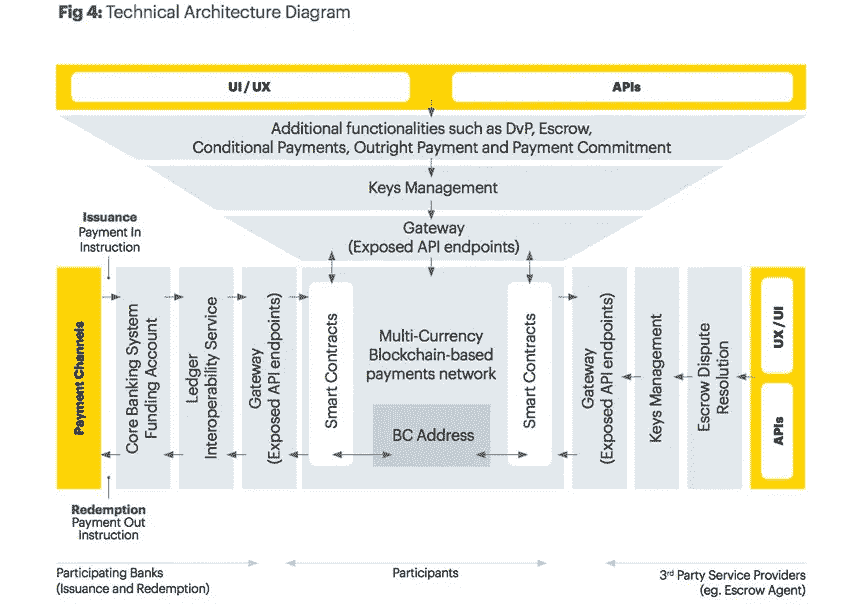

# 滴滴出行试用中国的 CBDC / Instapay 推出农民工电子钱包/ G20 的数字支付框架

> 原文：<https://medium.datadriveninvestor.com/didi-trialing-chinas-cbdc-instapay-launches-e-wallet-for-migrant-workers-g20-s-framework-for-d7bee6d06493?source=collection_archive---------13----------------------->

*2020 年 7 月 15 日*

***本周风景*** *…* ***新加坡*** *决定让世界其他地方知道他们多年来一直在开发和试验一个区块链驱动的支付系统，名为“****Ubin****”的项目。在* ***、JP 摩根*** *、新加坡* ***金融管理局(MAS)*** *和* ***淡马锡*** *的努力下，这是新加坡迈出的重要一步，使他们能够绕过央行数字货币(CBDC)。尽管全球许多政府都在迅速努力理解——即使是****【G20】****也已经介入，帮助围绕这些和数字支付建立一个框架，此外，各地的金融系统都在接受严密的评估(参见****Wirecard****再往下看)，而地区性的* ***中国*** *一直在他们的****CBDC*这只是开始。各地的金融基础设施都在推动数字化，不要指望它会放缓，如果它会加速的话！****

我们也有一些令人兴奋的金融科技和 DeFi 行业关键公司的融资消息。再加上 CoinDesk 的一份报告，让我们难得一见地了解了***crypto****是如何真正用于* ***委内瑞拉*** *等等。尽情享受吧！*

## 🚘[打车巨头滴滴出行试水中国央行数字货币](https://www.coindesk.com/chinas-uber-didi-said-to-trial-pbocs-central-bank-digital-currency)

打车巨头滴滴出行正在组建一个特别工作组，在其交通平台上设计和实施中国央行数字货币(CBDC)的测试。他们与中国人民银行(PBoC)数字货币研究所建立了战略合作伙伴关系，以加速 CBDC(即数字货币电子支付)的应用。测试阶段正在中国的四个城市进行，麦当劳、星巴克和赛百味等选定的商业商店以及政府机构将参与测试… [阅读更多信息](https://www.coindesk.com/chinas-uber-didi-said-to-trial-pbocs-central-bank-digital-currency)

## 💸 [Instapay 推出农民工电子钱包吸引 10 万用户](https://fintechnews.my/24301/e-wallets-malaysia/instapay-e-wallet-migrant-worker/)

Instapay 正在推出一项针对农民工群体的电子钱包服务，使雇主能够将农民工的工资支付数字化，从而降低现金处理的成本和风险。该公司持有马来西亚中央银行的电子货币许可证，并与万事达卡合作开发与电子钱包相关的预付费支付卡。电子钱包还包括汇款功能，允许农民工每月给他们的亲人寄钱……[了解更多](https://fintechnews.my/24301/e-wallets-malaysia/instapay-e-wallet-migrant-worker/)

## 🏦[新加坡跳过 CBDC，使用区块链支付系统“Ubin 项目”](https://thedailychain.com/singapore-skips-cbdc-with-blockchain-powered-payments-system-project-ubin/)

Source: [Ledger Insights](https://www.ledgerinsights.com/libra-ec-response-redemption-e-money-regulations/)

新加坡披露了一个由区块链驱动的国际结算支付系统，被称为 Ubin 项目。新加坡金融管理局(MAS)和国家投资者淡马锡(Temasek)已经完成了该项目的第五个也是最后一个阶段，这个项目已经持续了多年……[阅读更多](https://thedailychain.com/singapore-skips-cbdc-with-blockchain-powered-payments-system-project-ubin/)

*值得注意的是，柬埔寨(以及其他国家)正在开发一个类似的基于区块链的支付系统，而不是 CBDC——被称为“巴空项目”—资料来源，分类帐洞察。*

## 🏦 [G20 为接受数字支付奠定监管基础](https://cointelegraph.com/news/g20-lays-regulatory-groundwork-for-accepting-digital-payments)

来自 19 个国家和欧盟的代表将参加 G20 峰会，为接受数字支付奠定基础。这些变化预计将于 10 月份开始，大概是在 DC 举行的 20 国集团财长和副手会议上，以及 11 月份的下一次峰会之前……[阅读更多信息](https://cointelegraph.com/news/g20-lays-regulatory-groundwork-for-accepting-digital-payments)

## 🏦[银行业对数字化转型的错觉](https://www.forbes.com/sites/ronshevlin/2020/07/06/bankings-delusions-of-digital-transformation/)

冠状病毒危机帮助加速了银行业的数字化转型，因为银行业似乎对此深信不疑。Boston Consulting Group 题为《新冠肺炎将从根本上加速零售银行业的数字化转型》的新闻稿证明，后危机时代，25%的消费者计划减少使用银行分支机构或完全停止使用……[阅读更多信息](https://www.forbes.com/sites/ronshevlin/2020/07/06/bankings-delusions-of-digital-transformation/)

## 🇧🇷 [巴西电信，金融科技冲浪集团据说计划首次公开募股](https://www.bloomberg.com/news/articles/2020-07-09/brazil-telecom-fintech-surf-group-is-said-to-plan-ipo)

据知情人士透露，总部位于圣保罗的移动网络运营商 Surf 计划进行首次公开募股(IPO)。IPO 规模的目标尚未设定，Surf 的代表也拒绝置评。Surf 经营一家金融服务公司，提供数字银行账户、信用卡和贷款……[阅读更多信息](https://www.bloomberg.com/news/articles/2020-07-09/brazil-telecom-fintech-surf-group-is-said-to-plan-ipo)

## 💳 [Wirecard 调查引发对金融科技公司审计方式的审查](https://www.wsj.com/articles/wirecard-probe-brings-scrutiny-to-how-fintech-companies-are-audited-11594223998)

Wirecard 丑闻让人们开始关注公司审计的有效性。Wirecard 在 6 月 18 日表示，其审计机构安永会计师事务所(Ernst & Young)无法证实信托账户中存在 20 亿美元资金。审计师可能没有完全掌握新兴行业的商业模式，也不知道它们如何解释复杂的交易……[阅读更多](https://www.wsj.com/articles/wirecard-probe-brings-scrutiny-to-how-fintech-companies-are-audited-11594223998)

# 更多见解:

📖 [Visa 合作伙伴 Zap 筹集 350 万美元扩大比特币支付](https://www.forbes.com/sites/michaeldelcastillo/2020/07/15/visa-partner-zap-raises-35-million-to-expand-bitcoin-payments/)

📖 [VMware 投资数字资产，DAML 的创造者](https://blog.digitalasset.com/press-release/digital-asset-creators-of-daml-adds-vmware-as-investor-in-series-c-round-1594685906392)

📖[金钱乐高:DeFi 中国制造](https://decrypt.co/34622/money-lego-defi-made-in-china) — [解密](https://medium.com/u/2de7a312127a?source=post_page-----d7bee6d06493--------------------------------)

📖 [DeFi lending protocol Aave 从 Framework Ventures 和 Three Arrows Capital 筹集了 300 万美元](https://www.theblockcrypto.com/post/71559/defi-lending-protocol-aave-raised-3-million-from-framework-ventures-and-three-arrows-capital)

📖[数字资产之路](https://securities.bnpparibas.com/insights/road-to-digital-assets.html)—法国巴黎银行

# DeFi 兔子洞:

## 🇻🇪 [对加密技术在委内瑞拉实际应用的罕见一瞥](https://www.coindesk.com/airtm-airdrop-venezuela-crypto-donation-results)

委内瑞拉提供了一个比特币使用的例子，因为用户似乎对正规金融科技公司提供的比特币友好服务有需求。简而言之，人们信任服务提供商，即使他们偶尔会选择自己持有少量比特币。服务提供商让他们更容易跨境交易或清算比特币。其他有特殊需求的用户需要大量的计划和准备，才能直接使用比特币，成为他们众所周知的银行家……[阅读更多](https://www.coindesk.com/airtm-airdrop-venezuela-crypto-donation-results)

## 📖[在埃尔隆德部署流动性聚合& DeFi 产品的 Orion 协议](https://www.elrond.com/blog/orion-protocol-to-deploy-liquidity-aggregation-defi-products-on-elrond/)

埃尔隆德网络是一个智能合同平台，旨在实现互联网规模的性能。鉴于埃尔隆德每秒可以处理超过 10，000 笔交易，延迟时间为 5 秒，交易成本比以太坊低 100 倍，因此它有望实现 DeFi 生态系统的显著增长。另一方面，Orion Protocol 是 DeFi 领域的新兴参与者之一，希望利用我们全面的工具集和可扩展的架构来部署其流动性聚合功能。这两个合作伙伴希望尝试一个类似 IEO 的筹资平台，使感兴趣的参与者能够利用抵押担保作为资格标准来获得投资机会……[阅读更多信息](https://www.elrond.com/blog/orion-protocol-to-deploy-liquidity-aggregation-defi-products-on-elrond/)

## 📖[三大区块链公司合作开发支付被动收入的 DeFi 产品](https://cointelegraph.com/news/3-big-blockchain-companies-teamed-up-on-a-defi-product-that-pays-passive-income)

三大区块链公司 Cosmos、Polkadot 和 Terra 联手推出了一款名为 Anchor 的新 DeFi 储蓄产品，旨在为 stablecoins 存款提供可靠的利率。用户将从这些赌注奖励中获得被动收入。参与制作 Anchor 的公司计划在今年第三季度末在各自的区块链推出……[阅读更多](https://cointelegraph.com/news/3-big-blockchain-companies-teamed-up-on-a-defi-product-that-pays-passive-income)

 [## 金融科技的全球趋势|数据驱动的投资者

### 各国可能已经封锁了边境，以减轻新冠肺炎疫情，但当地和国际贸易必须去…

www.datadriveninvestor.com](https://www.datadriveninvestor.com/2020/04/28/global-trends-in-fintech-technology/) 

📣*想要了解区块链、DApps、DeFi 和 FinTech 行业的所有头条新闻、投资、深入研究和最新动态吗？* [***订阅***](https://www.topionetworks.com/newsletters) *并关注我* [***推特***](https://twitter.com/kyleellicott) *获取每周更新及更多！*

**访问专家视图—** [**订阅 DDI 英特尔**](https://datadriveninvestor.com/ddi-intel)