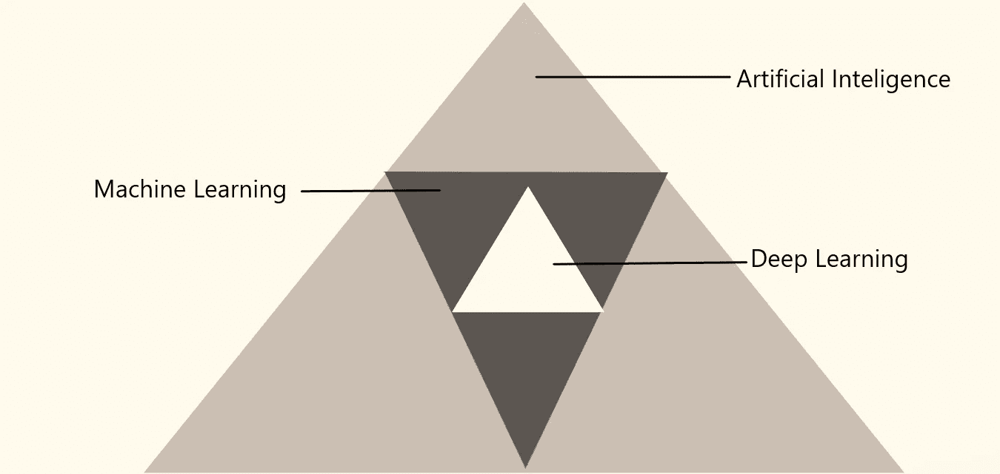

# AI vs ML vs DL 的区别

> 原文：<https://medium.datadriveninvestor.com/difference-between-ai-vs-ml-vs-dl-d6382f851dcb?source=collection_archive---------4----------------------->

image by Oracle

人工智能是一个边界 ambarella，机器学习和深度学习就是在这个边界下出现的。然而，人工智能是一种使机器能够模仿人类行为的技术。机器学习是人工智能技术的一个子集，它使用统计方法使机器能够随着经验而改进。深度学习是一种特殊的机器学习，其灵感来自于我们大脑的功能，称为神经元，这导致了人工神经网络的概念。

AI vs ML vs DL

AI、ML 和 DL 是彼此的子集。

有一些依赖关系，在此基础上我们可以更好地理解这个概念。

*   数据依赖性。
*   硬件依赖性
*   特征工程
*   问题解决方法
*   执行时间。

# **数据相关性**

当数据很小时，深度学习的表现不好，因为要完全理解它需要大量的数据。而机器学习算法可以轻松地处理较小的数据集。

# **硬件依赖**

深度学习严重依赖于高端机器，而机器学习算法也可以在低端机器上工作。

深度学习需要 GPU，因为它需要大量的矩阵乘法运算，并且只有使用 GPU 才能有效优化运算。

# 特征工程

在机器学习的情况下，大多数特征是由专家识别的。机器学习算法的性能取决于如何准确地识别和提取特征。

在深度学习中，它试图从数据中学习高级特征。深度学习减少了为每个问题开发新的特征提取器的任务。

# **解决问题的方法**

当使用传统的机器学习方法解决问题时，通常建议首先将问题分解成子部分来单独解决它们，然后最终将它们组合起来以获得期望的结果。在深度学习算法中，端到端地解决问题。

例如，假设有一个任务来识别什么是对象以及它出现在图像中的什么位置。

ML 方法:首先把问题分成两步:

*   目标检测
*   物体识别

结合之后，我们知道了什么是目标，以及它在图像中的位置。

DL 方法:让我们以 Yolonet 为例。这是一种深度学习算法，当图像通过时，它会给出对象的位置和名称。

# 执行时间

通常深度学习算法需要很多时间来训练，因为深度学习算法的参数很多，这使得训练比通常的训练更长。它可能需要两个多星期。而机器学习需要更少的训练时间。

在测试数据时，执行时间完全相反。在测试期间，深度学习算法需要更少的时间来运行，而在 ML 测试中，时间会随着规模的增加而增加。

可能有一些其他因素会影响他们，但我发现以上这些是有用的。通过这些任何人都可以很容易地理解背后的概念。