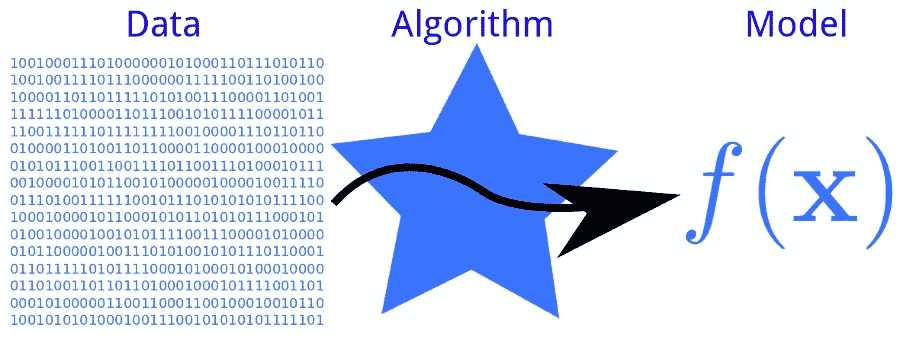
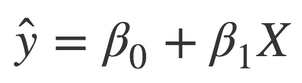
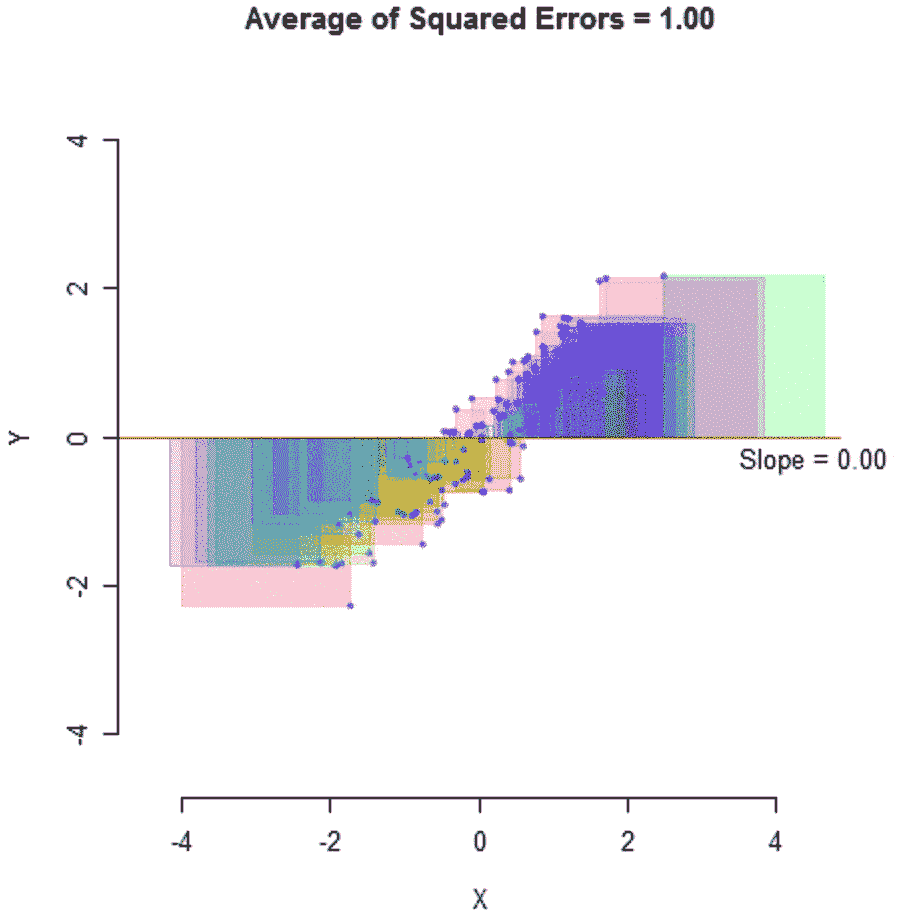
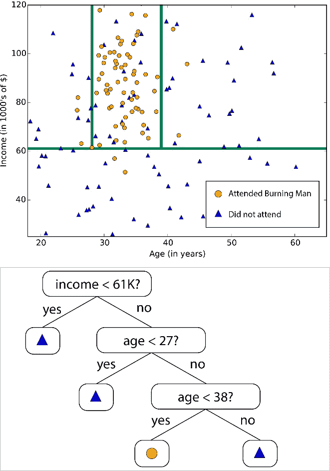

# 最大似然算法和最大似然模型的区别

> 原文：<https://medium.datadriveninvestor.com/difference-between-an-machine-learning-algorithm-and-model-14879f4aec7b?source=collection_archive---------1----------------------->

[source](https://blogs.bmj.com/technology/files/2017/05/data-algorithm-model.png)

机器学习初学者的一个常见困惑是“*机器学习算法*和“*机器学习模型*的区别。这两个术语经常互换使用，这使得它更加令人困惑。

事实上，我正在写另一篇关于机器学习的中型文章，我自己也遇到了这个难题！那么，它们是一回事吗？

> 简单的答案是 ***不*，**机器学习算法就像一个 ***过程*** 运行数据来寻找模式和规则，这些模式和规则被存储并用于创建一个机器学习模型，该模型就像一个 ***程序*** 可用于进行预测。

# 什么是算法？

机器学习"*算法*"本质上是一个用来在数据中寻找模式并从数据中学习的过程。它通常被称为数据集上的“ *fit* ”，这意味着它被应用于数据集。

 [## 肖尔算法:RSA 的克星|数据驱动的投资者

### RSA 加密是一种公钥加密系统。这意味着它有一个所有人都可以访问的公钥和一个私钥…

www.datadriveninvestor.com](https://www.datadriveninvestor.com/2020/05/25/shors-algorithm-the-bane-of-rsa/) 

有许多不同类型的算法，有许多不同的功能和目的。三个主要的是:

*   **回归:**用于输出为连续值的预测，如逻辑回归。
*   **分类:**用于进行输出为分类值的预测，如 K-最近邻。
*   **聚类:**用于将相似的事物或数据点分组为簇，如 K-Means。

它们类似于计算机科学中的其他算法，同样也有数学基础。例如，简单的线性回归算法由熟悉的等式表示

[source](https://www.sharpsightlabs.com/blog/linear-regression-in-r/)

其中 ŷ是 y(因变量)的预测值，x 是 x(自变量)的值，β1 是直线的斜率，β0 是常数。

然后，对数据运行该算法，并尝试优化，调整斜率和常数，通过最小化误差量来实现最大效率，误差量由误差平方的平均值来衡量。

(For other algorithms, the measure of error and adjusted terms may be different) [source](https://m325.com/linear-regression-from-scratch/)

# 什么是模型？

一个机器学习“*模型*”*是“*算法*的输出被存储的地方。它表示从算法“*训练*”中学习到的数据，并保存算法的一组特定特征。*

*   *线性回归模型存储最适合数据的系数和常数的向量。*
*   *决策树模型存储对应于各个分支的 if-then 语句集。*
*   *神经网络模型存储与反向传播和梯度下降的独立矩阵相关的权重和偏差。*

**

*example of a decision tree model. [source](https://docs.microsoft.com/en-us/azure/machine-learning/how-to-select-algorithms)*

*该模型可以保存以供以后使用，并作为一个程序，使用算法中以前存储的特征来进行新的预测。如果模型被有效且充分地训练，它可以被用于对相似数据做出更多的预测，达到一定的准确度和置信度。*

# *算法 vs 模型*

*既然我们知道了什么是算法和模型，就更容易理解它们之间的关系了。如前所述，对数据运行算法来创建模型。*

*该模型由数据和如何使用数据对新数据进行预测的过程组成。这个过程几乎就像一个预测算法。*

*但是，并非所有模型都存储预测算法。一些算法，如 k-最近邻算法，存储整个数据集作为预测算法。然而，这都是基于你的模型所服务的目的。*

*我们本质上想要一个机器学习“*模型*”，并不太关心它背后的算法。但是，知道将哪种算法应用于模型以产生最佳结果是很重要的。但是一旦你知道了这一点，在你拥有一个完美的工作模型之前，只需要几行代码和几个层次的交互。*

# *摘要*

*   *机器学习算法是在数据上运行的程序，用于发现模式和学习*
*   *机器学习模型是算法的输出，由数据和预测算法组成。*
*   *机器学习算法提供了一种[自动编程](https://machinelearningmastery.com/difference-between-algorithm-and-model-in-machine-learning/)，其中机器学习模型代表程序本身*

***访问专家视图—** [**订阅 DDI 英特尔**](https://datadriveninvestor.com/ddi-intel)*