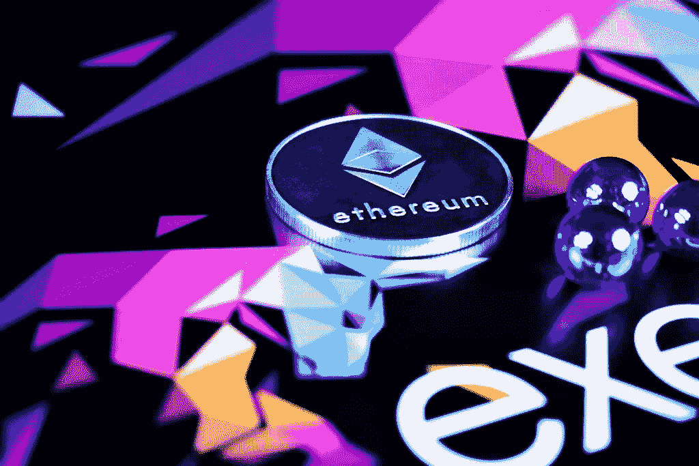

# 加密货币和代币的区别

> 原文：<https://medium.datadriveninvestor.com/difference-between-cryptocurrency-tokens-5bd993ae09da?source=collection_archive---------15----------------------->

对于新手来说，区分代币和加密硬币可能是一个挑战。鉴于所有的术语和复杂性，理解区块链技术和加密货币并不容易。因此，这种复杂性成为许多好奇并想参与这个世界的人的障碍。

**加密货币简介**

区块链就像一本账本；每个块是事务的一个时期。区块链上的每个人都会记录这些交易，一旦交易完成，这些交易就会被锁定。然后下一个积木开始一个接一个地建立在前一个积木的上面。任何加密货币用户都没有硬币或代币，而是有一把钥匙，允许他们进入区块链，向目的地申报硬币或代币交易。类似于银行账户之间的资金转移。

 [## Azbit 旨在连接传统金融和加密货币|数据驱动的投资者

### Azbit 是下一个提供交易平台的加密项目，该平台提供保证金和算法交易。一样多…

www.datadriveninvestor.com](https://www.datadriveninvestor.com/2019/03/20/azbit-aims-to-connect-traditional-finance-and-cryptocurrency/) 

加密货币或数字硬币通常有一个至关重要的目的:作为一种交易模式。比特币是有史以来开发的第一种加密货币，它消除了法定货币。比特币的设计使用了可信且稳定的分散式公共账本，也就是区块链。该设计确保两点之间的快速、安全和可负担的交易。它主要表示用于交换服务和商品的加密硬币的价值，有点像物物交换系统。

加密硬币和代币是加密货币的一种形式，虽然它们有相似之处，但它们有很大的不同。它们都运行在区块链技术上，也进行类似的交易。加密硬币独立于任何平台，而代币需要另一个平台存在。硬币被用作货币，但代币有更广泛的应用。

加密硬币的主要目的是进行支付或金融交易。相比之下，令牌有助于在区块链内使用分散式应用程序所采用的各种功能。尽管如此，硬币可以是多功能的。

以太是一种建立在以太币上的代币，是智能合约的燃料。智能合约是一种软件程序，它验证和控制两个给定方之间的数字货币或资产交易。智能合同存在于分散的区块链网络中。

每枚硬币都有一个区块链本地的优势，它的能力和活动只在它们特定的区块链上。每种加密硬币最初都是通过初始硬币发行(ICO)从区块链引入的，ICO 允许个人付费获得在区块链内使用的任何加密硬币。当这些加密货币/硬币的价值上升时，加密所有者可以获利；这可以通过使用各种数字货币平台来有效管理，如比特币基地、币安和北海巨妖。证券交易所加密硬币价值大幅上涨的最著名例子是比特币，其价值从 2017 年 7 月 21 日的 2，825.27 美元飙升至 2017 年 12 月 15 日的 19，650.01 美元。

什么是加密世界中的令牌？

代币经常被误解为数字硬币。然而，有一个巨大的差异。

令牌被定义为在现有区块链上创建的单位值。一般来说，代币是代表生态系统中的价值、股份、投票权等的东西。任何人都可以根据自己的需求在给定的平台上创建令牌。创建这些令牌的个人通常被称为“开发人员”开发者在创建这些代币时以某种本地货币支付区块链。一旦创建，令牌通常用于启动应用程序根据其设计可以提供的许多功能。

加密令牌的用途不仅仅是授权用户访问分散的应用产品和服务。一些代币用作资产或投资，而其他代币也用作货币。

代币用于在首次硬币发行(ICO)中筹集股票，这是一个类似于在证券交易所上市的公司首次公开发行(IPO)的概念。在初始硬币发行中购买的代币代表在一个组织中的股份，或者可以给予用户对该组织的决策的投票权。

# 代币与硬币:它们的目的

为了区分令牌和加密硬币，必须理解上述的重要用途。

加密硬币大多被用作货币，这被认为是显而易见的。

反正很多硬币除了充当货币还有其他用途。例如，币安，这是一个著名的密码交易所，有自己的令牌 BNB(币安令牌)。当一个人使用这个代币进行交易时，费用会减少 50%。

BAT，Basic Attention Token 旨在建立一个数字内容创作者、广告商、内容出版商和互联网用户都受益的系统。与此同时，脸书和 YouTube 等不称职且具有侵略性的中间商平台最终会被淘汰。

音乐是建立在 Musicoin 平台上的一个令牌，允许其用户访问不同的功能，观看音乐视频或播放歌曲。作为奖励，用户可以免费使用所有功能，没有广告，易于分享，独立艺术家立即获得报酬。

以$SNT 表示的地位是建立在以太坊之上的。它在移动设备上运行 go-ethereum (geth)，允许用户将他们的小工具变成以太节点。地位可以让用户从事挖矿，让以太坊网络更强大。

Mithril 是一个建立在 Etheruem 之上的去中心化社交媒体平台。ERC-20 **MITH** 是建立在这个区块链上的代币，奖励内容创作者和对其社交网络的贡献。

WPR 令牌是代表物理实体的令牌的一个很好的例子；它代表电。WPR 是建立在 WePower 平台上的公用令牌，相当于某种能量的度量。用户可以使用该平台上的智能合约在区块链上买卖电力。

令牌最著名的例子是以太，它是以太坊的底层令牌。以太为这种密码提供了维持其目的的能力和力量。以太是令牌在区块链内部工作的一个很好的例子。

毕竟，理解代币和加密硬币之间的区别并不难，不是吗？

要记住的关键点是，加密硬币是给定区块链的本地货币，通常被用作金融交易的手段。相比之下，令牌是在区块链的基础上创建的，根据开发人员的需求，它有多种用途。

Sahithya 是一名 IT 专业人员，在该领域工作了 4 年。她很喜欢自己的工作，但也喜欢写作。她一定会时不时地在博客上发表一些东西，这让她保持理智。

她还喜欢不时地画素描和绘画，以此来缓解压力。她也喜欢在 Kindle 上随意阅读一些书籍。

2011 年至 2012 年，Sahithya 在 Make a difference(非营利组织)担任英语教师志愿者，2012 年在 Street Cause(非政府组织)担任学生志愿者。目前她在美国佛罗里达州担任软件工程师。

【https://medium.com/@ravalisahi[T2 查看 sahithya09](https://sahithya09.wordpress.com/author/sahithya09/) 的所有帖子

*原载于 2020 年 4 月 20 日 http://sahithya09.wordpress.com**[*。*](https://sahithya09.wordpress.com/2020/04/20/difference-between-cryptocurrency-tokens/)*